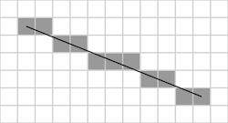

## Assignment 5: Text on the Screen

A console is a text interface for entering commands and seeing output.
Today we have powerful shell programs that support scripts, process
control, and output redirection. But simpler consoles can be very
powerful too. One very famous console is
[Joshua in WarGames](https://www.youtube.com/watch?v=ecPeSmF_ikc).

### Learning goals

In these next three assignments (5, 6, and 7), you will take an important
step to turning your Raspberry Pi into a working computer: writing a console.
After completing these 3 assignments, you will be able to plug a keyboard
and display into your Raspberry Pi, type commands, and see their output.

After completing this first assignment, you will be able to
output strings of text on your screen so that changes seem instantaneous
using double buffering. In the next assignment you will write a keyboard
driver so you can read in characters from a keyboard using interrupts.
In the final assignment you will bring these two together and write
a simple console.

### Assignment tasks

1. __Pull the assignment 5 project.__

    To start the assignment, find the `courseware/assign/assign5/code`
    directory. You may need to pull from the `cs107e/courseware` repository
    to get the latest code.

    This project has four files that will help you significantly.

    The first pair is `font.c` and `font.h`, which provide 32-bit
    (RGBA) images of standard ASCII characters. The character images are
    stored as one contiguous image in memory. The first character is '&nbsp;'
    (space), whose ASCII value is 32 (0x20). The last character is '~'
    (tilde), whose ASCII value is 127 (0x7e). The characters are a
    fixed-width font, so finding the X offset in the image involves
    subtracting 32 from the value and multiplying it by the character
    width. The underlying image was generated by using GIMP (the open
    source Photoshop), typing in the characters, and choosing a C file
     as the output format.

    The third and fourth files are `gfx.h` and an updated `fb.h`, which
    describe the interfaces you will implement.

1. __Show text on your display.__ Your graphics library
   has to implement 5 functions:

    * `unsigned int gfx_init()`: This function initializes the frame buffer:
      it's basically what you did in Lab 5. It returns 0 if initialization
      succeeds and a non-zero value otherwise.

    * `char* gfx_buffer()`: Returns a pointer to the writeable (invisible)
       frame buffer.

    * `unsigned int gfx_color(unsigned int r, unsigned int g, unsigned int b)`:
      This function returns a 32-bit value representing a pixel with the
      corresponding red, green, and blue values.

    * `void gfx_plot(unsigned int color, unsigned int x, unsigned int y)`:
      draw a single pixel at `x`,`y` to have color `color`.

    * `void gfx_draw_char(unsigned int color, unsigned int x, unsigned
      int y, char ch)`:
      This function draws a single character ch with its top left
      corner at x,y. It should check that the character does not
      march off the right edge or bottom edge of the display (there
      should be no wrap-around or memory corruption).
   
    * `void gfx_draw_string(unsigned int x, unsigned int y, char* str)`:
      This function draws a the null-terminated string `str`
      with its top left corner at x,y. It should check that the string
      does not march off the right edge or bottom edge of the display
      (there should be no wrap-around or memory corruption).

1. __Demonstrate your graphics library.__

    Write a test program `joshua.c` that displays the text from the
    image at the top of the assignment to the screen. Display this in
    three places: one so it is fully visible, one so it is truncated
    on the right of the screen, and one so it is truncated at the
    bottom of the screen.

    Typing `make` in your code directory should compile this program to
   `joshua.bin`.

1. __Implement double buffering.__

    Add the following three functions to your framebuffer library to
    incorporate double-buffering. You will need to set the virtual
    height of the buffer to be twice the physical height. A buffer
    swap involves changing the Y offset from 0 to the physical height
    (or vice versa). This must be done by sending a command via the
    Mailbox.

    * `void fb_clear()`: Clears the writeable (invisible) buffer to be
       all black.

    * `void fb_draw()`: Swaps the writeable (invisible) and visible
       buffers.

    * `const char* fb_display()`: Returns a pointer to the frame buffer
       currently displayed on the screen. `fb_buffer` should return
       the invisible buffer.

    Add `gfx_clear()` and `gfx_draw()` to your graphics library, which
    call `fb_clear()` and `fb_draw()`.

1. __Test double-buffering.__

    Write two versions of a test program that fills in pixels from the
    top-left to the bottom-right of the screen. The first version, which
    should compile to `single-buffer.bin`, does so using single
    buffering (i.e., `fb_display()`). The second version, which should
    compile to `double-buffer.bin`, does so using double buffering
    (i.e., `fb_clear()` followed by `fb_buffer()` followed by `fb_draw()`).

    

### Handing in

Commit your code to your repository.

### Extensions

1. Write a small graphics library that supports, in addition to strings,
    drawing rectangles and lines. Your library should support two types of
    lines: aliased and spatially anti-aliased.

1. Add the function `gfx_program_visualize(unsigned int x, unsigned
    int y, unsigned int width, unsigned int height)` to your graphics
    library.  This function draws the current running program in a
    rectangle defined by the four parameters, taking ARM 32-bit
    instructions and making them 32-bit pixels. If the program does
    not fit in the rectangle then do not show the entire program. If
    the program is smaller than the rectangle then fill the rest of
    the rectangle with black.

<table>
  <tr>
      <td></td>
      <td></td>
  </tr>
  <tr>
      <td>
Aliased
</td>
      <td>
Spatially anti-aliased
</td>
  </tr>
</table>

