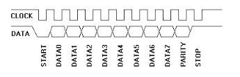

## Assignment 7: Full Console

In this assignment, you'll complete your console. After this assignment,
you will be able to type commands into your Raspberry Pi with a PS2
keyboard without any worry of characters being lost because you type too
quickly. 

### Learning goals

In this assignment, you will

1. Handle interrupts from your PS2 keyboard and use them to read scan
    codes into a ring buffer.
1. Slightly modify your keyboard implementation to
    read scan codes from the ring buffer rather than directly from
    GPIO.

### Fully Operational Battle Station

1. __Pull the assignment 7 project.__

    To start the assignment, find the `courseware/assign/assign7/code`
    directory. You may need to pull from the `cs107e/courseware` repository
    to get the latest code. 

    This project is a merge of the assignment 6 and lab 7 code. It has
    dummy implementations of `fb.c`, `console.c`, and `gfx.c` that you will
    want to replace with your own implementations. 

    The project has a new version of `keyboard.h` and `keyboard.c`.
    The interface is
    slightly different than your assignment 6 version, as now it is
    non-blocking. We changed the function names slightly to make sure
    you don't accidentally mistake one implementation for the other.

1. __Set Up PS2 Clock Interrupts.__ Modify `keyboard.c` so that
   `keyboard_init` sets up your system to trigger interrupts when there
    is a falling edge on GPIO pin 23. This is essentially the code you
    wrote for lab 7.

1. __Handle PS2 Clock Interrupts.__ Fill in `interrupt_vector` in
    `handlers.c` so that it invokes an interrupt handler in your
    keyboard driver (`keyboard.c`). Be sure to clear the event in this
    handler (or it will keep on triggering forever). Make this
    handler do something very simple, like toggle an LED or increment
    a counter. Enable global interrupts in your `notmain` (in `console.c`) 
    and test
    that this handler is executing and does not crash. Commit your code
    and tag it as "interrupt_working" so you have a known working point.

1. __Read PS2 Scan Codes.__ Modify your interrupt handler so it
    reads bits from GPIO pin 24 and reads in a PS2 scan code. This
    should be a basic adaptation of your code from assignment 6. Be
    sure to synchronize on the start bit. Test this code by
    writing received scan codes to an array (e.g., 15 elements) and
    printing the contents of this array on the screen in your main
    loop. Once this code is working, commit your code and tag it as
    "scancodes_working" so you have a known working point.

    

1. __Put PS2 Scan Codes in a Ring Buffer.__ Write a ring buffer of
    size 128, following the pseudocode in the second interrupts lecture.
    When your interrupt handler receives a scan code, it puts the scan
    code in the ring buffer. Write functions that test if there is anything
    in the ring buffer and return a single scan code from the buffer.
    Adapt your prior test program so that it removes scan codes from the
    ring buffer and displays them on the screen. Once this code is working,
    commit your code and tag it as "ringbuffer_working" so you have a
    known working point.

1. __Process PS2 Scan Codes.__ Almost there! Implement `keyboard_has_char`
    and `keyboard_read_char`. `keyboard_has_char` should remove scan codes
    from the ring buffer until it removes a character or the ring buffer
    is empty. If it removes a character, return 1 so the console knows
    it can fetch the character with `keyboard_read_char`. If it empties the
    ring buffer, return 0 so the console knows to not call
    `keyboard_read_char`. Modify your console to use these functions.
    You now have a fully operational console!

### Handing in

Commit your code to your repository.

### Extensions (complete one or both)

1. __Console debugger__. Extend your console to include your debugger.
    When you invoke db(), instead of jumping to the terminal, you should
    get a prompt on the console. Now, when you invoke a command in your
    console, that command can invoke db() and let you debug its state.
    
1. __Profiler__

    Now that you have interrupts, you can add a simple profiler that
    will record where your code mostly spends its time.

    1. At runtime, allocate an array as large as your code segment.
    You can determine this by subtracting the __text_end__ variable
    defined in the linker script (similar to how __bss_end__ is used)
    from 0x8000.  You can put the array after __bss_end__.  Look at
    cstart.c for how to access these variables.

    2. Next, setup timer interrupts to trigger each time `X` cycles
    has passed, using the system timer (page 172, section 12 of the
    broadcom manual).  There is a structure defined in `gprof.c` that
    you should use.  The current clock time is held in the `clo`
    field.  To set a timer, assign `c1` the current time `(clo) + X`.
    Then enable it by assigning `cs.c1 = 1`.

    3. When an timer interrupt occurs, convert the `pc` to an index
    into the array and if it is in bounds, increment the value at that
    element of the array.  Then reset the `c1` to the current `time +
    X` and return.  (Note, the interrupt could be for other reasons,
    but taking extra samples should help more than it hurts.)

    4. Implement `gprof_dump`, which prints the non-zero counts in the
    profile table.

    As a test, print the results to your console every 100 interrupts.

  
