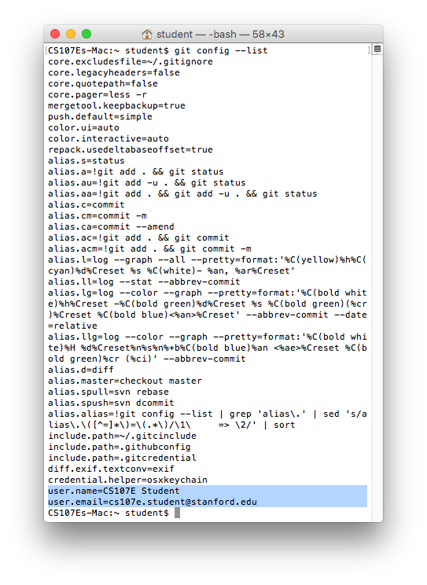

**Part 1 hard deadline:** Friday, January 8, 2016, 1:30 PM (start of class)

**Part 2 hard deadline:** Sunday, January 10, 2016, 11:59 PM

*(No late days can be used on this assignment.)*

*Welcome to CS107E!*

We have two goals for this assignment:

1. You'll tell us which lab section you prefer.
   (This'll be your 'solution' to the assignment.)

1. We'll make sure that you know how to download an assignment, check
   in your solution, and submit it to us for grading.

In this class, you'll use a
[version control system](https://git-scm.com/book/en/v2/Getting-Started-About-Version-Control)
called [Git](https://en.wikipedia.org/wiki/Git_(software)) to keep
track of your work, so you'll learn a little about how to use it.

(Git and the GitHub website are used all the time in industry to track
work on projects, too. In fact, the way you use them here will
basically be best practice for many small and medium-sized companies
and teams. Programmers write code and then check it into a central
repository on something like GitHub for other programmers to look at,
review, and build on.)

### Steps

- [Step 0: Prerequisites](#step-0-prerequisites)
- [Part 1](#part-1)
  - [Step 1: Set up Git](#step-1-set-up-git)
  - [Step 2: Get started with GitHub](#step-2-get-started-with-github)
- [Part 2](#part-2)
  - [Step 3: Download assignment 0's 'starter code'](#step-3-download-assignment-0s-starter-code)
  - [Step 4: Write down your lab preference](#step-4-write-down-your-lab-preference)
  - [Step 5: Commit your change](#step-5-commit-your-change)
  - [Step 6: Submit the 'assignment'](#step-6-submit-the-assignment-push-and-then-make-a-pull-request)
    - [Step 6.1: Push to GitHub](#step-61-push-to-github)
    - [Step 6.2: Create a pull request](#step-62-create-a-pull-request)
- [Afterward: Grader's code review](#afterward-graders-code-review)

#### Step 0: Prerequisites

This assignment expects you to know how to use the UNIX command line
on Linux or OS X, and how to edit a text file.

If you're on Windows, you should have set up
[a Linux virtual machine](/guides/vmware);
you'll be using that machine for all assignments, including this one.

See
[our UNIX guide](/guides/unix)
if you need information about these topics. The standard CS 107 will also
have a UNIX lab in week 1 which we'll announce to the class, should
you want to attend.

You should also read through the other
[course guides](/guides)
for information about hardware and the Pi, which we'll start working
with in week 2.

### Part 1

#### Step 1: Set up Git

First,
[install Git on your Mac or Linux machine](http://git-scm.com/book/en/v2/Getting-Started-Installing-Git).

Then open a Terminal window and type everything after `$ ` on these
lines so that Git marks your changes with who you are:

(Replace `My Name` and `myemail@stanford.edu` with your own.)

```
$ git config --global user.name "My Name"
$ git config --global user.email myemail@stanford.edu
```

You might want to change the text editor Git uses (when it asks you to
write a summary of your changes). If you prefer Emacs, for example:

```
$ git config --global core.editor emacs
```

Now check that you've done everything right so far; this command
should print out the settings you just put in:

```
$ git config --list
...
user.name=My Name
user.email=myemail@stanford.edu
```



#### Step 2: Get started with GitHub

GitHub is the site that will host all the assignments. You'll download
assignments from there and later push your solutions back up.

If you don't have an account already,
[sign up now](https://github.com). Then email your username to Omar
(osnr@stanford.edu), and he'll set up a private repository just for
your assignments, inside the
[CS107e organization](https://github.com/cs107e).

He'll e-mail you when you're all set up and ready to move on to Part 2.

### Part 2

#### Step 3: Download assignment 0's 'starter code'

(Note: for the rest of this assignment, whenever you type in a
command, you should **replace any instances of `[YOUR-GITHUB-USERNAME]`
with the username you picked for your GitHub account**.)

Once Omar has added you, you should be able to type this URL into
your browser (replacing `[YOUR-GITHUB-USERNAME]` with yours) and see
your personal assignment repository:

`https://github.com/cs107e/[YOUR-GITHUB-USERNAME]-assignments`


You'll begin each assignment by cloning the _branch_ in your personal
repository that corresponds to the assignment.

So clone the `assign0` branch now with this command; it'll download
the starter code into a new folder called `assign0`. You'll do your
work inside that folder. (You might have to type in your GitHub
username and password.)

```
$ git clone -b assign0 https://github.com/cs107e/[YOUR-GITHUB-USERNAME]-assignments assign0
remote: Counting objects: 3, done.
remote: Total 3 (delta 0), reused 0 (delta 0), pack-reused 3
Unpacking objects: 100% (3/3), done.
Checking connectivity... done.
```

**Important**: always make sure that you specify the `-b assignX` (`-b
assign0`, `-b assign1`, or whatever the assignment is) option when
starting an assignment. Otherwise, you might get the wrong starter
code and submit to the wrong place!

Now you can `cd assign0` to move into that folder and run `ls` to see
the starter file there. There should be just one, lab.txt.

```
$ ls
lab.txt
```

#### Step 4: Write down your lab preference

We'll have two lab sections this quarter:

- Every Tuesday, 7-9 PM
- Every Wednesday, 7-9 PM

Open lab.txt in a text editor. Replace its contents with one of these
four options. Make sure you use the exact same text (your submission
will be automatically checked):

- `Tuesday`
- `Tuesday, can't make Wednesday`
- `Wednesday`
- `Wednesday, can't make Tuesday`

Save the file.

#### Step 5: Commit your change

Now Git recognizes that you've changed the assignment from the original
starter code. Run `git status` and you should see something like:

```
$ git status
On branch assign0
Your branch is up-to-date with 'origin/assign0'.
Changes not staged for commit:
  (use "git add <file>..." to update what will be committed)
  (use "git checkout -- <file>..." to discard changes in working directory)

	modified:   lab.txt

no changes added to commit (use "git add" and/or "git commit -a")
```

Next you'll *commit* the change you just made and set a kind of
'checkpoint' with the folder how it is right now.

First, *stage* the lab.txt file so Git knows to record it as part
of the commit.

```
$ git add lab.txt
```

Note that Git now expects lab.txt to be included when we commit:

```
$ git status
On branch assign0
Your branch is up-to-date with 'origin/assign0'.
Changes to be committed:
  (use "git reset HEAD <file>..." to unstage)

	modified:   lab.txt

```

Finally, commit your change, along with a short description of what
exactly you did to the original code. Your terminal output should
resemble:

```
$ git commit -m "Entered my lab preference."
[assign0 019f726] Entered my lab preference.
 1 file changed, 1 insertion(+), 1 deletion(-)
```

Though it's not required (you only need to commit once -- when you're
done -- to submit), we recommend that you **commit every time you make
meaningful progress**, *including* that final time.

#### Step 6: Submit the 'assignment' (push and then make a pull request)

##### Step 6.1: Push to GitHub

Let's push our changes back online to GitHub, so we can
submit them to the course staff for grading.

```
$ git push
Counting objects: 3, done.
Delta compression using up to 2 threads.
Compressing objects: 100% (1/1), done.
Writing objects: 100% (3/3), 265 bytes | 0 bytes/s, done.
Total 3 (delta 0), reused 0 (delta 0)
To https://github.com/cs107e/your-username-assignments.git
   5e39234..61814fe  assign0 -> assign0
```

If you go to your assignment repo page at
`https://github.com/cs107e/[YOUR-GITHUB-USERNAME]-assignments` now,
you should see your change.


Note that this page will probably show assign0 by default, which is
what we're looking for right now. But for future assignments, you might
need to manually change to the branch for that assignment to see your
code on GitHub:


(The `submit-assignX` branches are placeholders used for submission;
you shouldn't need to touch them other than using them as base
branches for your submission pull request [see the next section].)

##### Step 6.2: Create a pull request

It's time to actually submit the assignment for grading. In this
course, we'll use GitHub's _pull request_ feature to handle assignment
submission and to give you feedback on your code.

(In a work environment, you might want to write a new feature or make
some other change without disrupting the master copy of the
code. You'd go off on a separate _branch_, do your work, and then
create a _pull request_ when you were done. A pull request is you
asking your coworkers to review your changes and, if they look good,
merge them back into the main line of code. We're using pull requests
similarly, except a grader instead of a coworker is reviewing your
code, and the master copy is just the starter code.)

Open the assignment repository page in your browser. Make sure it's on
branch `assign0`; you can also go to
`https://github.com/cs107e/[YOUR-GITHUB-USERNAME]-assignments/tree/assign0`
directly.

Click the 'New pull request' button on your assignment repository
page.


It'll say "There isn't anything to compare" at first. You need to set
the base branch to `submit-assign0`. Make sure the branch shown next
to 'compare' is `assign0`, too.


Then you'll get a comparison of your project to your starter code,
plus some areas to describe the changes.

Set the Title to "Submit assign0" and leave the description
blank. (You should write a separate README file in your repository if
you want to make comments.)


Then click 'Create pull request'. You'll get this pull request page:


You should see a green checkmark and a message that "All checks have
passed". You might need to wait a minute or two and refresh if they're
still running. (If the checks don't pass, then make sure you replaced
lab.txt with one of the four choices we gave!)

We have some basic automatic checks that will run on each assignment;
you can see more about the results by clicking Details. In assignment
0, the check is just that you wrote down one of the four choices in
lab.txt.

If you push changes to your assignment after creating the pull request
(to fix any errors the checker detected, for example), they'll
automatically get added to this page. You might want to bookmark it,
because the grader will give you feedback on your code here later.

But **do not** click 'Merge pull request'! Your grader will click that
button to let you know that they're done grading your assignment.

(Note: the **time of the last commit you push onto the pull request**,
not the time you clicked 'Create pull request', will be considered
your time of submission for deadlines and late days. If you create the
pull request at 11:59 but then push an extra commit on at 12:01 to fix
an error from the autochecker, you're past the deadline.)

### Afterward: Grader's code review

As we review your code, we'll put both line-specific and general
comments on the pull request page:


Click the 'Files changed' tab to see your whole solution from top to
bottom, along with the comments your grader made.


When your grader's done with their review, they'll click the Merge
button themselves, just like a coworker might Merge a pull request
when they're satisfied that it doesn't break anything.
