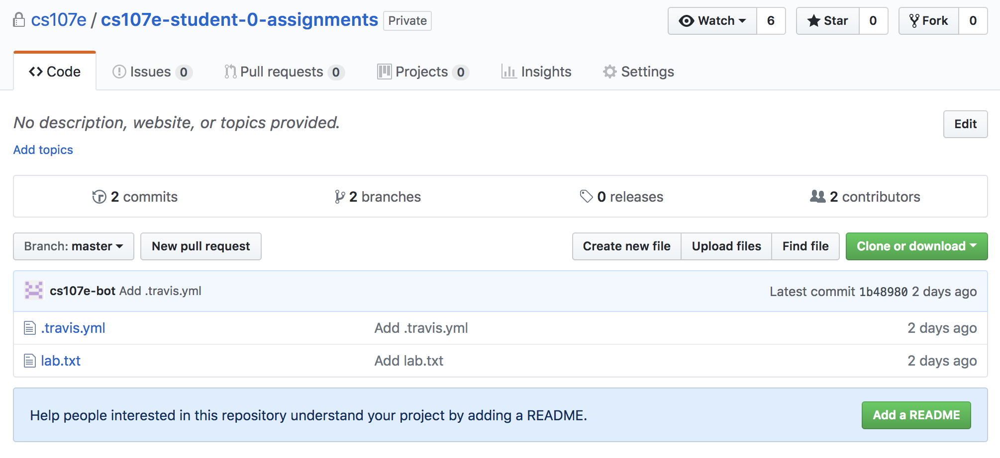
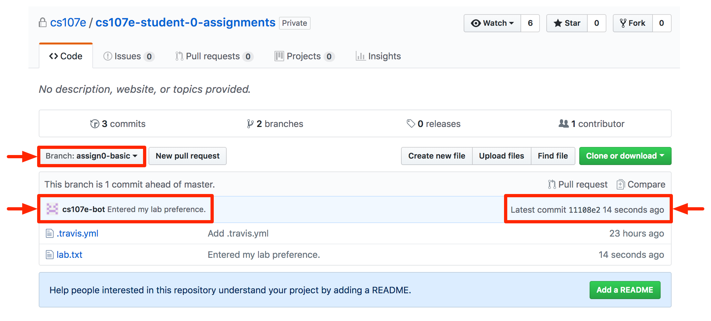
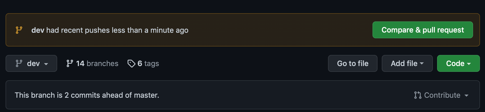
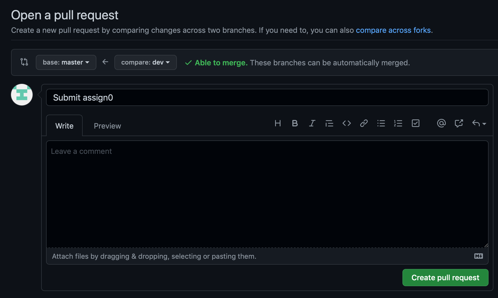
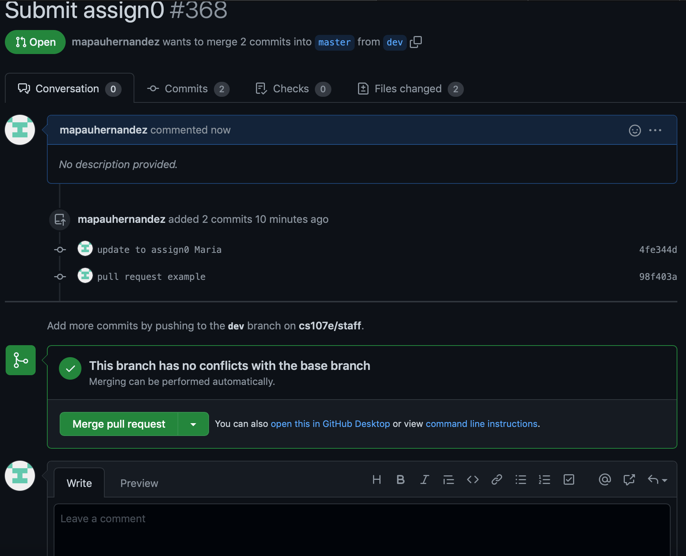
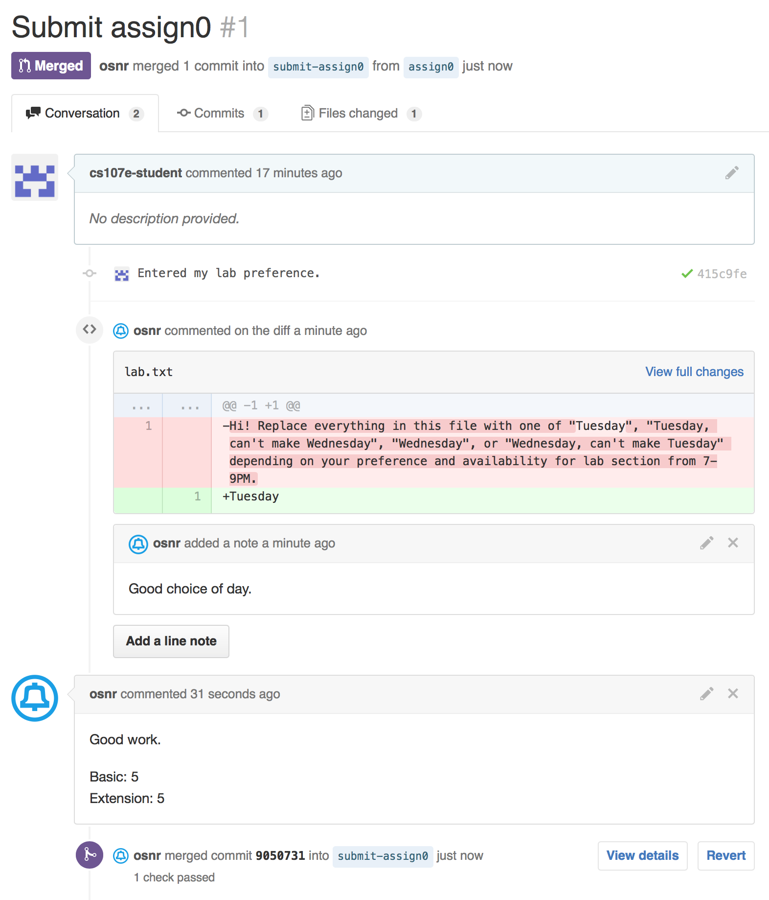
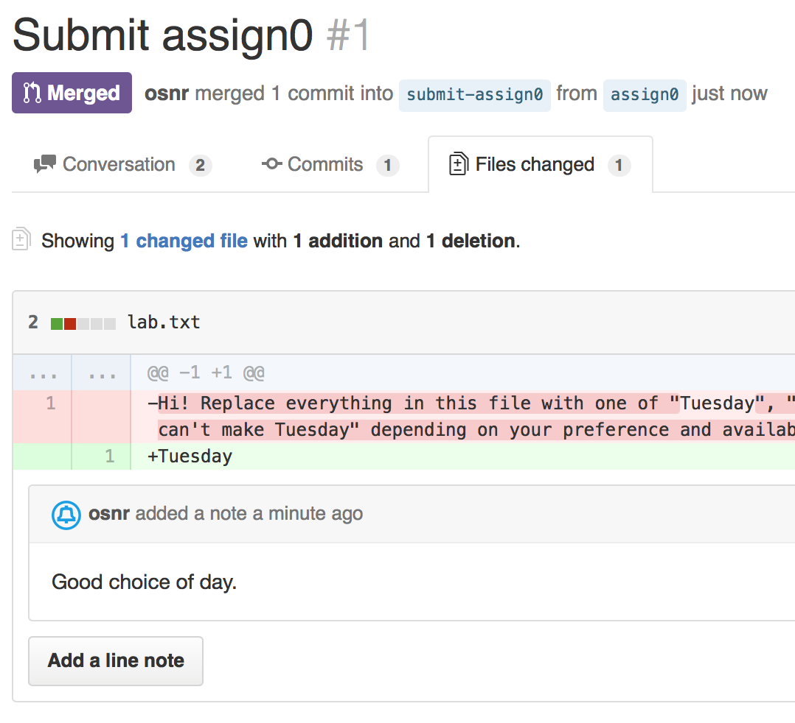


Task list to copy/paste when creating PR for this assign:

__Before releasing assign0:__
- [ ] Review writeup/starter files/process (TA)
- [ ] Followup on issues from previous quarter postmortem (issue #221)

__To prep for assign0:__
- [ ] 



*Written by Omar Rizwan*



<small>This assignment is not for a grade, but we do need you to complete it on-time to complete your enrollment and assign you to a lab section. If you run into troubles, please reach out on our [Piazza forum]({{ site.data.quarter.forum }}).</small>

## Goals

We have two goals for this assignment:

1. You'll tell us which lab section you prefer: please do this with the web form we sent out
   (This'll be your 'solution' to the assignment).

2. Have you go through the assignment workflow (download starter, check
   in your solution, and submit for grading) and ensure you can successfully complete these tasks.

This assignment will introduce you to the basics of the
[git](https://en.wikipedia.org/wiki/Git_(software)) version control
system and the [GitHub](https://github.com) repository hosting service that we will be using in this course.

Version control systems are used everywhere for developing software.
They let you, either by yourself or as a member of a team of developers,
keep a complete history of every code change made by any developer. This is
tremendously useful! If code was working yesterday and isn't today, you can
go back in time to yesterday. You can then see exactly what changed between
yesterday and today and who made those changes. 

A key idea in these systems is that there's a central repository that everyone
links to. This holds the "master" copy of code that everyone should be working
from. You have a local copy of this repository. You can edit the code as much
as you want in your local copy without affecting anyone else. After you've made
your changes, polished them, tested them, and think they're ready for everyone
else to use, you can "push" them to the central repository.
In addition to logging all changes to the code, version control systems manage
all of the tricky cases, like what happens if you want to push some changes
but someone else has changed that code too (what's called a "merge conflict"). 
The version control system makes sure that nobody's work is lost or destroyed
and you can always return to a known working state.

Web interfaces like GitHub work on top of version control systems to provide
powerful and useful UIs to managing your code. They promote good software 
practices such as code reviews, where other team members read over and review
review proposed changes to the code. Your collaborators can check for bugs and provide
feedback on the design and implementation.  The version control skills that you
will learn in this course will be invaluable for any future software projects
that you decide to work on.

## Prerequisites
All students should read over our [course
guides](/guides) on the Review topics of electricity, binary numbers, and the unix command line.

The assignment assumes you have followed our [installation guide](/guides/install) to configure your laptop with the development tools and set up your `cs107e_home` directory and git user identity.


If you were not able to successfully complete all installation steps, please reach out to the course staff for help before starting the assignment.
</div>

## Steps

### 1. Accept GitHub invitation
Our course repositories will be hosted on GitHub. You will download assignment starter files from GitHub and upload your completed work to GitHub for grading.

When enrolling in the course, you provided the username for your GitHub
account.  Each student will be given a private assignments repository inside our [CS107e GitHub organization](https://github.com/cs107e).  When the TAs set up the repository for your account, you will receive an
email invitation from GitHub. Accept this invitation and you're ready to proceed.

### 2. Get assignment starter files

**Note**: For the rest of this writeup, **where you see
`[YOUR-GITHUB-USERNAME]`, replace with your actual GitHub username**.

Confirm that your personal assignments repository is available on GitHub by visiting in a browser:
`https://github.com/cs107e/[YOUR-GITHUB-USERNAME]-assignments`



On your laptop, change to your `cs107e_home` directory and use git to clone your assignments repository:

```
$ cd ~/cs107e_home
$ git clone https://github.com/cs107e/[YOUR-GITHUB-USERNAME]-assignments assignments
remote: Counting objects: 3, done.
remote: Total 3 (delta 0), reused 0 (delta 0), pack-reused 3
Unpacking objects: 100% (3/3), done.
Checking connectivity... done.
```


**NOTE**: You may have to enter your GitHub username and password to authorize
access to your GitHub account. To avoid having to supply these credentials every
time, see [instructions for connecting to GitHub using SSH](https://help.github.com/articles/connecting-to-github-with-ssh/).
</div>

You should now have a new folder named
`assignments` containing a copy of your GitHub assignments repository. We will refer to this copy as your __local__ repository; the repository on Github is the __remote__ repository. You will do all of your assignment work in the local repository and synchronize that work with your remote repository using git push and pull operations (more on that later).

Change to your local repository and confirm it is properly connected to your Github remote with the following command:
```
$ cd assignments
$ git remote -v
origin  https://github.com/cs107e/[YOUR-GITHUB-USERNAME]-assignments.git (fetch)
origin  https://github.com/cs107e/[YOUR-GITHUB-USERNAME]-assignments.git (push)
```

To begin work on an assignment, you must first switch to the appropriate branch. We name all assignment branches using the same convention: `assignN` where N is the assignment number followed by the suffix `-basic` or `-extension` for basic and
extension submissions, respectively. For example, an assignment 7 extension is done on the `assign7-extension` branch.

Since you now plan to work on the basic portion of assign0, you would switch to the branch named `assign0-basic`.

The `git checkout` command switches to a named branch. Use to switch to the `assign0-basic` branch and then list the directory contents.  There should be just one starter file: `lab.txt`

```
$ git checkout assign0-basic
Switched to branch 'assign0-basic'
$ ls
lab.txt
```

### 3. Indicate your lab preference

If you have not already, submit the [web form for specifying your lab preference](https://docs.google.com/forms/d/e/1FAIpQLSf-lvGEalwTetpdbNDnRgKSw7luFBuycTiZin_9r0Yzfl8Ujg/viewform?usp=sf_link).

### 4. Tell us whether you have your kit

Use the `lab.txt` file to indicate whether you have received your kit. Write either

`I have my kit.`

or

`I don't have my kit.`

in the file and save it.

### 5. Commit your change

Git will recognize that you have edited a file in your local copy of the repository.
Verify this by running `git status`:

```
$ git status
On branch assign0-basic
Changes not staged for commit:
  (use "git add <file>..." to update what will be committed)
  (use "git checkout -- <file>..." to discard changes in working directory)

	modified:   lab.txt

no changes added to commit (use "git add" and/or "git commit -a")
```

You *commit* your changes to your local repository to record them into the 
repository history.  The log of commits provides a history of changes to the code.

In order to commit a changed file, you must first *stage* it. This
fine-grained control allows you to selectively record changes and more
easily assemble what you want to commit.  For example, if 
two files have been edited, you may want to only commit changes to one file.
In this case, you would stage only the file of interest before committing,
and changes to the other file will not be included. 

Use `git add` to add a changed file to the staging area:

```
$ git add lab.txt
```

`git status` reports what files are currently staged:

```
$ git status
On branch assign0-basic
Your branch is up-to-date with 'origin/assign0-basic'.
Changes to be committed:
  (use "git reset HEAD <file>..." to unstage)

	modified:   lab.txt
```

Once the desired files are staged, follow with `git commit` to record these changes:

```
$ git commit -m "Entered my lab preference."
[assign0-basic 019f726] Entered my lab preference.
 1 file changed, 1 insertion(+), 1 deletion(-)
```

The `-m` flag indicates the string argument to be
used as the commit message. Alternatively, the command `git commit` without the `-m` flag, causes git to open a text editor where you can enter a more detailed commit message. In practice, good commit messages contain a short (under 50 character) summary of
the changes on the first line, followed by a more thorough description of the
changes.  Detailed commit messages enable programmers to look back in the
history of changes to better understand when and why parts of the code were
changed.

Try out `git log` to view the history of commits in your current repository. 

```
$ git log
commit d1b60b978dbd59ec8fdb3377220bf9f6fce52a90 (HEAD -> assign0-basic)
Author: Julie Zelenski <zelenski@cs.stanford.edu>
Date:   Thu Jan 9 13:05:11 2020 -0800

    Entered my lab preference.
```

Staging also allows you
to more easily commit multiple files in one single commit. With staging,
you can move around in
your directory, adding all of the files you want to commit, then once
you have all of them, commit them together. This is important because you
don't every want to code to be in an inconsistent or bad state. For example,
if you add a new file that another file references, you want to put those
two changes together in a single commit: the file shouldn't be there if it
isn't referenced, and you don't want code to reference a file that doesn't
exist.

Each commit that you make records a snapshot of your work. You can use these snapshots to review your progress, 
compare versions, or identify and undo an unfortunate change.  Establishing good commit practices gives you the ability to navigate the history of
code changes, as well as providing the opportunity to revert to previous
versions.  Sometimes you may find that you want to revert to a commit before a
set a changes that introduced a bug in your code.  The more you commit, the
more opportunities you will have to restore previous working states without
losing as much work.  **We recommend that you commit early and often and that you write
detailed commit messages.**


### 5. Push to GitHub
The commits you have made so far are now stored in your local repository.  They're part of its
history, so you can go back before them, move back to this specific commit, or use them
in all kinds of useful ways. The next step is to push those changes to the central repository on
GitHub. Pushing to GitHub is necessary to share your work with the course staff for grading.
```
$ git push
Counting objects: 3, done.
Delta compression using up to 2 threads.
Compressing objects: 100% (1/1), done.
Writing objects: 100% (3/3), 265 bytes | 0 bytes/s, done.
Total 3 (delta 0), reused 0 (delta 0)
To https://github.com/cs107e/[YOUR-GITHUB-USERNAME]-assignments.git
 * f1610d4a..00a3466f  assign0-basic -> assign0-basic
```

To confirm that your changes were properly received into your remote repository, view it on the web at
`https://github.com/cs107e/[YOUR-GITHUB-USERNAME]-assignments`.

**Note:**  GitHub will show commits for `Branch: master` by default. To see the code and
changes for a specific assignment branch, switch to the branch by selecting it from  `Branch` drop-down menu :




### 6. Answer background questions
Create a file called `background.txt` that contains answers to the following
questions.  Responses to these questions will be graded by a human, so no need
to follow strict formatting requirements.  However, please ensure that your
responses are clearly labeled (i.e. we know what question it correspond too)
and reasonably organized.

1. What is the result of performing a bitwise OR of the following two
   hexadecimal numbers (include the result in decimal): 0x0f OR 0xff. Now left
   shift that number by 24; what is the result in hexadecimal? Assume numbers are 32-bit.

2. How many milliamperes of current will flow through a 1.5K resistor connected
   to 3V on one end and 0V (Ground) on the other end?

3. Find a file in the directory `/etc` on your computer; send us the name of the
   file and the number of bytes contained in that file. How many files and
   directories are contained in the first level of directory `/etc`? Include the commands you used to
   answer these questions.

Use the `git` commands you learned in the previous steps to stage this file and
commit it to your local repository. Then, push your changes to your GitHub.

### 7. Create a pull request (submission)

In this course, assignment submission is done using GitHub's _pull request_
feature.  Pull requests provide a summary view of changes made to the code as
well as a section for comments where course instructors will be providing
feedback.

The pull request model is used by many modern software projects to promote good
practices when working in a distributed development environment. The typical
flow starts with a base branch (often called *master*) that reflects the master
copy of the code. Feature development or bug fixing occurs by creating a new
_branch_ where changes are made. Once you're confident that the code in your 
branch is polished, tested, and working well, you can ask other people to merge
the commits in your branch into *master* by making  a _pull request_. You've
pushed commits to your branch, you're now asking other people to pull those
commits into master. Team members use the pull request to review the
proposed changes and provide comments. When a team member approves the pull request,
GitHub automatically merges the commits back into the base branch.


In this class, we use this same workflow so common in software development to
review and grade your code. You write each assignment on a branch. To submit an 
assignment, you make a pull request to merge it with the base branch, signifying
your code is ready to be added to your slowly growing library of code you'll use
to build your shell. The grader reviews your code and gives comments and bug reports.

View the contents of your remote repository on the web at `https://github.com/cs107e/[YOUR-GITHUB-USERNAME]-assignments`. Switch to the branch `assign0-basic` by selecting it from the "Branch" drop-down menu.

Click the 'New pull request' button.



Now you will see text entry boxes for describing the pull request, followed by
a list of the commits that you have made and a line-by-line comparison (`diff`)
of the changed files.

Set the Title to "Submit assign0 basic" and leave the description blank (for
future assignments you can include comments for your grader in the
description).


Click 'Create pull request', which will submit the pull request and take you to
a page to view it:



There is a section indicating whether our automated checks have passed.  You
may need to wait a minute or two and refresh if have not finished.  If the
checks have passed, you will see a green checkmark and a message: "All checks
have passed". If the checks did not pass, make sure you have inserted a valid
choice in `lab.txt` (one of the four choices we provided) and added a 
`background.txt` with answers to the background questions.

Each assignment has a set of automated checks that will be run upon submission. For this
assignment, the check just verifies that `lab.txt` contains one of the four
valid choices and that the `background.txt` file exists. Note the initial starter code will not pass the check until both criteria are met. To see more about the results and why the check is failing, click on the 'Details' link (you may be prompted to register for Travis and sync your Github).

The pull request page will update to reflect any changes that are pushed after
the initial submission (e.g. to fix any errors the checker detected).  This
page will also be used by graders to provide feedback on your submissions.

You make one pull request per assignment. If you need to update your submission after your initial pull request, simply edit your files, commit, and push to add it the assign0-basic branch. There is no need to make another pull request. We will grade the last commit pushed to the branch, and that commit determines the submission time for deadlines and lateness. To repeat: submission time is determined by the **time of the last commit you push**, not
the time you clicked 'Create pull request'. If the deadline is 9:00 and you create a pull request at
8:58, and push an additional commit at 9:02, the submission is one day late.

## Afterward: Grader's code review

Graders will review code by including line-specific and general comments on the
pull request page:



Click the 'Files changed' tab to see your whole solution from top to bottom,
along with any inline comments that the grader has added.



When finished with their review, the grader will click the Merge button
themselves. This is similar to how a coworker would merge a pull request when
they are satisfied with the quality of the code changes that you have proposed.
