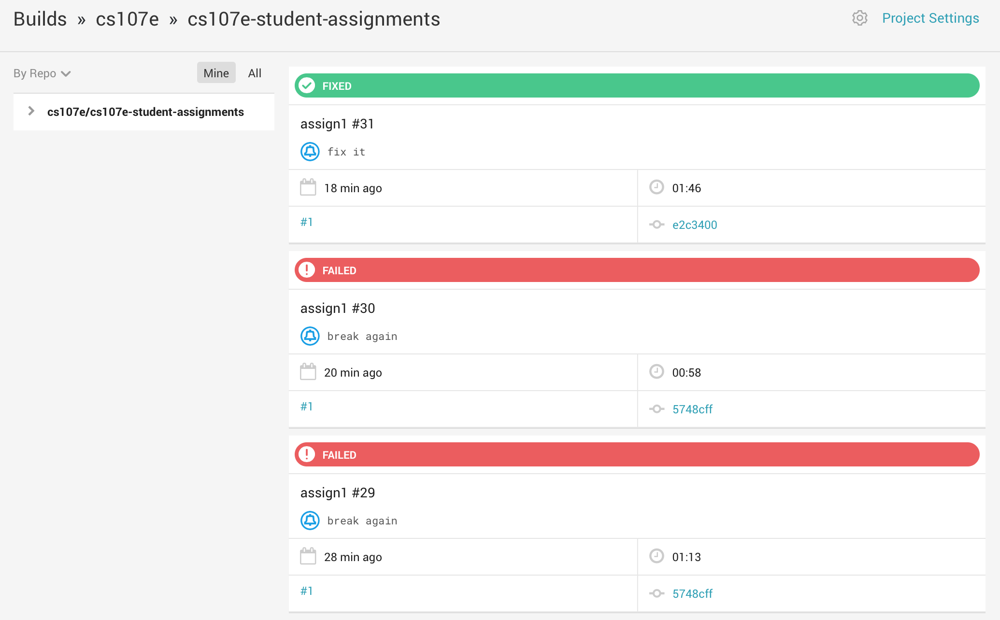
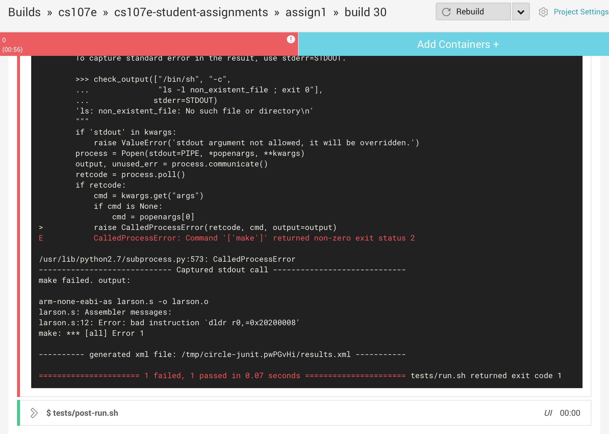

**Due: Monday, January 18, 2016 at 11:59PM**

[Glen A. Larson](http://en.wikipedia.org/wiki/Glen_A._Larson), 
the man responsible for producing 
the original 
[Battlestar Galactica](http://en.wikipedia.org/wiki/Battlestar_Galactica)
and 
[Knight Rider](http://en.wikipedia.org/wiki/Knight_Rider_%281982_TV_series%29)
television series,
often used simple lighting effects in his shows.
One famous example is a scanner 
that consists of a set of red LEDs that scan back and forth.
The front of the Knight Rider car had a scanner.

Check out this short 
[video tribute](https://www.youtube.com/watch?v=hDUoyeMLxqM)
to Glen Larson. 
How many times does the scanner pattern appear?

Check out the [Larson Scanner Kit Demo](https://www.youtube.com/watch?v=yYawDGDsmjk) from evilmadscientist.com.

The goals of this assignment are

- To understand ARM assembly language.

- To become fluent with the ARM cross-development tools.

- To know how to use breadboards and use LEDs.

- To program general-purpose input/output (GPIO) pins.

### Basic Part: Simple Scan Pattern

This assignment involves modifying the blink program showed in class.
`blink.s` is an ARM assembly language program that blinks a single LED.
To implement a scanner, you will need to control at least 4 LEDs.

1 Wire up your breadboard with 4 LEDs. 
If you feel ambitious, 
and want to make more interesting patterns,
wire up 8 LEDs.
Make sure all the LEDs on your breadboard work.

2 Connect the LEDs to GPIO 20-23 (or GPIO 20-27, if you use 8
LEDs). The leftmost LED in your scanner should be connected to GPIO
20, the second from the left to GPIO 21, and so on, such that the
rightmost LED in your scanner is connected to GPIO 23 (or 27 if using
8 LEDs).

3 Pull your 107e Github assignment repo and switch to your assign1 branch. 
You should see some starter code in the repo.

4 Currently `larson.s` in the starter code is simply a copy of `blink.s` 
from lab. Add code to scan back and forth from pin 20 LED to 23 (or 27).
You will first need to initialize all the GPIO pins.
Then you will need to sequentially turn LEDs on and off.
Make sure you handle the left and right sides properly
(that is,
the left-most and right-most LED should be on for only one cycle).
You should write the program without any function calls
(because we haven't taught you how to create and call functions 
in assembly language yet),
and only the assembly language instructions 
used in the original `blink.s`.

5 Generate the scanner pattern. 
Enjoy watching it late at night in your room.
Impress your friends.

### Extension

The basic part of this assignment should not take too long. 
If you want to explore further, extend the program.
The extension is more challenging, and
may involve using additional ARM assembly instructions.

<!---
1 Program up 4 more patterns. 
If you want ideas,
check out some of these 
[patterns](https://www.youtube.com/watch?v=uUlkumlkryo#t=17).
-->

If you watch the Larson scanner carefully,
several LEDs are turned on at once.
The center one is at full brightness,
and the ones on the edge are dimmer.
How would you dim an LED?
Implement a scanner with LEDs dimmed 
in a way that would please Glen Larson.

### Checks

The automated check here is more likely to fail than in assignment 0,
since there are more things that can go wrong. We're checking
that:

- you have a Makefile (which we've included in the starter code, so
you should be fine if you keep that as is)
- you haven't checked larson.bin in (you should only be checking in
  your source code, and then we'll build larson.bin from it on our
  end)
- `make` runs successfully on the clean testing virtual machine
- `make` generates a `larson.bin` file

The human grader will then test the `larson.bin` file generated by the
automated tester on a physical Raspberry Pi with the LEDs plugged in.

You can learn more about automated testing, and check on its results
before you make a pull request, by logging into
[CircleCI](https://circleci.com) with your GitHub account. Then go to
[Add projects](https://circleci.com/add-projects) and then choose the
cs107e GitHub account, then click 'Watch project' next to your
assignments repo. Then click the newly appeared eye icon to view your
repo's test page on CircleCI, which should show an entry for each time
you've pushed so far.

Then you can also click the Details link in the test result in your
pull request (which you might want to make early -- you can always
push more commits to it) to see the CircleCI results page from testing
your latest solution.

The results page shows the result of testing one particular solution
you pushed. You might need to scroll down to 'tests/run.sh' and dig
around to find the output if something like `make` failed.

You can even download the larson.bin that was generated on the test
machine, although hopefully it's exactly the same as the one you're
building on your computer!

