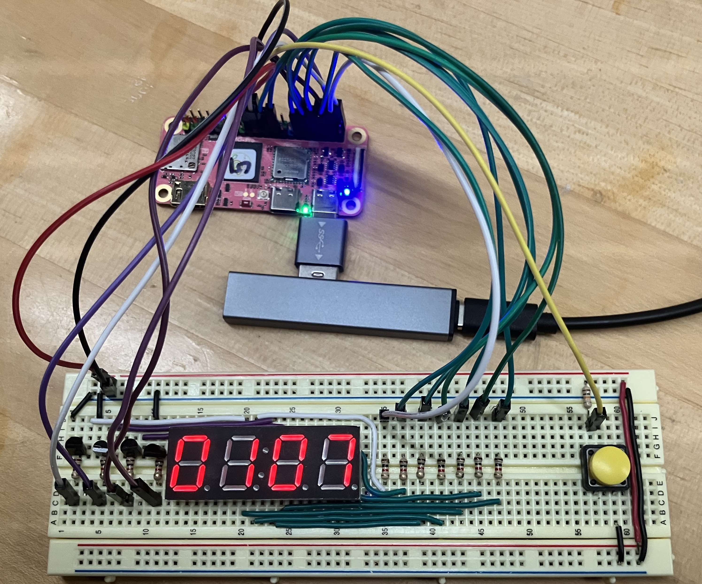


Task list to copy/paste when creating PR for this assign:

__Before releasing assign2:__
- [ ] Review writeup/starter code (instructor)
- [ ] Review consistency/completeness of grading info published to students relative to grading tests used, consider changes clarity/ease of grading (TA)
- [ ] Followup on issues from previous quarter postmortem (issue #228)

__To prep for assign2:__
- [ ] 



*Written by Pat Hanrahan; updated by Julie Zelenski*



### Goals
Your next assignment is to build a clock using a 4-digit 7-segment
display.

The goals of this assignment are for you to:

- Get started with bare metal programming in C on the Raspberry Pi.
- Begin building a simple, modular library of useful functions.
- Learn how to write and use automated test cases to validate your code's behavior.
- Learn how to use the Raspberry Pi's system timer peripheral.
- Use your gpio and timer modules in the clock application.

### Get starter files
Change to the `cs107e.github.io` repository in your `cs107e_home` and do a `git pull` to ensure your courseware files are up to date.

To get the assignment starter code, change to your local assignments repository, fetch changes from the remote ,and switch to the assignment basic branch:

```
$ cd ~/cs107e_home/assignments
$ git fetch origin
$ git checkout assign2-basic
$ ls
Makefile apps     cstart.c gpio.h   start.s  timer.c
abort.c  assert.h gpio.c   memmap   tests    timer.h
```

Skim through each of the provided files to learn the overall structure of the project and review the skeletal starter code. The project includes a few [magic files](#magic) (`memmap`, `start.s`, and `cstart.c`) that are necessary for bare metal C programs. We will explain their purpose in the upcoming lectures.

### Modular design

For this assignment, you will implement functions
across three different C files: `gpio.c`, `timer.c`, and `apps/clock.c`.  The first two files implement reusable modules, the latter is the application program file. **Do not create any new source files or directories; add your code by editing the given files.**

The `gpio` and `timer` modules provide access to two of the Raspberry Pi peripherals. The `gpio` module has routines that control the GPIO pins and the `timer` module retrieves the system tick count. The two modules are used by the clock application, but, more broadly, these modules are designed to be reusable in any future application that requires similar functionality. These two modules are the first of many more to come. By the end of the quarter, you will have implemented a complete set of modules that you be a library of core functions for your Raspberry Pi, sufficient to write your text console.

Each module is divided into an _interface_ and its _implementation_. The module interface is described in its header file, e.g. `gpio.h` or `timer.h`. Each public function is listed with its name, prototype, and documentation about what the function does. The module implementation is in the corresponding `.c` file where those functions are defined. 

This idea of
separating interface and implementation is fundamental to all software engineering:
projects might choose different file naming conventions, but they always separate 
interface from implementation. It allows someone using the module to not have to think
about how its implemented, so keeps pieces of software self-contained and independent. It
also allows you to change the implementation without causing any problems -- this may become
very valuable towards the end of the course, if you want to swap out your implementation
for a reference one written by the CAs.

For the `gpio` and `timer` modules, we specify the module interface; it is your job to write the module implementation to match it. You are not to change anything in the `gpio.h` and `timer.h` header files. All your edits will be in the `gpio.c` and `timer.c` source files. You should not export additional public `gpio_` or `timer_` functions. However, you can add your own private helper functions by declaring those functions at the top of the C file with the `static` keyword to make them only accessible to the implementation. 

The file `apps/clock.c` contains your application program code that configures and operates your clock. The clock application does not directly access the peripherals, instead it calls on the public functions of the `gpio` and `timer` modules. There is no required interface for the clock application, but you should strive for a clean and well-decomposed program that would make your CS106 section leader proud.

The subsequent assignments in CS107e will be structured similarly. Each week you will implement new modules to add your Raspberry Pi library in the context of an application program that uses those modules.

### Testing

Now that you're writing larger programs, we want to introduce you to strategies for how to test your program. We
hope these ideas will serve you well throughout your programming life.

The starter project includes an additional program file `tests/test_gpio_timer.c` that
defines an alternate `main()` function. Instead of running the clock, this `main()` function makes a series of calls to `gpio` and `timer` functions and uses `assert()` in order to validate the operations work correctly. Use `make test` to build and run this test program.

Recall from Lab 2 how `assert()` drives the red and green LEDs
on the Pi as a simple status indicator. If an assert fails, the program
halts and blinks the red LED of doom. If all asserts pass and
the program finishes normally and the green LED of happiness will turn on. Your goal is to make that little green light shine!

The given `tests/test_gpio_timer.c` only has a few very simple tests. You should extend the test program
with many additional tests of your own so as to thoroughly exercise the
functionality of your modules. _Unit-testing_ each module in isolation before
going on to integrate its use into an application is an important strategy for
managing the development process as your programs become larger and more complex.  

Learning how to effectively test your code is an important component of growing your programming skills and we want to be sure to reward for your testing efforts. The breadth and depth of the tests you add
to `tests/test_gpio_timer.c` will be used to determine a portion of your grade for this assignment (that is,
to get full credit on this assignment, you will need to include a thorough
suite of tests as part of your submission).

### Basic part: a simple clock
<A name="clock_spec"></a>
#### 1. Wire up clock hardware 

The first step is to build the hardware for your display.

- Complete the breadboard circuit for the 4-digit 7-segment display you started in [Lab 2](/labs/lab2). Test your breadboard with jumper cables so that you know the wiring is correct before you connect it to the Raspberry Pi. 
- In total, you will use 13 GPIOs on the Pi: eight pins to control which segments are on, four to control which digits are on, and one to read the state of the start button.
    - Connect GPIO pins 20-26 to the 1K current-limiting
resistors on your breadboard that drive segments A through G. GPIO 20 controls segment A, GPIO 21 controls segment B, and so on. An 8th pin, GPIO 27, can be used to control the decimal point, which is optional. 
    - Connect GPIO pins 10-13 to the base of the transistors controlling digits
1 through 4. GPIO 10 controls the first digit, GPIO 11 the second digit, and so on.
    - Connect GPIO 2 to the red start button. The start button should be connected to the power rail through a 10K pull-up resistor; making the default state high. Pressing the button grounds the circuit, pulling the reading low.
- At this point if you output 3.3V on GPIO 20 and 3.3V on GPIO 10, you should turn on segment A of digit 1. Hooray!
- Snap a photo of your finished hardware setup, add the photo to your repo with the name `board`, and commit the image file to your repo. We want to see your beautiful handiwork!

{: width="80%"}
Here's a photo of our clock breadboard connected to the Raspberry Pi. We selected jumper colors in a repeating pattern (yellow-green-blue-violet) to help identify which connection is which.

#### 2. Implement and test gpio module

Review Chapter 6 of the [Broadcom BCM2835 peripheral manual](/readings/BCM2835-ARM-Peripherals.pdf#page=89) which documents the GPIO peripheral. The device registers `FSEL`, `SET`, `CLR` and `LEV` will be used in your `gpio` module implementation.

Open the file `gpio.h` in your project directory and read the module documentation to learn about the module as a whole and the expected behavior of each function. Your functions must correctly implement each of the public functions. In addition, your functions should also be robust against client error. If asked to set an invalid pin or function, your function should not blunder on to wrong or broken behavior. The function documentation in the module interface gives specific guidance on the expected handling for improper calls.

We recommend that the first operations you implement are `gpio_set_function` and `gpio_get_function`. These operations use the `FSEL` device registers to configure the mode of a GPIO pin. Thus far we have only seen the input and output modes, see the module interface for the additional alternate modes that you must support. Implement `gpio_set_input` and `gpio_set_output` as simple wrapper functions that call `gpio_set_function` to input or output mode.

Before moving on, test what you've implemented. Edit the `main()` function of `tests/test_gpio_timer.c` to uncomment the call to `test_gpio_set_get_function()`.  Run `make test` to build and execute the test program on the Pi. If the green LED on the Pi turns on, all tests ran
successfully -- bravo! If instead the Pi's red LED is flashing, this means
you are failing a test.  If neither LED lights up, your program may be freezing or
crashing somewhere during the tests.

If you don't get the green light, comment out all of the asserts within   `test_gpio_set_get_function()`. Uncomment the asserts one-by-one and re-run after each addition to determine which specific test is
failing. Use that information to narrow in on your bug, fix it,
and re-test until you achieve the green light of nirvana.

Passing these tests shows you're off to a great start, but the provided test coverage is not comprehensive. You will need to add test cases of your own to definitively confirm the full correctness of your module. To jumpstart your brainstorming, consider what additional tests could be used to:

- confirm setting a GPIO pin to alternate function modes, not just input or output
- confirm can configure a GPIO pin in each of the different FSEL registers
- confirm no interference when configuring multiple GPIO pins within the same FSEL register
- confirm that improper requests are gracefully handled

What other cases can you think of to add to the above? As you add each new test case, build and re-run your test program to verify success. Don't move on until you are bathed in green light on your now-comprehensive test suite.


When writing test cases, take note that certain GPIO pins exhibit
specialized behavior. GPIO pins 14 and 15 are used for serial
transmission and by default have the function `GPIO_FUNC_ALT5`.  Manipulating these pins will disrupt the communication between your computer and the Pi. __You do not need to include pins 14 and 15 in your tests.__ GPIO 35 controls the red power LED on
the Pi and GPIO 47 the green ACT LED. If you manipulate these pins, the corresponding LED will be affected. This is to be expected.
</div>

The remaining gpio functions to implement are `gpio_write` and `gpio_read`. These functions read and write the current pin state by accessing the `SET`, `CLR`, and `LEV` device registers.

After you've implemented these functions, test them by uncommenting the call to
`test_gpio_read_write()` in the `main()` function of `tests/test_gpio_timer.c`. Re-run the test program, look for the green light, and make necessary fixes until you achieve success.

Remember that the test coverage provided in the starter code is a good start, but you will need to supplement with additional test cases to achieve thorough coverage.  The test cases used by the automated tester in grading are quite rigorous. Rather than wait for our grading tests to ferret out issues for you to fix, the challenge goal for you is to find and fix any problems before you submit. We want your code to sail through grading with flying colors.

Keep up the habit of __frequent git commits__ and push to sync history with your GitHub remote repository. This gives you an audit trail of your progress and an "off-site" backup to ensure that all of your great work is safely recorded.


__A note on volatile__

- Writing code that correctly interacts with a peripheral will require understanding of the
`volatile` keyword.  Remember from lecture that qualifying a variable as `volatile` indicates that its value could change
unexpectedly. Consider this pointer to the memory-mapped GPIO device
register `LEV0`:

        unsigned int *lev = (unsigned int *)0x20200034;

    The data at that address can, and should, be qualified as `volatile`:

        volatile unsigned int *lev = (unsigned int *)0x20200034;

    Adding the `volatile` qualifier informs the compiler that the `unsigned int` value can change due to events not apparent in the code. You read the LEV0 register to get the current value of an input pin. Whether that value read is 0 or 1 depends on what is physically connected to the pin, which can change externally. If every iteration of a loop in C reads from `*lev` and there is no intervening write to that location inside the loop, the optimizer could move the read operation outside the loop and only execute it once, on the assumption that the value will not change. If `lev` is qualified as pointing to a `volatile` int, the compiler cannot make that assumption and must re-read the value for each and every access.  

    Note that `volatile` is not something to throw about willy-nilly. Apply it thoughtfully and intentionally to those specific data values that need to be treated in this special manner. Extraneous use of `volatile` can be misleading and will reduce performance as it disallows the compiler from making optimizations.


Congratulations on completing your first Raspberry Pi module!


#### 3. Display a digit

For your next task, turn your attention to the clock application and put your shiny new gpio module to work to drive the 7-segment display.

In `apps/clock.c`, create an array of 16 elements, one for each
hexadecimal value between 0 and 15. Each array element should
be a byte (8-bits). Bit 0 (the least significant) will represent
segment A, bit 1 segment B, and so on. If a bit is set, then that
segment should be lit. For example, digit `0` consists of segments A-F, so its bit pattern is `0b00111111`. Digit `1` consists of just segments B and C, so its bit pattern is `0b00000110`.  (`0b` is the prefix that introduces a binary number
literal, just as `0x` prefixes a hexadecimal literal.)

Bit 7 (the most significant) will be used to represent `DP`, the dot. Since we won't be
using the dot in this assignment, bit 7 should always be 0.

Create bit patterns for all the digits 0, 1, 2, 3, 4, 5, 6, 7, 8, 9,
A, B, C, D, E, F. You won't be displaying A-F for this assignment, but they
may be useful in the future.  This [interactive demo of a 7-segment display ](http://www.uize.com/examples/seven-segment-display.html)
is handy for seeing how the bit pattern relates to the character segments.

Add code to the `main()` function of `apps/clock.c` to display a single digit. Verify that your bit patterns are correct by displaying each digit value from `0` to `F`.  Use `make install` to build and run your clock application.

#### 4. Implement and test timer module

In order to implement a clock, we'll need some way to determine the passage 
of time. Thankfully, the Raspberry Pi includes a "system timer". The system timer is an on-board peripheral that is initialized to zero when the Pi powers up and is 
continuously incremented once every microsecond behind the scenes. 

Chapter 12 of the
[Broadcom BCM2835 Peripherals Manual](/readings/BCM2835-ARM-Peripherals.pdf#page=172)
contains the documentation for the system timer peripheral. For this module, note that we only care about the lower
32-bits of the system timer. Don't forget that we use
[ARM physical addresses](/readings/BCM2835-ARM-Peripherals.pdf#page=6),
not bus addresses (0x7E... for peripherals), so you'll need to
change the 0x7E... prefix in any peripheral address to 0x20.

The `timer` module defines functions that access the system timer. Read the interface to the module in the `timer.h` header. Review the given code for the module implementation in `timer.c`. 

Your one task for the `timer` module is to implement the function `timer_get_ticks` to read
the current system tick count from the system timer. 


Uncomment the call `test_timer()` in `tests/test_gpio_timer.c`. Use `make test` to build and re-run the test program. Verify the given tests succeed and then consider what additional tests are needed for the timer module (there may not be much; it is a pretty simple module). Once both the gpio and timer modules are passing all of your tests, you're ready to tackle the rest of the clock application.

#### 5. Write display refresh loop

GPIO pins 20 to 26 drive the seven segments A to G. Segments A to G are shared by all four digits on the display. There is no way to turn on the display segments to show a `5` on the leftmost digit while simultaneously showing a `3` on the rightmost digit.

Instead, you will write a display refresh loop that drives the four digits by iterating over the
digits one-by-one in quick succession. It turns on the segments for the leftmost digit, waits a short
length of time, and turns off that digit, then repeats the process for each of the other three digits. You might think that turning a
digit on and off would cause it to flicker. The key is to sequence through
the digits so fast that our eyes cannot see them changing. Good thing
computers are fast!

Implement the display refresh loop in `apps/clock.c`. Use the functions from the `timer` module to control the wait time. Loop though all
four digits, turning each on for 2500 microseconds. Do you see any flicker? How long
does the delay have to for you to start to see it?

#### 6. Implement clock

The program for the basic assignment starts by showing `----` on the display and waits for the user to click the start button. The clock then displays the elapsed minutes and seconds since start. A loop continually refreshes the display, updating the value displayed to match the elapsed time. Make sure to test that the timer is calibrated correctly
so the clock is counting at the right rate.

The clock time is counting elapsed time since the clock was started, which is not quite the value as the system tick count.  Clock time and the system tick count change at the same rate, but start at different values. Your program will need to implement this logic.

This video shows starting our Raspberry Pi clock and counting to 12 seconds:

<iframe width="420" height="236" src="https://www.youtube-nocookie.com/embed/PaYcgyyuA60?modestbranding=1&version=3&loop=1&playlist=PaYcgyyuA60" frameborder="0" allow="accelerometer; autoplay; encrypted-media; gyroscope; picture-in-picture" allowfullscreen></iframe>


__Mission accomplished!__ Follow our [submit instructions](#submit) and it's time to celebrate. You have wired up a complex breadboard circuit, written two reusable library modules and a clock application, as well as working up a methodology for testing your code. Be sure to show off your spiffy new clock to your followers (but probably not a good idea to try to get through a TSA screening with it in your bag...).

### Extension: Set time
If you're looking for an extra challenge, consider doing the optional extension to create an interface to set the clock time.

After you have submitted your basic version, create an extension branch with

    $ git checkout -b assign2-extension

Add a second blue button to your clock breadboard next to the red button. Connect the blue button to GPIO pin 3.
Design a user interface that allows you to set the time using these buttons. You should be able to
set the minutes and seconds separately.  Strive for an interface design that is
easy to use and that works even after the clock starts running. It can be
challenging to build an [interface with just a few buttons](https://dilbert.com/strip/2016-06-12)! 

Commit a `README.md` file on your `assign2-extension` branch that describes your extension. Your documentation should explain to the user how to set the time via the red and blue buttons.

When reading button presses on the Pi, you will quickly realize that pressing
the button once may cause the value on the GPIO pin to change multiple times.
This is due to physical characteristics of the button mechanism which cause the
button circuit to open and close multiple times during a press.  To address
this issue, implement **debouncing** by checking whether the value change on
the GPIO pin corresponds to an actual button press or one of these
spurious events.  This can be done by checking that the GPIO pin reads the
button press value for a long enough time (that is, these spurious events will
change the GPIO value quickly, meaning if you check the value of the pin as
pressed, then wait a bit longer and see it as unpressed, that means it was a
spurious event). Experiment with the amount of time required to register a
valid press so that your buttons click easily without having to hold them down
too long, but do not generate extra button press events for a single physical
button press.


### Magic files <a name="magic"></a>

The starter project contains additional code files `start.s` and `cstart.c` and the file `memmap`. The `memmap` file is used by the linker when building the program and `start.s` and `cstart.c` provide the minimum startup to set up a C program to run in the bare metal environment. A bit later in the course, we will study these files to understand how they work and why they are necessary. Feel free to look into the files now to get a sneak preview, but don't worry if you don't fully understand them yet. We will discuss them in more detail soon!

### Submit
The deliverables for `assign2-basic` are:

+ a photo of your completed breadboard
+ implementation of the `gpio.c` and `timer.c` modules
+ your comprehensive tests for both modules in `tests/test_gpio_timer.c`
+ application program `apps/clock.c`

Submit the finished version of your assignment by making a git "pull request",
following the steps given in the [Assignment 0 writeup](/assignments/assign0/).
Remember to make separate pull requests for your basic and extension
submissions.

### Grading

To grade this assignment, we will:

+ Verify that your project builds correctly, with no warnings (see Note 1 below)
+ Run automated tests that exercise the functionality of your `gpio.c` and `timer.c` modules. These tests will touch on all required features of the module. (see Note 2 below)
+ Observe your clock application running on a Raspberry Pi wired to a clock breadboard and confirm it operates correctly. Our hardware setup will be configured exactly as specified in [Step 1 above](#clock_spec).
+ Admire the photo you submit of your completed breadboard.
+ Go over the tests you added to `tests/test_gpio_timer.c` and evaluate them for thoughtfulness and completeness in coverage.
+ Review your code and provide feedback on your design and style choices.

Note 1: The automated tester will __deduct one point for any warnings generated when compiling your code__. Warnings are the way the compiler draws attention to a code passage that isn't an outright error but appears suspect. Some warnings are mild/harmless, but others are critically important. If you get in the habit of keeping your code compiling cleanly, you'll never miss a crucial message in a sea of warnings you are casually ignoring. By default, all warnings will be treated as errors in your makefile, and your code will be graded in the same way

Note 2: If your modules have failures on the automated tests, we will report those to you by filing issues.  To promote the practice of fixing your bugs, you will have the opportunity to re-submit with corrections for these issues for a
partial refund of the points originally deducted.
Furthermore, fixing bugs in your modules now will put you in a better place to earn
the full system bonus at the end of the quarter. The system bonus points are awarded for submitting a working system using entirely your own code written for the assignments. 

