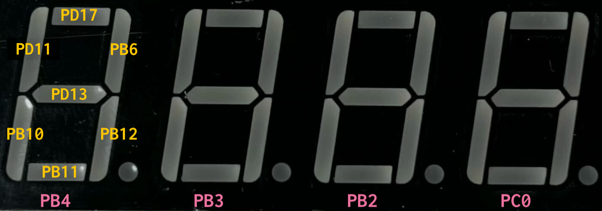
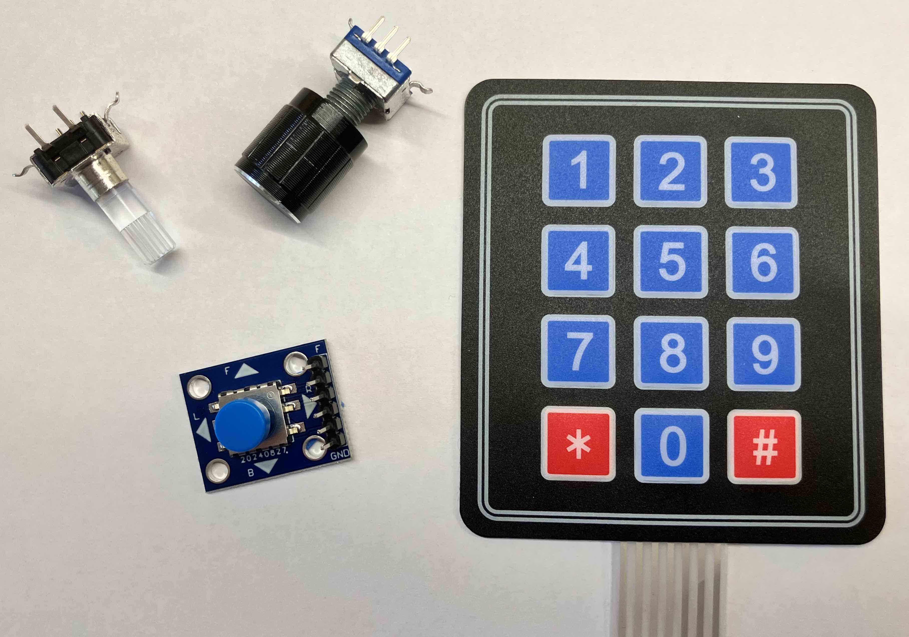
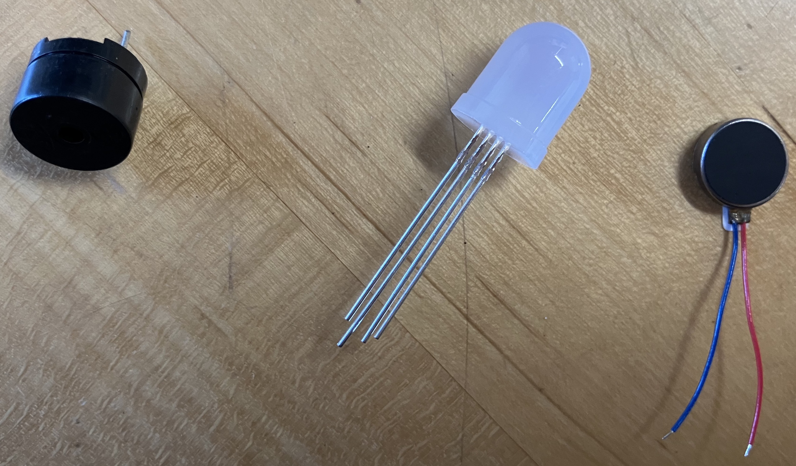


Task list to copy/paste when creating PR for this assignment:

__Before releasing assign2:__

- [ ] Review writeup/starter code (instructor)
- [ ] Review consistency/completeness of grading info published to students relative to grading tests used, consider changes clarity/ease of grading (TA)
- [ ] Followup on issues from previous quarter postmortem (issue #325)

__To prep for assign2:__

- [ ]





## Goals

Your next assignment is to build a clock using a four digit 7-segment
display.

The goals of this assignment are to:

- Get started with bare metal programming in C.
- Begin building a simple modular library of useful functions for the Mango Pi.
- Practice writing and using test cases to validate your code's behavior.
- Learn how to access the RISC-V Control and Status Registers (CSR).
- Use your gpio and timer modules in the countdown clock application.

## Get starter files

Change to your local `mycode` repo and pull in the assignment starter code:

```console
$ cd ~/cs107e_home/mycode
$ git checkout dev
$ git pull code-mirror assign2-starter
$ ls assign2
Makefile     cstart.c     memmap.ld     style_reflection.txt  timer.c
clock.c      gpio.c       start.s       test_gpio_timer.c     timer_asm.s
```

In the `assign2` directory, you will find these files :

- Files you will edit:
    - `clock.c`:  your countdown clock application program
    - `gpio.c`, `timer.c`, `timer_asm.s`: implementation of the gpio and timer modules
    - `test_gpio_timer.c`:  test program with your unit tests for gpio and timer
    - `README.md`: edit this text file to communicate with us about your submission
    - `style_reflection.txt`: a text file that you will edit for your responses to the style reflection prompts
- Files you will use as-is:
  + `Makefile`: rules to build clock application (`make run`) and unit test program (`make test`)
  + `cstart.c`, `start.s`, `memmap.ld` are the support files needed for a bare metal C program.
  A bit later in the course, we will study these files to understand how they work and why they are necessary. Feel free to read over these files now to get a sneak preview, but don't worry if you don't fully understand them yet.

The `make run` target builds and runs the clock application
`clock.bin`. The `make test` target builds and run the test program
`test_gpio_timer.bin`, where you will add all of your unit tests. You will likely focus on using `make test` early in development. After you have completed and tested your library modules, you will then switch to using `make run` to work on your clock application.

## Modular design

The `gpio` and `timer` modules provide access to two of the Mango Pi peripherals. The `gpio` module has routines that control the GPIO pins and the `timer` module retrieves the system tick count. Both modules are used by the clock application, but, more broadly, they are designed to be reusable in any future application that requires similar functionality. These two modules are the first of many more to come. By the end of the quarter, you will have implemented a complete set of modules that form a library of core functions for your Mango Pi.

A module is divided into an _interface_ and its _implementation_. The module
interface is in its header file e.g. `gpio.h` for the `gpio` module. The header file lists the public functions and gives the name, prototype, and documentation for each. The implementation for the functions is in the corresponding `gpio.c` file.

Separating interface and implementation is a fundamental software engineering practice that embodies the principle of _abstraction_. The interface describes the module functionality in such a way to allow the client to use the features without having to think about the underlying code that implements it. This separation also allows easily changing out the implementation -- this may become valuable towards the end of the course if you want to swap out your implementation for a reference one written by the staff.

For the `gpio` and `timer` modules, we specify the module interface; it is your job to write the module implementation to match the provided specification. The interface documentation in the header files is written for a client of the module. The client needs an overview of what functionality is exported by the module and information about how to use the functions and what behavior to expect from them. The interface does not describe any insider info of how the function gets its job done; those details are private to the implementation.

> __Where are the header files?__
> The module header files are stored in `$CS107E/include`. Change to that directory and list to see the filenames. Use `cat` to  view the contents of a file. You can also browse the [header files on this website](/header). Note you should should never edit/modify these header files, the interface is fixed and is not to be changed.
{: .callout-question}

You will edit the source files `gpio.c` `timer.c` and `timer_asm.s` to complete the private implementation of the modules. You should not export additional public `gpio_` or `timer_` functions. However, you can add your own private helper functions by declaring those functions at the top of the C file with the `static` keyword to make them private and accessible only to the implementation.

The source file `clock.c` will contain the application program that operate the clock. The clock application does not directly access the peripherals, but instead calls on the public functions of your `gpio` and `timer` modules. There is no required interface for the clock application, but you should strive for a clean and well-decomposed program that would make your CS106 section leader proud.

The assignments from here forward are all structured in a similar way: your task is to implement additional modules to add to your library, eventually completing your own version of libmango.

## Testing

The assignments in CS106B included required test cases for [SimpleTest](https://web.stanford.edu/class/archive/cs/cs106b/cs106b.1262/course/testing_guide/); in CS107e, our poor man's version uses `assert`, but we share the same core values: write lots of unit tests and use a test-as-you-go strategy. Learning and practice effective strategies for testing will serve you well throughout your career as a programmer.

The `make run` target in the makefile is configured to build and run the clock application program. The alternate target `make test` will build and run the test program in `test_gpio_timer.c`. The first part of your work will be to implement the gpio and timer modules. To run tests against your modules, `make test` is the appropriate target to use. When working on the clock application, use the `make run` target.

The `test_gpio_timer.c` is a program whose purpose is to run unit tests.
The `main()` function makes a series of calls to `gpio` and `timer` functions and uses `assert()` in order to validate the operations work correctly.

Recall from Lab 2 how `assert()` drives the blue ACT LED on the Pi as a simple status indicator. If an assert fails, the program stops and blinks the ACT LED. If all asserts pass and the program finishes normally and the blue LED turns off to signal all is well.

The given `test_gpio_timer.c` only has a few very simple tests. You should
extend the test program with many additional tests of your own so that you thoroughly exercise the functionality of your modules. _Unit-testing_ each module in isolation before going on to integrate its use into an application is an important strategy for managing the development process as your programs become larger and more complex.

Learning how to effectively test your code is an important component of growing your programming skills, and we want to be sure to reward you for your testing efforts. The breadth and depth of the test cases you add to `test_gpio_timer.c` will be assessed as one of qualitative metrics for your submission. But don't think of this as merely an arbitrary requirement to please your grader! Your investment in constructing a comprehensive set of test cases means you can find (and fix) more bugs, resulting in a submission of higher quality.

## Core functionality

### 1. Implement and test gpio module
To build your Larson scanner, you controlled the gpios PB0-PB7 by writing assembly code that directly manipulated the `PB_CFG0` and `PB_DAT` device registers. Doing so in assembly is a neat accomplishment, but what would be even cooler is to have a set of handy C functions that you could call to control a GPIO by id and you would no longer have to drop down assembly or dig through the user manual to find each address. Writing a module of useful routines to control the GPIOs will be your first task of assignment 2.

[Section 9.7 of the D1-H User Manual](/readings/d1-h_user_manual_v1.0.pdf#page=1083)
contains the documentation for the Mango Pi GPIO peripheral. There are 88 multi-function GPIO pins that are organized into six groups (`PB`, `PC`, `PD`, `PE`, `PF`, `PG`). To control pin `PB0`, which is in the `PB` group, you access the bits for pin index 0 within the `PB_CFG0` and `PB_DAT` registers. Each group has its own group-specific device registers. To control `PF3`, you access the bits for pin index 3 within the `PF_CFG0` and `PF_DAT` registers. The user manual lists the addresses of all gpio registers in a [table on p.1080](/readings/d1-h_user_manual_v1.0.pdf#page=1093) and a few pages further gives the division of bits within each register. The code you write for the gpio module will incorporate those details inside the private implementation.  But the client who uses your gpio module doesn't need to know anything about this! The client looks in the public interface and sees that `gpio_set_output(pin_id)` can be used to set the pin to output-- easy-peasy!

Start by reading the module interface in the `gpio.h` header file (available in your repo `$CS107E/include/gpio.h` or [browse gpio.h here](/header#gpio)). The header file declares the public functions and documents the expected behavior of each.

The eight functions exported by the `gpio` module are:

- `gpio_init`, `gpio_id_is_valid`, `gpio_set_input`, `gpio_set_output` (written for you)
- `gpio_set_function`
- `gpio_get_function`
- `gpio_read`
- `gpio_write`

The starter code contains completed code for the first four functions, along with a few private helper functions.  Start by reviewing all of the provided code and comments in `gpio.c` and ask questions if there is anything unclear. You are to complete the module by implementing the remaining four public functions.

We recommend starting with `gpio_set_function`. This operation is used to configure a pin to a selected function. As you recall from assignment 1, you configure a pin by changing the appropriate bits in the associated `CFG` device register (e.g. `PB_CFG0` for pin PB0). Each group has its own separate `CFG` registers, i.e. `PB_CFG0` is distinct from `PC_CFG0`.  Within a group, each `CFG` register is associated with up to eight pins.  Pins with indexes 0-7 are configured in the `CFG0` register, pins 8-15 in the `CFG1` register and pins 16-23 in `CFG2` register. When updating the bits for a given pin, take care to not overwrite settings for the neighboring pins! This means you must first read the current state for all pins in this configure register, selectively modify the bits of interest, and write back the updated state.

Next write the companion `gpio_get_function` that returns the function a pin has been configured for. This operation reads the appropriate `CFG` register and extracts the function bits corresponding to this pin.

After implementing both set and get, you are ready to test. A simple first test case would be to configure a pin using `gpio_set_function` and read it back with `gpio_get_function` to confirm they match. You will write test cases using the `assert` you learned about in lab2.

Open the test program `test_gpio_timer.c` in your editor and review the starter code version of `test_gpio_set_get_function()` to see a sample test case. Edit the `main()` and uncomment the call to `test_gpio_set_get_function()`. Use `make test` to build and execute the test program. If the test program runs to completion, the blue LED turns on briefly then off. A flashing blue light indicates there is a failed assert.

If you passed this first test, hooray! This is a great start but you will need to add many test cases of your own to thoroughly exercise your code and confirm the full range of functionality. Consider this partial list of expected behavior for `gpio_set_function` and `gpio_get_function`, each of these features corresponds to one or more test cases:

- get function should match what was set
- can configure all valid gpios
  - valid gpio ids are in groups B-F and index 0-N (N dependid on which group)
  - see starter code `gpio_id_is_valid` for per-group size
- can configure to any valid function
  - input, output, alternate, reserved, etc.
  - refer to `gpio.h` header file for valid options
- pins can be re-configured
  - e.g. set to output then set to input then set to disabled
- each pin's configuration should be independent of others
  - set one pin's function should not interfere with configuration of any others

What other cases can you think of to add to the above? As you add each new test case, build and re-run your test program to verify success.

Your functions should also be robust against client error. If given an invalid pin or function, do not blunder on to sadness. The function documentation in the gpio.h header file gives specific guidance on the expected handling for improper calls. Once you have implemented that handling, add further test cases that confirm it is working as intended on such calls.

>__Pins with special function__ Some GPIO pins have specialized behavior to note.
- At reset, all GPIOs are initially disabled excepting four F group pins that are configured for JTAG control. `GPIO_PF0`, `GPIO_PF1`, `GPIO_PF3`, `GPIO_PF5` will be set to function `Alt 4`. It is okay to reconfigure and manipulate these gpios for testing.
- `GPIO_PB8` and `GPIO_PB9` are initially disabled on reset. However, the process of initializing the DRAM via `xfel ddr d1` (or `mango-run`) sets them to function `Alt 6`. It is okay to reconfigure and manipulate these gpios for testing.
- Four GPIOs (`GPIO_PG12`, `GPIO_PG13`, `GPIO_PE16`, and `GPIO_PE17`) have an internal pull-up resistor that is always active unless the gpio is configured to output.  When the pull-up is active, the pin has a low voltage that is enough for a connected LED to faintly glow and input to read as high.  Setting the gpio to output turns off the resistor. Our clock connections intentionally do not use any of these gpios because of possible confusion from this "semi-on" state.  It is okay to reconfigure and manipulate these gpios for testing.
- `GPIO_PD18` controls the blue ACT LED on the Mango Pi board. The start sequence in `cstart.c` configures it as output and turns it on.  You can manipulate this gpio for testing but be aware these actions will affect the blue LED.
- We recommend your Mango Pi __not be connected to your clock breadboard__ while testing the gpio module (or be aware that the connected components will be reacting to the actions of your test cases).
{: .callout-warning}

Next up, implement the `gpio_write` and `gpio_read` functions. To set a pin's state to high or low, write a 1 or 0 to the corresponding bit in group's `DAT` register. To read a pin's state, read the corresponding bit.

Be sure to test the functions before moving on. In `test_gpio_timer.c` the function `test_gpio_read_write()` has a simple test that calls `gpio_write` to change a pin state and confirms `gpio_read` returns the updated state. Consider what other behaviors need to be confirmed and write additional test cases for each.

- read should match value that was written
- can read and write pins for any valid gpio id
- each pin's state is independent of others
- proper handling of invalid requests

Don't forget that observing the GPIO activity is another way to confirm correctness. If your implementations of `gpio_write` and `gpio_read` are both broken in same way, they could theoretically pass a round-trip unit test, but observing a lit LED or registering a button press is the real deal.

Having confirmed your now-comprehensive set of test cases, you have completed your first module for your libmango library -- __Congratulations!__ 🏆

The `gpio` module is a key component of libmango. Several of the modules you will implement in later assignments will layer on `gpio`. Given your efforts to thoroughly test and vet the module, you will be able to confidently rely on it going forward!

>__A note on volatile__
Writing code that correctly interacts with a peripheral will require understanding of the `volatile` keyword. Below declares a pointer to the address for the memory-mapped device register holding the PB group data:
```
unsigned int *pb_data = (unsigned int *)0x02000040;
```
The contents at that address can, and should, be qualified as `volatile`:
```
volatile unsigned int *pb_data = (unsigned int *)0x02000040;
```
A `volatile unsigned int` indicates the value can change due to events not apparent in the code. `*pb_data` accesses the current pin state through the device register. Whether the state is 0 or 1 depends on what is physically connected to the pin, which can change externally. If C code repeatedly reads from `*pb_data` with no intervening write to the location, the compiler could make the assumption that the value will not change and cache the value of the first read and re-use it later.
If type is qualified as `volatile`, the compiler cannot make that assumption and must re-read the value for each and every access.
Note that `volatile` is not something to throw about indiscriminately. Apply it thoughtfully and intentionally to those specific addresses that need to be treated in this special manner. Extraneous use of `volatile` can be misleading and will reduce performance as it disallows the compiler from making optimizations. Review the recommended readings on volatile from the  [C Pointers lecture](/schedule#C_Pointers).
{: .callout-info}

### 2. Implement and test timer module

The clock application needs to determine the passage of time. The RISC-V specification requires a machine counter `mtime` that tracks a tick count incremented with constant frequency (see documentation in [Section 3.1.10 of the RISC-V spec](/readings/riscv-privileged-20190608-1.pdf#page=44)).  On the Mango Pi, `mtime` is a 64-bit tick counter that is initialized to zero on reset and is continuously incremented at a rate of 24Mhz (i.e. each tick is 1/24 microsecond). This `mtime` register is not exposed as a memory-mapped address, instead access is provided using a `CSR` ("Control and Status Registers"). The CSRs are documented in [Section 2 of the RISC-V spec](/readings/riscv-privileged-20190608-1.pdf#page=17)). CSRs are accessed using special assembly instructions.  To read a CSR, the instruction is `csrr` (CSR read).  `csrr rd,which` will copy the value of CSR `which` into the destination register `rd`. CSRs can be identified either by name mnemonic or CSR number. In this case, either `time` or `0xC01` refers to the read-only CSR that corresponds to the `mtime` machine register.

Read the header file `timer.h` to view the function declarations and documentation for the `timer` module. The module implementation is split over two files: `timer.c` for the C code and `timer_asm.s` for assembly code. You have only one task for the `timer` module which is to implement the function `timer_get_ticks` in `timer_asm.s` to access the current tick count. This function must be implemented in assembly, as CSR can only be accessed using special instructions.

After implementing the `timer_get_ticks` function, it's time to test. Uncomment the call `test_timer()` in `test_gpio_timer.c`. Use `make test` to build and run the test program. Verify the given tests succeed and then consider what additional tests are needed for the timer module (there may not be much; it is a pretty simple module). Once both the gpio and timer modules are passing all of your tests, you're ready to tackle the clock application.

### 3. Wire up and test clock hardware

Next turn your attention to the hardware for your clock display.

<A name="clock_spec"></a>

- Complete the breadboard circuit for the display unit you started in
  [Lab 2](/labs/lab2). Test your breadboard with jumper cables so that you know the
  wiring is correct before you connect it to the Mango Pi.
- In total, you will use twelve GPIOs on the Pi: seven to control the segments, four to control the digits, and one to read the state of the
   button. Here is the schematic from lab (click to enlarge):
  {: .zoom .w-75 }
  The assigned GPIOs appear to be random, but if you compare it to the [refcard](/guides/refcard), I think you'll see the method to our madness.  You can also ask `pinout.py` to show you the clock connections:
  ```console
  $ pinout.py clock
  ```
- The dots in the upper right of the schematic control the segments. Add male-to-female jumpers connecting the seven header pins for gpios `{PD17, PB6, PB12, PB11, PB10, PD11, PD13}` to the 1K current-limiting
  resistors on your breadboard that connect to segments A - G of the display unit. `PD17` controls segment A, `PB6` controls segment B, and so on.
- The dots in the lower left of the schematic are for the digits. Add male-to-female jumpers connecting the four header pins for gpios `{PB4, PB3, PB2, PC0}` to the 1K resistors at the base of the transistors controlling digits 1 through 4.
 `PB4` controls the first digit, `PB3` the second digit, and so on.
- Connect `PD12` to read the state of the button. The button is
  connected to the power rail through a 10K pull-up resistor; pulling the default state high. Pressing the button grounds the circuit, bringing the reading low.
- Here's a photo of our clock breadboard connected to the Mango Pi.
  {: .zoom}

#### Using `gpio_xfel.py` for testing
You'll want to test those connections before moving on. SL Daniel James wrote a cool tool `gpio_xfel.py` to control the gpios by using `xfel` to peek and poke the gpio registers -- neat! Try it out now:

```console
$ gpio_fel.py
A tool for interacting with the GPIO pins on the Mango Pi

Usage: gpio_fel.py subcommand

Subcommands:
    read pin          - Read pin state
    write pin val     - Set pin state (val can be high,1,true,low,0,false)
    getfn pin         - Get pin function
    setfn pin fn      - Set pin function (fn can be 0-15,input,output,alt2-8,interrupt,disabled)
    show [pin] ...    - Show function and state of one or more pins (if no argument, show all pins)

$ gpio_fel.py show
[PB0]  fn: 15 (Disabled)
[PB1]  fn: 15 (Disabled)
[PB2]  fn: 15 (Disabled)
...
```
The commands below turn on the blue ACT led which is controlled by gpio `PD18`:
```console
$ gpio_fel.py setfn PD18 output
$ gpio_fel.py write PD18 1
```

You can use `gpio_fel.py` to verify your clock wiring. The diagram below labels each segment/digit with the controlling gpio.
{: .zoom}

To light the middle segment of digit 4, you will need to turn on `PD13` and `PC0`:

```console
$ gpio_fel.py setfn PD13 output
$ gpio_fel.py write PD13 1
$ gpio_fel.py setfn PC0 output
$ gpio_fel.py write PC0 1
```
Did it light up? Cool! Continue using `gpio_xfel.py` to turn on and off each of the seven segments and the four digits.  These tests confirm your hardware -- when you are done, you know your circuit and connections are certified awesome!

With confidence in your hardware, you are ready to try a similar test on your software: calling your function to control the gpios. This is a great real world test of your gpio module!  In the `test_gpio_timer.c` we provide the function `test_breadboard_connections`. Review the code to see how it calls your gpio functions to configure the pins and light the segments one at time, pausing when the button is pressed. Uncomment the call to `test_breadboard_connections` and use `make test` to build and run. Because you previously confirmed the hardware, any new problems that come up in this test must originate from faulty code in your gpio module.

Take a beat to appreciate why it is valuable to separate the testing of your hardware from the testing of your software. Imagine you were in a hurry and figured it would be quicker to test both simultaneously by jumping straight to `test_breadboard_connections without checking the hardware separately first. But when a segment doesn't light up, how can you determine what's at fault: is the problem hardware, software, or both? Sounds like there might be some painful debugging ahead...

Give yourself a pat on the back! You've constructed an intricate circuit and used your marvelous gpio module to confirm it is fully functional. Snap a photo of your finished hardware setup, copy the file to the `assign2` directory in your repo. Add the file and commit to include it with your submission so we can see your beautiful handiwork.

### 4. Display a digit

You are now ready to start on the software for clock application.

In `clock.c`, create an array of 10 elements, one for each decimal digit. Each array element should
be a byte (8-bits). C has no `byte` type, but `unsigned char` suffices (there is also a `uint8_t` defined in `<stdint.h>` if you prefer it). The array entry at index 0 is the bit pattern for the digit 0, and so on for the digits 1 throgh 9.

Bit 0 (the least significant) will represent segment A, bit 1 segment B, and so on. If a bit is set, then that segment should be lit. For example, digit `0` consists of segments A-F, so its bit pattern is `0b00111111`. Digit `1` consists of just segments B and C, so its bit pattern is `0b00000110`. (`0b` is the prefix that introduces a binary number literal, just as `0x` prefixes a hexadecimal literal). Bit 7 (the most significant) could be used to represent `DP` but since we are not using the decimal point in this assignment, bit 7 will always be 0.

Write a function that turns on the segments for a given digit on Digit 1 and call it from the `main()` function of `clock.c`. Verify that your bit patterns are correct by displaying digits from `0` to `9` and visually confirming.
Use `make run` to build and run your clock application.

### 5. Write display refresh loop

The GPIO pins that drive the seven segments A to G are shared by
all four digits on the display. There is no way to turn on the display segments to show a `5` on the leftmost digit while simultaneously showing a `3` on the rightmost digit.

Instead of actually displaying a simultaneous `5` and `3`, you'll accomplish the same effect with a display refresh loop that iterates over the digits one-by-one in quick succession. It turns on the segments for the leftmost digit, waits a moment, and turns off those segments, then repeats the process for each of the other three digits. You might think that turning a digit on and off would cause it to flicker. The key is to sequence through the digits so fast that our eyes cannot see them changing. Good thing computers are fast!

Implement the display refresh loop in `clock.c`. Loop though the four digits, turning each digit on for a fraction of a second. Use the functions from the `timer` module to control the wait time. At first, use a long-ish delay so you can observe the individual digits and confirm it's working as you intend. Then change it to be so fast that your eyes don't see the flicker.

### 6. Implement countdown clock

The clock operates as a countdown clock. The display unit shows the time remaining expressed in minutes and seconds with leading zeros, e.g. "1234" is 12 minutes and 34 seconds and "0205" is 2 minutes and 5 seconds.

The default duration is 67 seconds (1 minute and 7 seconds = 107).  You can run the clock using a different duration via an optional `make` argument.  The command `make run DURATION=20` will build and run the clock using a duration of 20 seconds. (For the curious: review `Makefile` and `clock.c` to see how we implemented this mechanism!) Your clock should work for any duration up to 5999 (5999 seconds is 99 minutes and 59 seconds).

When the user clicks the button, start the countdown.  Continually refresh the display to show the count of minutes and seconds remaining. Confirm that the timer is calibrated correctly by observing that the clock is counting down at the right rate according to your watch or computer.

When the count reaches zero, announce the end of the countdown by blinking the display on and off (or apply your own creative touch to display a message or pattern).

This video shows countdown clock of 10-second duration:

<video controls="controls" width="400"
       name="Assignment 2 demo" src="images/clock_demo.mp4"></video>


__Mission accomplished!__  You have wired up a complex breadboard circuit, written two reusable
library modules and a clock application, as well as developing an effective methodology for testing. Be sure to show off your spiffy new clock to your followers (but
not to the TSA next time you pass through airport security...).

## Troubleshooting

Here are some problems that have "bugged" students in the past, presented here to help you troubleshoot:
- Double-check your constants, especially  addresses. The wrong number of zeros or a missing prefix can cause a lot of grief. A numeric constant with no prefix is decimal. If you intend hex, be sure to prefix with "0x", e.g. `0x02000000`.  The prefix for binary is "0b", e.g. `0b10110001`.
- Take care with your bitwise operations. Try out Max's [Bitwise Explorer](https://mdrach.github.io/cs107-apps/) as a helpful tool for practice and visualization.
- A case in a C `switch` statement must end with `break` or you will have unintended fallthrough to other cases. <https://stackoverflow.com/questions/29915854/why-does-c-require-breaks-in-switch-statements>
- Make sure you declare the contents of hardware peripheral registers as `volatile`, otherwise the compiler might optimize away repeated reads/writes. If you don't understand why this is important, ask us in lecture, lab, or office hours -- it's important and also pretty cool!
- If you accidentally connect a full 3.3V to a segment LED or transistor base without the protection of a current-limiting resistor, it can fatally damage the component. If this fate befalls you, grab a replacement from the spare parts bin in the lab room or ask us for help in office hours.
- More critically, a connection from voltage (e.g. Pi's power pin or a gpio output set to high) direct to ground creates a short circuit which will fatally damage your Pi.  __Always have your Pi unplugged when rearranging wires__. (Rule of thumb: when Pi's green light is on, it means "back off, especially if you have wire or a metal tool in your hand") After you finish rewiring, trace your circuit one more time to confirm it is correct before you power back up.

## Extension: Putting the G in GPIO

The gpio and timer modules you have built can do so much more than turn on a LED or read a button press. If you're eager to go further, consider this extension to explore other GPIO input and outputs. Level up your clock by adding a a new input device to set the countdown duration and a new output device for a fun alarm signal.
Completing the full extension (both input and output) is worth __3 extension bonus credits__.


### Input to set countdown duration
For your input device, we suggest a rotary encoder knob, 5-way directional switch, or membrane keypad.  Each of these devices is composed of several buttons or button-like controls packaged together.

{: .zoom}

Design a user interface for your chosen input device that allows the user to set the duration before starting the countdown.  Ideally, it supports both reliable and precise single-stepping and efficiently making a sweeping change. While the user is setting the duration, the display should change in some fashion to show it is in "set" mode; perhaps by flashing or scrolling? Strive for an interface design that is easy to learn, straightforward to use, and provides clear feedback. It can be challenging to build an [interface with just a few buttons](images/dilbert160612.jpg). (Looking at you, [sign found posted in HCI wing](images/bad_ui.jpg) of Gates building. Oh, the irony...)

When reading from an input device, you will notice that a single press/turn may cause the value on the GPIO pin to fluctuate more than once.
This is due to the physical mechanism making and breaking contact several times in rapid succession before settling down into a stable open or closed state. To address this
issue, you should implement _software debouncing_ to discard these spurious rapid changes and process as a single event.
When you observe the value has changed, follow-up with additional reads to confirm that value has stabilized. Your goal is to strike a good balance where your interface feels responsive, yet processing is not so quick that it generates unwanted extra events.

Whenever using a GPIO as an input, it is not possible to get a reliable reading from a "floating" state. This is why we connect the start button to a pull-up resistor, to pull the line high by default.  You will need to do something similar for the additional gpios for your input device. However rather than using more external resistors, for the extension you will level up your gpio module to add support for the internal resistor. If you read further on in the GPIO chapter of the [D1-H user manual](/readings/d1-h_user_manual_v1.0.pdf#page=1090) you will discover that the Mango Pi GPIOs have an internal pull-up resistor that can be activated in software. For the extension, you are to implement the gpio function `gpio_set_pullup` to activate the internal pull-up for a given gpio. When wiring up your input device, do not use external hardware pull-up resistors but instead call on your new `gpio_set_pullup` function.

Expectations for input device
- Allows user to use device to change duration before starting countdown
- Interface is sensible, responsive, and reliable (good debouncing)
- Uses internal pull-up resistors, no external physical resistor
- gpio module includes correct implementation of `gpio_set_pullup`


### Output alarm
For output devices, we have passive piezo buzzers, vibrating disc motors, and RGB LEDs. While turning one of these on is not so thrilling, using your timer and gpio modules to pulse these devices, i.e. turning on and off in specific patterns/timing, gives some cool effects!  Cycling the buzzer at a particular frequency produces a square-wave tone; you can play a little melody or create sci fi sound effects. Pulsing the vibrating disc in various patterns makes haptic feedback like those used by a cell phone or wearable. Selectively dimming the individual components of the RGB LED allows full color spectrum and brightness, enabling your own light show. Try a single output device or use two or three in combination!

{: .zoom}

We have no rigid requirement for a specific fancy output -- do something you find creative and fun.

> __Check it out!__
> Be sure to persue our [notes/resources](extension) for more info on the components used in the extension.
{: .callout-info}

Before starting on the extension, be sure you have completed all core tasks, including commit, tag, and push of your completed code. This ensures your submit tag is a known good place that can be a fallback if the extension doesn't pan out. You also can claim the timeliness bonus by commit/tag/push the core program by due date.

The extension follows the same workflow, edit files on the `dev` branch, make regular commits and pushes. When you have successfully completed the extension, tag with `assign2-extension` so we know you to grade your extension.

Add documentation to the `README.md` file for `assign2` that shares what you learned from doing the extension and explains the input and output features of your fancy clock.

For us to grade your extension, you'll need to do a demo for us, since we won't have the hardware setup to match yours. Make a short video of you operating the clock.  Be sure your video shows both setting the countdown using your input device and the alarm from your output device. You can add the video to our repo and include with your submission or upload it to youtube and share the link in your README. Or skip the video and just come give a live demo to one of the instructors or CAs in OH.  We are excited to see what you come up with it!

## Style reflection

Here are the instructions for the [style reflection](style_reflection) to be submitted with this assignment.

## Submitting

The deliverables for `assign2-submit` are:

- a photo of your completed breadboard
- implementations of the `gpio.c` and `timer.c` modules
- comprehensive tests for modules in `test_gpio_timer.c`
- application program `clock.c`
- `README.md` with any information you want to share with your grader
- your responses to the prompt questions in `style_reflection.txt`
- additional for `assign2-extension`
  - instructions about your clock's extended features in `README.md`
  - video of you operating your fancy clock

Please be sure all of the above files are added and committed with your submission. Submit your finished code by tag `assign2-submit` and push to remote.
The steps to follow are given in the [git workflow guide](/guides/cs107e-git#assignment-submission).

## Grading

To grade this assignment, we will:

- Verify that your project builds correctly, with no warnings.
- Run automated tests on your `gpio` and `timer` modules.
- Observe your countdown clock running on a Mango Pi wired to a clock breadboard
  and visually confirm its operation. Our hardware setup will be configured exactly as specified in the [schematic](#clock_spec).
- Admire the photo you submit of your completed breadboard.
- Go over the unit tests you added to `test_gpio_timer.c` and evaluate them for
  thoughtfulness and completeness in coverage.
- Review your completed style reflection.

Our highest priority tests will focus on the core features for this assignment:

- Essential functionality of your library modules
  - Set/get the function on any valid pin
  - Read/write to any pin
  - Reading the timer value, timed delay
- Clock application
  - Countdown clock works correctly

The additional tests of lower priority will examine less critical features, edge cases, and robustness. Make sure you thoroughly tested your for a variety of scenarios!

__Note: Build warnings/errors__ We expect your code to compile cleanly with no warnings or errors. Warnings are the way the compiler draws attention to a code passage that isn't an outright error but appears suspect. Some warnings are mild/harmless, but others are critically important. If you get in the habit of keeping your code compiling cleanly, you'll never miss a crucial message in a sea of warnings you are casually ignoring. The provided makefile is set to treat warnings as errors, and your code will be graded in the same way.

### Our grading process

- We run automated grading tests against the submissions and CAs do a qualitative review of your code and tests. We use __GitHub issues__ to report tests that were not passed.
- Our automated grading tests are organized by __priority__.  Higher priority tests are considered more significant in grading.
  + __P1 "Essential"__ tests exercise core functionality that is critical to the system's operation. Your system won't be fully usable until these high priority issues are addressed.
  + __P2 "Comprehensive"__ tests thoroughly exercise the full range of functionality including lesser-traveled features.
  + __P3 "Just Mention__" is used for small concerns as a misbehavior in an obscure edge case or minor issue of polish.
- We have a __revise and retest__ policy for library modules. We will file GitHub issues for any test failure that is eligible for revision, and you may submit bug fixes for retest. Commit and push changes on your `dev` branch and tag the revised commit with `assign2-retest` (Do __not__ move the original `assign2-submit` tag!)  Once a week, the grader will re-run the automated tests on submissions tagged `assign2-retest` and update to show passing results on corrected issues.
- We accept revisions for priority 1, 2, and 3 automated unit tests on your library modules. There is no retest/resubmit for extensions or tests that are manually evaluated (e.g. clock). Such tests are run only against your original submission, marked with the `assign2-submit` tag.

By the end of the quarter, we want your library modules to have passing results on all Priority 1 tests. Lower priority tests can be fixed at your discretion and will contribute positively to your course grade.

## Good habits == good results

We encourage you to consciously develop habits that will serve you well in this course and going forward. Here are a few we recommend you start today:

- Practice with your tools and work to establish comfort with your environment. Be alert to where you have rough spots in your workflow,and make an effort to smooth it out. This might take the form of learning additional editor features, becoming more facile with the command-line, or customizing your environment more to your needs. Share your tips on Ed and ask for advice from others!
- Make __frequent git commits__ to record a snapshot of your ongoing work. This gives you an audit trail of your progress in your local repo and each commit is a place to compare or return to should anything go astray. When at a clean stopping point, use __git push__ to sync your local history to your GitHub remote repo. You can think of your remote repo as your "off-site" backup that ensure that all of your hard work is safely recorded.
- When writing unit tests, do not comment out tests to de-activate them once you have confirmed they are passing. If you __keep previous tests active__ so that they execute on every future run of the test program, this alerts you if you accidentally introduce a regression, i.e. a change causes a previously passing test to now fail.
