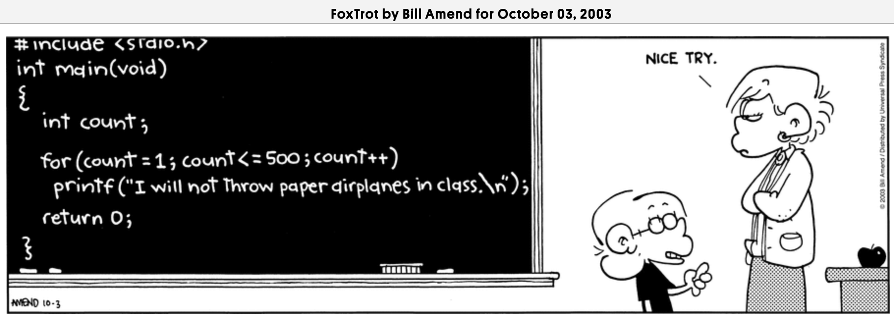
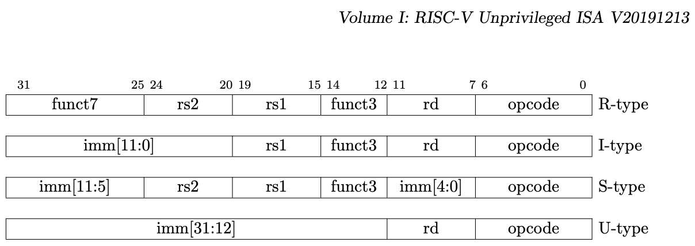


Task list to copy/paste when creating PR for this assign:

__Before releasing assign3:__
- [ ] Review writeup/starter code (instructor)
- [ ] Review consistency/completeness of grading info published to students relative to grading tests used, consider changes clarity/ease of grading (TA)
- [ ] Followup on issues from previous quarter postmortem (issue #395)

__To prep for assign3:__
- [ ]





{: .border }

## Goals

Libraries are critical in software development. They enable you to build
on existing abstractions that are well-designed and well-tested.
Many of the C standard libraries are large and complex. Because we copy our entire program over a slow line to the bootloader each time, we want a smaller, simpler library of only the essentials. The curated subset in our library contains features selected for their utility and relevance to our particular needs.

A library for outputting formatted text is particularly powerful,
since printing program state is a valuable form of debugging. The C function to output formatted text is `printf`. The standard version of `printf` has extensive features and a large code size.  You will implement a
pared-down `printf` that provides only the core functionality. Your `printf` is layered on a `strings` module that you will also write.
Completing this assignment will give you two new modules to add to your growing Mango Pi library.

In addition to the benefits you will reap from having this functionality, by implementing these
modules you will learn:

- how to decompose a complex programming problem into smaller and more manageable pieces,
- how strings and characters are represented and manipulated in C,
- how to convert C data types (numbers, pointers) to a string representation,
- how the UART peripheral on the Pi is used to communicate with your laptop
- how to make good use of the gdb debugger to make progress on difficult bugs!

## Best practices
This is a difficult assignment, and will require a thoughtful plan and good development habits. Here are our strong recommendations on how to approach:

1. __Mindset__. Your skills with memory-wrangling and C pointers will grow leaps and bounds in completing this assignment. When you're done, you'll understand these topics well, but you will work hard for it and wrangle some tough bugs along the way.  Bringing a growth mindset is one of your best assets. Rather than let that tricky bug get you down, instead focus on the improved understanding you will gain as you work it out. If you start to feel you are losing your mojo, reach out to us for help and encouragement.
1. __Start early__. This gives you time to think things through, to come to office hours, to re-work if your first approach isn't working out as you hoped, to pause and appreciate all that you are learning.  In contrast, getting a late start means working non-stop with the stress and unpleasantness of a looming deadline. Some bugs take a few minutes to resolve, others take hours, and you never know which it will be. When you're dealing with a doozy that has you has stumped, one of the best gifts you can have given yourself is time: for a break, a walk, a nap, a meal,... (and a visit to office hours!)
1. __Follow good development and debugging practice__, incremental stepwise, test as you go, use the debugger! Now is the time to invest in building up your mad gdb skills. Follow along with our detailed recommendations in the section [Road map for success](#road-map-for-success) about order of attack and how to proceed on each of the assignment tasks.
1. __Test as you go__. A small number of minutes spent upfront to construct good test cases and use them as you go
can save many hours of difficult detangling and debugging later.
1. __Commit often__. If you make a modification that accidentally break what was working before, you want to have a strong and complete audit trial of commits that allows you to easily review the changes and restore to an earlier version of working code if needed.

We have many quarters of experience helping students succeed on this assignment, and we know it is within your ability! But please, please, please follow our recommendations so you complete successfully and also have an enjoyable journey.

## Get starter files
Change to your local `mycode` repo and pull in the assignment starter code:

```console
$ cd ~/cs107e_home/mycode
$ git checkout dev
$ git pull code-mirror assign3-starter
```

In the `assign3` directory, you will find these files:
- `strings.c`, `printf.c`:  library modules 
- `test_strings_printf.c`:  test program with your unit tests for strings and printf
- `print_pinout.c`: sample application that uses `printf` to display the Pi's pinout. Do not edit this program, just use it as-is.
- `Makefile`: rules to build pinout application (`make run`) and unit test program (`make test`). Also a `make debug` target that runs the unit test program under `gdb`.
- `README.md`: edit this text file to communicate with us about your submission
- `style_reflection.txt`: a text file that you will edit for your responses to the style reflection prompts

<a name=mymodules></a>

The `make run` target builds and runs the sample application
`print_pinout.bin`. You will likely only use this target at the very end as a final test of your completed work. The `make test` target builds and run the unit test program
`test_strings_printf.bin`. This test program is where you will add all of your unit tests. You will make heavy use of this target. Use the target `make debug` to run the unit test program `test_strings_printf.elf` under gdb in simulation mode.

<style>
.small { font-size:small }
</style>

> __Use of MY_MODULE_SOURCES in Makefile__
Each week as you move forward, you have the option of building on your own code from the previous assignments. Open `Makefile` in `assign3` and read the comment which explains `MY_MODULE_SOURCES`.  The default setting will list only the library modules for the current assignment. If you edit `MY_MODULE_SOURCES` to add the library modules you completed previously (e.g. `gpio.c` and `timer.c`), your programs will now build using your code for those modules instead of the reference. Using your previous modules as you move forward will further test your code and give you a jumpstart on earning the full system bonus awarded to a final assignment that uses all of your modules and none of the reference. If you encounter a problem using a previous module, you can remove it from `MY_MODULE_SOURCES` to instead use the reference version until you have a chance to resolve the underlying issue.
{: .callout-info .small}

## Core functionality
In this section of the writeup, we review the module specifications. We recommend you skim this section to get an overview but don't get mired in the minutiae just yet. Before writing any code, read the section [Road map for success](#road-map-for-success) for a road map and advice on how to proceed. When ready to implement a particular function, come back to this section to review the nitty-gritty details.

### Strings module
Pretty much every programming language supports a string data type and operations. The C language's string type is very bare bones: a pointer to a contiguous sequence of characters terminated by a null-terminator (zero, or `'\0'`). You can access individual characters using pointer or array operations and that's about it. To do more useful  things with a C-string, such as find its length, make a copy, or compare two strings, you need additional functions. Use the command `man string` to list the functions from the C `strings` module. There are a lot of functions in the standard  library!

You will implement your own `strings` module. Your module will not support
such a large set of operations, just a few key essentials chosen for
their specific usefulness to us.

Start by reviewing the header file (available as `$CS107E/include/strings.h` or [browse strings.h here](/header#strings)). The functions exported by the `strings` module are:

- `memcpy` and `strlen` (both provided to you pre-written)
- `memset`
- `strcmp`
- `strlcat`
- `strtonum`

Although these function interfaces are modeled after similarly-named functions in the standard C library, we have made some simplifications, so please read our header file carefully to ensure you are implementing only and exactly what is expected.

The choice of these particular functions may appear eclectic, but each was selected for its utility in implementing or testing `printf`. As you write each string function, consider how to properly use it and what it will be useful for. In particular, `strlcat` may seem oddly-structured at first glance, but its specific functionality turns out to be an ideal match for certain tasks within `printf`.

### Printf module

The functions in the `printf` module construct formatted strings to be used as output.

The three public functions you are to implement in `printf.c` are:
- `printf`
- `snprintf`
- `vsnprintf`
- Additionally one private helper function is expected to be a part of your implementation:
  - `num_to_string`

Review the header file (available as `$CS107E/include/printf.h` or [browse printf.h here](/header#printf)) for documentation of the public functions. The features required in your version are simplified from the standard C library version, so please read our header file carefully to ensure you are implementing only and exactly what is expected.

The printf module is not really so much about output as it is about string manipulation. The main tasks are to process a input string of text and formatting codes and expand it into a fully fleshed-out output string.

#### Number to string conversion

 ```c
void num_to_string(unsigned long num, int base, char *outstr);

const char *hex_string(unsigned long val);
const char *decimal_string(long val);
 ```

You are to implement the helper function `num_to_string`. This function converts a number to a string representation in the specific `base` and writes the characters to `outstr` as a null-terminated string.

As an example, the call `num_to_string(209, 10, outstr)` converts the number `209` in base `10` to the string representation `"209"`, or more precisely, writes to `outstr` an array of four ASCII characters ending with a null-terminator: `2` `0` `9` `\0`. For hexadecimal base 16, `num_to_string(209, 16, outstr)` writes the output string `"d1"`, the array of characters: `d` `1` `\0`.

The first argument `num` is the number to be converted. The `base` argument indicates whether the output string should be in decimal (base 10) or hexadecimal (base 16). No other bases are supported. The `outstr` argument is the address of the array where the output string is to be written. Your function can assume the `outstr` array is always large enough to store all digits of num including space for the null-terminator.

The additional conversion convenience functions `hex_string` and `decimal_string` build on your `num_to_string` function. The convenience functions are provided to you pre-written. You should use this code as-is unchanged. Read the provided comments in the starter code for info on how to properly use these functions.


#### Snprintf and family

```c
int snprintf(char *buf, size_t bufsize, const char *format, ... );
int vsnprintf(char *buf, size_t bufsize, const char *format, va_list args);
int printf(char *format, ... );
```
These three functions of the printf family each accept the same type of input strings and formatting codes, but differ slightly in how they are called or where the output is written.

The "formatting codes" allow combining different types of values into a single output string. Review this [C reference](http://www.cplusplus.com/reference/cstdio/printf/#example)
for sample uses of `printf`.  `printf` writes the formatted output to your terminal; the `snprintf` variant writes the formatted output to a string buffer. In the final arrangement, the workhorse `vnprintf` will underly both `printf` and `snprintf`.

Full documentation for a standard C function is available via man page, e.g. `man snprintf`. In general, our libmango versions supports a limited set of options compared to the full-featured standard library version. Refer to our [printf.h](/header#printf) header file to know exactly what your code is required to support.

Any ordinary characters in the input string are copied unchanged to the output string. The formatting codes in the input string are placeholders for values to be inserted. For each formatting code, the requested conversion is applied to the argument and written to the output string.

Your implementation must handle these formatting codes:

```
 %c   single character
 %s   string
 %d   signed decimal integer (%ld long decimal)
 %x   unsigned hexadecimal integer (%lx long hex)
 %p   pointer
 %%   directly output a percent sign (no formatting)
```

For formatting codes `%c` and `%s`, no processing is needed to "convert" characters
and strings, the character or string argument is copied as-is to the output string.

For the integer formatting codes `%d` and `%x`, the argument is of type `int`. For `%ld` and `%lx`, the argument is type `long` which is just a wider integer (64-bit).  A number is converted to string representation by calling the `decimal_string` or `hex_string` function and copied to the output string.

Formatting codes support an optional field width. The field width enforces a minimum number of characters in the output for this conversion. Space characters are inserted as necessary to pad up to the minimum width. For formatting codes that output in hexadecimal, the padding character is a `'0'` instead of space. In all cases, padding chars are inserted on the left.

Some examples:

- `"%3c"`     char argument, output is space-padded, field width=3
- `"%12s"`    string argument, output is space-padded, field width=12
- `"%8x"`     unsigned int argument, output is zero-padded, field width=8
- `"%7ld"`    long argument, output is space-padded, field width=7

The `%p` format is a variant of `%lx` used for pointers.  A pointer uses a default conversion format of zero-padded field width 8 hexadecimal prefixed with 0x, e.g. `0x02000040`. If a field width is specified, e.g. `%16p`, it overrides the default width of 8.

The `snprintf`and `printf` functions accept a variable number of arguments, one argument for each formatting code in the format string. To access those additional arguments, you use C's `<stdarg.h>` interface. Read more about [Variadic functions](#varargs) below.

The characters of the converted output string are written to `buf` ending with a null-terminator and truncated if necessary to fit in `bufsize`. The return value is the length of the fully expanded output string (i.e. number of characters that would have been written ignoring any truncation that did happen).

Some examples:

- `snprintf(buf, 20, "%3s", "hello")` writes 6 chars to buf `h` `e` `l` `l` `o` `\0` and returns 5
    - Explanation: string conversion, no padding needed for field width 3, fits in bufsize 20, no truncation
- `snprintf(buf, 20, "%2c", 'M')` writes 3 chars to buf <code>&nbsp;</code> `M` `\0` and returns 2
    - Explanation: char conversion, inserts 1 space char to pad to field width 2, fits in bufsize 20, no truncation
- `snprintf(buf, 20, "%4x", 27)` writes 5 chars to buf `0` `0` `1` `b` `\0` and returns 4.
    - Explanation: hex conversion, inserts 2 __zero__ chars to pad to field width 4, fits in bufsize 20, no truncation
- `snprintf(buf,  5, "%7d", -9999)` writes 5 chars to buf <code>&nbsp;</code> <code>&nbsp;</code> `-` `9` `\0` and returns 7.
    - Explanation: decimal conversion, inserts 2 space chars to pad to field width 7, does not fit in bufsize 5, truncates to first 4 that fit, returns count that would have been written if not truncated
- `snprintf(buf,  0, "%p", ptr)` writes __nothing__ to buf and returns 10.
    - Explanation: pointer conversion, default output form `0xNNNNNNNN`, no chars fit in bufsize 0, writing `0xNNNNNNNN` would have been 10 chars

> __bufsize and memory corruption: here be dragons!__
One of the most critical requirements for `snprintf` is that it must always respect `bufsize`. `bufsize` communicates the hard upper limit on how much space is available to store the output string, but there is no guarantee that the entirety of the converted output will fit within `bufsize`.  In all cases `bufsize` wins: not writing past the end of `buf` and not corrupting memory is more important than writing out the string requested by the arguments. If `bufsize` is too small to fit all of the output, even if the minimum field width says you should go past it, you must truncate the output and store a null-terminator in `buf[bufsize - 1]`.  Finally, `bufsize` can be zero: if so, you should not write anything to `buf`, not even a null-terminator.
{:  .callout-danger }


<a name="varargs"></a>
#### Variadic functions

`printf` and `snprintf` are functions that take a variable number of arguments.
C provides the `stdarg.h` mechanism to support variadic functions.
Below is an example:

```c
#include <stdarg.h>
#include <stdio.h>

int sum(int n, ...) { // one fixed argument, followed by other variable arguments
    int result = 0;
    va_list ap; // declare va_list

    va_start(ap, n); // init va_list, read arguments following argument named n
    for (int i = 0; i < n; i++) {
       int arg = va_arg(ap, int); // access value of next argument, type is `int`
       result += arg;
    }
    va_end(ap);   // clean up

    return result;
}

int main(void) {
    printf("%d\n", sum(3, 51, 19, 32));
    printf("%d\n", sum(2, 7, -7));
    return 0;
}
```

The parameter list `int sum(int n, ...)` has one fixed argument `n` and an ellipsis which indicates
that it can optionally followed by any number of additional arguments.
For example, the call `sum(3, 51, 19, 32)` contains one fixed argument, 3, and three additional arguments: 51, 19, and 32.
In a call to `sum`, the fixed argument is the count of additional arguments to follow.

Unlike fixed arguments, variable arguments do not have names,
so you need a mechanism to access their values within the `sum` function.
The `stdarg.h` header defines the `va_list` and its operation for this purpose. You declare a `va_list`, initialize via `va_start`, retrieve a variable argument using `va_arg`,
and clean up with `va_end`.

To initialize a `va_list` call `va_start`__passing the name of the last fixed argument__.
This configures the `va_list` to start reading at the next argument following that one.
 In the above example, we tell `va_start` that `n` is the last fixed argument. Note that we literally pass the _name_ `n`. The type or value of the fixed argument doesn't matter -- the fact that `n` happens to be an `int` is
irrelevant, nor does it use the value of `n`, `va_start` is just using the name to locate where to access the arguments that follow.

Each call to `va_arg(ap, type)` retrieves the value of the next argument according to the type you specify.
 In the `sum` example, the variable arguments are all `int` type, but
the type can be different per-argument by changing the type passed to
`va_arg`. When done processing all variable arguments, call
`va_end(ap)` to clean up.

One nit to be aware of is that you cannot ask `va_arg` for an argument of `char` type. Instead you must ask for the value as an
`int` type. (This is due to obscure rules in C standard about "[default argument
promotions](http://stackoverflow.com/questions/1255775/default-argument-promotions-in-c-function-calls)")

For additional information about `stdarg`, read the [Wikipedia page on
stdarg.h](http://en.wikipedia.org/wiki/Stdarg.h) or this tutoriall <https://www.tutorialspoint.com/c_standard_library/c_macro_va_start.htm>

## Road map for success

Having read up to here, you may be feeling overwhelmed by what work lies ahead. It is a big job, but it will be much more tractable if you break it down into manageable tasks and tackle one at a time. Developing an appropriate decomposition and identifying a good path to follow from start to finish is not always obvious when you just starting out, so read on for our recommendations on what has been found to work well.

### Order of attack and strategic hints

#### 1. strings module

Definitely start here. Each string function is a small task that can be implemented and tested independently. As you write each function, brainstorm test cases that cover a range of uses. Add those tests into `test_strings_printf.c`. It will be useful to test both under gdb and on the Pi. Use `make test` to build and run the test program on the Pi and use `make debug` to run under gdb. If it works on one and not the other, this typically means there is a latent bug, one whose effect differs by context.  (review [differences due to simulation](/guides/gdb#simulation)) Don't move on to the next function until the current one is running correctly in all situations.

- Confirm you have a clear understanding of how a C-string is represented: `char*` is memory address, at address is array of ASCII characters ending with a null-terminator (zero character). Many string-handling bugs arise from forgetting or mishandling the null-terminator. Be sure you know why the terminator is necessary and what happens if it is missing or misplaced.
- `strcmp` is the simplest of the bunch and makes a great starting point for practice
  with string handling. The `strcmp` function is critical to all your future testing as you will later depend on it to confirm the result of other string operations.
  What are some test cases you can use now to ensure `strcmp` will be robust
  and reliable when you need it?
- We provide the implementation of `memcpy`, the generic function that copies a sequence of bytes from source location to destination. The interface
  is written in terms of `void*` which allows the function to accept any type of pointer and copy any type of pointee data. Because it is not valid to dereference a `void*` or use in pointer arithmetic, it internally uses a typed pointer `char*` to access the data as an array of raw bytes. Review our given code and confirm you understand how it works. You're now ready to write `memset`, the generic function that writes a repeated byte in a region of memory.
- You're now ready to take on `strlcat`.   Be sure to take advantage of how the implementation can layer on the already-implemented `strlen` and `memcpy`. This size-bounded concatentation operation will turn out to be a perfect fit for use within `printf` (even including the odd-duck return value). Test this one very thoroughly so you can be confident calling it on later.
- Working through `strtonum` will reinforce your understanding of the difference
  between the ASCII character '5' and the integer value 5 and what is needed to
  convert from string form to integer value. You will later implement that same conversion
  in the opposite direction.
- The second argument to `strtonum` is of type `char **`. This double pointer may give you a double take! The argument is serving as an output parameter whose value is being modified "by reference".  C does not have a language equivalent to the C++
reference parameter, but we can use pointers to create a manual version. The code below demonstrates using an `int *` parameter as a mechanism to modify an `int` variable. The `char **` parameter of `strtonum` is similarly being used to modify a variable of type `char *`.
  ```
  void no_change(int val) {
        val += 100;
  }

  void change(int *ptr) {
        *ptr += 100;
  }

  void main() {
       int num = 4;
       no_change(num);
       change(&num);
  }
  ```
- We cannot over-emphasize the __importance of testing as you go__.
  Attempting to implement `printf` on top of an unreliable/untested strings library is crazy-hard, as you must debug all of the code simultaneously and untangle complex interactions.
  If you start on `printf` having already confirmed your strings library does its job correctly, you can focus your attention on debugging only the new code being added.

Completing the strings module is a great first milestone! You now have a collection of very useful string functions and have important lessons under your belt, such as understanding the relationship between pointers and arrays, being aware of need to take care with the null-terminator, and so on.

#### 2. Converting numbers to string

Now move on to the `printf` module. We recommend your first task be to implement the `num_to_string` function. This is a small but mighty operation that convert a number to a string representation (the inverse of the conversion performed
by `strtonum`).

- Initially implement conversion to base 10 only
- Translating a number to a digit character decomposes into a nice helper of its own.
- If you process the digits in reverse order (e.g. from the least significant digit to the most), your logic will be cleaner. Declare a temporary buffer to store the digits as you go and later invert the order when copying to the output buffer.
- Always be sure to include the null-terminator!
- After testing conversion to base 10, now go back and add support for base 16. However, don't copy/paste the code you wrote for base 10
  to create a second nearly identical conversion! Repeated code means more code to write, debug, test, and maintain; a lose-lose all around. Instead, identify how to unify into a single code path that flexibly allows for either base.
- __TESTING!__
  - This helper does the heavy lifting of the number formatting for printf, so be sure to __test very thoroughly__.
  - Be sure that your `strcmp` is rock-solid. Most of the unit tests for conversion/snprintf test a function by writing its output string into a buffer, followed by an assert that uses `strcmp` to confirm the contents written to the buffer match the expected. In order for these tests to be valid, you are depending on the truthfulness of `strcmp`!
  - Your initial test cases will be direct calls to `num_to_string`. We also recommend tests on the provided `hex_string` and `decimal_string` functions as well. These functions depend on your `num_to_string`, and if it is working properly, it is expected they will be fully functional as well, but rather than assume, add test cases to confirm!

#### 3. Implement snprintf

You are now ready to tackle `snprintf`. The most important advice is __do not try to implement the whole gamut of snprintf functionality in one go!__ This would be an overwhelming task and will quickly lead to a mess of complicated code that is hard to debug or get right. The way to tame the complexity is to advance in small steps, continually testing as you go.

- Start by implementing a version of `snprintf` with no support for formatting codes that outputs only ordinary characters.
  - Test on simple example: `snprintf(buf, bufsize, "Hello, World!")`.
  - Test cases use `strcmp` to confirm that `buf` contains the expected output string.
- Add support for the simplest formatting codes first: `%%` `%c` `%s`.
  - Test on a single codes first `snprintf(buf, bufsize, "%c", 'M')`, work up to multiple mixed codes `snprintf(buf, bufsize, "LS%cU = 100%% %s!", 'J', "fresh")`.
- Begin thinking about truncation now and the imperative to respect `bufsize`.
  - When appending characters to the output, you must only copy the characters that fit. Think back to the `strlcat` function you implemented earlier. That size-bounded concatenation operation is perfect here!  Using it each time you need to append to output gives a tidy and reliable way to enforce truncation, ensure proper null-termination, and calcuate the length that would have been without truncation.
  - Add tests that produce more output than fits into a small-size buffer and confirm proper truncation at bufsize.
- The number formatting codes `%d`, `%x`, `%ld`, `%lx` are next up. These conversions get dispatched to `hex_string` or `decimal_string`, functions that work like a champ because you already crushed it on implementing the `num_to_str`.  Enjoy that victory lap!
- The last big hurdle is to add handling of the field width.
  - A good first task is to add code that inserts pad chars on left up to minimum field width when appending a conversion. Hexadecimal outputs use `'0`' as the pad char, all others use `' '` (space).
  - Temporarily hard-code so that every conversion uses a fixed field width of 12, say, and test to confirm that appropriate pad chars are inserted. Also include tests to confirm that padding plays nicely with truncation and properly respects bufsize.
  - Now obtain field width from the formatting code instead of using a fixed width. To parse a number out of the format string, recall that handy function you wrote in for strings module to convert a string of digits to a number (hint!).
  - The field width applies to formatting codes `%c` `%s` `%d` `%ld` `%x` `%lx` `%p`. The padding characater is `'0'` for hexademical and `' '` for all others.  Padding must respect bufsize. This sounds it would create a lot of combinations to test, but if you work to gather the common code into a unified path, it will significantly cut down on the testing burden.
- The final formatting code pointer `%p` is a just a remix of things you already have conquered: unsigned long value in hexadecimal zero-padded to field width 8 and prefixed with "0x".


Achieving a working `snprintf` is the big hill to get over in this assignment. Once you have that, all that remains is re-factoring and layering. You are in the homestretch!

#### 4. Refactor into `vsnprintf`

```c
int vsnprintf(char *buf, size_t bufsize, const char *format, va_list args);
```

The `printf` function needs the same functionality as `snprintf`. However
since `snprintf` takes a variable number of arguments, you cannot call it directly from `printf`.  You must create a shared helper function `vsnprintf` (that takes a `va_list` parameter), which you can then call from both `snprintf` and `printf`. Refactoring means moving your `snprintf` code into `vsnprintf` and then
changing `snprintf` to call `vsnprintf`. Once you have completed this refactor,
confirm you are still passing all of your previous tests.

#### 5. Implement `printf`
Adding `printf` is a piece of cake. It declares a stack array of a large length (our versios uses 1024 as the max output length), calls `vsnprintf` to fill that array with the formatted output string, and hands the string over to `uart_putstring`. Having thoroughly tested `snprintf`/`vsnprintf`,
you will not likely need many new tests for `printf`, since it is built on the same substrate that you have already confirmed correct.

`printf` uses the uart peripheral which must be initialized with a call to `uart_init`. This init call should be done __once and only once__ and typically at beginning of program execution. The starter code already calls `uart_init` (at start of `main`) and you do not need to change it.

It is time 🕰 for a serious Happy Dance 🙌 and an epic 🎼 that celebrates your amazing feats! You did it! 🏆 We hope you will enjoy the fruit 🍎 of your labors 💪 for a long time to come!


<a name="testing"></a>
### Testing advice
Students who struggled in the past generally wrote too much code before testing it. Instead you want to approach the work by dividing in tiny increments, making a small, testable improvement each time. If the latest changes don't work, you'll know exactly where to look for the mistake. This strategy will save you a lot of time and heartache.
To quote Dawson Engler, Systems Programmer Extraordinaire:

> __Engler’s theorem of epsilon-steps__ Given a working system _W_ and a change _c_,  as _c_ → ε  the time _T_ it takes to figure out why _W_ + _c_ doesn’t work goes to 0 (_T_ → 0).
{: .callout-info}

After taking each epsilon-step in your code, immediately turn your attention to
testing and debugging it. What test case can you add to `test_strings_printf.c`
to confirm that the code you just added is working correctly? It may require multiple test cases to get at different parts of the behavior. Add those tests now and don't move on until you pass them all.

Never delete a test! Sometimes a later change will cause a test that was previously passing to backslide. If you have removed or commented out the test, you won't realize the bug has resurfaced. Instead, accumulate all tests in `test_strings_printf.c` and keep them active. Every subsequent run will re-validate against the entire test suite and alert you to any regression.

In `test_strings_printf.c`, we want to see a comprehensive test suite
that exercises each function in the strings module and all formatting options mix-and-match for printf and variants. There is a lot of ground to cover! Grading will include an evaluation of the effectiveness of your tests, along with our feedback to help you to develop and refine this critical skill.

Review the function specifications in the `strings.h` and `printf.h` header files and be sure that your test cases have full coverage of the specified behavior, including any edge cases or required error handling. Note that our  specifications make some simplifying assumptions relative to the standard library. Your functions need only handle calls that are valid according to our assumptions: e.g. exactly and only these formatting codes, base is always be 10 or 16, the width specified must begin with a zero, the format string
is well-formed and so on. You do not have to detect/handle/reject calls that violate these assumptions. We will not test on such inputs and your tests do not need to consider these cases.

### Debugging advice
One unfortunate circularity with trying to test printf is the lack of a working
printf to help you debug.  Here are a couple of strategies you may want to consider:

- __Use the debugger__! Run under gdb in simulation mode and use gdb commands to
  step and print variables to observe your program's operation. We strongly encourage you to invest in building up your gdb chops now -- this investment will really pay off! Stay mindful of the differences between the simulator and the actual Pi. (Review gdb exercises of [Lab 3](/labs/lab3/) for a refresher). The `make debug` target from the Makefile runs gdb on the `test_strings_printf.elf`.
    ```console?
   $ make debug
   riscv64-unknown-elf-gdb -q --command=CS107E/other/gdbsim.commands test_strings_printf.elf
   Reading symbols from test_strings_printf.elf...
   Auto-loading commands from CS107E/other/gdbsim.commands...
    ```

- __Liberal use of `assert()` tests__. For example, you can test the output written
  by `snprintf` matches the expected output by asserting the two strings
  `strcmp` as equal. Note that the version of `assert` from assign3 forward calls  `uart_putstring` to print out details (i.e. line number, failed expression), so you are no longer limited to interpreting smoke signals from the blue LED.

- __Compare to reference.__ The `string` and `printf` functions are a part of the C standard library, available in any C compiler (non-bare-metal). If you are not sure of the expected behavior for a particular call, try it on your local compiler, or do a quick test in this handy [online C environment (Rextester)](https://rextester.com/l/c_online_compiler_gcc ).

## Extension: disassembler
Congratulations on your printf success! The blood, sweat, and tears that you put into it will pay huge dividends, super-charging all your future debugging and providing a foundation on which you can build many cool tools. If you have additional bandwdith to keep going from here, there is a super-neat extension that we hope you will explore!

The extension is to add a new custom formatting code to your shiny new `printf` that converts a binary-encoded instruction into human-readable assembly. This effectively adds a disassemble operation to `printf` 🤯!  Here is a diagram of the bitwise breakdown for the four base instruction encodings taken from the [RISC-V ISA Manual](/readings/riscv-spec-20191213.pdf#page=34):

{: .border }

Let's break down the R-type, used for three-register ALU instructions. Each register is encoded as its 5-bit numeric index (0 to 31). An R-type instruction encodes 3 registers: one for the destination and two source registers. The opcode bits identify the class of instruction and the funct7 and funct3 bits identify the specific ALU operation variant (add, sub, shift, etc).

To build one of our assembly language programs such as `blink.s` or `larson.s`, we called upon the  _assembler_ to translate each assembly instruction such as `add a3,a4,a5` into its binary-encoded machine instruction `00f706b3`. The reverse process is a _disassembler_  which picks apart the bits of the encoded instruction `00f706b3` to produce the output `add a3,a4,a5`.

Use the custom formatting code `%pI` which expects a corresponding argument of "pointer to instruction". There is no "instruction" type in C; use a pointee type of `unsigned int` to read a binary-encoded instruction from memory. The instructions for the currently executing program are stored in memory as well. If you print the instruction at the program start address and move upwards in memory, you can disassemble the entire program!

Here is a sample use of `%pI`:

```c
unsigned int add = 0x00f706b3;              // manual binary-encoded instruction
unsigned int *first = (unsigned int*)main;  // address of instruction in memory for function main()

printf("Encoded instruction %08x disassembles to %pI\n", add, &add);
printf("Encoded instruction %08x disassembles to %pI\n", *first, first);
```
The output of the above code is:
```console?prompt=none
Encoded instruction 00f706b3 disassembles to add a3,a4,a5
Encoded instruction fe010113 disassembles to addi sp,sp,-16
```

You _could_ use your bit-masking superpowers to pick apart an encoded instruction but a simpler way is to define a C bitfield. In the starter file `printf.c` we included some code that demonstrates sample use of a bitfield to get you started.

To learn more about the instruction encoding, refer to the [RISC-V ISA Manual](/readings/riscv-spec-20191213.pdf#page=34). This neat [online encoder/decoder](https://luplab.gitlab.io/rvcodecjs/#q=fe010113&abi=true&isa=RV64I) is fun way to learn more!


Start by decoding the common R-type and I-type instructions. The RISC-V ISA encoding is remarkably regular, so you can catch a good chunk of all instructions with just a few cases. Add decoding for the SB-type instructions and you'll learn about load/store and how the target for a branch is encoded.  Decoding UJ-type is a neat exercise in piecing together the bits of the immmediate and more practice with pc-relative addressing.  As much as possible, aim for your output to match the standard disassembly tools (i.e. `riscv64-unknown-elf-objdump -d` or gdb `disassemble` command). Don't worry about making special cases for oddballs or psuedo instructions. For those instruction types you do not decode, simply print the encoded value.

There is a unit test in the `test_strings_printf.c` that demonstrates sample disassemble use.  To see how good a job your disassembler is doing, you can also compare your output to the result from gdb's tools.  In `gdb`, you can disassemble the single instruction at an address with the `x/i` command or dump a sequence of instructions using the `disassemble` command:

```console?prompt=(gdb)
    unsigned int add = 0x00f706b3;
(gdb) x/i &add
   0x4fffffac: add a3,a4,a5
(gdb) disassemble main
   0x0000000040000890 <+0>:  add sp,sp,-16
   0x0000000040000894 <+4>:  sd  ra,8(sp)
   0x0000000040000898 <+8>:  sd  s0,0(sp)
   0x000000004000089c <+12>: add s0,sp,16
   0x00000000400008a0 <+16>: jal 0x400026c4 <uart_init>
```
To submit the extension for grading, tag your completed code `assign3-extension`.
In your `README.md`, tell us about your disassembler and which instruction types you can decode. There are four instruction types (R-type, I-type, SB-type, UJ-type). Decoding each group of instructions earns one credit, up to a total of __4 credits__ if you correctly implement all. A great implementation deserves to be generously rewarded!🎖

You just wrote a program that dissects itself from the inside -- what is a crazy-awesome-meta achievement! 💪

## Style reflection

Here are the instructions for the [style reflection](style_reflection) to be submitted with this assignment.

## Submitting

The deliverables for `assign3-submit` are:

- implementations of the `strings.c` and `printf.c` library modules
- comprehensive tests for both modules in `test_strings_printf.c`
- `README.md` (possibly empty)
- your responses to the prompt questions in `style_reflection.txt`

Please be sure all of the above files are added and committed with your submission. Submit your finished code by tag `assign3-submit` and push to remote.  The steps to follow are given in the [git workflow guide](/guides/cs107e-git#assignment-submission).
  
As time permits, you are encouraged to revisit code from previous assignments and submit bug fixes for any issues that are eligible for revision.  To submit bug fixes, commit your changes, tag `assign2-retest` (`assignN` where `N` is the assignment you are resubmitting) and push. This tag signals that we should re-run the automated tests and update your issue lists to show new successes.  All unit tests on library modules are eligible for resubmit.

## Grading

To grade this assignment, we will:

- Verify that your project builds correctly, with no warnings
- Run automated tests on your `strings` and `printf` modules
- Go over the unit tests you added to `test_strings_printf.c` and evaluate them for
  thoughtfulness and completeness in coverage.
- Review your completed style reflection.

Our highest priority tests will focus on the essential functionality of your library modules:

  - strings
    - correct behavior according to spec
    - all strings properly null-terminated, buffer size respected
  - printf
    - correct behavior according to spec
    - format codes `%c`, `%s`, `%d`, `%x`, `%p`
    - all strings properly null-terminated, buffer size respected

The additional tests of lower priority will examine less critical features, edge cases, and robustness. Make sure you thoroughly tested on a wide variety of scenarios!

