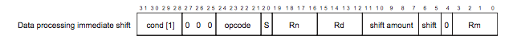


Task list to copy/paste when creating PR for this assign:

__Before releasing assign3:__
- [ ] Review writeup/starter code (instructor)
- [ ] Review consistency/completeness of grading info published to students relative to grading tests used, consider changes clarity/ease of grading (TA)
- [ ] Followup on issues from previous quarter postmortem (issue #231)

__To prep for assign3:__
- [ ] 


*Written by Pat Hanrahan and Julie Zelenski*




## Goals

Libraries are critical in software development. They let you build
on existing, well-designed, and well-tested abstractions.
Many of the C standard libraries are
surprisingly large. Because we copy our entire program over a slow
serial line to the bootloader, we want a smaller, simpler library of just the essentials. The library you will implement supports a subset of the standard features selected for their utility and relevance to our particular needs.

A library for outputting formatted text is particularly powerful,
since printing program state is a valuable form of debugging. In C, the
standard function to output formatted text is `printf`. The standard version of `printf` has many options and a large code size.  You will implement a
pared-down `printf` that provides just the essential core functionality. Your `printf` will be layered on a `strings` module that you will also write.
Completing this assignment will give you two new modules to add to your growing library of Raspberry Pi functions. 

In addition to having extended your library with this extremely useful functionality, by implementing these
functions you will learn:

- how to decompose a complex programming problem into smaller and more manageable pieces,
- how strings and characters are represented and manipulated in C,
- how to convert basic C types (numbers, pointers) to a string representation,
- how to reuse your GPIO and timer code from the previous assignment, and
- how to use the UART library shown in class to communicate with your laptop.

## Advice

This is a difficult assignment, so...

1. **Mindset**. Completing this assignment will exercise everything we've been talking in class about memory, pointers and strings. When you're done, you'll understand these topics well, but you will work hard for it and you're likely to encounter tough bugs along the way. If you start to lose momentum, reach out for help so we can help you get back on track.
1. **Start early**. This gives you time to think things through, to take advantage of office hours, to take a break and clear your head when stalled, to back out from a decision that didn't work out, to pause and appreciate all that you are learning.  In contrast, getting a late start means working non-stop under the unpleasant stress of a looming deadline. Some bugs take ten minutes, some take two hours, and you never know which one it will be. If you start early, hitting a two-hour bug won't stress you out. But if you do hit such a doozy, please reach out to us so we can help you tackle the problem!
1. **Follow good development and debugging practice**, just like you learned in lab. Now is the time to build up your mad gdb skills. Take to heart our recommended [Strategies for Success](#strategies-for-success). This will help you complete the assignment more efficiently and with less strife. 
1. **Test as you go**. Spending 10 minutes to write a test
can save you hours of debugging time later.
1. **Commit often**. If you modify your code and break it you can easily go back to a working version. 
1. **You have a reference.** All of these functions are part of the C standard libraries. If you are unsure of how they should behave, or what the output should be, try them on your local machine, or in a [friendly web-based compiler](https://www.onlinegdb.com/online_c_compiler).

We have many quarters of experience helping students succeed on this assignment, and we know it's within your ability! But please, please, please follow our recommendations so you complete successfully and also have an enjoyable journey.

## Get starter files
Change to the `cs107e.github.io` repository in your `cs107e_home` and do a `git pull` to ensure your courseware files are up to date.

To get the assignment starter code, change to your local repository, fetch any changes from the remote and switch to the assignment basic branch:

```
$ cd ~/cs107e_home/assignments
$ git fetch origin
$ git checkout assign3-basic
```

Each subsequent assignment starts from where you left off, so the `assign3-basic` branch contains the `gpio.c`
and `timer.c` files you submitted for the previous assignment. You have the option of building on your own code as you move forward or switching out your modules for our library versions. Which modules of yours are used and which of ours is controlled by the setting `MY_MODULES` in the Makefile. Read the `Makefile` for information on how to configure this setting.

The starter code contains the files `printf.c` and `strings.c`, a sample application `apps/print_pinout.c` and the test program `tests/test_strings_printf.c`. 

You will edit the `strings.c` and `printf.c` files to implement the required
functions.  You will also add many tests to `tests/test_strings_printf.c`.  The `apps/print_pinout.c` is a small sample application that uses `printf` to display the Pi's pinout. **Do not modify `apps/print_pinout.c`.**

The `make install` target of the Makefile builds and run the sample application `apps/print_pinout.bin`. The `make test` target builds and run the test program `tests/test_strings_printf.bin`. Remember that you can run the debugger in simulator mode on the corresponding ELF file, e.g. `arm-none-eabi-gdb tests/test_strings_printf.elf`.

## Basic section

Below we introduce the modules by giving an rundown of the functions and their specifications. We recommend you skim through this section to get an overview but don't get too lost in the nitty-gritty just yet. When ready to get cracking on the coding, start by bringing your full attention to the [Strategies for Success](#stragies-for-success) section where we give a road map and advice on how to proceed. You can postpone serious study of the minute details of the function specifications until you are deeper into the implementation phase.

### Strings module
Every general purpose programming language supports a string data type and operations. 
The string type in C is very bare bones; simply a pointer to a contiguous sequence of characters terminated by a null character (zero, or `'\0'`). You can access individual characters using pointer or array operations and that's about it. To do more useful things with a C-string, such as find its length, make a copy, or compare two strings, you must write functions to do so. Use the command `man string` to list the functions from the standard C  `strings` module. There are a lot of functions in the standard library!

You will implement your own `strings` module for the Pi. The module will not include such a large set of operations, just a few key essentials chosen for their specific usefulness to us.

The string functions you are to implement in `strings.c` are:

- `memset`
- `memcpy`
- `strlen`
- `strcmp`
- `strlcat`
- `strtonum`

Review our [strings.h](https://github.com/cs107e/cs107e.github.io/blob/master/cs107e/include/strings.h) file to learn the operation of each
function.  Although our function interfaces are modeled after similarly-named functions in the
standard C library, we have made some simplifications, so please read our header file
carefully to ensure you are implementing only and exactly what is
expected.


The choice of these particular six functions may appear eclectic, but each was selected for its utility in implementing or testing `printf`. As you implement each string function, consider how to properly use it and what it will be useful for. In particular, `strlcat` may seem oddly-structured at first glance, but its specific functionality turns out to be an ideal match for certain tasks within `printf`.


### Printf module

The functions in the `printf` module construct formatted strings in preparation for writing those strings to a terminal or a file. 

The three public functions you are to implement in `printf.c` are:
- `printf`
- `snprintf`
- `vsnprintf`
- These two private helper functions are also expected to be part of your implementation:
  - `unsigned_to_base`
  - `signed_to_base`

Review our [printf.h](https://github.com/cs107e/cs107e.github.io/blob/master/cs107e/include/printf.h) file for documentation of the public functions and see the starter file `printf_internal.h` for the private helpers. The required feature set is simplified from the standard C library version, please read our header file carefully to ensure you are implementing only and exactly what is expected.

The printf module is not really so much about output; the work is almost entirely string manipulation. The fundamental task is to process an input  string and its embedded formatting codes and expand into a fully fleshed-out output string.

#### Number to string conversion helpers

 ```c
int unsigned_to_base(char *buf, size_t bufsize, unsigned int val, int base, int min_width);
int signed_to_base(char *buf, size_t bufsize, int val, int base, int min_width);
 ```

These helper functions convert a numeric value to a string representation in a particular base. For example, given the integer value `126`, its string representation in base 10 is the sequence of four ASCII characters `1` `2` `6` `\0`, i.e. the string `"126"`. The string representation of `126` in base 16 would be `"7e"`.

The `val` argument is the integer value to convert.
If `signed_to_base` is called with a negative value, the output string will contain a leading minus sign.

The `base` argument indicates whether the output string is to be represented in
decimal (base 10) or hexadecimal (base 16). 

The `min_width` is the minimum number of characters in the output string.  If 
the output string contains fewer characters than `min_width`, the output string is padded with leading zeros to bring it up to length `min_width`. If the 
output string is already at least as long as `min_width`, the `min_width`
argument is ignored. The minus sign should precede the zero padding and is included
in the `min_width`. You can assume `min_width` is non-negative.

The caller supplies the arguments `buf` and `bufsize`. `buf` is the address of the character array where the output string is to be written. `bufsize` is the size of the array. The functions must respect this size and never write more characters that fit in `buf`. If the output string would be too long, truncate to what fits, being sure to reserve one slot for the null terminator. The contents written to `buf` must be a valid, null-terminated string. 

The return value is the count of characters written to `buf` if there is space to fit the entire output string. If not, it returns
the count of characters that would have been written if there
were space. The null terminator is not included in the count. 

Some examples (`'\0'` is the null terminator):

  * ` signed_to_base(buf, 20, 35, 10, 0) ` writes 3 bytes into buf: `3` `5`  `\0` and returns 2.
  * `unsigned_to_base(buf, 20, 35, 16, 4)` writes 5 bytes into buf: `0` `0` `2` `3` `\0` and returns 4.
  * `signed_to_base(buf, 5, -9999, 10, 6)` writes 5 bytes into buf: `-` `0` `9` `9` `\0` and returns 6.

**Note about bufsize and memory corruption:**
You might notice that some of these parameters overlap in what they specify about
the output string. For example, `bufsize` is a hard upper limit on how much space is 
available to store the output string, but nothing in the calling convention says that
`min_width` must fit within `bufsize`. In all cases `bufsize` wins: not writing past the end
of `buf` and not corrupting memory is more important than writing out the string specified
by the arguments.  If `bufsize` is too small to fit your output, even if `min_width` says you 
should go past it, you must truncate the output and store a null terminator in `buf[bufsize - 1]`. 
Finally, `bufsize` can be zero: if so, you should not write anything to `buf`, not even a 
null terminator.


#### `snprintf` and family


```c
int snprintf(char *buf, size_t bufsize, const char *format, ... );
int vsnprintf(char *buf, size_t bufsize, const char *format, va_list args);
int printf(char *format, ... );
```
These three functions of the printf family each accept the same type of input strings and formatting codes, but differ slightly in how they are called or where the output is written.

The "formatting codes" allow combining different types of values into a single output string. Review this [C reference](http://www.cplusplus.com/reference/cstdio/printf/#example) for sample uses of `printf`. The default `printf` writes the formatted output to your terminal; the `snprintf` variant writes the formatted output to a string buffer. In the final arrangement, the workhorse `vnprintf` will underly both `printf` and `snprintf`.

Full documentation for any standard C function is available in its man page, e.g. `man snprintf`. Bear in mind that your implementation supports a more limited set of options than the full-featured standard library version. Refer to our 
[printf.h](https://github.com/cs107e/cs107e.github.io/blob/master/cs107e/include/printf.h) header file to know exactly what your version is required to support.

The ordinary characters in the input string are copied unchanged to the output string. The input string can also contain formatting codes that are placeholders for values to be inserted in the output string. For each formatting code, the requested conversion is applied to the associated argument and then written to the output string. 

Your implementation must support these formatting codes:

```
 %c   single character
 %s   string
 %d   signed decimal integer (optional width)
 %x   unsigned hexadecimal integer (optional width)
 %p   pointer
 %%   output a percent sign
```

For formatting codes `%c` and `%s`, no processing is needed to "convert" characters and strings, the character or string argument is copied as-is to the output string. 

For the integer formatting codes `%d` and `%x`, the integer value is converted to a string representation using your handy `unsigned_to_base` and 
`signed_to_base` helper functions.  The optional width such as `%03d` or `%05x`can be specified to set the minimum number of characters in the converted string. The width is a non-negative decimal number and must be specified with a leading 0. For example, `"%014x"` outputs its unsigned integer argument as a hexadecimal string of at least 14 characters (padded with zeros on the left as necessary). 

The `%p` format outputs an address as a width-8 hexadecimal string prefixed with 0x, e.g. `0x20200004`.

The `snprintf`and `printf` functions take a variable number of arguments, one argument for each formatting code in the format string. To access those additional arguments, you use C's `<stdarg.h.>` interface. Read more about [Variadic functions](#varargs) further down in this writeup.

These functions return the number of characters written if they fit or the number of characters that would have been written if there were space.

<a name="varargs"></a>
#### Variadic functions 

`printf` and `snprintf` are functions that take a variable number of arguments.
C has standardized the way to access variadic functions using the `stdarg.h` interface.
Here is an example.

```c
#include <stdarg.h>
#include <stdio.h>

int sum(int n, ...)
{
    int result = 0;
    va_list ap;

    va_start(ap, n);
    for (int i= 0; i < n; i++)
        result += va_arg(ap, int);
    va_end(ap);

    return result;
}

int main(void)
{
    printf("%d\n", sum(4, 100, 0, 5, 2) );
    printf("%d\n", sum(2, -1, 1));
    return 0;
}
```

The function `sum` has one fixed argument `n`, followed by some number of
additional arguments, indicated by the `...` in its parameter list. 
For example, the call `sum(4, 100, 0, 5, 2)` contains one fixed argument, 4
(number of values to sum), and four additional arguments, 100, 0, 5, and 2.

The implementation of the `sum` function demonstrates how to use `stdarg.h`. 

The variable `ap` is declared of type `va_list`.  This variable is initialized
using `va_start`, which is passed the last named argument. In this case, we
tell `va_start` that `n` is the last argument before the variable arguments
begin.

Then we loop over the `n` arguments, fetching each argument using `va_arg(ap,
type)`. In the `sum` example, the variable arguments are all of `int` type, but
the type can be different per-argument by changing what type is used in
`va_arg`. When we are done processing all of the variable arguments, we call
`va_end(ap)` to clean up after ourselves.

Note that because of obscure rules in the C standard about "[default argument
promotions](http://stackoverflow.com/questions/1255775/default-argument-promotions-in-c-function-calls)",
you cannot ask `va_arg` for the `char` type. Instead you must ask it for an
`int` and then cast the `int` to a `char`.

For additional information about `stdarg`, read the [Wikipedia page on
stdarg.h](http://en.wikipedia.org/wiki/Stdarg.h).

## Strategies for success

Having read up to here, you may feel a bit overwhelmed by all that lays before you. It is a big job, but it will be much more tractable if you break it down into manageable tasks and tackle one at a time. Developing an appropriate decomposition and identifying a good path to follow from start to finish can be tricky, so read on for our guidance on strategies that we know work well. 

### Order of attack

#### 1. strings module

Definitely start here. Each string function is a small task that can be implemented and tested independently. As you write each function, brainstorm test cases that cover a range of use cases. Add those tests into `tests/test_strings_printf.c` and use `make test` to build and run the test program. Don't move on to the next function until the current one is fully vetted and debugged.

- `strlen` and `strcmp` are the simplest and make a great starting point for practice with string handling. These are critical functions that you will later depend on. What are some test cases you can use now to ensure these functions will be robust and reliable when you need them?
- `memset` and `memcpy` are generic functions to set/copy raw data. The interface is written in terms of `void*` to allow any type data to be manipulated but internally you can simply cast to `char*` and treat as a sequence of raw bytes. Don't assume this data ends with a null char, only an actual C-string will have a null terminator. 
- Tackling `strlcat` at this point allows it to make use of `strlen` and `memcpy` (assuming they are thoroughly tested)
- Working through `strtonum` will reinforce your understanding of the difference between the ASCII character '5' and the integer value 5 and what is needed to convert from string form to integer value. You will soon implement a similar conversion in the opposite direction.
- We cannot over-emphasize the importance of [testing](#testing) as you go. Attempting to implement `printf` on top of an unreliable/untested strings library is an arduous task, as you must debug all of the code simultaneously and untangle complex interactions. In contrast, implementing `printf` on top of
a robust strings library is much more straightforward. Because of your thorough testing, you can be confident that the strings library does its job correctly and focus your attention on debugging only the new code being added.

Congratulations are now in order! Having finished the strings module, you start on the printf module with a collection of very useful string functions and important lessons about strings under your belt (such as understanding the relationship between pointers and arrays, being aware of need to take care with the null terminator, and so).

#### 2. conversion helper functions

Start with the two `xxx_to_base` helper functions. These small but mighty operations convert a number to a string representation (the inverse of the conversion performed by `strtonum`). 

- At first, focus on conversion to base 10 into an adequately-sized buffer. Postpone handling hexadecimal, minimum width and bufsize truncation until after you have the basics working.
- Pro-tip: building the string in reverse (e.g. from the least significant digit to the most) allows the logic to be somewhat cleaner.
- When ready to add support for hexadecimal, don't copy/paste to create a second nearly identical conversion, one for each base! Repeated code means more code to write, debug, test, and maintain; a lose-lose all around.
Instead, identify how to unify into a single implementation that flexibly allows for either base.
- Similarly, you need both a signed and unsigned conversion function, 
but rather than duplicate code between the two, consider how you can call 
the `unsigned` function from the `signed` function.
- These helpers are going to do the heavy lifting of the number formatting for printf, so be sure to test them very thoroughly in all variations.

#### 3. Implement snprintf

You are now ready to tackle `snprintf`. Trying to implement all of its functionality in one go is extremely difficult and can
quickly lead to a mess of complicated code that is hard to debug or get right. The way to tame the complexity is to advance in small steps with constant testing as you go.

- Be sure that your `strcmp` is rock-solid. Your tests are likely to be formed by calling `snprintf` to write a formatted string into a buffer, followed by an assert that calls `strcmp` to confirm the contents written to the buffer match the expected. 
- Start by implementing `snprintf` with no support for formatting codes, it only outputs ordinary characters.  You can test simple examples such as `snprintf(buf, bufsize, "Hello, World!")`.
- Add support for the simplest formatting codes first, just `%%` and `%c`. You can now test examples like `snprintf(buf, bufsize, "%c%c = 100%% fresh", 'C', 'S')`.
- Formatting code `%s` is up next. Be sure to remember the functions you have in your string module that can help. For example, a function that could be used to append onto a string seems like it would be rather useful (hint!).
- When you move on to `%d` and `%x`, your conversion helpers will be ready and waiting. Postpone handling the optional width until after the basic conversions work. When reading the width from the input string, remember that you already wrote a function that converts a string of digits to integer value (hint!)
- The pointer `%x` is easy-peasy, as it is just a special case of the integer conversion (hint!).
- You can make the simplifying assumption that you will never be asked to construct an output string of length greater than 1024 characters (regardless of the size of the destination buffer). If you allocate a temporary buffer of this maximum size on the stack and write the full output string into it, you can then copy what fits from the temporary buffer into the final destination as a way to neatly handle the truncation as needed to fit the destination buffer.

Getting to a working `snprintf` is the big hill to get over in this assignment. Once you have that, all that remains is re-factoring and layering. You are in the homestretch!

#### 4. Refactor into `vsnprintf`

```c
int vsnprintf(char *buf, size_t bufsize, const char *format, va_list args);
```

The `printf` function needs the same functionality as `snprintf`. However 
since `snprintf` takes a variable number of arguments, you cannot call it directly 
from `printf`.  You must create a shared helper function `vsnprintf` (that takes a
`va_list` parameter), which you can then call from both `snprintf` and `printf`.
Refactoring means moving most of your `snprintf` code into `vsnprintf` and then changing `snprintf` to call `vsnprintf`. Once you have completed this refactor, confirm you are still passing all of your previous tests.

#### 5. Implement `printf`
Adding `printf` is a piece of cake. It declares a stack array of the maximum output length (1024), calls `vsnprintf` to fill that array with the formatted output string, and hands the string over to `uart_putstring`. Having thoroughly tested `snprintf`/`vsnprintf`, you will not likely need many new tests for `printf`, since it is built on the same substrate that you have already confirmed correct.

It is time 🕰 for a serious Happy Dance 🙌 and an epic 🎼 that celebrates your amazing feats! You did it! 🏆 We hope you will enjoy the fruit 🍎 of your labors 💪 for a long time to come!


<a name="testing"></a>
### Testing advice
Students who struggled in the past generally wrote too much code
before testing it. Instead you want to approach the work by dividing in tiny
increments, making a small, testable improvement each time. If the latest changes
don't work, you'll know exactly where to look for the mistake. This strategy will save you a lot of time and heartache.  To quote Dawson Engler, Systems Programmer Extraordinaire:

> Engler’s theorem of __epsilon-steps__: 
> Given a working system _W_ and a change _c_,  as _c_ → ε  the time _T_ it takes to figure out why _W_ + _c_ doesn’t work goes to 0 (_T_ → 0).

After taking each epsilon-step in your code, immediately turn your attention to testing and debugging it. What test case can you add to `tests/test_strings_printf.c` to confirm that the code you just added is working correctly? It may require multiple test cases to get at different parts of the behavior. Add those tests now and don't move on until you pass them all.

Never delete a test! Sometimes a later change will cause a test that was previously passing to backslide. If you have removed or commented out the test, you won't realize the bug has resurfaced. Instead, accumulate all tests in `tests/test_strings_printf.c` and keep them active. Every subsequent run will re-validate against the entire test suite and alert you to any regression.

Review the function specifications in the `strings.h` and `printf.h` header files and be sure that your test cases have full coverage of the specified behavior, including any edge cases or required error handling. If your own testing gets there ahead of the autograder, you can find and fix your bugs before submitting to its rigorous scrutiny.

In `tests/test_strings_printf.c`, we want to see a comprehensive test suite that exercises each function in the strings module and all formatting options mix-and-match for printf and variants. There is a lot of ground to cover! Grading will include an evaluation of the effectiveness of your tests, along with our feedback to help you to develop and refine this critical skill.

Our specifications make some simplifying assumptions relative to the standard library. Your functions need only handle calls that are valid according to our assumptions: e.g. exactly and only these formatting codes, base is always be 10 or 16, the width specified must begin with a zero, the width will never be negative, the format string is well-formed and so on. You do not have to detect/handle/reject calls that violate these assumptions. We will not test on such inputs and your tests do not need to consider these cases.

### Debugging advice
One unfortunate circularity with trying to test printf is the
lack of a working printf to help you debug.  Here are a couple of strategies you may want to consider:

- Run your program under gdb in simulation mode and use gdb commands to
    step and print variables to observe your program's operation. We strongly encourage you to invest in building up your gdb chops now -- this investment will really pay off! Be mindful of the differences between the simulator and the actual Pi. (review exercise 4d of [Lab3](/labs/lab3/#4d-differences-under-simulation) if you need a refresher)
- Liberal use of `assert()` tests. For example, you can test the output
  written by `signed_to_base` matches the expected output by asserting the two
  strings `strcmp` as equal. Note that the version of `assert` used from here forward calls `uart_putstring` to print out details (i.e. line number, failed expression), so you are no longer limited to interpreting red and green smoke signals.
- A somewhat more convenient arrangement is to debug using our `ref_printf` from `librefpi.a`. This is a duplicate of our implementation of printf for you to use to help debug your own implementation. You can use `ref_printf` as needed, but make sure you remove all calls to this function before you submit the assignment!
    - Using this function will cause warnings to be generated when you compile your code. Since we include the `-Werror` flag in your Makefiles, this warning is treated as an error. In order to successfully compile your code, you'll need to temporarily remove the `-Werror` flag from the makefile while you're using the `ref_printf` implementation
    - If you forget to remove all calls to `ref_printf` in your final code submission, your code will fail our autograder `make` test, and you will automatically have 1 point deducted from your assignment score :/ so don't forget!
**WARNING:** Our implementation of `ref_printf` will call on __your__ string functions in `strings.c`. You should be certain that your string functions are robust for this path to work. Also be careful that you call the `ref_` versions in your tests. A slip-up may cause you to mistakenly conclude your version is working when you were in fact testing our version, not your own.
</div>

## Extension: disassembler
After completing printf, there may not be much bandwidth left for going further, but we think this extension is particularly neat and hope we can inspire a few of you to go for it!

The extension is to put your shiny new `printf` to work in writing a program that can disassemble itself. The binary-encoded instructions for the currently executing program are stored in memory starting at address `0x8000`. Each instruction is encoded as an unsigned int. Here is a diagram of the bitwise breakdown for a data processing instruction:



Reading from left to right, the upper four `cond` bits indicate conditional execution, the next three bits are `000` indicate this is a data processing instruction with an immediate operand 2, the four `opcode` bits determine which kind of operation (add, subtract, etc), the `S` bit determines whether the flags are set, and so on. 

In lecture, Phil asked you to play the role of _assembler_ by translating an instruction such as  `add r3, r4, r5` into `e0843005`. The reverse process is a _disassembler_ which picks apart the bits of the encoded instruction `e0843005` to print out `add r3, r4, r5`.  The extension is to automate this disassembly process and produce output like that shown below:

    ...
    0x00008074: e0 43 30 05    add r3, r4, r5
    0x00008078: eb 00 01 c9    bl 87a4
    ...

You _could_ use your bit-masking superpowers to pick apart an encoded instruction but a simpler way is to define a C bitfield. Open the file `disassemble.c` given in the starter code to see an example.

Your extension should be capable of decoding the most common variants of the data processing and branch instructions. The ARM instruction set has a remarkably regular encoding, so you can catch a good chunk of all instructions with just a few cases. If you want to get fancier, try decoding load/store and load/store multiple (i.e. push and pop).

Refer to the [ARM ISA documentation](/readings/armisa.pdf#page=2) for details on the instruction encodings. Another useful resource is this [ARM guide from USCD](https://cseweb.ucsd.edu/~ricko/CSE30/ARM_Translation_Guide.pdf) which breaks down the bits in the encoding. 

Don't worry about making special cases for oddballs. For any instructions you don't decode, print the encoded value and skip to the next. 

Print the sequence of disassembled instructions starting from address `0x8000` and continuing for 100 instructions or so.  Some of the data you encounter may not be instructions at all (e.g. data values can be intermixed into the instructions). Don't worry about those, just decode the first 100 4-byte values as though each was an instruction. 

Create a new `assign3-extension` branch and write your code in the `disassemble.c` file. Use the target `make disassemble` to build and test on the Pi. Compare your output to the contents of `disassemble.bin.list` (this is the disassembly produced by the `objdump` too) to see how good a job your disassembler is doing. To submit for grading, make a separate pull request for extension branch.

You just wrote a program that dissects itself from the inside -- how meta and awesome is that! We will offer more credit on this extension as it is more challenging than the previous ones; a great implementation deserves to be generously rewarded!🎖

## Submit
The deliverables for `assign3-basic` are:

+ implementation of the `strings.c` and `printf.c` modules
+ your comprehensive tests for all strings and printf functions in `tests/test_strings_printf.c`

Submit the finished version of your assignment by making a git "pull request",
following the steps given in the [Assignment 0 writeup](/assignments/assign0/).
Make separate pull requests for your basic and extension
submissions.

Before submitting, you should make sure that:

- `apps/print_pinout.c` is unchanged
- `make` and `make test` successfully build
- `make test` also successfully builds with the unchanged version of the test program in the starter

IF any of these tasks are not successful, you will automatically have 1 point deducted from the assignment.
 
## Grading

To grade this assignment, we will:

+ Verify that your project builds correctly, with no warnings (see Note 1 below)
+ Run automated tests that thoroughly exercise the functionality of your `strings.c` and `printf.c` modules. These tests will touch on all required features of the module. (see Note 2 below)
+ Go over the tests you added to `tests/test_strings_printf.c` and evaluate them for thoughtfulness and completeness in coverage.
+ Review your code and provide feedback on your design and style choices.

Note 1: The automated tester will __deduct half a point for any warnings generated
when compiling your code__. Warnings are the way the compiler draws attention to a code passage that isn't an outright error but appears suspect. Some warnings are mild/harmless, but others are critically important. If you get in the habit of keeping your code compiling cleanly, you'll never miss a crucial message in a sea of warnings you are casually ignoring. We use the `-Werror` flag in your makefiles to help you catch your warnings. This converts all warnings into hard errors, which block the build and guarantees no warnings will be overlooked and left unresolved.

Note 2: If your modules have failures on the automated tests, we will report those to you by filing issues.  To promote the practice of fixing your bugs, you will have the opportunity to re-submit with corrections for these issues for a
partial refund of the points originally deducted.
Furthermore, fixing bugs in your modules now will put you in a better place to earn
the full system bonus at the end of the quarter. The system bonus points are awarded for submitting a working system using entirely your own code written for the assignments.


