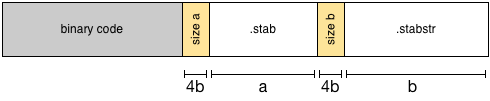

**Due: Monday, February 8, 2016 at 11:59PM**

## Overview

This assignment consists of two parts and an extension. This overview attempts
to give you the necessary background information on each of these parts to get
started.

1. **Implementing `bt()`: a backtracing function**

   In the first part of the assignment you'll implement a backtrace procedure
   that computes the chain of function calls the program used to get to the
   current execution point.  For example, here's a backtrace emitted by
   [FreeBSD's](https://www.freebsd.org/) redzone allocator after it detected a
   problem:

         #0 0xc0583e4e at redzone_setup+0x3c
         #1 0xc04a23fa at malloc+0x19e
         #2 0xcdeb69ca at redzone_modevent+0x60
         #3 0xc04a3f3c at module_register_init+0x82
         #4 0xc049d96a at linker_file_sysinit+0x8e
         #5 0xc049dc7c at linker_load_file+0xed
         #6 0xc04a041f at linker_load_module+0xc4
         #7 0xc049e883 at kldload+0x116
         #8 0xc05d9b3d at syscall+0x325
         #9 0xc05c944f at Xint0x80_syscall+0x1f

   In this example, the backtrace starts at the current function, `#0`, and
   works it's way back to the top-most function, `#9`. The backtrace above says
   that some function named `Xint0x80_syscall` called a function `syscall`. It
   also says that this call occurred on the instruction offset by `0x1f` bytes
   from the beginning of the `Xint0x80_syscall` function. `syscall`, in turn,
   has a call to `kldload` at a `0x325` offset from the beginning of the
   function. This goes on and on until we reach the call to `redzone_setup`.
   The offset shown here says that the backtrace was generated when the
   function was at that offset.

   You'll be implementing `bt()` whose job it is to print out a backtrace
   beginning at the calling function.

2. **Implementing a redzone allocator.**

   We've alluded to [buffer
   overflows](https://en.wikipedia.org/wiki/Buffer_overflow) several times in
   class. A redzone allocator is a type of memory allocator that automatically
   detects memory corruption in many (but not all) cases.   
 
   [Funny fact: Netflix was started by Reed Hastings using the cash that came
   from IBM's aquisition of Purify, a company he started that used redzone
   allocation and binary rewriting to detect memory corruption. Two decades
   later, they are still an issue!]

   The idea is simple. Say a user requests `k` bytes of memory. Instead of
   allocating _only_ `k` bytes of memory (plus whatever we need to keep track
   of the allocation), we allocate `k + (2 * r)` bytes of memory, where `r` is
   the size of one redzone, laid out like this:

   

   Then, we write a series of hopefully unlikely values, say `r / 4`
   `0xDEADBEEF`'s, into each redzone. Finally, we return a pointer to the
   beginning of the `k` sized memory region to the user.

   Some arbitrary time later, we check if all redzones contain only the known
   values. If they contain anything else, then the user must have a bug
   somewhere in their program, and we print out some helpful information to
   help the user find their mistake. You might be surprised how many bugs such
   a simple scheme like this can catch!

## Part 1: `bt()`

For this part of the assignment, you'll be implementing the `bt()` function in
`main.c`. To implement the function, you'll need to inspect the current stack
frame, which is pointed to by the `fp` register, print the address of the
calling function and the stack frame number, and then proceed recursively to
the previous stack frame until `fp` is `0`. It may be helpful to reread the
[lab 4 stack section](/labs/lab4), which includes a figure of two stack frames.

To retrieve the current value of a register without calling out to assembly
code, you can insert variations of the following snippet into your C code:

    unsigned reg_value;
    asm("mov %0, rX" : "=r" (reg_value));

After this code has run, the value of register `rX` will be in the `reg_value`
variable. You can use register aliases, such as `ip`, in place of `rX` as well.

Your backtrace should print out each frame's number followed by the calling
function's address in the following format:

    #0 0x00000001
    #1 0x00000002
    #2 0x00000003
    ...
    #n 0x0000000n

Of course, the `0x00000001` addresses should be the actual function call
addresses. The address printed at `#0` should be an address in the function of
the caller to `bt()`. For example, calling `bt()` from `main()` should yield
something similar to the backtrace below, where `0x80a8` is an address in
`main` and `0x800c` is an address in `_start`:

    #0 0x000080a8
    #1 0x0000800c

The addresses above will likely be different for you since your functions will
be in different locations. You should verify, using `nm` and `objdump`, that
the addresses printed by your backtrace function are valid.

# Part 2: `malloc()`

For this part of the assignment, you'll be implementing the `_rzmalloc()`
function in `main.c`. This function is called by the `malloc` macro in
`inc/malloc.h` when the `REDZONE_MALLOC` macro is defined. You'll notice that
the `Makefile` we've provided you is defining this macro. We do this because
we'd like to transparently use the debugging redzone macro in our programs. By
using this macro, a program using `malloc` can be debugged using redzones
simply by passing `-DREDZONE_MALLOC` during compilation.

The `inc/malloc.h` also contains three more useful definitions. `REDZONE_SIZE`
and `REDZONE_VALUE` correspond to the size of each redzone and the value that
will be repeatedly written in each redzone. The `rz_header` structure defines a
header, similar to the ELF header, that should be placed at the beginning of
each redzone allocation to identify it. Thus, when your redzone allocator
creates an allocation of size `n`, it actually allocates a region of memory of
size `sizeof(struct rz_header) + n + 2 * REDZONE_SIZE`.

Begin by implementing `_rzmalloc()`. It should allocate the correct number of
bytes by bumping a pointer, like the current implementation, and additionally
write the header to the beginning of the region and write the `REDZONE_VALUE`
to the two redzones next to the user's allocation. Finally, it should return a
pointer to the user's allocation.

Next, implement the `rz_check` function. This function should scan all of the
allocations and ensure that all of the redzones contain only the
`REDZONE_VALUE`. It should return `1` if all of the redzones are valid, and `0`
if they're invalid. If it detects an invalid redzone, it should print the first
address where a redzone has been overwritten as well as the file, line, and
function where the buggy allocation was made in the following format:

    REDZONE ERROR: 0x00008c10 from [bad_function() at main.c:45]

You'll need to keep track of where your allocations begin and end to ensure you
only scan valid allocations. You can test your code with the following
functions and your `assert` macro:

    void memset(void *dest, char c, size_t n) {
      char *char_dest = (char *)dest;
      for (; n > 0; n--) *char_dest++ = c;
    }

    void test1() {
      char *buffer = (char *)malloc(1 << 6);
      memset(buffer, 0, 1 << 6);
      assert(rz_check());
    }

    void test2() {
      char *buffer = (char *)malloc(1 << 6);
      memset(buffer - 1, 0, 1 << 6);
      assert(!rz_check());
    }

    void test3() {
      char *buffer = (char *)malloc(1 << 6);
      memset(buffer + 1, 0, 1 << 6);
      assert(!rz_check());
    }

    void test4() {
      char *buffer = malloc(1 << 6);
      memset(buffer - (REDZONE_SIZE + sizeof(struct rz_header)), 1, sizeof(struct rz_header));
      assert(!rz_check());
    }

It's also possible that a misbehaving program overwrites the header. Ensure
you're checking for your header's integrity as well. If the header is broken,
print out a message saying:

    REDZONE ERROR: 0x00008c10 from [BAD HEADER]

## Extension: Function Names via. STABS

The goal of this extension is to emit a backtrace similar to the one shown in
the overview:

    #0 0x000081d0 at d+0x10
    #1 0x000081ec at c+0x10
    #2 0x00008208 at b+0x10
    #3 0x00008224 at a+0x10
    #4 0x0000824c at main+0x1c
    #5 0x0000800c at _start+0x0c

### Overview

You'll do exactly what debuggers do to print out friendly names: read the
debugging information in the object file. The exact format of the debug
information has changed over time as our programming languages have become
increasingly more complex. When times were a little simpler, the common debug
format was
[STABS](http://www.sourceware.org/gdb/onlinedocs/stabs.html#overview); we'll be
using this format for this assignment. STABS manifests itself through the
addition of several new sections to an ELF file. Of note are the `.stab` and
`.stabstr` section. The former contains a table of debugging information
including mapping addresses to indexes in a string table. The latter is the
string table.

You can see that these new sections exist in the object file with `readelf`:

    arm-none-eabi-readelf -S main.elf

These new sections were emitted because we passed the `-gstabs` flag to the
compiler in the `Makefile`. `objdump` can read these sections and print out a
coalesced table with the following command:

    arm-none-eabi-objdump --stabs main.elf

The `n_type` field identifies what the debug information is describing. For
example, an `N_LYSM` is a stack/local variable or a type definition. An `N_RSYM`
is a variable that will be stored in a register. An `N_FUN` is a function. The
meaning of the `n_value` field depends on the `n_type`. For example, the
`n_value` field of an `N_RSYM` is the register number that item will be in,
while the `n_value` field of an `N_FUN` is the address of the first instruction
of that function.

### New Binary Format

Because our bootloader can't directly read ELF files, we've had to invent our
own binary format to send the STABS data to our Pi. The format is:

In words, the binary we'll send to the Pi is the following, in sequence:

  1. original binary code
  2. 4 byte header: the size, in bytes, of the .stab section
  3. the .stab section
  4. 4 byte header: the size, in bytes, of the .stabstr section
  5. the .stabstr section

The .stab section contains a series of `Stab` structures. The definition of this
structure is in `inc/stabs.h`. The `.stabstr` section contains many strings
grouped together, string after string. The `n_strx` field of a `Stab` structure
contains a byte index to the beginning of a string in this section. This is the
string that `objdump` prints. Note that the string contains more information
than just, say, a function's name. You'll have to account for this when printing
out a function's name.

### Extension

To start, modify your `Makefile` to build the new binary format by changing the
`all` target to depend on `$(NAME).bin.extra` instead of `$(NAME).bin`. We use
the `.bin.extra` extension for files that conform to the binary format we
discussed above. Confirm the new binary is built by `make`. You may also want to
change the `install` target to send the `$(NAME).bin.extra` file to Pi.
Otherwise, you may be sending a binary _without_ the necessary STABS
information.

Because the end of our binary has changed, you'll also need to modify the
address at which your memory allocator begins allocating memory so as not to
overwrite STABS data during allocations. Then, modify your `bt()` function, or
add a new function that your `bt()` function calls, to read the `.stab` and
`.stabstr` data in the binary. Your upgraded `bt()` should print out a backtrace
that adds the function's name and the offset to each backtrace step:

    #0 0x000081d0 at d+0x10
    ...
    #5 0x0000800c at _start+0x0c
