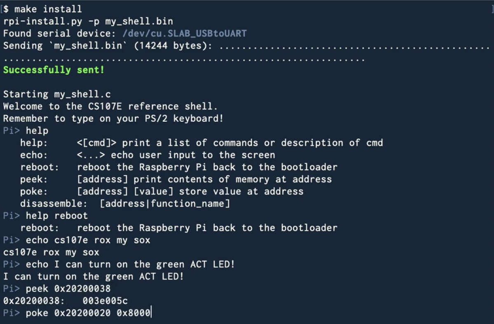
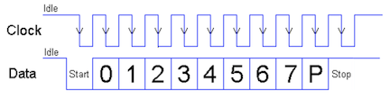
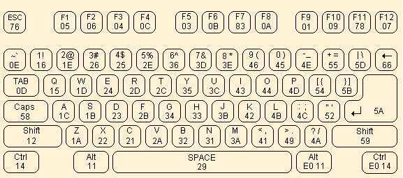


Task list to copy/paste when creating PR for this assign:

__Before releasing assign5:__
- [ ] Review writeup/starter code (instructor)
- [ ] Review consistency/completeness of grading info published to students relative to grading tests used, consider changes clarity/ease of grading (TA)
- [ ] Followup on issues from previous quarter postmortem (issue #210)

__To prep for assign5:__
- [ ] 




*Written by Philip Levis, updated by Julie Zelenski*



{: width="80%"}


## Goals

For this week’s assignment, you will implement a PS/2 keyboard driver and implement a simple command-line shell. You will then be able to type commands and execute them on your Pi. Neat!

In completing this assignment you will have:

-  written code that interfaces with an input device. When you next download a device driver, you will say "I have a decent idea how that code operates"
- seen the design of a complex interface into hierarchical levels and appreciated its benefits
- implemented a simple command-line interpreter
- explored the use of C function pointers for callbacks and command dispatch

This is a fun assignment, and brings us back to using physical devices and making them do cool things. These additions are the first steps toward turning your humble little Raspberry Pi into a standalone personal computer.

## Get starter files
Change to the `cs107e.github.io` repository in your `cs107e_home` and do a `git pull` to ensure your courseware files are up to date.

To get the assignment starter code, change to your local repository, fetch any changes from the remote and switch to the assignment basic branch:
```
$ cd ~/cs107e_home/assignments
$ git fetch origin
$ git checkout assign5-basic
```

Read the `Makefile` for information on how to reuse the modules you have written for previous assignments. 

Verify that your project has up-to-date versions of
your modules `gpio.c`, `timer.c`, `strings.c`, `printf.c`, `backtrace.c` and `malloc.c`.  If you are missing updates made on a different branch, use `git merge` to incorporate those changes. For example, if you made a regrade submission on `assign3-basic` and want to add those changes into `assign5-basic`, have `assign5-basic` checked out and use `git merge assign3-basic`.

The starter project contains the module files `keyboard.c` and `shell.c`, the application program `apps/uart_shell.c` and the test program `tests/test_keyboard.c`. You will edit `keyboard.c` and `shell.c` to implement the required functions. You can add tests to `tests/test_keyboard.c`. The program `apps/uart_shell.c` is used unchanged as a sample application which tests your shell program.

The `make install` target of the Makefile builds and runs the sample application `apps/uart_shell.bin`. The `make test` target builds and runs the test program `tests/test_keyboard.bin`. With no argument, `make` will build both, but not run. 

## Basic part

### Keyboard driver

You are to implement the `keyboard` module that interfaces with a PS/2 keyboard. The exported functions are:

+ `void keyboard_init(unsigned int clock_gpio, unsigned int data_gpio)`
+ `unsigned char keyboard_read_next(void)`
+ `key_event_t keyboard_read_event(void)`
+ `key_action_t keyboard_read_sequence(void)`
+ `unsigned char keyboard_read_scancode(void)`

Our [keyboard.h](https://github.com/cs107e/cs107e.github.io/blob/master/cs107e/include/keyboard.h) documents the operation of each function.  

The design of the keyboard module is worth a pause to understand and appreciate. The functionality is arranged hierarchically, each routine building on the next. The bottom level routine reads a raw scancode, the next level gathers a sequence of scancodes into one logical key action, the higher level routines translate those actions into key events and typed characters.

The layered interface cleanly supports the needs of different clients. A client that simply wants typed characters might need only the top level `keyboard_read_next`; a client that reacts to up and down events also accesses the mid level `keyboard_read_event`.  

The hierarchical design also eases the job of the implementor. Each level focuses on a discrete part of the operation and delegates tasks above and below to other functions. This makes each function simpler to implement and test. Your implementation plan of attack is to start at the bottom and work your way upward.

#### 1) Read and validate scancodes

The bottom level `keyboard_read_scancode` handles the nitty-gritty of the PS2/2 protocol.  You got a start on implementing this function during lab5, copy that work into `keyboard.c` now. The entire keyboard module rests on this cornerstone, so your first task is to finish it off and ensure it is reliable and robust.

A PS/2 scancode is an 11-bit packet organized in 8-odd-1 format. The first bit, the start bit, is low. The next 8
bits are data bits, least significant bit first. The following bit is a parity
bit. The PS/2 protocol uses odd parity, which means that there should be an odd number of 1s among the data and parity bits. The 11th and final bit is the stop bit, which is
always high.



The return value from `keyboard_read_scancode` is the 8 data bits from a well-formed packet. It is important to detect and recover from transmission errors. Check the value of each start, parity, and stop bit. If you detect an erroneous bit, discard the partial scancode and retry reading a new scancode from the beginning.  Discard as many invalid tries as necessary until you receive a valid scancode.

In a similar vein, a dropped bit or discarded partial read could cause your driver to become desynchronized. When that happens your driver can get stuck, trying to read a scancode byte starting mid-packet and waiting for further bits to arrive that aren't forthcoming. One way to resynchronize is using a simple timeout reset. Use
your timer module to note if the current clock edge occurred more than
3ms after the previous one, and if so, reset the state and
assume the current clock edge is for a start bit. This small effort provides additional robustness to combat flaky connections and hardware blips.


**Timing is everything!**: The timing of the PS/2 protocol has to be strictly followed. The keyboard sends the bits rapid-fire and you must catch each bit as it arrives. Once your driver sees the falling clock edge for the start bit, it needs to stay on task to read each subsequent bit.  There is not time between clock edges to complete a call to a complex function like printf.  Save any debug printing for after you read the entire sequence.
</div>

The first test in `tests/test_keyboard.c`  will read and echo scancodes. Use this test to verify your basic scancode functionality.

#### 2) Gather sequence into key action

The next level function  `keyboard_read_sequence` gathers a sequence of scancodes into one logical key action.  A key action is the press or release of a single key.

When you press a key, the PS/2 keyboard sends the scancode for that key. When you release
the key, it sends a two-byte sequence: `0xF0` (the "break" code) followed by the key's scancode. For example, typing `z` will cause the keyboard to send `0x1A` and releasing `z` will
cause the keyboard to send `0xF0`, `0x1A`.

The press or release of an extended key sends a sequence with the extra byte `0xE0` inserted at the front. For example, pressing the right Control key sends the sequence
`0xE0`, `0x14` and releasing sends `0xE0`, `0xF0`, `0x14`.

The `keyboard_read_sequence` function reads the sequence (1, 2 or 3 bytes depending on context) and translates it into a `key_action_t` struct which reports the type of action (press or release) and which key was involved.

Use the test program `tests/test_keyboard.c` to verify the operation of this function before moving on.

#### 3) Process key events

There are additional type and constant definitions used starting at this level.  Review [keyboard.h](https://github.com/cs107e/cs107e.github.io/blob/master/cs107e/include/keyboard.h) for the definitions of `keyboard_modifiers_t` and `key_event_t` and [ps2.h](https://github.com/cs107e/cs107e.github.io/blob/master/cs107e/include/ps2.h) for the definition of `ps2_key_t` and keycode constants.

The mid level routine `keyboard_read_event` processes key actions into key events. It calls `keyboard_read_sequence` to get a `key_action_t` and packages the action into a `key_event_t` struct which includes the state of keyboard modifiers and the PS/2 key that was acted upon.

The `modifiers` field of a `key_event_t` reports which modifier keys are in effect.  The state of all modifier keys is compactly represented using a _bit set_. The `keyboard_modifiers_t` enumeration type designates a particular bit for each modifier key.  If a bit is set in `modifiers`, this indicates the corresponding modifier key is currently held down or in the active state. If the bit is clear, it indicates the modifier is inactive. 

The PS/2 protocol does not provide a way to ask the keyboard which modifiers are active, instead your driver must track the modifier state itself. A simple approach is a static variable in your keyboard module that you update in response to modifier key events. The Shift, Control, and Alt modifiers are active iff the modifier key is currently down. Caps Lock operates differently in that its setting is "sticky". A press makes Caps Lock active and that persists until a subsequent press inverts the state.

To identify which characters can be produced by a given key, we provide an array to use as a _lookup table_. Review the definition of the `ps2_keys` array in [ps2.c](https://github.com/cs107e/cs107e.github.io/blob/master/cs107e/src/ps2.c).  The array is indexed by scancode. The __A__ key on PS/2 keyboard generates scancode `0x1C`; array element `ps2_keys[0x1C]` holds the PS/2 key information for this key.

Use the functions in `test/test_keyboard.c` to verify your processing of key events before moving on.

#### 4)  Produce ASCII characters

You now have all of the pieces needed to implement the final top-level routine `keyboard_read_next`.  This function calls `keyboard_read_event` to get the next key press event and produces the character corresponding to the key that was typed. 

The return value is the ASCII character produced by an ordinary key or a  value designated for a special key such as Escape or F9. The character produced by a key is determined by its `ps2_key_t `entry in the lookup table.

A `ps2_key_t` has two fields for each key, `ch` and `other_ch`, which correspond to the unmodified and modified character produced by the key.  The __A__ key produces `{ 'a', 'A' }`. The __Four__ key produces `{ '4', '$' }`. Keys such as __Tab__ that do not produce a different character when modified have a 0 in the `other_ch` slot, e.g.as `{'\t', 0}`.

Your driver should handle all keys shown in this keyboard diagram.



Typing an ordinary key produces an ASCII character. The ordinary keys are:
- All letters, digits, and punctuation keys
- Whitespace keys (Space, Tab, Return) 

Typing a special key produces its designated value. These values are greater than 0x90 to distinguish from ASCII values. The special keys are:
- Escape
- Function keys F1-F12
- Backspace key (sometimes marked with ← or ⌫)

Press or release of a modifier key changes the event modifiers.  No character or code is produced.  The modifier keys are:
- Shift, Caps Lock, Alt, Control

A change in modifiers can affect the character produced by future typed keys. Our keyboard translation layer does not produce modified characters based on state of Alt or Control, only for Shift and Caps Lock. When the Shift modifier is active, `other_ch` is produced when typing a key that has an `other_ch` entry. If Caps Lock is active, `other_ch` is produced only for the alphabetic keys. Caps Lock has no effect on digits, punctuation, and other keys. If Shift and Caps Lock applied together, Shift "wins", e.g. `other_ch` is produced. (Caps Lock and Shift together do not invert letters to lowercase). 

If you are using a Mac, Keyboard Viewer (accessible from menu bar) is a handy tool for visualizing the character produced for a given key combination. Try it out!
If you are still unsure how to handle a particular case,
experiment with our reference implementation of the keyboard
using the test application from lab.


### Simple shell
With a keyboard as input device, your Pi has gone interactive! The simple shell application allows the user to enter commands and control the Pi without needing to plug another computer into it.

The video below is a demonstration of our reference shell. The user is typing on a PS/2 keyboard connected to the Pi and the shell output is displaying over uart to a Mac laptop.

<iframe width="625" height="400" src="https://www.youtube-nocookie.com/embed/7m_nOmzCHiw?modestbranding=1&version=3&playlist=7m_nOmzCHiw" frameborder="0" allow="accelerometer; autoplay; encrypted-media; gyroscope; picture-in-picture" allowfullscreen></iframe>

#### 1) Review shell interface and starter code

A shell, such as `bash` or `zsh`, is a program that operates as a command-line interpreter. The program sits in a loop, reading a command typed by the user and then executing it. 

The starter code for `shell_run` demonstrates the standard read-eval-print loop that is at the heart of an interpreter. Here it is in pseudocode:

    loop forever
        display prompt
        read line of input from user
        evaluate command (parse and execute)

The public functions you will implement in shell are:

+ `void shell_readline(char buf[], size_t bufsize)`
+ `int shell_evaluate(const char *line)`

The `shell_readline` function reads a command typed by the user. The `shell_evaluate` executes that command.  Review the documentation for these operations in the header file [shell.h](https://github.com/cs107e/cs107e.github.io/blob/master/cs107e/include/shell.h).
 
One important detail of the shell's interface to draw your attention to is how the shell provides flexibility in the output device. The `shell_init` function takes a _function pointer_ argument to be supplied by the client. Whenever the shell wants to display output, it calls the client's function pointer.

The `apps/uart_shell.c` application program initializes the shell with `shell_init(printf)`; this configures the shell to send its output to the serial uart interface.
In assignment 6, you'll write a `console_printf` function that draws to a HDMI monitor. Initializing the shell with `shell_init(console_printf)` configures the shell to call this function instead to display output on the graphical console.

As a rule, your shell should display all output by calling `shell_printf` (which is set to the client's function pointer), never a direct call to a particular output function.  This applies to all shell output, whether it be the shell prompt, displaying the result from a command, or responding with an error message to an invalid request.

#### 2)  Read line

`shell_readline` reads the characters typed on the keyboard by the user and writes the line of input into a buffer. The user indicates the end of the line by typing Return (`\n`).  You'll find this task fairly straightforward given your awesome keyboard driver.

Handling backspace adds a slight twist. When the user types Backspace (`\b`), the shell deletes the last
character typed on the current line.  Removing it from the buffer is simple enough, but how to un-display it? If you output a backspace character, e.g. `shell_printf("%c", '\b')` , it moves the cursor backwards one position. If you back up, output a space, and then back up again, you will have effectively "erased" a character. (Wacky, but it works!) 

There are two error conditions that `shell_readline` should detect:
- disallow typing more characters than fit in the buffer
- disallow backspacing through prompt or to previous line

Reject the attempt and call the provided `shell_bell` function to get an audio/visual beep.

`shell_readline` is a great way to exercise your shiny new keyboard driver!

#### 3) Parse command line

`shell_evaluate` first takes the line entered by the user and parses it into a command and arguments. The parsing job is all about string manipulation, which is right up your alley after assign 3.

+ Divide the line into an array of tokens. A token consists of a sequence of non-space chars.  
+ Ignore/skip all whitespace in between tokens as well as leading and trailing whitespace. Whitespace includes space, tab, and newline.
+ The first token is the name of the command to execute, the subsequent tokens are the arguments to the command.

When tokenizing, be sure to take advantage of the nifty functions you implemented in your `strings` and `malloc` modules. They will be helpful!

#### 4)  Execute command
Now that you have the command name and arguments, you're ready to evaluate it.

+ Look up the function pointer for the command by name. The command table associates a command name string with its function pointer.
    + If no matching command is found, output message `error: no such command 'binky'.`
+ Call the function pointer, passing the array of tokens and the count of tokens. The first element in the array is the command name, the subsequent elements are the arguments to the command.
+ The return value of the command is used as the return value for `shell_evaluate`.

There is a command table started in `shell.c`. You will modify the table as you add commands. Each entry in the table is a `command_t` struct as defined in 
[shell_commands.h](https://github.com/cs107e/cs107e.github.io/blob/master/cs107e/include/shell_commands.h). A command function pointer takes two parameters: `argv` is an array of `char *`, i.e. an array of strings, and `argc` is the count of elements in the  `argv` array. A command function returns an int to indicate success or failure. The result is 0 if the command executed successfully, or nonzero otherwise. 

Your shell has five commands:

- `int cmd_echo(int argc, const char *argv[])`
- `int cmd_help(int argc, const char *argv[])`
- `int cmd_reboot(int argc, const char* argv[])`
- `int cmd_peek(int argc, const char* argv[])`
- `int cmd_poke(int argc, const char* argv[])`


We've implemented `cmd_echo` as an example. This command simply echoes its arguments:

    Pi> echo Hello, world!
    Hello, world!


The additional commands you are to implement are:

+ **help**

    Without any arguments, `help` prints a list of all available commands
    along with their description in the following format:

        Pi> help
        cmd1: description
        cmd2: description

    If an argument is given, `help` prints the description for that command,
    or an error message if the command doesn't exist:

        Pi> help reboot
        reboot:  reboot the Raspberry Pi back to the bootloader
        Pi> help please
        error: no such command `please`.

+ **reboot**

    This command restarts your Pi by first sending an EOT (end of transmission) over the UART, then calling the `pi_reboot` function from the `pi` module of `libpi`. See ya back at the bootloader!

+ **peek**

    This command takes one argument: `[address]`.  It prints the 4-byte value stored at memory address `address`. 

    Example (assume address 0xFFFC contains the number 0x12345678):

        Pi> peek 0xFFFC
        0x0000fffc:  12345678

   Hint: the `strtonum` function from your strings module is handy for converting strings to numbers. If the address argument is missing or cannot be converted, `peek` prints an error message:

        Pi> peek
        error: peek expects 1 argument [address]
        Pi> peek bob
        error: peek cannot convert 'bob'

    Recall that the ARM architecture is not keen to load/store on an unaligned address. A 4-byte value can only be read starting from an address that is a multiple of 4. If the user asks to peek (or poke) at an unaligned address, respond with an error message:

        Pi> peek 7
        error: peek address must be 4-byte aligned

+ **poke**

    This command takes two arguments: `[address] [value]`.  The poke function stores `value` into the memory at `address`.

    Example (assume 0xFFFC currently contains the number 0x12345678):

        Pi> peek 0xFFFC
        0x0000fffc:  123456789
        Pi> poke 0xFFFC 1
        Pi> peek 0xFFFC
        0x0000fffc:  00000001
        Pi> poke 0xFFFC 0
        Pi> peek 0xFFFC
        0x0000fffc:  00000000

     `strtonum` will again be handy.  If either argument is missing or cannot be converted, `poke` prints an error message:

        Pi> poke 0xFFFC
        error: poke expects 2 arguments [address] [value]
        Pi> poke fred 5
        error: poke cannot convert 'fred'
        Pi> poke 0xFFFC wilma
        error: poke cannot convert 'wilma'

    You can now turn a GPIO
    pin on and off by entering shell commands!

        Pi> poke 0x20200010 0x200000
        Pi> poke 0x20200020 0x8000
        Pi> poke 0x2020002C 0x8000

    Review the
    [BCM2835 manual](/readings/BCM2835-ARM-Peripherals.pdf#page=90)
    to see what is stored at these addresses. What do the above
    commands do? Hint: the ACT LED on the Pi
    is GPIO pin 47.

    Check out the
    [Wikipedia article on peek and poke](https://en.wikipedia.org/wiki/PEEK_and_POKE) if you're curious.

## Testing and debugging
As usual, the effort you put into writing good tests will be evaluated along with your code submission. An interactive program such as this one adds new challenges for testing. Your inventive solutions to overcoming these challenges are welcome!

The given code in `tests/test_keyboard.c` program has functions that test each layer of the keyboard module. These functions simply echo the data returned by the keyboard module. You must manually verify the correctness of the output. 

The `test_keyboard_assert` function demonstrates an example approach for an assert-based test where you coordinate with the user to provide the keyboard input.

The `shell` module is intended to be run interactively and does not lend itself well to assert-based testing. This doesn't mean you should eschew testing it, but you will have to be more creative in how you proceed. A former student set up an array of commands to be used as a test script and then fed each line to `shell_evaluate` in sequence and verified that the output was as expected, which I thought was pretty clever.

The `shell_readline` function is a particularly sticky one. Given that the simulator does not emulate the peripherals, debugging code that requires keyboard input under gdb is a no-go. Extending from the former student's test script plan, you could have a string of characters to force feed into `shell_readline` and instead of calling `keyboard_read_next`, you take the next char from your test string.

## Extension: editing and history

Create an `assign5-extension` branch for this part of the work and make a separate pull request from your basic submission.

The extension consists of two parts. You should do both parts.

1.  **Command-line editing**

    Implement the left and right arrow keys to move the cursor within the current line and allow inserting and deleting characters at the point of the cursor. What other editing features might be nice to have:  Ctrl-a and Ctrl-e to move the cursor to the first and last character of the line? Ctrl-u to delete the entire line? Implement your favorite vim/emacs/editor must-haves!

2. **Command history**

    Number the commands entered starting from 1 and maintain a rolling history of the last 10 commands entered. Change the prompt to include the command number of the current line. Add a `history` command that displays the history of recent commands, each prefixed with its command number. See the example below:

        [1] Pi> help echo
        echo: <...> echo user input to the screen
        [2] Pi> echo cs107e rocks
        cs107e rocks
        [3] Pi> history
          1 help echo
          2 echo cs107e rocks
          3 history

    Implement the up and down arrow keys to access commands from the history. Typing the up arrow key changes the current line to display the command from the history that is previous to the one on the current line. Typing a down array changes the current line to display the command that ran _after_ the one on the current line, or whatever the user had typed until he/she typed up. Use the `shell_beep` when the user tries to move beyond either end of the history.

    What other history features might be handy? `!!` to repeat the last command? `!ze` to repeat the most recent command matching the specified prefix `ze`?

    If you didn't already know that your regular shell includes editing and history features like these, now is a great time to pick up a few new tricks to help boost your productivity!

If you wrote the disassemble extension for assign3 (or you want to do it now!), a cute option is to integrate a `disassemble [addr]` command into your shell. The fun never stops!


## Submit
The deliverables for `assign5-basic` are:

  - Implementation of the `keyboard.c` and `shell.c` modules
  - Your comprehensive keyboard tests in `tests/test_keyboard.c`

Submit the finished version of your assignment by making a git “pull request”. Make separate pull requests for your basic and extension submissions.

The automated checks make sure that we can run your C
code and test and grade it properly, including swapping your tests for
ours.

CI verifies that:

- `apps/uart_shell.c` is unchanged

- `make` and `make test` successfully build

- `make test` also successfully builds with the unchanged version of the test program in the starter

## Grading
To grade this assignment, we will:

- Verify that your submission builds correctly, with no warnings. Warnings and/or build errors result in automatic deductions. Clean build always!
- Run automated tests that exercise the functionality of your `keyboard.c` and `shell.c` modules. These tests will touch on all required features of the module.  
- Our automated testing requires that your shell has absolute consistency in calling `shell_printf` for all shell output. Double-check that you are compliant. Also be sure to have removed or commented out all `printf` calls inserted for debugging.
- Go over the tests you added to `tests/test_keyboard.c` and evaluate them for thoughtfulness and completeness in coverage.
- Review your code and provide feedback on your design and style choices.


