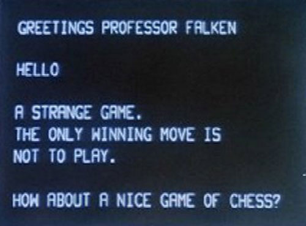


Task list to copy/paste when creating PR for this assign:

__Before releasing assign6:__
- [ ] Review writeup/starter code (instructor)
- [ ] Review consistency/completeness of grading info published to students relative to grading tests used, consider changes clarity/ease of grading (TA)
- [ ] Followup on issues from previous quarter postmortem (issue #342)

__To prep for assign6:__
- [ ]







A console provides a command-line text interface for entering commands and
seeing output. Today we have fancy shell programs that support scripts, process
control, and output redirection. But simpler consoles can be powerful too. One famous console from popular culture is [Joshua in WarGames](https://www.youtube.com/watch?v=ecPeSmF_ikc).

## Goals

In this assignment, you will add graphics capability to your system and use it to
create a snazzy graphical display for your shell. This will unleash your Mango Pi from the shackles of its laptop minder and elevate it into a
standalone personal computer running a console that allows the user to enter
and execute commands. Neat!

In completing this assignment you will:

- learn how a framebuffer is used as a bitmap to drive a video display
- implement simple drawing routines
- gain greater proficiency with C pointers and multi-dimensioned arrays

After finishing this assignment, the functionality of your system is complete.
All that remains for assignment 7 is to add a final touch of usability polish
so you can type faster without dropping keystrokes.  This system is all bare-metal code you wrote
yourself -- what a great achievement and sense of satisfaction you have 
earned with all your hard work!

## Get starter files
Change to your local `mycode` repo and pull in the assignment starter code:

```console
$ cd ~/cs107e_home/mycode
$ git checkout dev
$ git pull code-mirror assign6-starter
```

In the `assign6` directory, you will find these files:
- `fb.c`, `gl.c`, `console.c`:  library modules 
- `test_gl_console.c`:  test program with your unit tests
- `console_shell.c`:  application program that runs your shell, reading input from the PS/2 keyboard and displaying output to the console. You will use this program unchanged.
- `Makefile`: rules to build console_shell application (`make run`) and unit test program (`make test`)
- `README.md`: edit this text file to communicate with us about your submission


The `make run` target builds and runs the sample application
`console_shell.bin`. Use this target as a final step to confirm the full
integration of your `fb`, `gl`, and `console` modules.  The `make test` target
builds and run the test program `test_gl_console.bin`. This test program
is where you will add unit tests. You will make heavy use of this
target throughout your development.

You can edit the `MY_MODULE_SOURCES` list in the `Makefile` to choose which
of your modules to build on. (See instructions for [use of
MY_MODULE_SOURCES](/assignments/assign3/#mymodules) in assignment 3) Building on all
your past modules now is a great way to get a preview of your progress toward
achieving the full system bonus.

## Core functionality

### 1) Framebuffer

The base layer of graphics support is implemented in the `fb` module.

Start by reviewing the header file `fb.h` (available in `$CS107E/include` or [browse fb.h](/header#fb)).

+ `void fb_init(int width, int height, fb_mode_t mode)`
+ `void* fb_get_draw_buffer(void)`
+ `void fb_swap_buffer(void)`
+ simple getters for fb settings: `fb_get_width`, `fb_get_height`, `fb_get_depth`

The `fb` module allocates and manages the
framebuffer memory and coordinates with the lower-level  `de` and `hdmi`
modules to display the framebuffer on an HDMI monitor.

The starter version of `fb_init` contains the code from lab6. It allocates the framebuffer memory for the requested width and
height configured for 32-bit depth, each pixel is a 4-byte BGRA color.
This version of `fb_init` assumes single-buffered mode. In this mode, there is only one buffer
into which all drawing takes place. This buffer is always active
and on-screen; any changes to the pixel data are immediately displayed.

You are to extend `fb_init` to support configuring the framebuffer in
double-buffered mode. In this mode, two separate
framebuffers are allocated. The active buffer is the one currently displayed
on-screen; the other buffer that is off-screen is used as the
'draw' buffer. In double-buffered mode, all drawing is done to the off-screen draw buffer.
When ready, the client calls `fb_swap_buffer` to swap the two buffers. The
off-screen draw buffer becomes the active on-screen buffer in a single smooth transition.

Additionally, `fb_init` should respond to a second/subsequent call by performing
a reinitialization. Any previous memory is deallocated and the framebuffer is
reset for the requested configuration.

Time to test! The `test_gl_console.c` test program provides a simple `test_fb`.
Our provided sample unit test configures the framebuffer and uses a
few asserts to confirm the initial state. To test drawing, the unit test writes
to the framebuffer. Assert-based tests cannot be used to confirm what is
drawn to the display, you have to do your own visual inspection. Read over the
provided test code and work out what should be displayed if working correctly.
Then run the test program and confirm what is drawn to the display matches
the expected.

### 2) Graphics
The graphics library module layers on the framebuffer and provides higher-level
drawing primitives to set and get the color of a pixel, draw filled rectangles,
and display text. 

Start by reviewing the header file `gl.h` (available in `$CS107E/include` or
[browse gl.h](/header#gl)) to see the documentation of the basic drawing
functions:

+ `void gl_init(int width, int height, gl_mode_t mode)`
+ `void gl_draw_pixel(int x, int y, color_t c)`
+ `color_t gl_read_pixel(int x, int y)`
+ `void gl_draw_rect(int x, int y, int w, int h, color_t c)`
+ `void gl_clear(color_t c)`
+ `color_t gl_color(unsigned char r, unsigned char g, unsigned char b)`
+ simple getters for gl settings: `gl_get_width`, `gl_get_height`

Review the provided `gl_init` code that calls on the `fb` module to initialize the framebuffer.

Start by writing the simple getter functions that provide a consistent `gl` interface to the client. The
`gl` versions just turn around and call into `fb`, but the client doesn't need to know this. The
client calls `gl_init` and `gl_draw_...`, without any direct use of `fb`.

Now you're ready to start on the drawing functions `gl_clear`, `gl_draw_pixel` and `gl_draw_rect`.
Mapping from a pixel's x,y coordinate to the appropriate location within the framebuffer
memory is made easier when you access the memory as a multi-dimensioned array.  For a refresher on
that syntax, review the [framebuffer lecture](/lectures/Framebuffer/code/clear/clear.c) and
the exercises of [Lab 6](/labs/lab6).

When accessing the pixel data, be mindful that C does __no
bounds-checking__ on array indexes. If you write to an index outside the array bounds, you step on other neighboring memory with
various sad consequences to follow. You must take care to
access only valid memory! A call to `gl_draw_pixel` should ignore a request to draw at an x,y location that is outside the framebuffer bounds.
If asked to draw a rectangle that is partially/fully out of bounds, `gl_draw_rect` should clip to draw only those pixels that are in bounds.
One way to enforce clipping is iterate over all locations and call `gl_draw_pixel` for each and depend on `gl_draw_pxiel` to discard/ignore the invalid ones. This simple
approach is easy to get correct, but can be slow because of the
repeated checks. The faster alternative is to first compute the clipped bounds (i.e. by intersecting requested rectangle with framebuffer bounds) and then draw only those pixels that are now known to be in bounds.

Time to test! The `test_gl_console.c` test program defines a
simple `test_gl` to get you started. The provided tests are quite basic, you will need to supplement with additional tests to confirm the full range of functionality. One possibility is to rig up
assert-based unit tests that make a `draw_xxx` call followed by calls to
`read_pixel` to confirm the pixel color at a location. Such tests confirm
a consistent round-trip between draw and read, however you must also
visually confirm the result that is drawn on the display -- that's the real deal!
Be sure to also include test cases that confirm the correct clipping behavior.

Use your `gl` module to draw something that makes you happy: [SMPTE color
bars](https://en.wikipedia.org/wiki/SMPTE_color_bars), the [Mandelbrot
set](https://en.wikipedia.org/wiki/Mandelbrot_set), [Sierpinski's
carpet](https://en.wikipedia.org/wiki/Sierpi%C5%84ski_carpet), crazy
psychedelic patterns, ...

### 3) Text-drawing
The final two functions to implement for the graphics library are:

+ `void gl_draw_char(int x, int y, char ch, color_t c)`
+ `void gl_draw_string(int x, int y, const char *str, color_t c)`

The last exercise of [lab 6](/labs/lab6) introduced you to the `font`
module that manages the font image data.  A font has one combined bitmap
consisting of glyphs for all characters, from which it can extract individual
character images.

`gl_draw_char` will use `font_get_glyph` to obtain the glyph image and
draw each 'on' pixel.

`gl_draw_string` is simply a loop that calls `gl_draw_char` for each character,
left to right in a single line.

Just as you did previously, ensure that you clip all text drawing to the bounds
of the framebuffer.

Edit the test program to draw yourself a congratulatory message and add tests that exercise text drawing.  Test by visual inspection is probably
your best option here. Be sure to have test
cases that confirm that character drawing is correctly clipped.

You're now ready to tackle the console!

### 4) Console
The console module uses the text-drawing functions of the graphics library to
show the console contents (i.e. rows of text) on the display.

Review the header file `console.h` (available in `$CS107E/include` or [browse
console.h](/header#console)). The console has these public functions:

+ `void console_init(int nrows, int ncols, color_t foreground, color_t background)`
+ `void console_clear(void)`
+ `int console_printf(const char *format, ...)`

`console_init` initializes the contents to empty, `console_printf` adds text at the cursor position, and `console_clear` resets the contents to empty.

The console module is a layer on top of the graphics library, which itself is a
layer on top of the framebuffer. The client interfaces with `console` by
calling `console_init` and then `console_printf`, without any direct use of
`gl` or `fb`.

The `console_printf` function should call use your `vsnprintf` to prepare the
formatted output.  Now process the characters in the formatted output
one-by-one and update the contents.
Each ordinary character is inserted at the cursor position and the
cursor advances. There are three special characters that require specific
processing:
- `\b` : backspace (move cursor backwards one position)
- `\n` : newline (move cursor down to first column of next row)
- `\f` : form feed (clear contents and move cursor to home position in upper left)

When processing characters, the console must also handle:
- Horizontal wrapping: if the character to be inserted does not fit on the current row,
  automatically wrap the overflow to the next row. It is a nice touch for backspace
  to work correctly on a wrapped row, but we won't test this specific case in grading.
- Vertical scrolling: filling the bottommost row and starting a new one scrolls 
  the contents upwards, that is, all rows are shifted up by one. The top row scrolls
  off and the bottommost row now contains the text just added.

After all characters have been processed and contents have been updated appropriately including any
wrap and scrolling, `console_printf` then redraws the final updated contents.
The console should operate in double-buffer mode and bring on-screen in a single smooth update.

We provide a very basic console test in `test_gl_console.c`.
You will need to add test cases for backspace, form feed, line wrap and scrolling. There is a lot
to test! The intention is for console to eventually be used as the shell output
device, but we recommend postponing that final integration test to
the very end. Trying to debug your console within context of the full shell program makes your job much more difficult, instead write targeted test cases using `console_printf` in `test_gl_console.c`.

#### Designing your console
The external interface of the console must match the specification as given in `console.h`
but the internal design of module implementation is left to you as a creative and open-ended task.

You know that the console must manage the text contents and track the cursor position,
but exactly how you structure that data is your choice.
For example, you might choose to store the contents as a 1-D array of `char *` or
instead as a 2-D array of `char` or something else entirely.
When thinking aobut these choices, be sure to consider the implications
in terms of the code require to manage it. Some ways of structuring the data
can simplify the implementation tasks or have less opportunity for error.
Make choices that make your life easier!

Don't feel bound to your first idea: if you start implementing your approach and
run into tough sledding and messy special cases, you may want to
consider a new design. Like much code in this class, 80% of the effort is
first figuring out what the code should do. Once you have worked that out,
finishing the code can be straighforward. Throwing away that first attempt and
using what you learned from it to restart with a clean design is often the best
path forward; far better than grinding along with a flawed approach.

When ready to implement, take it one small step at a time.
The code for the console is structurally complex and many tricky interactions to manage
(adding text, managing cursor, wrap, scrolling, backspace). Your best bet is to
decompose into small parts that
you can incrementally write, test, then build on. For example, you can start by
handling only a single line, then backspace, then multiple rows, then scrolling.
Think through each part before you start coding it: ten minutes of design and
sketching pseudocode on paper can save you hours of debugging.

### 5) Shell + console = magic!

The final step is an easy but very satisfying conclusion: use your console as
the output display for your shell.  The `make run` target builds the
application program `console_shell.c`. This program calls your `shell_init`
passing `console_printf` in place of the uart `printf`.  Simply by changing
which function pointer is supplied, the shell you wrote in assignment 5 now
springs to life in graphical form! You don't need to write any new code for
this, just run the `console_shell` program and enjoy seeing your modules all
work together in harmony.

If the console shell feels slow or drops keys as you're typing, don't worry.
We'll fix that problem in the next assignment. Why might the console shell be
slow to process keys?

The video below demonstrates of our reference console. The shell is running on
the Pi, the user is typing on the PS/2 keyboard, and the output is displaying on
the HDMI monitor.

<video controls="controls" width="625"
       name="Assignment 6 demo" src="images/console_demo.mp4"></video>

 > __Performance and dropped keys__ Thus far you have likely not given much thought to performance tuning as your programs have run acceptably fast without special effort.  Now that you are writing graphics code, you're likely to start seeing the bottlenecks inherent in tight inner loops. With literally millions of pixels to process, reducing even a handful of instructions per iteration can have a substantial impact. What performance difference would you expect from changing `for (int i = 0; i < fb_get_height()*fb_get_width(); i++)` into a version that calculates the total pixel count once outside the loop? If the loop iterates a handful of times, ok, small potatoes, but over 2 million iterations...? Identifying a high traffic code passage and putting in effort to streamline is a fun exploration that can produce a very pleasing reward.
   That said, for this assignment, we continue to prioritize correct functionality over efficiency; the __simple, slow approach is fine__. We expect that console redraw may feel a bit sluggish and __your console will miss keys that are typed__ while it is in the middle of drawing. You'll fix this in assignment 7 by employing a mechanism for sharing the CPU during a long-running operation.
 {: .callout-warning}


## Testing and debugging
The `fb` and `gl` modules can be exercised by use of `assert` with
`gl_read_pixel` can be used to confirm that expected color at a given pixel
location.  You should also observe what is displayed to
the monitor and visually confirm correctness.

For `console`, write targeted tests that call `console_printf` and confirm the visual results on screen. Start with simple outputs and work your way up to correct
handling of special characters, wrapping, and scrolling. After confirming
success with a full battery of test cases, switch to the `console_shell`
program as a final interactive test to see that `console_printf` also works
correctly in the context of the graphical shell. You will need to type slowly
on your PS/2 keyboard to avoid missed keys.

> __Careful with memory!__ The primary source of debugging woes on this assignment are due to incorrect
> access to memory -- uninitialized pointers, indexes out of bounds, wrong level
> of indirection, incorrect typecast, misunderstanding about units or layout --
> there be dragons here!  Know the bounds on your arrays and always respect those bounds. Be
> conscious of the automatic scaling applied for pointer arithmetic/array access.
> Keep track of the units a value is expressed in (bits? bytes? pixels?).
> Be __especially vigilant when accessing the framebuffer memory__. Should you erroneously write
> outside the framebuffer bounds, the transgression can cause all manner of strange
> artifacts on the display, up to and including a crash/lockup that forces you to reset your Pi. Such
> symptoms are a sign you have bugs in how you access the framebuffer memory.
{: .callout-danger}


## Extension: Line and triangle drawing
Extend the graphics library to support drawing anti-aliased lines and
triangles by implementing the functions `gl_draw_line` and `gl_draw_triangle`.

Your line drawing function should draw *anti-aliased* lines:

{: .w-25 .zoom}

Drawing a triangle starts with drawing anti-aliased lines for the triangle outline
and filling the interior with the specified color.

This extension is true extra credit and requires you to learn about
line drawing algorithms and brush up on your math/geometry. A good
introduction is the [Wikipedia entry on line drawing](https://en.wikipedia.org/wiki/Line_drawing_algorithm)
and "Computer Graphics from Scratch" has a nice explanation of
[triangle wireframes](https://gabrielgambetta.com/computer-graphics-from-scratch/07-filled-triangles.html#drawing-filled-triangles).

When using external
resources, be mindful that pasting-and-modifying code you find online does not earn extension
credit and misrepresenting the work of others as your own
is a violation of the Honor Code. While you are welcome to read conceptual information and skim pseudocode to learn about an existing algorithm, when ready to
implement, you must put aside all references and write and debug the code yourself
based on your own authentic understanding.

The line and triangle work makes heavy use of floating point operations. You will find these operations to be quite slow in our default build environment which relies on the software emulation fp routines in the gcc compiler support library. The Mango Pi has hardware floating
point which can greatly accelerate these operations. Research what changes are needed to the Makefile to instead compile for hardware floating point and how to enable the floating point unit at runtime. Use your timer routines to measure performance of drawing lines and triangles on hard-float versus soft-float and report back about the gains you were able to make!

Tag with `assign6-extension` to submit the extension for grading. Include the following information in your assign6 `README.md`:
- cite all references and resources that you used to learn from
- what approach did you use for line-drawing? why did you choose that approach? describe how the algorithm operates.
- what approach did you use for triangle-drawing? why did you choose that approach? describe how the algorithm operates.
- what speedup were you able to observe in hard-float versus soft-float?

## Submit
The deliverables for `assign6-submit` are:

  - Implementation of the `fb.c`, `gl.c` and `console.c` library modules
  - Your comprehensive tests in `tests_gl_console.c`
  - `README.md` (possibly empty)

Submit your finished code by commit, tag `assign6-submit`, push to remote, and ensure you have an open pull request. The steps to follow are given in the [git workflow guide](/guides/cs107e-git#assignment-submission).


## Grading
To grade this assignment, we will:

- Verify that your submission builds correctly, with no warnings. Warnings and/or
  build errors result in automatic deductions. Clean build always!
- Run automated tests that exercise the functionality of your `fb`, 
  `gl`and `console` modules.
- Go over the tests you added to `test_gl_console.c` and evaluate them for
  thoughtfulness and completeness in coverage.
- Review your code and provide feedback on your design and style choices.

Our highest priority tests will focus on the core features for this assignment:

- Essential functionality of your library modules
  - `fb`
    - correct configuration of framebuffer
    - double buffering
  - `gl`
    - drawing pixels, rects, characters
    - correct clipping of all drawing
  - `console`
      - display ordinary characters
      - handling of special chars (\n \b \f)
        - we will not test: insert tab or backspace through tab
      - horizontal line wrap
        - we will not test: backspace through wrapped line
      - vertical scrolling

The additional tests of lower priority will examine less critical features, edge cases, and robustness. Make sure you thoroughly tested for a variety of scenarios!
