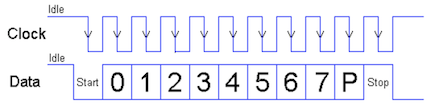


Task list to copy/paste when creating PR for this assign:

__Before releasing assign7:__
- [ ] Review writeup/starter code (instructor)
- [ ] Review consistency/completeness of grading info published to students relative to grading tests used, consider changes clarity/ease of grading (TA)
- [ ] Followup on issues from previous quarter postmortem (issue #)

__To prep for assign7:__
- [ ] 



{: width="60%" style="float:right;"}

*Written by Philip Levis, updated by Julie Zelenski*



---
### Goals

With all your hard work on the previous assignments, your Raspberry Pi
can now read input from a keyboard and respond to your commands via a
graphical console display.  For the _pièce de résistance_ you'll upgrade
your keyboard driver so that you can type as fast as the wind without
dropping characters.

Conceptually, this is about concurrency, a program
being able to do more than one thing at once, and preemption, when one
task in a program can interrupt another to take control of the processor.
Both concurrency and preemption are fundamental ideas to computer systems:
they're what let web servers handle tens of thousands of clients and
your GPU to draw beautiful graphics. In this assignment, you'll start
from the ground up, handling the root of preemption in every computer
system: interrupts.

In completing this assignment you will have:

- written a GPIO extension module to provide a nice API for interrupts,
- redesigned your PS/2 driver to use GPIO interrupts so it doesn't drop scan codes, and
- used an interrupt-safe data structure to correctly share data across regular and interrupt code.

Those of you reaching the stretch goal for the complete system bonus will also:

+ bundle the collection of modules you've written into a comprehensive library for implementing a bare-metal system on the Pi
+ have constructed a complete system of your own top to bottom: your console running on your library

This work completes the transformation of your Raspberry Pi into a
standalone computer, ready to be extended and improved in your final
project. Right on!

## Get starter files

Change to the `cs107e.github.io` repository in your `cs107e_home` and
do a `git pull` to ensure your courseware files are up to date.

To get the assignment starter code, change to your local repository,
fetch any changes from the remote and switch to the assignment basic
branch:
```
$ cd ~/cs107e_home/assignments
$ git fetch origin
$ git checkout assign7-basic
```

You should also verify you have the up-to-date contents for all of
your modules: `timer.c`, `gpio.c`,`strings.c`, `printf.c`, `malloc.c`,
`backtrace.c`, `keyboard.c`, `shell.c`, `fb.c`, `gl.c`, and
`console.c`.  If you are missing changes from a previous assignment
branch (e.g. commits from a regrade submission), have your
`assign7-basic` checked out and use checkout to incorporate changes from
the desired branch (e.g. `git checkout assign6-basic -- src/lib/console.c`).

This assignment adds three more modules: `interrupts_asm.s` and
`bits_asm.s` from Lab 7, and `gpio_interrupts.c`. Make sure you copy
these into into your `src/lib` directory. You can now add these modules to
your code, or, as usual, use the reference ones if you prefer.

__Pay careful attention to the assignment 7 Makefile__: The starter
Makefile assumes that you are going for the complete system bonus and
`MY_MODULES` is set to use all of your own modules. If you need to use
the reference implementation for some modules, you must edit the
Makefile to remove them.  If you fix those issues and are ready to add
the modules back in, you must edit the Makefile to re-list them.

When submitting assign 7, be sure the Makefile is set for the
configuration you intend to be graded. We will test your submission
using the modules you have listed in the Makefile.  If `MY_MODULES`
lists all 14 modules, your work will be evaluated as complete and will
be considered for the system bonus. If you do not have confidence in
one or more of your modules, remove them from `MY_MODULES` and the
reference module(s) will be used when testing and grading your
work. Your submission will not be eligible for the bonus.

## Overview

The basic part of the assignment is to rework your PS/2 keyboard
driver to be interrupt-driven. The keyboard interface is unchanged,
but its internal implementation changes from a polling strategy to one
using interrupts. You will also add support for GPIO interrupts and
write a little bit of assembly code.

The version of `keyboard_read_scancode` you wrote for assignment 5
loops calling `gpio_read` on the clock GPIO until it sees the level
transition from high to low. If your code doesn't happen to be reading
the GPIO at the moment the edge falls, it loses the event. Furthermore,
the CPU spins just waiting for this edge and can't do anything else while
it does. So it both loses events and is extremely inefficient.

Interrupts solve this problem. Instead of running a spin loop for a falling
edge, your code can configure the hardware to issue an interrupt when it
sees a falling edge. The interrupt handler can run immediately when this happens
and read the data bit from the data pin.

To add this functionality to your libpi, you'll need to do three things:

  - Use the assembly you wrote in lab for the core interrupt handling routine.
  - Write a GPIO interrupt library. Because all of the GPIO pins share a
  single interrupt, you need to add another layer of dispatch to allow
  software to register handlers on a per-pin level. The library, when it
  handles the GPIO interrupt, checks to see which pins have have pending
  events and calls the corresponding pin interrupt handlers. One tricky
  part you'll handle is quickly figuring out which pins have pending events:
  you'll leverage your assembly proficiency to write a function with the ARM `clz`
  instruction, which computes how many leading zeroes there are (the first
  1 bit set).
  - Update your keyboard driver to use interrupts instead of spin loops.
  This involves using a ring buffer to store scan codes, so you can safely
  share state between interrupt mode and supervisor mode code. 

To get started, read over the code in the starter
`tests/test_keyboard_interrupts.c` and try it out with your existing
keyboard driver. You should see that your code drops any keys typed while
the test program is paused inside `timer_delay`. Using interrupts in
your keyboard driver will fix this.

### 1) Write a GPIO interrupt handling library

In lab, your button press code directly handled GPIO interrupts. This is
OK for a simple test program, but more complex programs will want to be
able to handle interrupts pins. Furthermore, different modules may want
to handle interrupts. We want modules to be independent. If there's only
a single GPIO interrupt handler, then there needs to be a piece of code
that somehow dispatches interrupts to the right modules based on which
pins events are on. Requiring an application to do this, like you did
in your button example, requires an application to be aware of the
internals of modules. So what we need is a general library that lets
different modules register different handlers for different pins.

Take a look at the interface in `gpio_interrupts.h`. This file has
four functions you need to implement. The basic logic is that this
module handles the INTERRUPTS_GPIO3 interrupt by registering a handler
with the interface `interrupts.h`. When it handles an interrupt, it
then scans the two event pending banks `eds[0]` and `eds[1]` in the
peripheral registers for pending events, and dispatches to per-pin
handlers based on which pins have events. The basic logic is very
similar to what `interrupts.c` does, but a bit simpler, because there
aren't basic interrupts. We encourage you to study that code as a
model for what you should do. 

At this point, you definitely want to write a few tests! If there
are bugs in your interrupt handling library, then debugging your
keyboard will be very difficult. Test enabling and disabling GPIO
interrupts, registering handlers on pins in both banks, and that
you can handle two interrupts that arrive at the same time (hook
a button up to two pins in parallel). Spending an hour now to
write 3-4 good test may save you hours of debugging later.

### 2) Set up keyboard interrupts

Recall that we sample the PS/2 data line on a falling edge on the
clock line. In `ps2_init`, configure the PS/2 clock pin to trigger an interrupt
on a falling edge (using the API in `gpio_extra.h`) and register a 
handler for it. You should enable GPIO
interrupts in the PS/2 module and enable global interrupts in main: this
structure of where enables what reflects the structure of the level at which
they're interacting with the interrupts system.  Don't forget
you want your handler to clear the event or it will run forever!

Now is a good point to test! Run the test program to confirm that you are
receiving interrupts from the PS/2 clock line. If you type a key, how
many scan codes do you expect? How many clock edges per scan code? Is
this what you see?

Remember, interrupt code needs to the simple and fast. 
You want it to be fast because you don't want to delay/miss the
processing of the next interrupt. You want to tbe simple because debugging
interrupts is so hard. Putting `printf` in your handler, for exmaple, will
cause you to miss clock edges: a single character takes almost 100 microseconds,
which is the same length as clock pulse in PS/2.


### 3) Gather a PS/2 scancode
The falling edge of PS/2 clock edge indicates that now is the time to grab a bit from the PS/2 data line.  



Change your handler to gather the 11 bits of a scancode as they arrive. Your handler
should execute 11 times: don't enter spin loops to block to read in the scancode! Be sure to
re-purpose your earlier code that implements the logic to synchronize on the start bit and 
verify the parity and stop bits. Note that because you return from the interrupt handler,
you can't keep variables on the stack: you'll need to use global variables to keep track
of execution state.

Once you're receiving scan codes, you're ready to enqueue them for mainline code to fetch!

(As a side note, our reference version of the keyboard module supports reading in either polling mode or by interrupts. It defaults to polling and can be switched into interrupt mode by calling the function `keyboard_use_interrupts()`. Your keyboard does not need to support this. You can directly re-purpose your previous code to read scancodes to instead read via interrupts without trying to preserve the old way of doing things.)

### 4) Use ring buffer

You can now receive and store scan codes. But you still need to safely
get them to code running in supervisor mode (from main). You'll do
this with the ring buffer described in lecture. When your handler
successfully receive a scan code, it puts it into the ring
buffer. When mainline code calls `keyboard_read_scancode`, this
function blocks (spins) until there is a scancode in the buffer, then
returns it. `keyboard_read_scancode` always returns a scancode, either a
saved scancode that was received previously or waits for the next
scancode to arrive.

You should now be able to run your same console shell application as
in assignment 6, and all should work as before, except this time you
never miss a key. Each typed key is immediately enqueued by the
interrupt handler for later processing by the console when ready.

You now have a fully operational console that uses the full power of your
hardware! What you have running is not too far from an Apple II computer.

### 5) Need for speed?

Your new interrupt-driven keyboard driver won't drop a key unless someone can
type 86+ characters in between calls to `keyboard_read_scancode`: the ringbuffer
is 256 elements and most keys are 3 scan codes. Unless you're doing something really
CPU intensive, this is unlikely

But even a moderately fast typist can still enqueue a decent
number of keys during a slow console redraw that makes for a longish
wait as the console works through the backlog. __This is correct, in that
our requirement is that the console receive all typed
characters and correctly draw and respond to input__. But, ... if the
performance exercise from lab 7 has roused your interest in
optimization, we'd love to see what you can do to improve the
responsiveness. A few ideas to consider:

- Inner loops are the first place to look for speed-up opportunities (e.g. hoisting out redundant work, streamlining operations, loop unrolling). With a million pixels on the line, cutting 10 instructions per pixel totals to a full second of time saved.
- Every call to `gl_draw_char` calls `font_get_char` to re-extract the character from the font bitmap. Try doing the extract just once per unique char and cache to re-use later?
- Vertical scroll is particularly painful because of the need to redraw the entire screen. Rather than recalculate/redraw all the text, you could copy the previously drawn pixels upward. Or wackier, what about a framebuffer variant that simply adjusts the y_offset to get scrolling for "free" and defers paying the cost of a full redraw until hit virtual bottom?

## Complete system bonus
The `make lib` target of the Makefile bundles the files named in `MY_MODULES` into a single library `libmypi.a`.

If your `libmypi.a` uses all your own modules for this assignment (no use of reference modules) and your interrupt-driven console works correctly, 
you receive a full 10-point bonus. This is a big reward for a big 
accomplishment! If you fulfill this bonus, you've successfully built a complete
computer system from the ground up, and every line of code for that system is sitting in your assignments folder. Congratulations!

To be considered for the bonus, `libmypi.a `must use your own code
for all modules. We will not re-test your individual modules to the extent that they were
tested when grading each assignment, but all shell/console functionality must work correctly. This means, for example, your `printf` must handle
printing padded hexadecimal numbers (which are needed for `peek`), but
need not necessarily handle negative values perfectly (since they are
not used by the shell).

That `libmypi.a` library packages up all your battle-tested code in a form ready to be incorporated into any future project.  The directory 
`cs107e.github.io/assignments/assign7/libmypi-usage` contains a template project that demonstrates how to build an application using your `libmypi.a`.

To start a new project, make a copy of the template project and copy in
your `libmypi.a`. file  Use `make install` to build and run.  You can now program your Pi almost like an Arduino with this high-level library you wrote.

## Extensions

We have two proposed
extensions. Choose one OR the other (you do not need to do both). 

### 1) Profiler

One extension is to add profiling support to your shell.
A _profiler_ is a developer tool that tracks where in the code a program is spending its execution time.

If diagnosing how to improve in a slow program, your first task would be to observe the program and measure where it spends most of its time.
Speeding up those sections of the code will have the greatest
effect on the overall run time.

There is a simple and clever way to do this using a _sampling_ strategy.
Configure the ARM timer to periodically interrupt your program.
On each timer event, you record a sample of the PC. Recall that the argument to the interrupt handler is the PC of the instruction that was about to execute at the time of the interruption.
The probability that a given value of the PC is the argument to the interrupt handler
is proportional to the time spent executing that instruction.
The more often that an instruction is executed,
the more times the interrupt handler will be called with that PC.
A profile is created by creating a histogram that counts
the number of times the program is interrupted at each PC.

For this extension, you will configure periodic timer interrupts to sample the PC and print a histogram of the PC values. You will also add a new command to your shell run your profiler.

The header file `cs107e/include/gprof.h` declares the interface to the
profiling functions.

The profiling will maintain an array of counters, one for each instruction address in the text (code) section.

There is a known address where the text section starts (what value is
that again?), but to know the extent of the text, you will need to edit the linker map to mark the end.  It may help to revisit [lab4](/labs/lab4/) for
information on linker maps.

Open the `memmap` file and, patterning after how symbols are used to mark the bounds of the bss section, add a symbol to identify the end of the text section. Use this symbol in `gprof_init` to compute the correct amount of space needed to have a counter for each instruction in the text section. All of those counters should be initialized to zero at the start of profiling.

`gprof_init` configures a timer interrupt scheduled for the
interval defined in `gprof.c` using our `armtimer` module.  (See
the header file
[armtimer.h](https://github.com/cs107e/cs107e.github.io/blob/master/cs107e/include/armtimer.h)).  Attach the function `gprof_handler` as an interrupt handler. `gprof_handler` takes one
argument, the value of the PC at the time of the interrupt, and will increment the counter for that value of the PC.

Add the command `profile [on | off | status | results]` to
your shell commands. `profile on` should initialize or zero-out all profile
counts and start profiling (enable timer interrupts). `profile off` should stop
the profiling (disable timer interrupts). `profile status` should print `Status:
on` or `Status: off`, depending on whether the profiler is on or off,
respectively. `profile results` should print current (if status is on) or most
recent (if status is off) counts to the debugger console using the `gprof_dump`
function. The `gprof_dump` should print the highest 10 counts to the console (in any order).

The final touch for your profiler is to provide the function name that each high-count instruction belongs to. If you remember the `name_of` function you wrote for assignment 4, the compiler has embedded each function's name as a string of characters before its first instruction. You can find the function's name by walking backwards in memory from the instruction to find the "magic" byte that marks where name is stored.

For each high-count instruction, you should report the address of the instruction, the name of the function it belongs to, the instruction offset within the function, and the count of samples recorded for that instruction. Thus your profiler results look something like this:

    0x0000ae0c uart_putchar+36: 13358
    0x0000be1c timer_get_ticks+16: 23219
    0x0000be5c timer_delay_us+24: 36209

Cool, you now have a profiler!

### 2) PS/2 mouse and paint application

For this extension, you'll write a small paint application using your
`libmypi.a`.

Make a `paint` subdirectory in your assign7 directory. We've
provided one starter file, `mouse.c`, but you'll add files around it
so that the `paint` directory is actually a complete standalone
application, with its own `Makefile` and everything.

Copy the starter project files in
`cs107e.github.io/assignments/assign7/libmypi-usage` into `paint`,
and copy your finished `libmypi.a` in as well. Add the starter file `mouse.c` to the project and edit the Makefile to add `mouse.o` to the list of `OBJECTS`.

Make sure you can build and run the "Hello, world" application right
now.

Your first job is to write a driver for a PS/2 mouse. There is a box of PS/2 mice on the shelf in the B21 lab room. Borrow a mouse from us while working on the extension, but please return  it to us when done. Read these pages on the
[PS/2 protocol](https://web.archive.org/web/20180124072221/http://www.computer-engineering.org/ps2protocol/) and
[PS/2 mouse specifically](https://web.archive.org/web/20171214135004/http://www.computer-engineering.org/ps2mouse/)
for details on how to talk to a mouse. Connect the power/ground/clock/data pins from the PS/2 plug on the mouse to your Pi.

The functions `mouse_read_scancode` and `clock_edge` are the near-identical twins to the parallel functions in keyboard, the only change being to use the GPIO pins for mouse clock and data GPIO pins instead of keyboard. The mouse `clock_edge` gathers data bits and enqueues a scancode to a ring buffer to be dequeued by `mouse_read_scancode`, same as you did for keyboard.

The function `mouse_write` implements the other half of the PS/2 protocol:
sending a packet from the Pi to the mouse. We must first set the mouse into "data reporting mode" so it sends scancodes on mouse movement. See "Host-to-Device
Communication" in the PS/2 protocol documentation for the full write
process. Here are some notes:

- You need to temporarily reconfigure the mouse's clock and data GPIO pins as output pins so you can pull them low
when needed. 'Release' (set as input again) the clock line after you
delay 100 us and write the start bit, and release the data line after
you write the parity bit and see a falling clock edge.

- To write a packet, you wait for a falling clock edge
11 times (before sending each of 8 data bits, before sending the
parity bit, before releasing the data line, and before reading the
acknowledgment bit from the mouse). After that last falling clock
edge, spin until the data line goes high (that's the end of the ack
bit transmission).

The `mouse_init` functions writes to the mouse and reads its responses to perform the required mouse initialization sequence:

1. Write a Reset scancode to put the mouse in Reset mode.
2. Read the ACK scancode (should be 0xFA).
3. Read the BAT Successful scancode (should be 0xAA).
4. Read the Device ID scancode (should be 0x00).
5. Write the Enable Data Reporting scancode.
6. Read the ACK scancode (should be 0xFA).

Run `mouse_init` from `main.c` and confirm that the mouse responds
with the expected scancodes. After data reporting has been enabled, the mouse should send movement scancodes as you move it.

The higher-level `mouse_read_event` function is implemented on top of `mouse_read_scancode` to convert the low-level scancode into a mouse movement event. See the `cs107e/include/mouse.h` file for declaration of the
`mouse_event_t` structure, and consult the PS/2 mouse page to find how
scancode bits map to event details. Be careful about the 9-bit two's
complement representation of distances!

Using your shiny new mouse driver, implement a paint application
in `main.c`. When you run paint, it will initialize the graphics library, and then loop, reading mouse events and drawing on the screen in response.

It should be possible to:

- draw stuff [like a smiley face :-)] by holding down the left mouse
button and moving the mouse
- when not holding down the button, move some mouse pointer-like shape around on
the screen without disrupting stuff that's been painted

Other than that, the details of the UI are up to you. Describe in your
README how we should use your paint program!


## Submit
The deliverables for `assign7-basic` are:

  - A reworked `keyboard.c` module that uses interrupts
  - Completed versions of all your previous modules (if to be considered for system bonus)
  - Your tests in `tests/test_keyboard_interrupts.c`

Submit the finished version of your assignment by making a git “pull request”. Make separate pull requests for your basic and extension submissions.

Make sure you add all the necessary source files to Git so that we can
clone your assignment and build and run it. If you are aiming for the complete system bonus, double-check that your Makefile lists all modules in `MY_MODULES` and that the updated versions of your files are added and committed to the repository. If you are submitting the paint extension, be sure all of the needed files in your paint subdirectory are committed as well.

One means to verify what was included with your submission is to push and then clone it again from GitHub in a separate `assign7-clone` folder.  Build and run from this clone to be sure all essential files are present.


The automated checks make sure that we can run your C
code and test and grade it properly, including swapping your tests for
ours.

CI verifies that:

- `apps/interrupts_console_shell.c` is unchanged

- `make` and `make test` successfully build

- `make test` also successfully builds with the unchanged version of the test program in the starter

## Grading
To grade this assignment, we will:

- Verify that your submission builds correctly, with no warnings. Warnings and/or build errors result in automatic deductions. Clean build always!
- Interactively test your full console program running with a PS/2 keyboard and HDMI monitor.
- Review your code and provide feedback on your design and style choices.


## Course learning goals


__Three cheers for YOU!__ 👏👏 👏 This is __your__ computer system, the one you built yourself from the ground up. Each line of code is there because you put it there, you know what it does, and why it is needed. We are in awe of the effort you put in to arrive here and hope you are as proud of your work as we are.

Reflecting on where you started, it has been an impressive journey. Take stock of the progress you have made on mastering these course learning goals:

✔︎ __To understand how computers represent information, execute programs, and control peripherals__
- Binary and hexadecimal number systems, machine encoding of instructions
- Memory layout, pointers, arrays, structs
- ARM assembly, use of registers, instruction control flow
- Runtime use of stack and heap memory
- Memory-mapped I/O to access to peripherals, device drivers (keyboard, display)
- Interrupts, simple multi-processing

✔︎ __To master command-line programming tools and the C programming language__
- Build tools (assembler, compiler, linker, make, bootloader)
- Implementation of standard C library functions (strings, printf, malloc, graphics)
- Strategies for testing and debugging code, using gdb
- Establishing a productive and effective programming workflow

Bring these skills into the final project, mix with your creativity and initiative, and something fabulous will surely result. We're looking forward to it!


`
