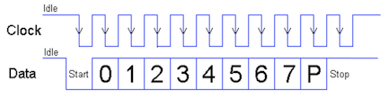


Task list to copy/paste when creating PR for this assign:

__Before releasing assign7:__
- [ ] Review writeup/starter code (instructor)
- [ ] Review consistency/completeness of grading info published to students relative to grading tests used, consider changes clarity/ease of grading (TA)
- [ ] Followup on issues from previous quarter postmortem (issue #409)

__To prep for assign7:__
- [ ] 



{: width="50%" style="float:right;"}


<br>
<small>The usual 48-hour grace period applies, but we __strongly discourage__ its use. Completing and submitting on-time means you can then put your attention on fixing open issues and claiming the big full system bonus!</small>

---
## Goals

With all your hard work on the previous assignments, your Mango Pi
can now read input from a keyboard and respond to your commands by drawing to a
graphical console display. For the _pièce de résistance_ you'll upgrade
your keyboard driver so that you can type as fast as the wind without
dropping characters.

Conceptually, this assignment is about concurrency and preemption. Concurrency
is when a program is able to do more than one thing at once. Preemption
is when one task in a program can take control of the processor from
another. Both concurrency and preemption are fundamental ideas to computer systems:
this allows your phone to multitask between applications and allows a web server to handle tens of thousands of clients. In this assignment, you start
from the ground up, handling the root of preemption in every computer
system: interrupts.

In completing this assignment you will have:

- redesigned your PS/2 driver to use gpio interrupts so it doesn't drop scancodes, and
- used an interrupt-safe data structure to correctly share data across regular and interrupt code.

The stretch goal is to achieve the __full system bonus__ which attests that you have:

+ written a library of modules that provide foundational support for implementing a bare-metal system on the Pi
+ constructed a successful and complete system of your own top to bottom: your console running on your library

This work completes the transformation of your Mango Pi into a
standalone computer, ready to be extended and improved in your final
project. Way to go!

## Get starter files
Change to your local `mycode` repo and pull in the assignment starter code:

```console
$ cd ~/cs107e_home/mycode
$ git checkout dev
$ git pull code-mirror assign7-starter
```

In the `assign7` directory, you will find these files:
- `ps2.c`: library module
  + The starter code contains an empty `ps2.c` file. Copy/paste your existing code from `assign5/ps2.c` to get your starting point.
- `test_interrupts.c`:  test program with your unit tests
- `interrupts_console_shell.c`:  application program that runs your shell, reading input from the PS/2 keyboard via interrupts and displaying output to the console. You will use this program unchanged.
- `Makefile`: rules to build `interrupts_console_shell` application (`make run`) and unit test program (`make test`)
- `README.md`: edit this text file to communicate with us about your submission
- the subdirectories `mylib` and `template` show how to build and use your libmymango
  + `mylib` has symbolic links to your module source files and a `Makefile` to build `libmymango.a`
  + `template` is a sample application that builds on top of your `libmymango.a`

The `make test` target builds and run the test program `test_interrputs.bin` that does simple unit tests. The `make run` target builds and runs the program `interrupts_console_shell.bin`.

>__Take note of the assignment 7 Makefile!__ Unlike previous makefiles that used your code only for the modules specific to the current assignment, this makefile assumes that you are aiming for the full system bonus and want to use all your own code. `MY_MODULE_SOURCES` is set to use __your code for all modules__.  If you need to use our reference module in place of yours, edit the Makefile to remove the faulty module. After resolving the issue, add the module back to the list of `MY_MODULE_SOURCES` to build your full system.
{: .callout-warning}

## Interrupts-driven `ps2` module

In assignment 5, you wrote a PS/2 device driver that reads scancodes by polling. The task for assignment 7 is to rework that driver to read by interrupts.

Start by copying your code from the file `assign5/ps2.c` and pasting that code into the file `assign7/ps2.c`. This is your starting point. You won't edit the original `assign5/ps2.c` file, preserve that version as-is. All new edits are made int the file `assign7/ps2.c`.

Review the code you wrote for assignment 5. A call to `ps2_read` waits for the next scancode to arrive. "Waiting" is a tight loop that repeatedly calls `gpio_read` on the clock gpio until it observes the level transition from high to low, i.e. falling edge. If your code isn't reading the gpio at the moment the edge falls, it misses the event. Furthermore, the CPU spins just waiting for this event and can't do anything else while it does. The drawbacks of the polling implementation are that it misses events and it is very inefficient.

Read over the test function `check_read_delay` in file `test_interrupts.c`
and try it out with your existing module. You should see that your code
drops any keys typed while the test program is paused inside `timer_delay`.
This is the expected behavior from the polling implementation.

Interrupts solve this problem. Instead of sitting in polling loop waiting for a falling
edge, your code can configure the hardware to issue an interrupt when it
sees a falling edge. The interrupt handler is invoked to immediately read the data when it is available, never missing a bit.

### 1) Configuring PS/2 interrupts

For a PS/2 device, the triggering event is a falling edge on the clock line. The handler response is to read a single bit from the data line.

Start by writing a basic handler function that reads a bit from the data gpio. The handler function needs to know which gpio to read from. The clock and data gpio are stored in the `ps_device_t` struct; we recommend you use the `aux_data` argument to pass a pointer to that struct. For now, have your handler just announce the interrupt with a quick `uart_putchar('+')`. (if feeling fancy, can putchar `'0'` or `'1'` based on the data bit read, but stay away from complex `printf`; there isn't time). Be sure that the handler also clears the interrupt or it will endlessly re-trigger.

Now you must arrange for your handler to be called on clock falling edge event.

Review the module interface for `gpio_interrupt` in its header file [gpio_interrupt.h](/header#gpio_interrupt) to learn the functions that set up a gpio interrupt.
Here are the steps to take in `ps2_new`:
- initialize `gpio_interrupt` module
- configure clock gpio for interrupt on negative edge event
- register your function as handler for the interrupt
- enable gpio interrupt for clock gpio

The above steps do the event-specific parts of configuring a gpio interrupt. You also need to configure the top-level interrupts module.Review the module interface for the global interrupts system in header [interrupts.h](/header#interrupts). Here are the steps to take in the program `main()`:
- initialize `interrupts` module before doing any configuration of interrupts
- flip the global enable switch after completing all configuration of interrupts

Some parts of arranging interrupts happen in a local context (i.e. per specific PS/2 device), others steps are taken globally (once for the entire program). You configure the gpio interrupt within the PS/2 module and interact with the top-level interrupts in the program `main()` function. This reflects the level at which the modules interact with the interrupt systems. Interacting with gpio interrupts is localized within PS/2 module; this is mostly a private matter of the PS/2 module implementation. The top-level interrupts module is configured in the program `main` function. The top-level interrupts module acts globally and use must be coordinated across the entire program.

Test using the function `check_interrupts_received` of `test_interrupts.c` to confirm that your handler works. When you type a key, the handler should output a digit for each bit, 11 bits in total per scancode.

Remember that interrupt code should be simple and fast. You want to be simple because debugging
interrupts is so hard. You want it to be fast because you don't want to delay/miss the next interrupt.
Calling `printf` in your handler, for example, could
cause you to miss clock edges as even a relatively simple `printf` can take tens or hundreds of microseconds,
which is longer than a PS/2 clock pulse.

### 2) Gather a PS/2 scancode
The falling edge of PS/2 clock edge indicates that right now is the time to read a bit from the data line.



Your handler function will be called 11 times, once for each falling clock edge. Each invocation of the handler reads a single bit from the data gpio. Because each invocation has its own stack frame, you cannot use a stack local variable to store the accumulated scancode from call to call. Instead you will add that data to the `ps2_device_t` struct.  Pass the pointer to the device struct as the `aux_data` argument. You can additional fields to the `ps2_device_t` struct to store whatever information is needed to track the device state between calls to the handler function.

Your assign5 version of `ps2_read` handled the entire scancode in one function call, using a loop for the 8 data bits and verifying the validity of the start, parity and stop bits. You now need to rework that code to operate in context of your handler function which reads a single bit at a time.  It takes 11 separate calls to the handler to assemble one scancode. If the handler detects a bit in error, discard any partial scancode and re-start on new start bit as you did previously. Hint: Reviewing the finite state machine you sketched for the [assign 6 style reflection](../assign6/style_reflection#FSM) may be helpful in working out the code logic.

Once your handler function can gather a scancode, you're ready to enqueue those scancodes for mainline code to retrieve.

> __Tip: polling versus interrupt__ Our reference version of the `ps2` module supports both reading in polling mode and reading by interrupts; the mode is configurable via an internal switch. Your ps2 module does __not__ support this.  Rather than a switchable mode, you will have two distinct `ps2` modules: the original `assign5/ps2.c` that reads via polling and the reworked `assign7/ps2.c` that reads by interrupt.  (You will not use assign5 version going forward; but the file is preserved in your assign5 directory if you want to review it.)
{: .callout-info}

### 3) Use ring buffer
When the handler function reaches the stop bit that completes the scancode; it needs to then safely pass the scancode from the interrupt handler to mainline code. The ring buffer queue shown in lecture is just the tool for the job! (see [ringbuffer.h](/header#ringbuffer))

Create a new ring buffer queue in `ps2_new` and add it as a new field in the `ps_device_t` struct. Once your handler function has gathered a complete scancode, add the scancode to the queue. Edit `ps2_read` to dequeue from the queue. The `ps2_read` function blocks (spins) until there is a scancode available in the queue, then dequeues and returns it. `ps2_read` always returns a scancode, either a saved scancode that was previously queued or waits for the next scancode to arrive in the queue.

You should now be able to run the exact same console shell application from
assignment 6, and everything works as before, except this time you
never miss a key. The interrupt handler jumps into enqueue each scancode
as it is arrives. Those scancodes are gathered into typed keys that then
display in the console when ready.

### Testing and debugging
Use `make test` to run the `test_interrupts.c` test program. The starter code demonstrates some simple ways to manually test the interrupt handling of your reworked `ps2` module. You might find it helpful to also re-use your assign5 tests that you used to confirm correct behavior the `ps2` module and `keyboard` running on top of it.

Once you have confirmed the behavior of your interrupt-driven `ps2` module in isolation, try `make run` to test `ps2` in the `console_interrupts_shell` program.

Your console using the interrupt-driven `ps2` module should no longer drop keys; however even a moderately fast typist can still enqueue a decent number of keys during a slow console redraw that makes for a bit of a wait as the console works through the backlog. Remember that the expected behavior is that the console receives every character that is typed and redraws in response to each event. Given this design, you will be motivated to make that [redraw run briskly](#responsiveness).

You now have a fully operational console that uses the full power of your
hardware! What you have running is not too far from an Apple II computer.

## Extensions

There are two extensions offered for this assignment: profiler __OR__ mouse/paint.  Successfully ompleting either extension earns __3 bonus credits__.

### Profiler

Add a `profile` command to your shell. A _profiler_ is a developer tool that tracks where in the code a program is
spending its execution time.

When diagnosing how to improve the performance of a sluggish program, you first make observations and take measurements. You want to identify which code the program is spending most of its time executing, i.e. its "hot spots". These are the code sections you want to put your efforts into streamlining as they will have the biggest payoff in improving performance.

One clever way to find hot spots is a simple _sampling_ strategy. Repeatedly interrupt the program and record a sample of which instruction the interrupted `pc` was executing. The probability of observing a given value of `pc` is proportional to the time spent executing that instruction, i.e. the more often an instruction is executed, the higher the likelihood it will be observed when sampling. Thus after having taken a good number of samples, picking out the instructions with the highest sample counts will identify the hot spots.

Implement the profile as an additional command in `assign5/shell.c` module. You do not need to preserve the original version or make a distinct copy for assign7, directly edit the file `assign5/shell.c`.  In your `assign7` Makefile, confirm that `shell.c` listed in `MY_MODULE_SOURCES`. Buildling assign7 will find the `shell.c` file in the `assign5` directory. Test your profiler by running the `interrupts_console_shell` application from the `assign7` directory. (This is also how we will test your profiler.)

Use the `hstimer` module to generate timer events at interval ~500 microseconds. (Refer to header file [hstimer.h](/header#hstimer), sample code in Interrupts lecture).  The CSR `mepc` ("machine exception program counter") is the means to access the value of the interrupted pc.  You muse use an assembly instruction to access the CSRs, but rather than add a separate `.s` file to the project, read up on gcc's support for "inline/extended assembly" and use that syntax to directly embed the necessary instructions into your C code.

To record the samples, maintain an array of counters, one for each instruction address in the text (code) section.  By knowing where the text section starts and ends (remember about the linker map file `memmap.ld` and the `memmap.h` header file), you can allocate the appropriate amount of space.

Add the command `profile [on | off]` to your shell commands to control the profiler. `profile on` resets all profile counts to zero and starts profiling. `profile off` stops profiling and prints the profiler results. `profile` with no argument shows the current status of profiling including time elapsed since start of profiling and number of samples collected so far.

The profiler results lists the 20 instructions with the highest sample counts. Each instruction is printed with its address and label (obtained from `symtab`) in a table like the one shown below:

```
profile: 35207 msecs elapsed, collected 70357 samples

  Counts  |    pc        <fn>
---------------------------------------
   28576  |  0x40003674  <gl_draw_char+288>
    6779  |  0x40003698  <gl_draw_char+324>
    3981  |  0x400032a4  <gl_clear+68>
    2562  |  0x40009b98  <timer_delay_us+44>
    2223  |  0x40006788  <rb_empty+24>
    2040  |  0x40009c10  <timer_get_ticks>
    2002  |  0x40006458  <ps2_read+44>
    1689  |  0x40009c14  <timer_get_ticks+4>
    1095  |  0x400032ac  <gl_clear+76>
    ...
```

Cool, you now have a profiler! Run it on your console program and learn where your hot spots are.

Tag your submit `assign7-extension` and be sure you have committed the updates to file `assign5/shell.c`. In your assign7 `README.md`, include some of your sample profiler output and share with us what you learned from writing and using this neat tool. Were you able to use the profile information to improve your console performance?

### PS/2 mouse and standalone paint application

For this extension, you'll create PS/2 mouse driver module and use it to implement a simple paint application.

> __Got mouse?__ We keep a small stash of PS/2 mice in the Gates lab room for those working on this extension. Please do not take the mice out of the lab, we need them to stay in lab for all to use. Thank you! 🐁
{: .callout-info}

Communicating with a PS/2 mouse is similar to a PS/2 keyboard. First read these specifications for the [PS/2 mouse](https://web.archive.org/web/20171214135004/http://www.computer-engineering.org/ps2mouse/) and [PS/2 protocol](https://web.archive.org/web/20180124072221/http://www.computer-engineering.org/ps2protocol/) (paying particular attention to the last section labeled "Host-to-Device Communication").

Start by extending your interrupt-driven `ps2` module to support the new function `ps2_write`. This is the symmetric operation to `ps2_read` that sends a scancode packet from the Pi to the device. Read the PS/2 protocol specification for how to switch between communicating from device-to-host (e.g. `ps2_read`) to host-to-device (e.g `ps2_write`). A scancode packet consists of 11 bits (start, 8 data, parity, stop) and each bit is written to the data line after observing a falling edge on the clock line.

With `ps2_write` in place, you're ready to create a mouse driver! The `mouse` module layers on the `ps2` module just as `keyboard` does, using `ps2_read` (and now `ps2_write`) to talk to the input device. Read the header file [mouse.h](/header#mouse) for the mouse interface and documentation. Create a new file `mouse.c` and implement the two required functions (`mouse_init` and `mouse_read_event`). `mouse_init` resets the mouse and enables data reporting mode. `mouse_read_event` calls `ps2_read` and converts scancodes into mouse events.

Edit the `mylib/Makefile` to add `mouse.c` to the list of `LIBMANGO_MODULE_SOURCES` and rebuild your library `libmymango.a`. Your library now supports interfacing with a mouse, neat!

Now create a new standalone paint application that uses your library. (note: this is a good preview of how to start your final project!) Make a copy of the `template` subdirectory and name the copy `paint`. Copy your library `libmymango.a` from `mylib` into the paint folder. Using your shiny new mouse driver, implement a simple paint application in `paint/main.c`. The paint application draws a blank canvas and then loops, reading mouse events and drawing on the screen in response.

It should be possible to:

- draw by holding down the left mouse button and dragging the mouse
- when not holding down the button, move some pointer/indicator around on the screen without disrupting what's previously been painted
- Watch this short clip of our paint application in action:

{: .zoom}

Other than that, the details of the UI are up to you. Describe in your assign7
`README.md` how to use your paint program. Tag your submission `assign7-extension`; be sure your commit includes both your mouse.c module and all of the files for the paint application. We can't wait to try it out!

## Submitting
The deliverables for `assign7-submit` are:

- A reworked `ps2.c` module that uses gpio interrupts
- `README.md` (possibly empty)

Submit your finished code by commit, tag `assign7-submit`, and push to remote. The steps to follow are given in the [git workflow guide](/guides/cs107e-git#assignment-submission).

If you are submitting an extension, be sure all additional files needed for the extension are included in your commit (e.g. `assign5/shell.c` or `paint` subdirectory).

In light of the coincident push to wrap up your full system, we've intentionally scoped the coding task for the assignment to be relatively modest compared to previous assignments. There also is no style reflection.  Our strong recommendation is that you plan to __complete and submit assignment 7 by the on-time deadline__. This allows you then turn your attention to revise and resubmit on open issues and claiming the big full system bonus!

## Grading
The grading for assignment 7 tests the interrupt-driven `ps2` module using the same `ps2` module unit tests we used for assign5.

  - ps2 (interrupt-driven)
    - receive bits by interrupt
    - read well-formed scancode
    - discard malformed (wrong start/stop/parity) and restart, timeout resynchronize
        - tough for you to directly test, just try your best and we'll run under our test rig to give you results

We plan to quickly run tests on all submissions that __meet on-time deadline__ and get results out post-haste so you have the opportunity to respond and tag for re-test ahead of the full system submission.

## Full system bonus
The crowning achievement on top of your hard work on the assignments is seeing your modules working together in a harmonious whole. Successfull passing the system integration test earns the __full system bonus__ , a whopping __6 bonus credits__!

> __Full system deadline end of day Saturday__ The deadline for full system submit has historically been coincident with the assign7 deadline, but we have decided to extend by a few extra days to get those last fixes in up. Submit for full system by __Sat Mar 8 11:59pm__. This is also the deadline for any final revise-and-resubmit fixes for retest.
{: .callout-info}


### Revise and resubmit
We aim for all students to resolve all P1 issues, with added recognition for resolving issues of lower priority.

After readying a fix and testing yourself, commit/tag/push to request retest from us. Use the `assignN-retest` tag for retest of `assignN`. You can tag the same commit with several retest tags if it contains fixes for more than one assignment. During the last week leading up to the full system submission deadline, we will run the retest cycle nightly and update issues with new results.

### Testing your system in integration

The results we post as issues are from unit tests run on each module in isolation. If your code has successful results on all module unit tests, this likely tracks with success on full system. However, it is possible to have discrepancies in either direction. For example, the full system can succeed despite a failure on an unit test, such as when the unit test is very thorough and surfaces an isolated bug that is not exercised or detectable by the full system.  Conversely, it is possible to have 100% success on all module unit tests and yet still hit a failure on full system. This could be a bad interaction between modules that only surfaces in integration or a bug that was not detected by a module unit test that was not fully rigorous in its coverage.

TLDR; __use revise and resubmit to resolve issues found by unit tests, but also supplement with manual testing of your full system in integration__. Build `interrupts_console_shell` with `MY_MODULE_SOURCES` set to include all modules. Test the console application, taking care to exercise all module features being used: key combinations, shell commands, console wrap and scroll, and so on.


### System responsiveness

Here is some opportunities to accelerate a sluggish redraw:
- Use the [speed exercise from lab6](/labs/lab6#speed) for timing code and test harness to try out options
- Inner loops are the first place to look for speed-up opportunities
    (e.g. hoisting out redundant work, streamlining operations, loop unrolling), especially the inner loops within the `gl` module.  With nearly two million pixels on the line, cutting just 10 or 20 instructions per pixel can save tens of millions of cycles. You will absolutely feel the difference!
- _Cacheing_ is a technique used widely in computer science. The basic gist is that you save a result to re-use rather than having to repeatedly recompute/refetch.
  + As one example: each use of `gl_draw_char` calls `font_get_glyph` to re-extract
    the glyph from the font bitmap. If the `gl` module extracted a glyph on first use and saved it, it could use the cached version on subsequent draw operations and avoid the repeated work to extract it.
- If you do the [profiler extension](#extensions), you can use it to identify the hot spots in your code, which points you to the places to focus your attention to get the most impact for your efforts!



### Submit full system
+ Double-check that final versions of files for all modules/assignments are committed and pushed. The `assign7` Makefile should have your settings and flags to build `interrupts_console_shell` without warnings or errors.
+ Tag the commit you want us to test `fullsystem-submit`. If you do not have a `fullsystem-submit` tag, we will not test your code for the full system bonus.
+ Get submit on or before full system deadline. This deadline is firm, no grace period applies.

### Grading full system

For the integration test, we will build the assign7 `interrupts_console_shell` application using all of your library modules and interactively test the complete system running with a PS/2 keyboard and HDMI monitor.
+ Our test will touch on the core features of the system to confirm all is working together in integration.
+ We will not re-test your individual modules to the same extent as the comprehensive module unit tests, but all functionality used by shell/console must work correctly. This means, for example, your `printf` must properly print zero-padded hexadecimal numbers (which are needed for `peek`), but could slip by with a minor bug in formatting a large negative value (since they are not used by the shell).
+ Your console should feel reasonably responsive and the screen should update in a smooth and non-glitchy manner. It doesn't need to be blindingly fast, but it should not be painfully slow. Keeping it snappy will not only delight your grader, but make testing it yourself less torturous. (If you have a sluggish redraw in need of acceleration, revisit the [speed exercise from lab6](/labs/lab6#speed) for inspiration.)

The full system bonus of __6 credits__ is a big reward for a big accomplishment. You have successfully built a complete computer system from the ground up, writing your own code at every step of the way. Congratulations!

### Building libmymango.a
The full system test does not require you to build your modules into library but we wanted to let you know how to build your library for possible future use such as in your project. Change to the directory named `mylib` and use `make. This builds `libmymango.a` which packages together your battle-tested code of modules into a complete library to support a bare-metal system on the Mango Pi.

The `libmymango.a` library is in a form ready to be easily incorporated into any future project. The directory named `template` contains a template project that demonstrates how to build an application using your `libmymango.a`. To start a new project, make a copy of the template folder, copy in `libmymango.a`, and use `make run` to build and run. You can now program your Pi almost like an Arduino with this high-level library you have created.

## Course learning goals

__Three cheers for YOU!__ 👏👏👏 This is __your__ computer system, the one you built
yourself from the ground up. Each line of code is there because you put it there,
you know what it does, and why it is needed. We are in awe of the effort you put
in to arrive here and hope you are as proud of your work as we are.

Reflecting on where you started, it has been an impressive journey. Take stock of
the progress you have made on mastering these course learning goals:

✔︎ __To understand how computers represent information, execute programs, and control peripherals__
- Binary and hexadecimal number systems, machine encoding of instructions
- Memory layout, pointers, arrays, structs
- RISC-V assembly, use of registers, instruction control flow
- Runtime use of stack and heap memory
- Memory-mapped I/O to access to peripherals, device drivers (keyboard, display)
- Interrupts, simple multi-processing

✔︎ __To master command-line programming tools and the C programming language__
- Build tools (assembler, compiler, linker, make, bootloader)
- Implementation of standard C library functions (strings, printf, malloc, graphics)
- Strategies for testing and debugging code, using gdb
- Establishing a productive and effective programming workflow

Bring these skills into the final project, mix with your creativity and initiative,
and something fabulous will surely result. We're looking forward to it!


