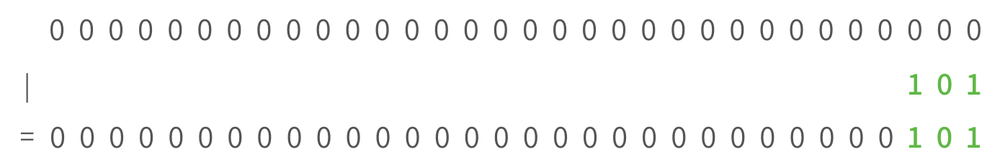
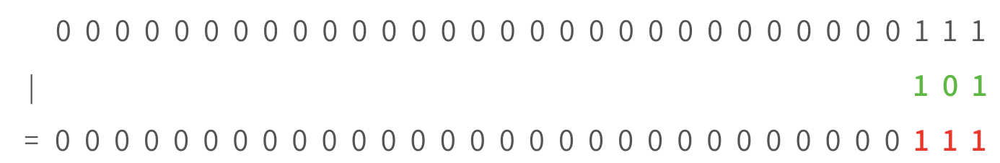

_Written by Anna Mistele_

What happens when you have a number `x` and you want to AND or OR it with a bit? It actually follows an interesting 
pattern, shown in the table below. Take a moment to convince yourself that this table is correct.


Alright, so let's imagine we have four bytes of information and we want to change 3 bits (e.g. to set an FSEL value). 
How would we set the three rightmost bits to `101`?



Okay, so it looks like to set bits in a 32-bit memory address, we can just OR them in. Right? 

**WRONG!** What if the memory address isn't all zeroes?



That doesn't look quite right. If the bits are already set to `1`, using an OR won't change them—
they'll just stay at `1` (why? check the table above!). The only way we can actually insert the number we want is 
by OR'ing it with `0`s or AND'ing it with `1`s (see the table above!). Conventionally, we choose to OR it with zeroes. 
So we want to use zeroes to "erase" the previous value at that location, but we don't want to erase the whole number. 
How do we do this?


Taking advantage of the rules from the table above, we can create a number that only erases the bits we want to change! 
If a bit in our bitmask is set to 1, it will leave that bit alone. If our bitmask has a `0`, though, it will erase the bit 
when we AND our bitmask with the memory address.


Whoaa!! Looks like if we take our memory address, AND it with a bitmask, and then OR it with the number we want to plug in, we'll have inserted that 
number without messing up any of the other bits.

The only issue: No one wants to write out `unsigned int bitmask = 0b111111111111111111111111111111000;` That's a lot of ones. 
Instead, we can write `~0b111`. The tilde (`~`) means take the number `0b111` and flip all the bits (all the trailing zeroes 
turn to `1`s, the three ones turn to `0`s)! So `~0b111` is equivalent to `0b111111111111111111111111111111000`.

Okay there's actually one more issue. What if we want to replace bits in the middle of a memory address? Well, we can left-shift our bits to the right 
location. Look at the example bitmask below and figure out which bits are being changed.

```
unsigned int register = 0b1000011011101011111; // value here doesn't matter
register &= ~(0b11111 << 10);
register |= (0b10101 << 10);
```
