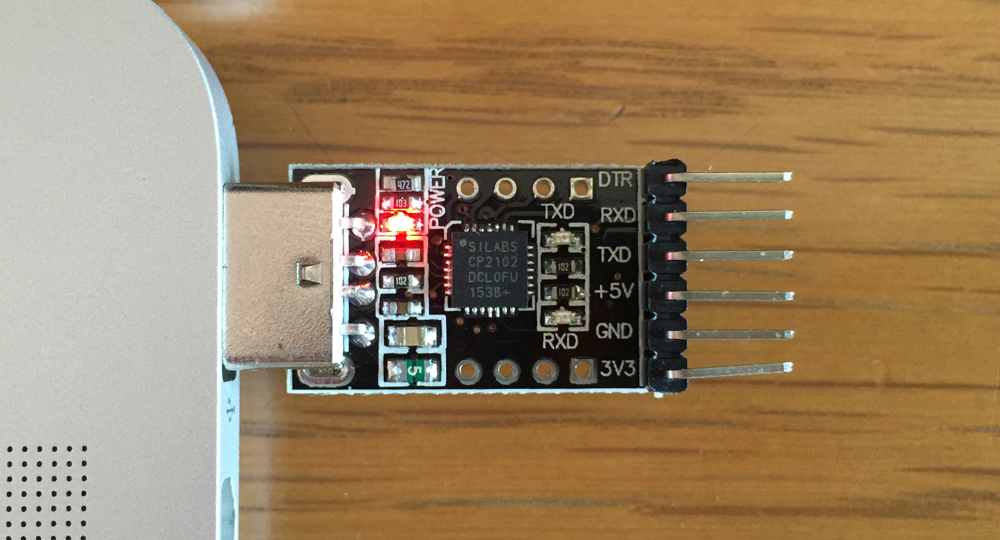

For this class, you will need to install the following:

- The `arm-none-eabi` cross-compile toolchain to build programs for the Raspberry Pi
- The driver for the USB-serial adapter which connects your
    computer to the Pi.
- The python packages need by the `rpi-install.py` script used to communicate with the Pi bootloader.

Follow all the instructions on this page to install all of the above software on your Mac. 

### Install the toolchain
The  `arm-none-eabi` package is a complete cross-compile toolchain. A _cross-compiler_ is a compiler than runs on one system (in this case, x86) and generates machine code for a different system (in this case, ARM). The toolchain includes the C compiler and other essential development tools (assembler, linker, debugger, and utilities). 

#### Install Homebrew

To ease the installation process, we have
built and packaged the toolchain into a Homebrew formula.
[Homebrew](http://brew.sh/) is a popular [package
manager](https://en.wikipedia.org/wiki/Package_manager) for OS X. It is good
practice to install software using a package manager.

If you are already using Homebrew, skip to the next section. Otherwise, follow these steps to install Homebrew:

1.  Install the Xcode command line tools by running the command below. A dialog
    should pop up on your screen. Click "Install" when it appears.

    ```
    $ xcode-select --install
    ```

2.  Type the command below to run the script to install Homebrew. The script will
    guide you through installing Homebrew.

    ```
    $ ruby -e "$(curl -fsSL https://raw.githubusercontent.com/Homebrew/install/master/install)"
    ```

3. ✔️__Check:__ that Homebrew is installed by running the command `brew -v`. It's ok if your Homebrew reports a more recent version number/date than what is shown below.

    ```
    $ brew -v
    Homebrew 1.9.2
    Homebrew/homebrew-core (git revision 9d10; last commit 2019-01-20)
    ```

#### Install the `arm-none-eabi` formula

Use Homebrew to install our custom package containing the cross-compile toolchain.

1.  Run the command below to "tap" into the CS107e Homebrew package.

    ```
    $ brew tap cs107e/cs107e
    ```

2.  Install the `arm-none-eabi` formula from our package.

    ```
    $ brew install arm-none-eabi
    ```

3.  ✔️__Check:__ the compiler is installed by running the following command and confirming the
    output exactly matches what is shown below:

    ```
    $ arm-none-eabi-gcc --version
    arm-none-eabi-gcc (GCC) 4.8.3
    Copyright (C) 2013 Free Software Foundation, Inc.
    This is free software; see the source for copying conditions.  There is NO
    warranty; not even for MERCHANTABILITY or FITNESS FOR A PARTICULAR PURPOSE.
    ```

### Install the CS2012 driver

The CP2012 driver is used by the USB-serial adapter to send information between your computer and the Pi.

1. The driver is available from Silicon Labs. Go to their [CP210x Downloads page](https://www.silabs.com/products/mcu/Pages/USBtoUARTBridgeVCPDrivers.aspx)
and find the version for Macintosh OS (v5). Use the "Download VCP" link to download the zip file `Mac_OSX_VCP_Driver.zip`.  Double-click the zip file to uncompress into the dmg file `SiLabsUSBDriverDisk.dmg`. Open the dmg file to mount the volume named `Silicon Labs VCP Driver Install Disk`.

2. On the mounted volume, find the installer file named
    `Silicon Labs VCP Driver`. Open this file to launch the
    installer and follow its instructions. You will need
    to restart the computer to finish the install.


**NOTE**: Users running the latest MacOS releases (affects both High Sierra and Mojave) may see a message saying "System Extension Blocked" depending on your security settings. If you see this message, you must take additional action to enable the driver. Open `System Preferences` and choose the  `Security & Privacy` option. On the `General` tab, look for the line saying that the developer "Silicon Laboratories Inc" has been blocked from loading and click the `Allow` button to unblock it. After changing the setting, you must restart your computer for it to take effect.
</div>

✔️__Check:__ that the driver is found and loadable by running the following command:

```
$ kextfind -B -s SiLabs -report -b -loadable
CFBundleIdentifier  Loadable
com.silabs.driver.CP210xVCPDriver   yes
```

If you already have your kit, plug the USB-serial adapter
    into a USB port on your laptop now. The LED on the the breakout board should light up and the driver should now be active.

✔️__Check:__ that the driver is active by confirming the existence of the device file:

```
$ ls /dev/tty.SLAB_USBtoUART
/dev/tty.SLAB_USBtoUART
```



### Install python dependencies
The `rpi-install.py` script will be used to send programs from your computer to the Pi. This python script requires some python support packages to be installed. Using the [Miniconda](https://conda.io/miniconda.html) python package manager allows you to make those changes without disrupting your system's python installation.

1.  If your system already has `wget`, skip to next step. Otherwise, use Homebrew to install `wget`.

    ```
    $ wget -V
    -bash: wget: command not found
    $ brew install wget

    $ wget -V
    GNU Wget 1.20.1 built on darwin18.2.0.
    ```

3.  Use the following two commands to download the Miniconda distribution and run its install script: 

    ```
    $ wget https://repo.continuum.io/miniconda/Miniconda3-latest-MacOSX-x86_64.sh
    $ bash Miniconda3-latest-MacOSX-x86_64.sh
    ```

    Follow the prompts to install Miniconda and add Python to your PATH:

    ```
    ...
    Please, press ENTER to continue
    >>> [ENTER]
    ...
    <scroll down>
    ...
    Do you accept the license terms? [yes|no]
    [no] >>> yes
    ...
       - Press ENTER to confirm the location
       - Press CRTL-C to abort the installation
       - Or specify a different location below

    [/Users/yourusername/miniconda3] >>> [ENTER]
    ...
    Do you wish the installer to prepend the Miniconda3 install location
    to PATH in your /Users/yourusername/.bash_profile ? [yes|no]
    [yes] >>> yes
    ```
    
    Finally, restart your Terminal application.

4.  Use `pip` (which was installed by Miniconda) to install these two Python packages:

    ```
    $ pip install pyserial xmodem
    ```

    If `pip install xmodem` complains `OSError: [Errno 1] Operation not
    permitted: '/System/Library/Frameworks/Python.framework/Versions/2.7/doc'`
    or similar, don't worry, the library has still installed correctly.

5. ✔️__Check:__ that `rpi-install.py` runs and reports the correct version (1.0).

    ```
    $ rpi-install.py -h
    usage: rpi-install.py [-h] [-v] [-q] [-t T] [-T T] [-p | -s] [port] file

    This script sends a binary file to the Raspberry Pi bootloader. Version 1.0.
    ```


### Troubleshooting Mac install issues
<a name="troubleshooting"></a>

In the above instructions, we end each task with a ✔️__Check__ operation that confirms your readiness to move to the next step. If you re-do each of the check operations from above, you may be able to identify what part of your install was successful and where it went astray. If you hit a snag, ask on Piazza or come to office hours and we can help you out!


