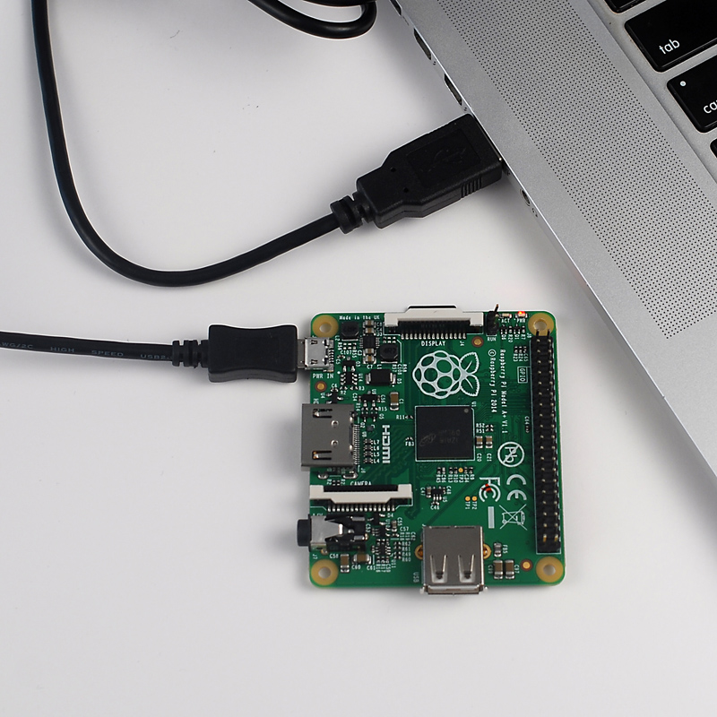

*Written by Pat Hanrahan*

**Warning: This guide applies to the newest A+ and B+ models,
and not the older A and B models**

### Powering using the usb-serial breakout board

The way we will power the Pi in this course 
is to use the usb-serial breakout board.
The header on the breakout board has pins labeled 5V and GND.
On some breakout boards, the 5V pin may be labeled VCC;
if you are uncertain, check the voltage using a multimeter.
Some breakout boards will also have a pin labeled 3.3V.
The Pi will not run properly if you power it from 3.3V.

Power and ground are connected 
to the Raspberry Pi's GPIO pins as shown.

The power LED is lit if the Raspberry Pi is receiving power.

Raspberry Pi A+ does not need much power. 
We can measure how much power the Raspberry Pi requires
by using an inline power meter.

The usb specification says that a usb port should supply 5V,
and up to 500 mA of current.
Our experiment shows that the usb port has a voltage of 4.72V
and is supplying 80 mA of current.
The total power being consumed is 0.37 W.
That is not a lot of power! 

Note, however, that the power used 
may go up if you are using LEDs and other peripherals.

### Powering using a micro-usb cable

Another way to power the Raspberry Pi is with a micro-usb
cable connected to a usb port on a laptop.

Note that there are different types of usb connectors.
The Raspberry Pi uses a micro-usb connector.

You can also directly power it with an AC adapter. 
The same kind that you use to charge your phone.

Note that there is a large USB port
on the bottom of the Raspberry Pi board.
Connecting a power source to the large usb connector 
will *not* power the Pi.

