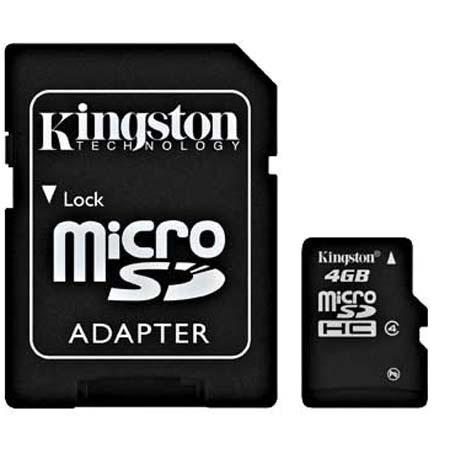
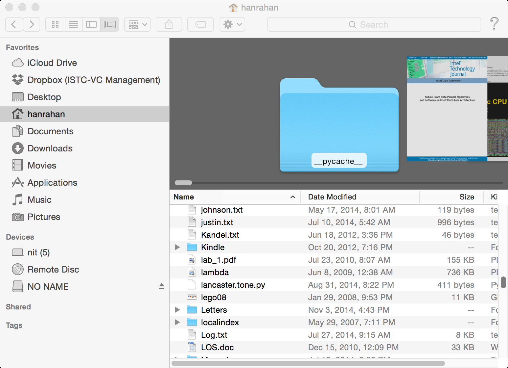

*Written by Pat Hanrahan*

### Using the SD card

Your Raspberry Pi kit contains a Kingston microSDHC card. A secure digital (SD) card
contains non-volatile memory for storage. The HC in SDHC stands for high
capacity.

The Raspberry Pi runs the software on the microSDHC card installed in the card
holder on the bottom of the printed circuit board.

### Mounting the SDHC Card in your laptop

Most laptops contain a SD slot. To copy software to the card, you need to mount it on your laptop. To do this, insert the microSDHC card into the SD card holder, and then insert the holder into your laptop’s SD card slot.

When you insert the SD card it should mount automatically. You should see it
show up in your finder along with other mounted file systems.

Verify that the card is mounted.

    $ ls /Volumes
    Macintosh HD    NO NAME

By default, the volume is named `NO NAME`.

### Download and install firmware

Now, download the Raspberry Pi firmware files from our [courseware
repository](https://github.com/cs107e/cs107e.github.io/tree/master/firmware).

There should be 4 files.

    $ ls firmware
    blink-actled.bin   bootcode.bin     bootloader.bin  start.elf     

`bootcode.bin` is the bootloader for the GPU and `start.elf` is the GPU start up code. Normally, `kernel.img` is
the linux kernel. In this course, we will replace the linux kernel with our
own program to run.

We have included two programs, `blink-actled.bin` and
`bootloader.bin`.  Initially, you should copy `blink-actled.bin`
to `kernel.img`. Thus, when the Pi boots, this program will
blink the on-board activity (ACT) LED. This is a
good way to test whether your Pi is working. If instead, you replace
`kernel.img` with `bootloader.bin`, the Pi will boot and run a boot
loader that can be used to upload programs to the Pi. You should
replace `kernel.img` with `bootloader.bin` after you've tested that
your Pi works correctly with `blink-actled.bin`.

Copy these files onto your SD Card.

### Eject your SD card

On the Mac, go to the finder and click on the Eject icon next to the file name.

### Troubleshooting

1.  The SD cards we are using are formatted with a FAT32 filesystem. If this
    file system is corrupted, you will need to reformat the file system.
    Consult the internet for how to do this.
2.  The Raspberry Pi can become wedged if `kernel.img` has bugs or
    becomes corrupted. You can always recover to a known state by copying the
    original firmware to the SD card.

