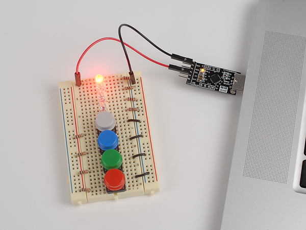
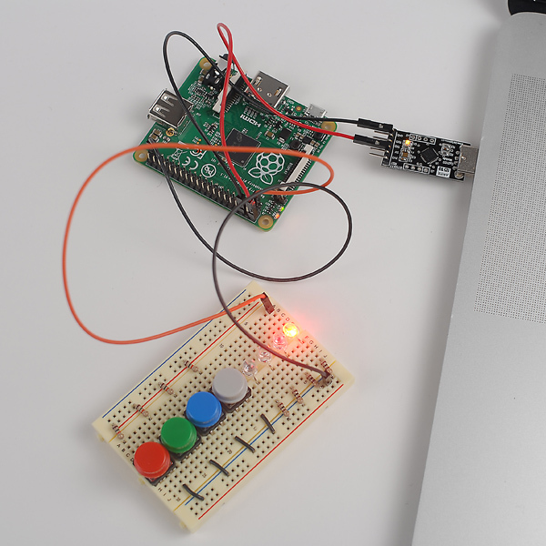


Task list to copy/paste when creating PR for this lab:

__Before releasing lab1:__
- [ ] Update firmware to latest from Broadcam
- [ ] Review writeup/code/checkin questions (instructor)
- [ ] Walk through (SL)
- [ ] Followup on issues from previous quarter postmortem (issue #224)

__To prep for lab1:__
- [ ] Review tips recorded in private/staff_notes.md and private/answers.md
- [ ] Confirm installation instructions are up-to-date
- [ ] Piazza announcement for students to bring adapter if their laptop doesn't have USB-A port A (e.g. recent Macs)
- [ ] Confirm lab cabinet has SD card readers for various computers
- [ ] Prepare some SD cards with bootloader in case students can't prep their own
- [ ] Bring blank labels and pens -- students make name tag and decorate kit box
- [ ] Create Google sheet with class roster to record lab attendance



*Lab written by Pat Hanrahan, updated by Philip Levis*

## Goals

During this lab you will:

- Learn how to cross-develop on your computer for the Raspberry Pi's ARM processor.
- Learn how to use a breadboard with LEDs and buttons.
- Learn how to download and run bare metal programs on the Raspberry Pi.
- Revisit the assembly code for the blink program and play with it a little.

## How does lab work?

When you arrive at lab, say hello and introduce yourself to your
labmates.  Together you will tackle the exercises below.  Everyone is
encouraged to collaborate with other labmates to share insights and
offer each other useful tips. You pair up and use private messages to
exchange notes, or just talk to one another. The instructor and TA
will circulate to offer advice and answers so as to keep everyone
progressing smoothly.

Lab is a time to experiment and explore. After we introduce topics in
readings/lectures, you'll do guided exercises in lab to further your
understanding of the material, get hand-on practice with the tools in
a supported environment, and ready yourself to succeed at this week's
assignment.

Bare metal programming requires precision. A trivial typo or slight
misunderstanding can stop your progress cold. Working with the support
of your classmates and staff can make the difference between quickly
resolving that sticking point versus hours of frustration wrestling on
your own in the dark.

Each lab has a set of check-in questions that we want you to answer as
you go. Touch base with the staff on your answers to confirm your
understanding and resolve any confusion. The check-in questions are
intentionally simple and your responses are not graded; we use them as
a gauge of how you're doing with the material so that we know better
how to help guide you.

To get the most out of lab, don't set your goal at merely finishing
the absolute minimum required in the shortest possible time.  If you
already have a good handle on the material, use the lab period to dive
into further nooks and crannies or help out those peers who could
benefit from your experience.  You should also get to know the
instructors.  They are masters of the craft, and you will learn a lot
by talking to them and asking them questions.  Any topic is fair game.

The combination of hands-on experimentation, give and take with your
peers, and the expert guidance of our staff is what makes lab time
truly special.  Your sincere participation can really accelerate your
learning!

## Prelab preparation

To prepare, please do the following before coming to lab:

1. Use the final checklist at the end of the [installation guide](/guides/install) to confirm your laptop is ready for action.
1. You will need an open USB-A port on your laptop to connect to the Pi. If your laptop requires a hub or adapter, be sure to bring it with you to lab.
1. Review our guide to the [Unix command line](/guides/unix/).

## Lab exercises

When you start lab, pull up the [check-in questions](checkin) in your browser so you can refer to them as you go.

### 0. Clone the lab repo
Before starting lab, do a `git pull` in your copy of the `cs107e.github.io` repository to ensure your courseware files are up to date.

```
$ cd ~/cs107e_home/cs107e.github.io
$ git pull
```

The lab materials are distributed in a separate git
repository. We recommend that you store your copy of the lab under your `cs107e_home`.  Change to that directory now and clone lab1:

    $ cd ~/cs107e_home
    $ git clone https://github.com/cs107e/lab1

<a name="step1"></a>

### 1. Assemble blink

To make sure your software tools are installed correctly, assemble the
`blink` program from assembly code into a binary program.  Change to
the lab subdirectory that contains the `blink` example and build the
`blink` program using these commands:

    $ cd lab1/code/blink
    $ arm-none-eabi-as blink.s -o blink.o
    $ arm-none-eabi-objcopy blink.o -O binary blink.bin


The middle step compiles the assembly in `blink.s` into an "object
file", a particular file format for binary code. An object file has a
lot of information in it that we don't need -- we just want the
program.  The last step, with `arm-none-eabi-objcopy`, turns this
object file into a raw binary that has just the program named
`blink.bin`.  If above commands execute without error, you are good to
go!

### 2. Inventory your kit

You will receive your CS107e Raspberry Pi kit when you arrive at lab.
Take a moment to identify all your parts and compare to the [kit inventory](/guides/bom/) to ensure your kit is complete.

(Recall that a [resistor](https://learn.sparkfun.com/tutorials/resistors)'s band colors tell its resistance: in this case,
10K or 1K ohms. Check out this [chart and calculator](http://www.digikey.com/en/resources/conversion-calculators/conversion-calculator-resistor-color-code-4-band).)

### 3. Power your breadboard

Next you will wire up a simple circuit on your breadboard to light an
LED. For a quick introduction or refresher on using a breadboard, read
this 2-minute [breadboard
tutorial](https://www.losant.com/blog/how-to-use-a-breadboard).  Which
holes are connected to which other holes?  How are the power and
ground rails connected?

Use your needlenose pliers to bend your wires. Don't snip your
resistors short -- you will need them in future assignments, at which
time you might snip them to fit perfectly when you have a much
longer-term setup.

Note that an LED is directional.  The longer lead is the anode and the
shorter lead is the cathode.  The voltage from anode to the cathode
should be positive.  If the polarity of voltages are switched, the LED
will not light up.  A LED also needs a 1K current limiting resistor
otherwise it can literally [blow up in a fiery, smoky
extravaganza](https://www.youtube.com/watch?v=WLctUO1DGtw)!

In the photo below of our circuit, we connected the cathode of the LED
to the 1K resistor and then connected the other end of the resistor to
the blue ground rail.  Note how the LED crosses over the middle of the
breadboard.  To light up the LED, we need to apply power to the anode
and complete the circuit by connecting the cathode to GND.



To check that the LED is working, you need to power the circuit.  We
will draw power from your laptop using a *USB to Serial Adapter*
(hereafter referred to as just "USB-serial").  This is the small black
breakout board with a USB-A connector on one side and a 6-pin header
on the other side.  The USB connector is inserted into a USB-A port on
your laptop. If your laptop does not have a USB-A port, you will need
an adapter.

When wiring, people experienced in electronics use colored wires to
indicate what type of signal is being carried by that wire.  This
makes debugging wires and visualizing what's going on much easier.
Generally, we will use the following conventions.

-   Black (GND)
-   Red (5V)
-   Orange (3.3V)
-   Blue (host output)
-   Green (host input)

In this next step, we choose red and black jumpers because we are
routing power and ground.

To provide power to your breadboard, do the following steps in
**precisely this order**.

1. Pick out two female-male jumper cables, one red and one black.

2. Connect the female ends of the jumpers to the header pins on the
USB-serial breakout board. Connect the black jumper to the header
labeled GND and the red jumper to the header labeled VCC.

3. Connect the male ends of the jumpers to the breadboard. Plug the
male end of the black jumper into the blue ground rail. Plug the male
end of the red jumper to the LED anode (longer leg).  Remember to
include the 1k resistor in the circuit between the LED cathode
(shorter leg) and GND.

4. After double-checking that your circuit wiring is correct, you're
ready to apply power. Plug the USB connector of the USB-serial into
your laptop.  A small led on the breakout board lights up to indicate
that it has power.  The LED on the breadboard connected to the red
jumper should also be lit.


**Danger:** Don't have the USB-serial plugged in to your laptop
while you are fiddling with the wiring.
The breakout board provides power which means all the wires are live.
This can cause a short circuit, which could fry your Pi or make your
laptop disable the USB port.
</div>


While the LED is lit, make the following measurements with the multimeter.

-   Measure and record the voltage across the resistor.
-   Measure and record the voltage across the LED.

Calculate the current flowing through the LED. You should now be able to answer the first [check in question](checkin).


If we had our standard physical lab, while the LED is lit, we'd ask
you to make the following measurements with a multimeter.

-   Measure and record the voltage across the resistor.
-   Measure and record the voltage across the LED.

Because you don't have a multimeter, instead, ask the staff member
what these values are if you were to measure them. Using these
provided values, calculate the current flowing through the LED. You
should now be able to answer the first [check in question](checkin).


### 4. Power via the Pi

Identify the 40-pin GPIO header on the Raspberry Pi A+ board and orient it to match the [pinout diagram](/guides/images/pinout.pdf) (this pinout diagram also available as a postcard in your kit and a poster on lab wall).  Read the pin labels on the diagram and identify two 5V power pins and two GND pins; you'll use these pins in this step.

Re-wire your circuit to run power/ground from the USB-serial first to the Raspberry Pi and from there to the breadboard. Follow these steps:

1. Unplug the USB-serial from your laptop so that no power is flowing. Disconnect the jumpers between the USB-serial and breadboard.
1. Connect power and ground from the USB-serial to the Raspberry Pi using two female-female jumpers. Use a black jumper to connect the GND of the USB-serial to a GND GPIO on the Pi. Similarly connect a red jumper for the 5V power.
1. Connect power and ground from the Raspberry Pi to the breadboard using the two female-male jumpers.  The black jumper connects a GND GPIO to the blue ground rail on the breadboard. The red jumper connects a 5V GPIO to the LED anode.

Power is now flowing from the USB-serial to the Raspberry Pi and then to the breadboard. Please note that the pin layout on the USB-serial you have may
be different than the one in the picture: pay attention to what the pins
are labeled, not their physical location.



After double-checking your wiring, apply power by plugging the USB-serial in your laptop. All three LEDs should light: the one on the USB-serial, the red power LED on the Raspberry Pi, and the  
the LED on the breadboard. Your circuit is complete!

Replace your 1K resistor with a 10K resistor. How does the brightness of
the LED change? (You might want to coordinate with another group so
you can compare them side by side.) Why does it change?

### 5. Prepare SD card

Your Raspberry Pi kit contains a microSDHC card (shown in the photo below on left alongside its adapter jacket). The Pi has a slot that accepts a micro-SD card on the underside of the circuit board (shown in the photo below right). When the Pi boots, it accesses the card to read the file named `kernel.img` and executes that program. You can change the program run by the Pi by writing a different `kernel.img` to the card. 


To copy files to the SD card, mount it on your laptop.  If your laptop does not have a built-in SD card reader, you will need an external reader (we have a few to loan in lab).  An adapter "jacket" allows a micro-SD to be used in a full-size SD card reader. First insert the micro-SD card into its adapter, and then insert the adapter into the SD card slot on your laptop.


When you insert the SD card it should mount automatically and the volume will show up in the Finder/File Explorer. 
By default, the SD card volume is named `NO NAME`.
You can change the name if you wish.

On a Mac, another way to confirm that the card is mounted is to list 
the mounted Volumes in your shell:

    $ ls /Volumes
    Macintosh HD    NO NAME

On Windows, the SD card will show up in your File Explorer, but the WSL shell will not have access to it. Use File Explorer to copy/rename files on the SD card.


**Note:**  If your laptop doesn't have an SD card slot or the card slot isn't cooperating, ask your partner to use their computer or borrow a USB card reader from us. Configuring your SD card is a one-time task. You will not need to modify it again and in future will use the bootloader, so do whatever is most expedient to prep your SD card and move on.
</div>

The Raspberry Pi firmware files are stored in the firmware subdirectory of the courseware repository. Change to that directory and confirm you have these 4 files:

    $ cd ~/cs107e_home/cs107e.github.io/firmware
    $ ls
    blink-actled.bin   bootloader.bin  
    bootcode.bin       start.elf

The `bootcode.bin` and `start.elf` files are needed to start up the Raspberry Pi. The two additional files
`blink-actled.bin` and `bootloader.bin` are programs.

The SD card needs an additional file named `kernel.img`. 
Normally, `kernel.img` is the operating system kernel you want to run
on the Pi, like Linux or Windows. But notice that we don't give you a `kernel.img`! In this course, we will write our own program to take the place of the kernel, and put our program under the name `kernel.img`.

We choose to first run the `blink-actled.bin`. This program blinks the green activity (ACT) LED near the corner of the Raspberry Pi board.

Follow these steps in order:

1. Copy the four files from the firmware folder onto the SD card.
    - On Mac, you can use either do this in the shell or using Finder. 

        `cp ~/cs107e_home/cs107e.github.io/firmware/* /Volumes/NO\ NAME`
    - On Windows, you can access the SD card only in in File Explorer, not the WSL shell. After changing to the firmware directory in your WSL shell, use the command `explorer.exe .` to show the current directory contents in File Explorer and you can copy those files to the SD card.

2. On the SD card, make a copy of `blink-actled.bin` named  `kernel.img`.

3. Confirm that your SD card has the following files:

        $ ls
        blink-actled.bin    bootloader.bin        start.elf
        bootcode.bin        kernel.img

    The three critical files for the Pi boot sequence are:

    `bootcode.bin` to boot the GPU

    `start.elf` to start the CPU

    `kernel.img` the program for Pi to execute

    Any other files on the card are ignored by the Pi when booting.

4. Eject the SD card. If Terminal prevents you from ejecting, type in `cd ..` to move to the parent folder and try ejecting again.

5. Insert the micro-SD card into the slot on the bottom side of the Raspberry Pi board. 

6. Power the Pi.  The green ACT LED on the Pi's board
should start blinking. Ta-da! 🎉

Keep this procedure for reconfiguring a fresh SD card in the back of your mind.
If you ever think your Pi is not working because of a hardware problem,
repeat these steps.
If the ACT LED doesn't blink after booting, 
then something is wrong and you may need to replace the Pi with a working one. 

### 6. Blink breadboard LED

Next, we are going to use the `blink` program (which pulses GPIO 20) in place of `blink-actled` (which pulses the on-board ACT LED at GPIO 47). Start by re-wiring your circuit. Use the Pi [pinout diagram](/guides/images/pinout.pdf) to identify GPIO 20 and connect it to the anode of the LED on the breadboard.


Next, update the files on your SD card. Carefully eject the micro-SD from your Pi, and mount it again on your laptop.


**Take care!** To eject the micro-SD from the Pi's card slot, gently push the card in and allow it to spring back out. If you try to pull out the card by force, you can break the mechanism and potentially destroy your Pi.
</div>

Copy your `blink.bin` file (the one you assembled in [step 1 of this lab](#step1))
to your SD card and name it `kernel.img`, replacing the file that was previously there.

Eject the SD card and insert it into the Raspberry Pi.

When you boot your Pi, it should run the blink program which blinks the LED on your breadboard.

Hoorah, hoorah!🔥

### 7. A better way: bootloader

Each time you change your code, you could repeat this process.
You would
power down your Pi, eject the SD card, 
insert the SD card into your laptop,
copy the new version of your code to `kernel.img`,
unmount and eject the SD card from your laptop,
insert it into the Pi,
and then power it up.
This quickly becomes tedious.
Even worse, the SD connectors are only designed to withstand
around 1000 insertions and deletions, after which they start to fail.

Instead, you can set up a serial connection between your laptop and the Pi and use a __bootloader__ to transfer the program. The bootloader runs on your Pi
and listens on the serial connection. On your laptop, you run a script to send the program over the serial connection to the waiting 
bootloader. The bootloader receives the program and writes it to the
memory of the Pi, a process called "loading" the program. After the
program is loaded, the bootloader jumps to the start address of the program,
and the program begins to run.

To stop that program and start another, reset the Pi and use the bootloader again.  This is much more convenient way to run your newly compiled program than all that shuffling of SD cards. You will learn to love the bootloader!

First install the bootloader onto your SD card:

1. Mount the SD card on your laptop. Make a copy of
   `bootloader.bin` and name it `kernel.img`, replacing the program
   you had there before.

2. Eject the SD card and insert it into the Raspberry Pi. Now whenever you reset the
Pi with that micro-SD card installed, the bootloader will run.

To use the bootloader, you must set up the communication channel between your computer and the Pi.  The USB-serial that you are using to power your Pi also contains pins that can be used as a serial communication line.

The 6-pin header at the end of the USB-serial breakout board has two pins labeled for transmitting (TX) and receiving (RX).
The Pi also has a TX and RX pin (GPIO pins 14 and 15, respectively). Use the Raspberry Pi [pinout diagram](/guides/images/pinout.pdf) to find these pins on the GPIO header.

Pick out two more female-female jumpers, one blue and one green. Use the blue jumper to connect the TX on the USB-serial to the RX on the Pi, and the green jumper to connect RX on the USB-serial to the TX on the Pi. As always, first unplug the USB-serial from your laptop before fiddling with your wiring.


**Note:** The connections run from one device's TX to the other's RX, and vice versa. Do **not** connect TX to TX and RX to RX!
</div>
 Note that the pins on your USB-serial
may be in different positions or have different label names. Don't just follow the picture blindly!


In the above photo, the green wire connects
the RX header pin on the USB-serial
to the Pi's TX pin (GPIO 14).
The blue wire connects the TX header pin on the USB-serial
to the Pi's RX pin (GPIO 15).

Plug in your USB-serial to reset your Pi. The bootloader should run on reset. When the bootloader is running, it signals that it is waiting to receive a program by repeatedly giving two short flashes of the green ACT LED on the Pi board. This "da-dum" is the heartbeat that tells you the bootloader is ready and listening. Look at your Pi now and observe this rhythm. Breathe in sequence with it for a moment to celebrate having achieved bootloader readiness.

Our Python script `rpi-install.py` runs on your laptop to send a program to the bootloader. Verify you have the proper version (1.1) from the following command:

    $ rpi-install.py -h
    usage: rpi-install.py [-h] [-v] [-q] [-t T] [-p | -s] [port] file
    
    This script sends a binary file to the Raspberry Pi bootloader. Version 1.1
    ...

Let's try bootloading a program. On your laptop, change back to the `lab1/code/blink/`
directory where you assembled `blink.bin` in step 1.

Watch the ACT LED on your Pi to confirm you see the bootloader heartbeat. To load and run `blink.bin`, simply type:

    $ rpi-install.py blink.bin
    Found serial port: /dev/cu.SLAB_USBtoUART
    Sending `blink.bin` (72 bytes): .
    Successfully sent!

While receiving a program, the bootloader turns on the ACT LED and holds it steady until transmission is complete. The bootloader then turns off the ACT LED and transfers execution to the received program. The `blink.bin` program should now blink the LED on your breadboard.

If you change your program and wish to reload it onto the Pi, you must first 
reset the Pi. What happens if you try to `rpi-install.py` a second time
after the bootloader has already loaded a program? Why does that happen?

One way to reset the Pi is to briefly cut power by unplugging the USB-serial
from your laptop,
and then plug it in again.
The Pi will restart into bootloader, ready to receive a new program. 

Reset your Pi now and re-load the blink program. Hoorah, hoorah, hoorah!! 👏

### 8. Study the blink program

    .equ DELAY, 0x3F0000

    // configure GPIO 20 for output
    ldr r0, FSEL2
    mov r1, #1
    str r1, [r0]

    mov r1, #(1<<20)

    loop: 

    // set GPIO 20 high
    ldr r0, SET0
    str r1, [r0] 

    // delay
    mov r2, #DELAY
    wait1:
        subs r2, #1
        bne wait1

    // set GPIO 20 low
    ldr r0, CLR0
    str r1, [r0] 

    // delay
    mov r2, #DELAY
    wait2:
        subs r2, #1
        bne wait2

    b loop

    FSEL0: .word 0x20200000
    FSEL1: .word 0x20200004
    FSEL2: .word 0x20200008
    SET0:  .word 0x2020001C
    SET1:  .word 0x20200020
    CLR0:  .word 0x20200028
    CLR1:  .word 0x2020002C

If there is anything you don't understand about this program,
ask questions of your partner and others.

Do the following exercises:

-   Look at the bytes in the `blink.bin` you assembled earlier by
    running `hexdump blink.bin` at a shell in the `blink` folder.

    (`hexdump` is a command that prints the bytes in a file in a
    human-readable form. You can run `man hexdump` to learn more. What are
    the numbers at the beginning of each line `hexdump` outputs?)

    Find the first occurrence of `e3`. What is the byte offset of `e3`
    relative to the start of the file?

-   Change the program such that the blink rate slows down by a factor
of 2.

    Modifying the program is a multi-step process. First
    you edit `blink.s` in a text editor, then use the
    commands in step 1 again to build `blink.bin` from it, and then
   unplug and replug to reset your Pi and use `rpi-install.py` to send your new `blink.bin` to run on the Pi. Make sure you understand why
    these steps are all necessary.
    
    Now perform experiments to determine how many instructions per second the
    Raspberry Pi executes.

<A name="button"></A>
### 9. Add a button (optional)

This last part is optional.
You do not need to use buttons for Assignment 1,
but you will for Assignment 2.
There are no check-in questions for this exercise.

Measure the resistance across the pushbutton legs using a 
multimeter and figure out which pins are always connected 
and which become connected when the button is pushed.
Use these observations to determine how to position the button correctly on the breadboard. 
The pushbutton needs a 10K pull-up resistor to the red power rail.
Verify that the resistor is 10K Ohms using the multimeter.
Measure the voltage at the pin, and measure it again when you push the button.

Here is a program that reads a button and turns on or off the LED depending on
whether the button is pressed.

    // configure GPIO 10 for input
    ldr r0, FSEL1
    mov r1, #0
    str r1, [r0]

    // configure GPIO 20 for output
    ldr r0, FSEL2
    mov r1, #1
    str r1, [r0]

    // bit 10
    mov r2, #(1<<10)

    // bit 20
    mov r3, #(1<<20)

    loop: 
        // read GPIO 10 
        ldr r0, LEV0
        ldr r1, [r0] 
        tst r1, r2
        beq on // when the button is pressed (goes LOW), turn on LED
        
        // set GPIO 20 low
        off:
            ldr r0, CLR0
            str r3, [r0]
            b loop

        // set GPIO 20 high
        on:
            ldr r0, SET0
            str r3, [r0]
            b loop

    FSEL0: .word 0x20200000
    FSEL1: .word 0x20200004
    FSEL2: .word 0x20200008
    SET0:  .word 0x2020001C
    SET1:  .word 0x20200020
    CLR0:  .word 0x20200028
    CLR1:  .word 0x2020002C
    LEV0:  .word 0x20200034
    LEV1:  .word 0x20200038


To run this program, connect the button to GPIO 10.
Make sure the jumper is
connected to the correct pin on the Raspberry Pi.
Also, make sure the pull-up resistor is properly installed on the breadboard.

Challenge yourself to understand
what each line of code accomplishes and why it works as expected.
Feel free to add your own code annotations if that helps.

Here are a few questions to test your knowledge.  To confirm your answers, you
will have to read the [Broadcom peripheral
manual](/readings/BCM2835-ARM-Peripherals.pdf),
or ask someone who knows the answer.

-   What does the peripheral register with the address 0x20200034 return?

-   Why does the input value go to 0 (LOW) when the button is pressed?

-   How does the Pi know which branch to jump to when it reaches `beq on`?


## Check in with TA

Each pair of students should periodically touch base with the TA as you answer the [check-in questions](checkin). The TA will
verify your understanding and can help with any unresolved issues.

Remember that the goal of the lab is not to answer exactly and only these questions -- it's to work through the material. The questions are an opportunity to self-test your understanding and confirm with us.

It's okay if you don't completely finish all of the exercises during
lab; your sincere participation for the full lab period is sufficient
for credit.  However, if you don't finish, we highly encourage you to
work those parts to solidify your knowledge of this material before
moving on. In particular, having successfully completed this lab is a necessary step before tackling this week's assignment.

