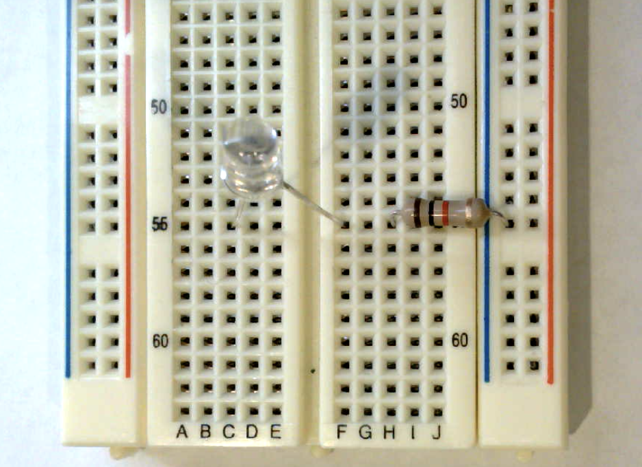
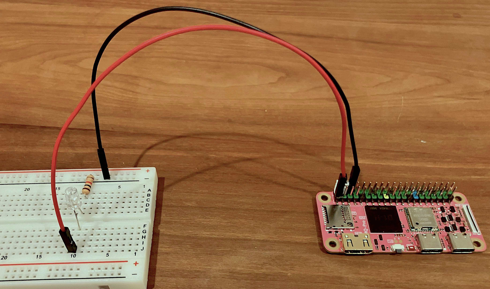
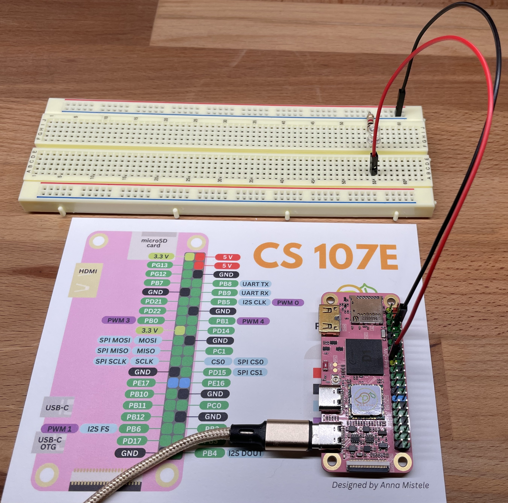
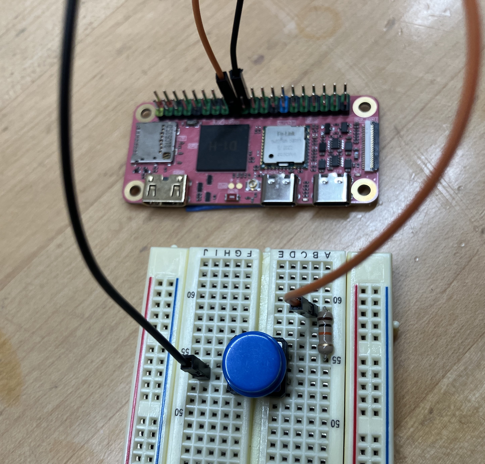


Task list to copy/paste when creating PR for this lab:

__Before releasing lab1:__
- [ ] Review writeup/code/checkin questions (instructor)
- [ ] Walk through (SL)
- [ ] Followup on issues from previous quarter postmortem (issue #21)

__To prep for lab1:__
- [ ] Review tips recorded in private/staff_notes.md and private/answers.md
- [ ] Confirm multimeters have fresh batteries
- [ ] Build kits
- [ ] Bring blank labels and pens -- students make name tag and decorate kit box



## Goals

During this lab you will:

- Explore simple breadboard circuits using LEDs, resistors, and buttons.
- Practice with building and running programs on the Pi.
    - Build programs using the cross-development tools you installed on your computer
    - Download and run programs on the Pi using the `xfel` bootloader
- Explore the assembly code for the blink and button programs.

## Prelab preparation

To prepare, please do the following before coming to lab:

1. Be up to date on recent lectures: __RISC-V architecture and assembly__
1. Reading to do ahead of lab:
    - Read this SparkFun tutorial on [using a breadboard](https://learn.sparkfun.com/tutorials/how-to-use-a-breadboard). Pay special attention to the section labeled "Anatomy of a Breadboard" to learn about the internal connections.
    - Please review our course guides on:
        -  [powering the Pi](/guides/power)
        -  [using the xfel bootloader](/guides/xfel) to send programs to the Pi
        -  [one page of RISC-V](/guides/riscv-onepage) assembly
1. Organize supplies to bring with you:
    - Bring your __laptop__, ideally with full charge, cable/charger as needed.
    - If you have access to a __multimeter__, bring it along.
1. When you arrive at lab, check that your Stanford ID card is authorized. When you place your card on the reader, it should blink green and unlock the door. If your card does not work, followup with one of the staff.

## Lab exercises

### 0. Pull lab starter code

Before starting a new lab or assignment, cd to your local `mycode` repo and pull in the lab starter code:

```console
$ cd ~/cs107e_home/mycode
$ git checkout dev
$ git pull code-mirror lab1-starter
```

Your repo should now be on the `dev` branch and has a subfolder named `lab1` containing the lab starter files.

### 1. Inventory your kit

You will receive your parts kit when you arrive at lab. Open it up and check it out!
Unwrap and discard the packaging. Identify what each component is and compare to the [kit inventory](/guides/bom/) to ensure your kit is complete. If you are missing any parts, ask us for replacements.

The components are packed in a handy plastic box for convenient carrying. Write your name on the white label on the box top to help you and and your box stay united. Plan to bring your entire parts kit to every lab.

### 2. Power up Pi and use `xfel` to converse

Start with our course guides to acquaint with your new BFF.

- Read through the guide on [powering the Pi](/guides/power) and:
    - follow the instructions to connect your Pi to power
- Open the guide to the [xfel bootloader](/guides/xfel) and follow along with steps to:
    - peek and poke to control the blue act LED
    - use `xfel` commands to bootload a program
    - use `mango-run` as a convenience for bootloading
If you run into any snags or have questions, be sure to ask for help!

Change to the directory `$CS107E/bin` directory and use the following commands to examine the size and data in the `blink-actled.bin` program file:
```console
$ cd $CS107E/bin
$ ls -l blink-actled.bin
$ hexdump -C blink-actled.bin
```
How many bytes of data are in the program file? How many instructions does this correspond to? What does this data represent?

Reset your Pi by briefly flipping the switch to temporarily cut power. Once it has reset, use `xfel ddr d1` to initialize the memory controller and `xfel hexdump` to display the contents of the 200 bytes of memory at address `0x40000000`. This is the initial contents of memory after the Mango Pi has reset.

```console
$ xfel ddr d1
$ xfel hexdump 0x40000000 200
```
Reset your Pi again and repeat the same commands above. Compare the memory contents from `xfel hexdump` in each case. Are the initial contents of memory the same after every reset or does it vary?  Does the memory appear to be filled with zeros, random/uninitialized garbage, or is there some pattern to the values?

 Use `xfel write` to copy the `blink-actled.bin` program to the Pi's memory at address `0x40000000`. Use `xfel hexdump` again to see the updated contents of memory.

```console
$ xfel write 0x40000000 blink-actled.bin
$ xfel hexdump 0x40000000 200
```
How have the contents of the memory on the Pi now changed?  What is the data and how does it relate to the contents of the `blink-actled.bin` file?

Use `xfel` to execute the loaded program.
```console
$ xfel exec 0x40000000
```
You should be rewarded with a blinking blue act LED on the Mango Pi board. You have just bootloaded your first program! To stop execution, reset your Pi.

#### Using mango-run
Every time you run a new program, you would repeat these same `xfel` commands (`ddr`, `write`, `exec`) so we packaged them into a simple script `mango-run` to give you one-stop shopping. Try it out now:

```console
$ mango-run                     # no argument, report if Mango Pi connected
$ mango-run blink-actled.bin    # bootloads program given as argument
```
 What happens if you try to `mango-run` a second time
after the bootloader has already loaded a program? Why does that happen?

To halt any currently executed program and return to FEL, simply reset the Pi. On reset, it will always will restart into FEL, ready to receive a new program.

### 3. Make LED circuit on breadboard

Grab the breadboard from your parts kit. You are going to use it to wire up a simple circuit. First, be sure you understand how the breadboard is internally constructed. Which holes are connected to which other holes?  How are the power and ground rails connected? Review the section  "Anatomy of a Breadboard" in the SparkFun [tutorial on breadboard](https://learn.sparkfun.com/tutorials/how-to-use-a-breadboard#anatomy-of-a-breadboard) from the pre-lab.

Test a few points on the breadboard to confirm the internal connections. Get out your multimeter if you brought one or borrow one of the shared lab multimeters. Grab two __male-male__ jumpers (any colors) from the bin in lab. Choose two neighboring holes along one of the power rails and plug one end of each jumper into the holes. Confirm these holes are connected by applying the multimeter leads to the free ends of the jumpers and testing for continuity. Now move the jumpers around to different positions on the breadboard (for example, two holes within same row or same column or one hole in each power or ground rail) as you continue testing for continuity. Sketch out a map of which holes are connected and which are not.

Take a close look at the power and ground rails on the long edges. There is a break in the marking at the midpoint. Testing with a multimeter will confirm that this is a discontinuity in the rail. Keep this is mind when wiring connections to the rails. The breadboard we used in previous quarters did not have that break, thus some of the photos/circuits may look a little different than yours.

You are going to wire up a simple circuit to light an
LED. You'll need an LED and a 1K resistor from your kit. A resistor's value is indicated by the sequence of colored bands. (See this Sparkfun [tutorial on resistors](https://learn.sparkfun.com/tutorials/resistors#decoding-resistor-markings) for help on decoding the bands and bookmark this [color code calculator](http://www.digikey.com/en/resources/conversion-calculators/conversion-calculator-resistor-color-code-4-band).) What are the band colors for 1K?  Find a 1K resistor in your kit and use the multimeter to measure the resistance to confirm the value.

Make a circuit on your breadboard for the LED. An LED has a directionality -- the longer lead is the anode and the shorter lead is the cathode.  The voltage from anode to the cathode
should be positive.  If the polarity of voltages are switched, the LED
will not light up.  The LED also needs a current-limiting resistor
otherwise it can literally [blow up in a fiery, smoky
extravaganza](https://www.youtube.com/watch?v=WLctUO1DGtw)! A resistor has no directionality and it can be placed ahead or behind the LED in the circuit.

In the photo below, the cathode of the LED connects to the resistor which connects to the
the blue ground rail. The LED itself crosses over the middle of the breadboard.  (click photo to enlarge)

{: .zoom}

We are just playing with this circuit in lab, so we won't worry about making things tidy and secure. When installing a more permanent circuit such as for assignment 1, you can use pliers to make a clean bend in the legs and snip the ends with a cutter so that each component sits neatly on the breadboard.

To light the LED, you need to apply power to the anode
and complete the circuit by connecting the cathode to ground. The power and ground will come from the header pins on your Mango Pi.

Follow these steps:

1. First, disconnect or switch off your Pi.
    >__Danger__ Always take care to cut power to the Pi
    before you fiddle with the wiring.
    If you leave it plugged in, power is flowing and all wires are live, which makes for a dicey situation. An accidental crossed wire can a short circuit, which could fry your Pi or make your
    laptop disable the USB port.
    {: .callout-danger-invert}

1. Pick out two __female-male__ jumpers from your kit, one red and one black. You'll use the red for power and black for ground. Of course, electrons don't care about colors, but adopting good conventions will helps us humans more easily trace and debug our circuits.

1. Your kit includes a printed [pinout refcard](/guides/refcard/) that you'll want to keep handy, grab it now. We also have a command-line version for that retro ascii art feel. Try it out!
    ```console
    $ pinout.py
    ```
   Orient your Pi so that the 40-pin header is in a vertical column on the right edge to match the pinout diagram.  Identify a 5V power pin and a GND pin on the header of the Mango Pi. Connect the female ends of the jumpers to the Mango Pi:  black to ground and red to power.

1. Plug the male ends of the jumpers into the breadboard: black jumper to the blue ground rail and red jumper to the anode of the LED. (click photo to enlarge)

    {: .zoom}

1. After double-checking that your circuit wiring is correct, you're
ready to apply power. Power up the Pi and the LED on the breadboard should light.


While the LED is lit, make the following measurements with the multimeter.

-   Measure and record the voltage across the resistor
-   Measure and record the voltage across the LED

Apply Ohm's law to these measurements to calculate the current flowing through the LED.

If you substitute a 10K resistor in place of the 1K, how will this change the rate of current flow?   How does it change if you connect to a 3.3V power pin instead of 5V?

What effect do these changes have on the brightness of the LED? Do some comparisons with your tablemates. Have one of you swap and compare the brightness of the changed circuit to the original and see the effect with your own eyes.  (Be sure power is disconnected while fiddling with the wiring!)

You are ready to answer the first check-in question. [^1]

### 4. Execute blink program
You want to run `blink` program from lecture which blinks a LED connected to gpio `PB0`. Re-configure your breadboard circuit by connecting `PB0` to the anode of the LED. Use the pinout to identify which header pin is `PB0`.

{: .zoom}

The `blink` subfolder of `lab1` contains the code for the blink program shown in lecture. Change to that folder and build the `blink` program using these commands:
<a name="build"></a>
```console
$ cd lab1/blink
$ riscv64-unknown-elf-as blink.s -o blink.o
$ riscv64-unknown-elf-objcopy blink.o -O binary blink.bin
```
The `riscv64-unknown-elf-as` command assembles the RISC-V instructions in `blink.s` into an "object
file". The assembler takes in assembly instructions (text) and translates to machine-encoded instructions (binary). In addition to the encoded instructions, the object file includes some extra data we don't need -- we just want the
program.  The command `riscv64-unknown-elf-objcopy` extracts just the raw binary program of instructions into a file
`blink.bin`.

Use the `mango-run` command to send the program to the bootloader:

```console
$ mango-run blink.bin
xfel ddr d1
Initial ddr controller succeeded
xfel write 0x40000000 blink.bin
100% [================================================] 36.000 B, 21.542 KB/s
xfel exec 0x40000000
```

Running the `blink.bin` program on the Pi should pulse gpio `PB0` which is connected to the LED on your breadboard.

### 5. Study blink program (RISC-V assembly)

Below is the blink program that from lecture. This code is available in the file `lab1/blink/blink.s` and also reproduced below.

```
    lui     a0,0x2000       # a0 holds base addr PB group = 0x2000000
    addi    a1,zero,1       # a1 holds constant 1
    sw      a1,0x30(a0)     # config PB0 as output

loop:
    xori    a1,a1,1         # xor ^ 1 invert a1
    sw      a1,0x40(a0)     # set data value of PB0 to a1

    lui     a2,11000        # a2 = init countdown value
delay:
    addi    a2,a2,-1        # decrement a2
    bne     a2,zero,delay   # keep counting down until a2 is zero

    j       loop            # back to top of outer loop
```

If there is anything you don't understand about this program,
ask questions of your partner and others.

Identify the `lui` instruction that inits the countdown. The value determines the number of loop iterations in the delay loop. Note that the "load upper immediate" operation loads into the upper 20 bits of the destination register. This effectively left-shifts the immediate by 12, so `lui a2,11000` sets countdown to `11000 << 12` which is roughly 45 million.

Edit the countdown value to make the delay half as long. Rebuild and run the program to see that it now blinks twice as fast.

Modifying the program and re-running it is a multi-step process:
- Use your text editor to edit `blink.s` and save changes. (pro-tip: do not exit editor, leave open and switch to other terminal)
- Re-build `blink.bin` ([build commands](#build) `as` and `objcopy`)
- Reset the Pi
- Bootload updated program `mango-run blink.bin`

Make sure you understand why each step is necessary. Show off your working edit-build-run cycle when you check-in with us. [^2]

Experiment with changing the number of loop iterations until you achieve a blink rate of roughly 1 second on and 1 second off. Review the assembly and count the number of instructions executed within each loop iteration. Combine these numbers to calculate an estimate of how many instructions per second the Mango Pi is executing. Compare your estimate with your neighbors -- does the measured rate mostly jibe with the stated clock speed (1Ghz)? You can now answer this check-in question[^3].


> __Toward a productive workflow__
You will be spending much quality time with your editor and terminal and will want to develop an efficient and productive workflow. Pay attention to speed bumps and awkwardness and consider what tools you have that can help streamline your process. For example:
- Learn how to use tab-complete and history as shortcuts to avoid (re)typing of commands and filenames.
 If you don't yet know about these features, ask Google or a peer to show you.
- Don't close out your editor each time you need to return to your shell; keep open multiple windows/tabs and use keyboard control to quickly switch between them.
- Organize your screen for visibility of all essential content, don't force yourself to hunt through scattered and overlapping windows.
- Longer term: eliminate as much mouse usage as you can. By learning key bindings/macros, you can keep your hands on the keyboard and stay in programming flow state.
    - <small>"The single biggest productivity slowdown I see in stanford undergrads (grads too) is the slow, laborious use of taking their hand off a keyboard, moving a mouse, clicking, switching screens, clicking on something else, switching back, etc. You don't realize how much this slows you down you until you watch someone who writes code well and compare their fluent flow to your plodding agrarian lifestyle.  Any time you move the mouse, you're not doing work. Do what you can to stop this." (--Dawson Engler)</small>
{: .callout-info}

<A name="button"></A>
### 6.  Add a button
The final lab exercise is to study the `button` program and build a circuit to test the program.

This button program is in the file `lab1/button/button.s`. It reads the state of a button connected to gpio `PC0` and turns off the LED on gpio `PB0` when the button is pressed.

```    
    lui     a0,0x2000       # a0 holds gpio base addr = 0x2000000
    addi    a1,zero,0x1     # a1 holds constant 1
    sw      a1,0x30(a0)     # config PB0 as output
    sw      a1,0x40(a0)     # turn on PB0
    sw      zero,0x60(a0)   # config PC0 as input

loop:
    lw      a2,0x70(a0)
    and     a2,a2,a1
    beq     a2,zero,off
on:
    sw      a1,0x40(a0)
    j       loop

off:
    sw      zero,0x40(a0)
    j       loop
```

Challenge yourself to understand
what each line of code accomplishes and why it works as expected. We annotated the first few lines to get you started, add your own annotations as you figure out each line. Have the [D1 user manual](/readings/d1-h_user_manual_v1.0.pdf) handy for looking up information about the GPIO peripheral and bookmark our one-page guide to [RISC-V instructions](/guides/riscv-onepage).

Here are a few questions to test your understanding.

- What information is stored in the peripheral registers at addresses `0x02000060` and `0x02000070`?
- What value is being tested by the `beq` instruction?
- Will the LED on or off when the program starts?

Once you understand how the code operates, you are ready to make the button circuit.

Grab a pushbutton from your parts kit. The button has four legs, which are partitioned into two opposing pairs. The legs within a pair are always connected to one another. When the button is pressed, all four legs become connected. Wiring a connection from a leg to one in the opposite pair will read as open until the button is pressed. Your first task is to work out which leg pairs are always connected and which only become connected when the switch is closed. How the legs are wired is not obvious! One way to experimentally confirm is using the multimeter to test for continuity across each pair of legs.  Once you understand how the legs are connected, position the button on the breadboard so it can act as a switch.

You will connect an input pin from the Pi into the button circuit to read the button state (pressed or not pressed)  The default voltage of a gpio input pin is in a "floating" state, so we must intentionally pull the pin to a known voltage to ensure a reliable reading. The button program above is written expect that the button state is initially high and goes low when pressed, so we need to make the default state high. We can do this by connecting the input pin to the power rail through a 10K resistor to "pull up" the line. This causes the gpio to read high by default when the button is not pressed. Pressing the button grounds the circuit and the gpio will then read low.  Sparkfun has a nice tutorial on the [use of pull-up resistors](https://learn.sparkfun.com/tutorials/pull-up-resistors/all) for more information.

Here is the schematic for connecting an input pin to read the button state. The input pin will read high while switch is open (button unpressed) and low when switch is closed (button pressed).


{: .w-50 .mx-auto}

Below is a photo of a partial circuit corresponding to the schematic above.

{: .zoom}

CC (3.3V) and ground are connected to the Pi, R1 is a 10K resistor. The northeast leg of the button is connected to the pull-up resistor which is connected to VCC. The southwest button leg is connected to ground. Be sure to note how the connection to power flows through the 10K resistor! Without that resistor, pressing the button would create a short between power and ground that could damage your Pi. Note that the circuit in photo is not yet complete -- it is missing the connection for the input pin.

Make the above partial circuit on your breadboard (keep the existing connections for the `PB0` LED intact as well). Now you are to add the missing connection from the input pin to read the button state. Use the pinout to find the input pin gpio `PC0` on the Mango Pi header.  Identify where to connect from `PC0` into the button circuit such that it will read high in starting state and read low when button is pressed. Add a jumper for that connection and your circuit is complete.

Your breadboard should have the previous circuit of LED connected to `PB0` and the additional button circuit connected to `PC0`. You are now ready to power it up and build and run the button program.  Time for another round of `riscv64-unknown-elf-...`, uh, what was that again? Let's add another useful tool to your bag of tricks: `make`. A `Makefile` can be used to list the commands needed to build and run the program and allows you to skip re-typing them again and again.  Next week's lab will have an exercise on exploring `make`, for now, you can take it on faith that the command `make run` is shortcut for building and running a program on the Mango Pi. Try it out now!

```console
$ make run
riscv64-unknown-elf-as button.s -o button.o
riscv64-unknown-elf-objcopy button.o -O binary button.bin
mango-run button.bin
```

If the LED turns at start and turns off when the button is held down, you've got it all right!
You're ready to answer the final check-in question[^4].


## Check in with TA
The points we'd like you to check in with us during the lab are listed below[^5]. Remember the goal of the lab is not to rush through to finish fastest; it's to work through the material and build understanding. We encourage you to check-in as you go, rather than batching up all for the end.


__Tidy up!__ Take care to return our tools and supplies to their rightful place, discard any trash, and straighten up the tables and chairs. Our lab room is our home, let's all work together to keep it a tidy and welcoming place!
{: .callout-warning}

[^1]: How much current flows through the LED with a 1K resistor connected to 5V? With a 10K resistor connected to 3.3V?
[^2]: Show off the workflow you are using to edit/compile/execute a program on the Pi. Everyone should confirm this success individually; this is an important takeaway before starting Assign1.
[^3]: What is your experimental estimate of the rate of instructions per second executed by the Mango Pi? How did you compute it?
[^4]: Show us your annotated version of `button.s` and your completed breadboard circuit with button and LED.  What is the purpose of the resistor in the button circuit? Why is it needed? How could you re-arrange the button circuit for a pull-down resistor instead of pull-up? How would you need to change the code to match this re-wired circuit?
[^5]: Before leaving, check in and let us know which (if any) of the tasks were you not able to complete. Do you need assistance? How can we help?
