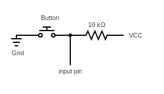
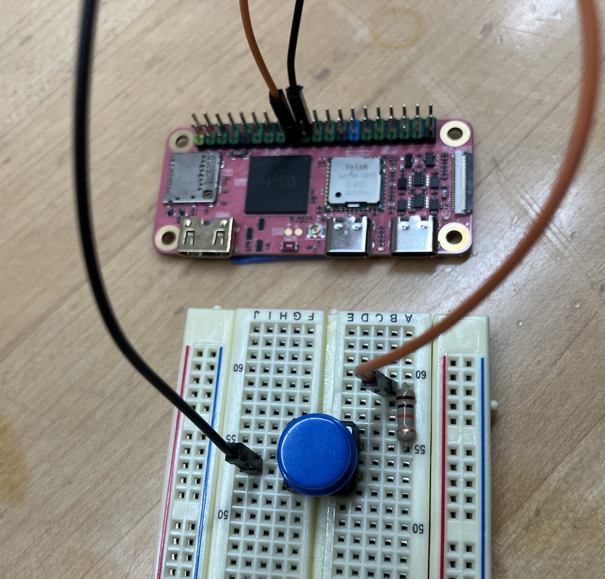


Task list to copy/paste when creating PR for this lab:

__Before releasing lab1:__
- [ ] Review writeup/code/checkin questions (instructor)
- [ ] Walk through (SL)
- [ ] Followup on issues from previous quarter postmortem (issue #21)

__To prep for lab1:__
- [ ] Review tips recorded in private/staff_notes.md and private/answers.md
- [ ] Confirm multimeters have fresh batteries
- [ ] Build kits
- [ ] Bring blank labels and pens -- students make name tag and decorate kit box



## Goals

During this lab you will:

- Practice building and running programs on the Pi using the cross-compile dev tools and `xfel` bootloader.
- Construct a simple breadboard circuit using an LED, resistor, and button.
- Study the assembly code for the blink and button programs.

## Prelab preparation

To prepare, please do the following before coming to lab:

1. Be up to date on [recent lecture content](/schedule/#Week1): __RISC-V assembly, GPIO__
    + Review course guides on [Meet your GPIO pins](/guides/MeetYourGPIOPins.pdf) and [Programming your GPIO pins](/guides/ProgramYourGPIOPins.pdf)
1. Reading to do ahead of lab:
    - Read this SparkFun tutorial on [using a breadboard](https://learn.sparkfun.com/tutorials/how-to-use-a-breadboard). Pay special attention to the section labeled "Anatomy of a Breadboard" to learn about the internal connections.
    - Review course guides on:
        -  [powering the Pi](/guides/power)
        -  [using the xfel bootloader](/guides/xfel) to send programs to the Pi
        -  [one page of RISC-V](/guides/riscv-onepage) assembly
1. Organize supplies to bring with you:
    - Bring your __laptop__ with full battery (and cable/charger if needed)
    - If you have access to a __multimeter__, bring it along (otherwise we also have a few in lab to share)

## Lab exercises

### 0. Pull lab starter code

The workflow for starting each new lab or assignment is:

```console
$ cd ~/cs107e_home/mycode             # change to local mycode repo
$ git checkout dev                    # be sure on dev branch
$ git pull code-mirror lab1-starter   # pull starter code for this lab
```

The above commands add a new subfolder named `lab1` that contains the starter files for this lab.

### 1. Inventory your kit

We will hand out your parts kit 🎁 open it up and check it out!
Unwrap and discard packaging in trash bin. Identify what each component is and compare to the [kit inventory](/guides/bom/) to confirm your kit is complete. If you are missing parts, ask us for a replacement.

The kit comes in a handy box so you can take it on the go. The box has a blank label for you to adorn with your name so that you and your box stay united. Plan to __bring your entire parts kit to every lab__ from here out.

### 2. Power up Pi and use `xfel` to converse

Start with our course guides to acquaint yourself with your new BFF.

- Guide: [powering the Pi](/guides/power)
    - follow instructions to connect your Pi to power
- Guide: [xfel bootloader](/guides/xfel)
    - follow steps in the guide to:
        - peek and poke to turn on the blue act LED
        - use `xfel` commands to load and execute a program
        - use `mango-run` as convenience for bootloading

Reset your Pi and use the commands below to view the initial contents of memory after a fresh reset.
The command `xfel ddr d1` initializes the memory controller and `xfel hexdump` display the contents of the 200 bytes of memory at address `0x40000000`.

```console
$ xfel ddr d1                  # initialize memory controller
$ xfel hexdump 0x40000000 200  # show memory contents (200 bytes at 0x40000000)
```
Reset the Pi again and repeat the same commands. Compare the memory contents from the first `xfel hexdump` to the second. Does memory seem to contain the same values after every reset or does it vary?  Does the memory appear to be filled with zeros, random/uninitialized garbage, or is there some pattern to the values?

Use the following commands to examine the `blink-actled.bin` program file in the CS107E directory:
```console
$ cd $CS107E/bin                    # change directory
$ ls -l blink-actled.bin            # long listing shows the size in bytes
$ hexdump -C blink-actled.bin       # show file contents
```
How many bytes of data are in the program file? How many instructions does this correspond to? What does this data represent?

Use `xfel write` to copy the `blink-actled.bin` program to the Pi's memory at address `0x40000000`. Use `xfel hexdump` again to see the updated contents of memory.

```console
$ xfel write 0x40000000 blink-actled.bin   # write program to memory
$ xfel hexdump 0x40000000 60               # show memory contents at addr
```
How did the contents of the memory on the Pi change? How does that change relate to the contents of the `blink-actled.bin` file?

Use `xfel` to execute the loaded program.
```console
$ xfel exec 0x40000000       # sets pc=0x40000000, start executing program
```
You should be rewarded with a blinking blue act LED on the Mango Pi board. You have just bootloaded your first program! To stop execution, reset your Pi.

#### Using mango-run
Each time you run a new program, you repeat the `xfel` commands (`ddr`, `write`, `exec`) so we packaged them into a simple script `mango-run` as one-stop shopping. Try it out now:

```console
$ mango-run                     # no argument, report if Mango Pi connected
$ mango-run blink-actled.bin    # load and run program given as argument
```
 What happens if you try to `mango-run` a second time
after the bootloader has already loaded a program? Why does that happen?

To halt the current execution and start over, reset the Pi. The Pi will restart into FEL, ready to receive a new program.

### 3. Make LED circuit on breadboard

Grab the breadboard from your parts kit. You are going to use it to wire up a simple circuit. First, be sure you understand how the breadboard is internally constructed. Which holes are connected to which other holes?  How are the power and ground rails connected? Review the section  "Anatomy of a Breadboard" in the SparkFun [tutorial on breadboard](https://learn.sparkfun.com/tutorials/how-to-use-a-breadboard#anatomy-of-a-breadboard) from the pre-lab.

Test a few points on the breadboard to confirm the internal connections. Use your multimeter if you brought one or borrow one of the shared lab meters. Grab two __male-male__ jumpers (any colors) from the bin of jumpers in the lab room. Choose two neighboring holes along one of the power rails and plug one end of each jumper into the holes. Confirm these holes are connected by applying the multimeter leads to the free ends of the jumpers and testing for continuity. Now move the jumpers around to different positions on the breadboard (for example, two holes within same row or same column or one hole in each power or ground rail) as you continue testing for continuity. Sketch out a road map of which holes are connected and which are not.


Take a close look at the power and ground rails on the long edges. There is a break in the marking at the midpoint. Testing with a multimeter will confirm that this is a discontinuity in the rail. Keep this is mind when wiring connections to the rails. The breadboard we used in previous quarters did not have that break, thus some of the photos/circuits may look a little different than yours.


You are going to wire up a simple circuit to light an
LED. You'll need an LED and a 1K resistor from your kit. A resistor's value is indicated by the sequence of colored bands. (See this Sparkfun [tutorial on resistors](https://learn.sparkfun.com/tutorials/resistors#decoding-resistor-markings) for help on decoding the bands and bookmark this [color code calculator](http://www.digikey.com/en/resources/conversion-calculators/conversion-calculator-resistor-color-code-4-band).) What are the band colors for 1K?  Find a 1K resistor in your kit. You can verify the value by using a multimeter to measure the resistance.

Make a circuit on your breadboard for the LED. An LED has a directionality -- the longer lead is the anode and the shorter lead is the cathode. The voltage from anode to the cathode
should be positive. If the polarity of voltages are switched, the LED
will not light up. The LED also needs a current-limiting resistor
otherwise it can literally [blow up in a fiery, smoky
extravaganza](https://www.youtube.com/watch?v=WLctUO1DGtw)! A resistor has no directionality and it can be placed ahead or behind the LED in the circuit.

In the photo below, the cathode of the LED connects to the resistor which connects to the
the ground rail. The LED itself crosses over the middle of the breadboard. (click photo to enlarge)

{: .zoom}

To light the LED, you need to apply power to the anode
and complete the circuit by connecting the cathode to ground. The power and ground will come from the header pins on your Mango Pi.

Follow these steps:

1. First, disconnect your Pi from power.
    >__Never rewire on a live Pi__ Always disconnect power from the Pi
    before you fiddle with the wiring.
    If you leave it plugged in, power is flowing and all wires are live, which makes for a dicey situation. An accidental crossed wire can a short circuit, which could fry your Pi or make your
    laptop disable the USB port.
    {: .callout-danger-invert}

1. Pick out two __female-male__ jumpers from your kit, one red and one black. You'll use the red for power and black for ground. Of course, electrons don't care about colors, but adopting good conventions will helps us humans more easily trace and debug our circuits.

1. Your kit includes a printed [pinout refcard](/guides/refcard/) that you'll want to keep handy, grab it now. We also have a command-line version for that retro ascii art feel. Try it out!
    ```console
    $ pinout.py              # display Mango Pi pinout in shell
    ```
   Orient your Pi so that the 40-pin header is in a vertical column on the right edge to match the pinout diagram. Identify a 3.3V power pin and a GND pin on the header. Connect the female ends of the jumpers to the Mango Pi:  black to ground and red to 3.3V power.
   > __Mango Pi GPIO pins are 3.3V only__ The GPIO pins are not 5V-tolerant and contact between 5V and another header pin can result in permanent and possibly fatal damage. To avoid accidental contact, we placed a small white shunt over the two 5V pins -- do not remove or move this shunt!
   {: .callout-danger}


1. Plug the male ends of the jumpers into the breadboard: black jumper to the ground rail and red jumper to the anode of the LED. (click photo to enlarge)

    {: .zoom}

1. After double-checking that your circuit wiring is correct, you're
ready to apply power. Power up the Pi and the LED on the breadboard should light.


While the LED is lit, make the following measurements with the multimeter.

-   Measure voltage across the resistor
-   Measure voltage across the LED

Apply Ohm's law to these measurements to calculate the current flowing through the LED.

If you substitute a 10K resistor in place of the 1K, how will this change the rate of current flow? What change do you expect in the brightness of the LED? Try it now to see for yourself.

You are ready to answer the first check-in question. [^1]

### 4. Execute blink program
You want to run `blink` program from lecture which blinks a LED connected to gpio `PB0`. Look on your pinout card and find the pin labelled `PB0`. You can also identify a pin by giving an optional argument to `pinout.py`:

```console
$ pinout.py PB0                  # highlight PB0 on pinout
```
Now that you know which pin is `PB0`, re-configure your breadboard circuit to connect `PB0` to the anode of the LED.

{: .zoom}

The `blink` subfolder of `lab1` contains the code for the blink program shown in lecture. Change to that folder and build the `blink` program using these commands:
<a name="build"></a>
```console
$ cd lab1/blink
$ riscv64-unknown-elf-as blink.s -o blink.o                 # assembler
$ riscv64-unknown-elf-objcopy blink.o -O binary blink.bin   # copy only binary
```
The `riscv64-unknown-elf-as` command assembles the RISC-V instructions in `blink.s` into an "object
file". The assembler takes in assembly instructions in human-readable text and translates to binary-encoded instructions (machine-readable bits). In addition to the encoded instructions, the object file includes some extra data we don't need -- we just want the
program. The command `riscv64-unknown-elf-objcopy` extracts just the raw binary program of instructions into a file
`blink.bin`.

Use the `mango-run` command to send the program to the bootloader:

```console
$ mango-run blink.bin         # mango-run = init memory + load program + execute
xfel ddr d1
Initial ddr controller succeeded
xfel write 0x40000000 blink.bin
100% [================================================] 36.000 B, 21.542 KB/s
xfel exec 0x40000000
```

Running the `blink.bin` program on the Pi pulses gpio `PB0` which is connected to the LED on your breadboard.

### 5. Study blink program

Below is the blink program that from lecture. This code is available in the file `lab1/blink/blink.s` and also reproduced below.

```ini
_start:
    lui     a0,0x2000       # a0 holds base addr PB group = 0x2000000
    addi    a1,zero,1       # a1 holds constant 1
    sw      a1,0x30(a0)     # config PB0 as output

loop:
    xori    a1,a1,1         # xor ^ 1 invert a1
    sw      a1,0x40(a0)     # set data value of PB0 to a1

    lui     a2,0x3f00       # a2 = init countdown value
delay:                      # busy loop to wait for a while
    addi    a2,a2,-1        # decrement a2
    bne     a2,zero,delay   # keep counting down until a2 is zero

    j       loop            # back to top of outer loop
```

If there is anything you don't understand about this program,
ask and discuss it with others.

Identify the `lui` instruction that inits the countdown. The value determines the number of loop iterations in the delay loop. The "load upper immediate" operation loads into the upper 20 bits of the destination register, effectively left-shifting the immediate by 12 positions. The instruction `lui a2,0x3f00` initializes the countdown to `0x3f00 << 12` which is roughly 66 million.

Edit the assembly instructions to halve the countdown value; this should make the delay half as long. Rebuild and run the program to see that it now blinks twice as fast.

It is a multi-step process to modify the program and re-run it:
- In your text editor, edit `blink.s` and save changes. (pro-tip: do not exit editor, leave open and switch to other terminal)
- Re-build `blink.bin` ([build commands](#build) `as` and `objcopy`)
- Reset the Pi (unplug/replug or click reset button on Mango Pi board)
- Bootload and execute `mango-run blink.bin`

Make sure you understand why each step is necessary. Show off your working edit-build-run cycle when you check-in with us. [^2]

Experiment with changing the number of loop iterations (i.e. the countdown value) until you observe a blink rate of roughly 1 second on and 1 second off. Review the assembly and count the number of instructions executed within each loop iteration. Combine these numbers to calculate an estimate of how many instructions per second the Mango Pi is executing. Compare your estimate with your tablemates -- does the measured rate mostly jibe with the stated clock speed (1Ghz)? You can now answer this check-in question[^3].


> __Toward a productive workflow__
You will be spending much quality time with your editor and terminal and will want to develop an efficient and productive workflow. Pay attention to speed bumps and awkwardness and consider what tools you have that can help streamline your process. For example:
- Learn how to use tab-complete and history as shortcuts to avoid (re)typing of commands and filenames.
 If you don't yet know about these features, ask a peer to show you or do a web search for a tutorial.
- Don't close out your editor each time you need to return to your shell; keep open multiple windows/tabs and use keyboard control to quickly switch between them.
- Organize your screen for visibility of all essential content, don't force yourself to hunt through scattered and overlapping windows.
- Longer term: avoid the overhead of reaching for your mouse and instead learn how to leverage key bindings and macros, so you can keep your hands on the keyboard and stay in programming flow state.
    - <small>"The single biggest productivity slowdown I see in stanford undergrads (grads too) is the slow, laborious use of taking their hand off a keyboard, moving a mouse, clicking, switching screens, clicking on something else, switching back, etc. You don't realize how much this slows you down you until you watch someone who writes code well and compare their fluent flow to your plodding agrarian lifestyle. Any time you move the mouse, you're not doing work. Do what you can to stop this." --Dawson Engler</small>
{: .callout-info}

<A name="button"></A>
### 6. Add a button
The final lab exercise is to study the `button` program and build a circuit to test the program.

This button program is in the file `lab1/button/button.s`. It uses two gpios: `PB0` configured as an output and connected to an LED and `PC0` configured as an input and connected to a push button. The code waits into a loop and turns the LED on/off in response to the current value of `PC0`.

```ini
_start:
    lui     a0,0x2000       # a0 holds gpio base addr = 0x2000000
    addi    a1,zero,0x1     # a1 = 1
    sw      a1,0x30(a0)     # config PB0 as output
    sw      zero,0x60(a0)   # config PC0 as input

loop:
    lw      a1,0x70(a0)
    andi    a1,a1,1
    sw      a1,0x40(a0)
    j       loop
```

Challenge yourself to understand
what each line of code accomplishes and why it works as expected. We annotated the first few lines to get you started, add your own annotations as you figure out each line. Have the [D1-H user manual](/readings/d1-h_user_manual_v1.0.pdf#page=1093) handy for looking up information about the GPIO peripheral and bookmark our one-page guide to [RISC-V instructions](/guides/riscv-onepage).

Here are a few questions to test your understanding.

- What information is stored in the peripheral registers at addresses `0x02000060` and `0x02000070`?
- Which instruction is reading the value of the gpio `PC0`?
- What is the purpose of the `andi` instruction?
- Is the LED turned on or off when the button is pressed?

Once you understand how the code operates, you are ready to make the button circuit.

Grab a pushbutton from your parts kit. The four legs of the button are organized into two pairs, the two neighboring legs on one side are one pair, the second pair is on the opposite side. The legs within a pair are always connected to one another. When the button is pressed, all four legs become connected. You need to select two legs to connect such that the circuit reads open until the button is pressed, which closes the switch. How the legs are wired is not obvious! One way to experimentally confirm is using the multimeter to test for continuity between legs when not pressed. I myself don't like fussing about the button orientation, so I rely on the fact that choosing two diagonal legs is guaranteed to not be an already-connected pair, these two will become connected only when the switch is closed. Once you understand how the legs are connected, position the button on the breadboard so it can act as a switch.

You will connect an input pin from the Pi into the button circuit to read the button state (pressed or not pressed). The default voltage of a gpio pin configured as an input is in a "floating" state, it might read high, it might read low, and value can fluctuate unpredictably. We must intentionally pull the pin to a known voltage to establish a reliable reading. The button program above is written expect that the button state is initially high and goes low when pressed, so we need to make the default state high. We can do this by connecting the input pin to the power rail through a 10K resistor to "pull up" the line. This causes the gpio to read high by default when the button is not pressed. Pressing the button grounds the circuit and the gpio will then read low.

Below is the schematic for a button connected to a pull-up resistor. The input pin will read high while switch is open (button unpressed) and low when switch is closed (button pressed).


{: .w-50 .mx-auto}

Below is a photo of a partial circuit corresponding to the schematic above. VCC (3.3V) and ground are connected to the Pi, R1 is a 10K resistor uses as a pull-up. Add this partial circuit on your breadboard (keep the existing connections for the `PB0` LED intact as well).

{: .zoom}

In the photo above, we used an orange jumper to connect 3.3V on Pi to one end of the pull-up resistor, the other end of the resistor is connected to the northeast leg of the button. We used a black jumper to connect the southwest button leg directly to ground on Pi. Pressing the button completes the circuit and power will flow from VCC __through the resistor__ across the button and then to ground.

>__Double-check your wiring!__ Before powering up your circuit, "read" it over to confirm it correctly models the schematic. Consistently choosing jumper colors according to use (e.g. orange for 3.3V power, black for ground) can help with readability. Be sure you understand why the resistor is needed and confirm it is correctly positioned. If the power were wrongly connected directly to the button leg (skipping the resistor), pressing the button would form a short. This causes the Pi to try to push near-infinite current (as R is near-zero) and the result would heat, smoke, permanent damage, and sadness.
{:.callout-danger-invert}

The circuit in photo is not yet complete -- it is missing the connection to read the button state. Review the schematic to identify where the input pin connects into the button circuit. The input point is chosen such that the input will read high in the starting state and read low when the button is pressed. Use the pinout to find gpio `PC0` on the Mango Pi header. Add a jumper from `PC0` to the input and your circuit is complete.

Your breadboard should have the previous circuit of LED connected to `PB0` and the additional button circuit connected to `PC0`. You are now ready to power it up and build and run the button program. Time for another round of `riscv64-unknown-elf-...`, uh, what was that again? Let's add another useful tool to your bag of tricks: `make`. A `Makefile` can be used to list the commands needed to build and run the program and allows you to skip re-typing them again and again. Next week's lab will have an exercise on exploring `make`, for now, you can take it on faith that we have provided a Makefile to use. Use the command `make run` as a shortcut for building and running a program on the Mango Pi. Try it out now!

```console
$ make run
riscv64-unknown-elf-as button.s -o button.o
riscv64-unknown-elf-objcopy button.o -O binary button.bin
mango-run button.bin
```

If the LED is on at start and turns off when the button is held down, you've got it all right!
You're ready to answer the final check-in question[^4].

If you have a little extra time, one last experiment is to make observations about a floating input. Consider the effect on the circuit of removing the connection that pulls up the input (i.e. remove pull-up resistor or disconnect jumper from to power). When the button is pushed, the input would still reliably read low (because the switch is closing the circuit from input to ground) so response to a button press should not be changed. But what is going to happen while the button is not pressed? The input is "dangling", not anchored to 3.3V or Ground. When the program reads from  it, it will be picking up an unreliable/unstable value coming from stray noise/capacitance. Here is an experiment to observe further. I know I said never to hot-wire a live Pi, but for this we are going to make an exception and proceed very cautiously. Have the circuit correctly configured and run the button program, confirm all is working as expected. Now, without resetting the Pi, leave the button program running, and very carefully disconnect the jumper from the pull-up resistor to power. Have your partner keep a close eye on the LED while you do this. What change do you observe in the LED? How does the floating input cause that effect?

References on floating inputs and use of pull-up resistors:
- Video short <https://www.youtube.com/shorts/y_QIEyC-uUk> from Adafruit
- Helpful tutorial <https://learn.sparkfun.com/tutorials/pull-up-resistors/all> from Sparkfun


## Check in with TA
Be sure to hand in your check-in sheet before leaving lab. We encourage you to touch base with us along the way rather than batching up your questions at the end[^5]. Remember the goal of the lab is not to rush through to finish fastest; it's to work through the material and build understanding.


__Clean all the things__: Please return tools and supplies to their place, discard any trash, and straighten up the tables and chairs. Our lab room is our home, let's work together to care for it and keep it a tidy and welcoming place!
{: .callout-warning}

<div class=checkinsheet markdown="1">
# {{ page.title }}
<div class="underline-name"></div>
Circle lab attended:  &nbsp;&nbsp;&nbsp;&nbsp;&nbsp;&nbsp;  _Tuesday_  &nbsp;&nbsp;&nbsp;&nbsp;&nbsp;&nbsp;  _Wednesday_
<BR>
<BR>
Fill out this check-in sheet as you go and use it to jot down any questions/issues that come up. Please check in with us along the way, we are here to help![^6]LED
</div>

[^1]: How much current flows through the LED with a 1K resistor connected to 3.3V? With a 10K resistor?
[^2]: Confirm you can use the tools on your laptop to successfully edit/compile/execute a program on the Pi. Resolve any snags here in lab so you'll be ready for the upcoming assignment.
[^3]: What is your experimental estimate of the rate of instructions per second executed by the Mango Pi? How did you compute it? How close is your estimate to the published clock speed?
[^4]: Show us your annotated version of `button.s` and your completed breadboard circuit with button and . Follow up with us if you aren't clear on the need for the pull-up resistor.
[^5]: Are there any tasks you still need to complete? Do you need assistance finishing? How can we help?
[^6]: Do you have any feedback on this lab? Please share!