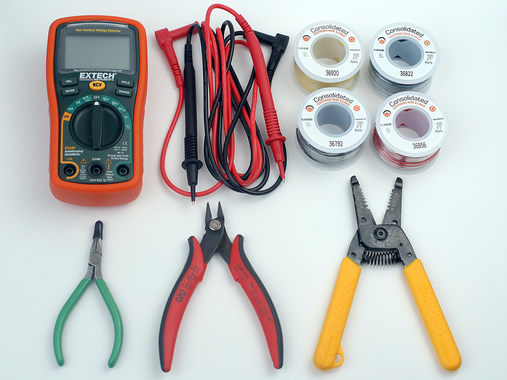
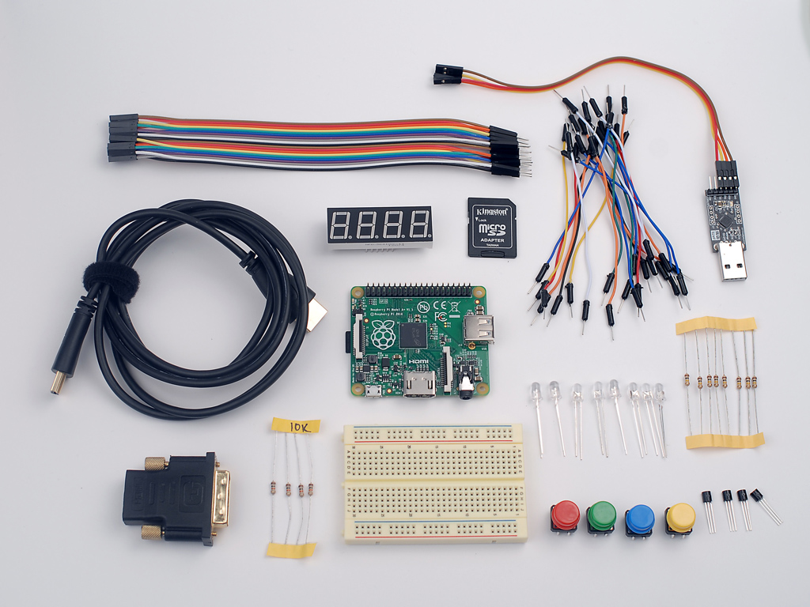
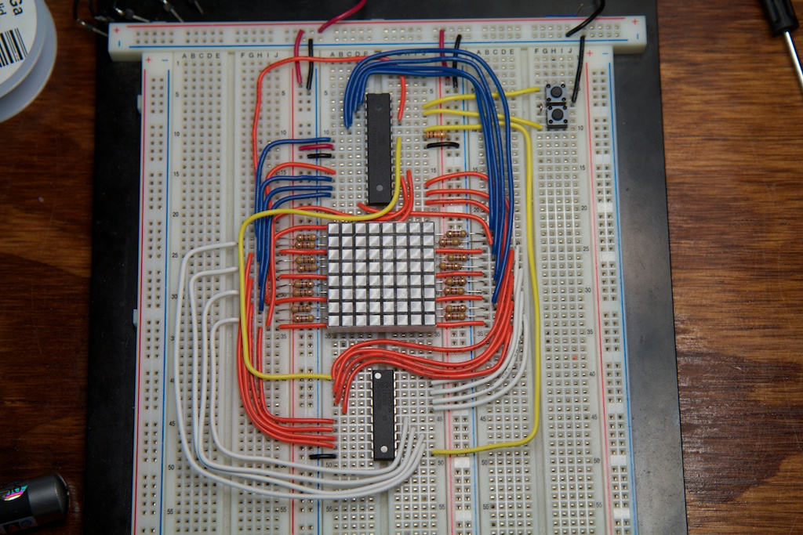
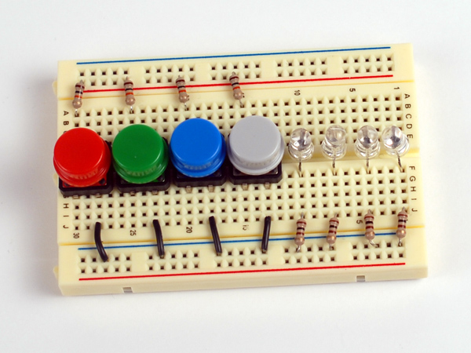
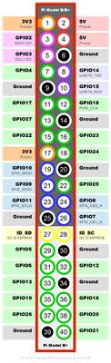

## Lab 1: Setup the Raspberry Pi

*Lab written by Pat Hanrahan*

### Goals

During this lab you will:

1 Learn how to perform cross-development for the arm in the Raspberry Pi.

2 Learn how to use a breadboard with buttons and LEDs.

3 Download and run bare metal programs on the Raspberry Pi.

You will be developing all the software in this course 
on your personal computer.
You will also have your own
Raspberry Pi Kit to carry around with you at all times.

You should find a partner and introduce yourself to one another.
Together you are to tackle the exercises outlined below.
Along the way, you are encouraged 
to chat with your neighbors to share insights and offer each other useful tips.
The instructors and TA will circulate to offer advice 
and answers so as to keep everyone progressing smoothly. 

Lab is a time to experiment and explore.
It follows up on the topics from recent readings/lectures with guided exercises 
ensuring you comprehend the material,
putting your knowledge into practice,
trying out the tools in a supported environment,
and preparing you to succeed at the assignment to come.

Bare metal programming requires precision. 
It is easy to get stuck by the most trivial error,
which is often almost impossible to see yourself.
Our goal in the lab is to get you past these bumps in the road
as fast as possible.
We don't want you to feel frustrated because something doesn't work.

To record lab participation,
we use an checklist form that you fill out as you work.
These questions are deliberately simple. 
We use them merely 
to record your participation 
and get a read on how far you got.
To get the most out of lab,
you should not do the minimal required of you
in the shortest possible time.
Even if you think you understand the material,
you should use the lab time to dive into the nooks and crannies.
You should also get to know the instructors.
They are masters of the craft, and you will learn a lot by
talking to them and asking them questions.
Any topic is fair game.

The combination of hands-on experimentation,
give and take with your peers,
and the expert guidance of the TA is what makes lab time truly special.
Your sincere participation can really accelerate your learning!

### Prelab preparation

To prepare for this lab, you should do the following.

1 If you are using a windows laptop, download and install a
virtual machine running linux.
We have written [instructions](/guides/vm.md)
on how to install this software.
The virtual machine will have the arm cross-development tools 
(all starting with the prefix `arm-none-eabi-`) installed.

2 If you are using a Mac laptop, download and [install
the arm cross-development tools](/guides/mac_toolchain) 
from the course github repository.
You do not have to install a virtual machine running linux on a Mac,
since OSX is based on unix.

3 Install git and learn how to use it.
Consult the following 
[CS107e guide to git](/guides/git.md)
for instructions on how to download and use it.

You should come to lab with working versions of the cross-development tools
(all beginning with `arm-none-eabi-`) 
and a running version of git.

Before coming to lab,
you should be able to login to a shell and type the following

    % arm-none-eabi-as -v
    GNU assembler version 2.24 (arm-none-eabi) using BFD version (GNU Binutils) 2.24
    % git --version
    git version 1.9.3

If this doesn't work, don't worry.
We will help you get setup in lab.

4.  We will use the following tools during this lab.



We do not have enough tools for everyone,
so you will have to share them.
If you own tools, bring them to lab.
We like people to use their own tools; 
it is very empowering.
And that also means you will be able to work outside of lab.
If you don't own these tools, don't worry. 
If you want to buy tools and don't know what to buy,
talk to the instructors. They love tools!

During this first lab you will be using
a wire strippers/cutter (yellow handled widget), 
a needle-nose pliers (green-handled widget), 
and a multimeter (the orange thing with a display).
Don't worry about wire and other supplies;
we'll provide that.

### Lab exercises

1 *Assemble the blink program*

All CS107e labs and assignments are distributed and managed as git repositories.
For assignments, your code will be in your own personal repository so that 
you can push your final code for grading. For labs, you will not need to turn 
in your code, so you will be able to simply pull the current courseware repo 
for the class and work off the lab code from there.

Clone the courseware repo, which includes the `blink` code from lecture 2 
under labs/lab1/code.

    git clone https://github.com/cs107e/courseware.git

Pull up the 
[checklist form](https://github.com/phanrahan/cs107e/labs/lab1/checklist.md)
and have it open in a browser 
so you can jot things down as you go.
Only one checklist needs to submitted for both you and your partner.

Now 'cd courseware/labs/lab1/code/blink' and type the commands:

    % arm-none-eabi-as blink.s -o blink.o
    % arm-none-eabi-objcopy blink.o -O binary blink.bin

2 *Inventory your Raspberry Pi Kit*

You will receive the official CS107e Raspberry Ki kit 
when you get to the lab.
The kit comes in a plastic sandwich box,
and contains the following parts:



- Raspberry Pi A+
- 4GB SDHC card
- USB serial cable with jumpers
- Mini-breadboard
- 8 LEDs
- 8 pushbuttons and colored caps
- 8 1K resistors
- 8 10K resistors
- 4 2n3904 bipolar-junction transistors (BJTs).
- 20 female-male jumpers
- 20 male-male jumpers in various sizes

Identify all the components and make sure your kit is complete.
If you are missing stuff, we have extras available.

3 *Wire up your breadboard*

The next step is to wire up your breadboard.
It is a little hard to describe this process in writing,
but there are people in the lab who have down it before.
Watch what they do.
Arrange everything to look neat.
Take your time and check your work.

<!---
When you have some extra time, check out this awesome 
[guide](http://ch00ftech.com/2012/07/28/the-ch00ftech-guide-to-breadboarding/)
and [video](https://www.youtube.com/watch?v=Yzfk0t0HfZc#t=225) 
about breadboarding by ch00ftech.


--->

Note that LEDs are directional.
The voltage from anode (the longer wire) 
to the cathode should be positive..
Each LED has a 1K current limiting resistor. 
Current will flow through this resistor and then through the LED.
There are various ways to wire up the LED (see below);
we connected the cathode to the resistor and then
connected the other end of the resistor to GND (the blue bus).
Note how the LED crosses over the middle of the breadboard.
To light up the LED, apply 3.3V or 5V to the anode.

Connect the multimeter to the pushbutton 
and figure out what pins are connected when the button is pushed.
The pushbutton needs a 10K pull-up resistor to the red power rail.
Verify that the resistor is 10K Ohms using the multimeter.
Measure the voltage at the pin,
and measure it again when you push the button.

When wiring, electronics gurus 
use colored wires to indicate what type
of signal is being carried by that wire.
For power, we will use the following conventions.

- Black (GND)
- Red (5V)
- Orange (3.3V)

Other signals should can use different colors.
For example, use yellow wires for output and white wires for input.

When you are done, your breadboard should look like the following.



To check that the LEDs are working,
you need a power source.
Let's do this using the *USB to Serial Cable* connected to your laptop.
This is the small black breakout board with a USB connector.
The side opposite the USB connector contains a 6-pin header.
The pins are labeled.
Connect the female end of the red jumper to VCC (which will be 5V)
and the black jumper to GND.

Now to the following steps in this order.
First, plug the male end of the black jumper into the
blue GND rail on the breadboard.
Second, plug the USB plug into your laptop.
A small led should turn light up on the breakout board.
Finally, plug the red male jumper pin into the breadboard.
One by one, check that each LED is wired properly.
When you have finished, here is what it should look like.


While the LED is lit, 
make the following measurements with the multimeter.

- Measure and record the voltage across the resistor.
- Measure and record the voltage across the LED.

Finally, calculate the current flowing through the LED.
Enter the calculated current on your lab checklist.

Now wire up the LED to the power pins on the raspberry pi.
Connect 5V and GND jumpers from the usb serial cable
to the 5V and GND connections on the raspberry pi.
5V is pin 2 and GND is pin 6. 
The pin configurations along the outer edge of the board are

```
2  5V
4  5V
6  GND
```

Here is a detailed diagram of all the GPIO pins. 
Find all the GNDs and power pins (both 3.3V and 5V).



Next wire up another GND to the breadboard, 
and 5V to the LED.
After finishing wiring things up,
insert the usb serial breakout board to your laptop - the LED should light up.


Now change the source of power to the LED from 5V to 3.3V. 
Does the brightness of the LED change?

**Warning: Don't have the usb serial breakout board plugged in while you are fiddling with the wiring. This can cause a short circuit, which could fry your Pi.**

4 *Run Blink on your Raspberry Pi.* 

First, connect the LED to GPIO 20.


Second, 
follow the instructions in [working with sd cards](../../guides/sd.md).
They will show you how to mount the sd card,
where to get the Raspberry Pi firmware,
and how to copy the firmware to the SD card.
After you have the firmware installed,
copy blink.bin to the sd card as kernel.img.
Eject the SD card properly.

Third, insert the SD card into the raspberry pi.
Power it up.
The LED should blink.

Study the blink program:

    // configure GPIO 20 for output
    ldr r0, =0x20200008
    mov r1, #1
    str r1, [r0]

    mov r1, #(1<<20)

    loop:

        // set GPIO 20 high
        ldr r0, =0x2020001C
        str r1, [r0]

        // delay
        mov r2, #0x3F0000
        wait1:
            subs r2, #1
            bne wait1

        // set GPIO 20 low
        ldr r0, =0x20200028
        str r1, [r0]

        // delay
        mov r2, #0x3F0000
        wait2:
            subs r2, #1
            bne wait2

    b loop

If there is anything you don't understand about this program,
ask questions of your partner and others.

Do the following exercises:

- Assembly the blink program, convert it to a binary, and do a `hexdump`.
Find the first occurence in the file of `e3`.
What is byte offset of `e3` relative to the start of the file?

- Change the program such that the blink rate slows down by a factor of 2. 
Now perform experiments to determine 
how many instructions per per second the Raspberry Pi executes.

5 *Run Button on your Raspberry Pi.* 

This last part is optional.
There are no questions on the checklist for this exercise.

Here is a program that reads a button
and turns on or off the LED 
depending on whether the button is pressed.

    /* configure GPIO 20 for output */
    ldr r0, =0x20200008 
    mov r1, #1
    str r1, [r0]

    // set bit 10
    mov r2, #(1<<10)

    // set bit 20
    mov r3, #(1<<20)

    loop: 

        // read GPIO 10 
        ldr r0, =0x20200034
        ldr r1, [r0] 
        tst r1, r2
        bne lo

        // set GPIO 20 high
        hi:
        ldr r0, =0x2020001C
        str r3, [r0] 
        b loop

        // set GPIO 20 low
        lo:
        ldr r0, =0x20200028
        str r3, [r0] 

    b loop

To run this program, connect the button to GPIO 10.
Make sure the jumper is connected to the right pin 
on the Raspberry Pi.
Also, make sure the pull-up resistor is properly
installed on the breadboard.

Study this program.


### Hand in your checklist to the TA

[Checklist](checklist.md)

At the end of the lab period,
hand in your checklist to the TA.
The TA will approve your submission 
so that you are properly credited for your work.
It's okay if you don't completely finish all of the exercises during lab;
your sincere participation for the full lab period is sufficient for credit.
However, if you don't finish,
we highly encourage you to work those parts
to solidify your knowledge of this material before moving on!
In particular, the first assignment assumes you
have successfully completed this lab.

