
Task list to copy/paste when creating PR for this lab:

__Before releasing lab2:__
- [ ] Review writeup/code/checkin questions (instructor)
- [ ] Walk through (SL)
- [ ] Followup on issues from previous quarter postmortem (issue #25)

__To prep for lab2:__
- [ ] See private/answers and private/staff_notes for advice saved from past
- [ ] Forum announcement for students to bring their own tools (also repeated in prelab)
- [ ] Confirm lab cabinet has plenty of hookup wire and hand tools
- [ ] Bring printed copies of ref sheet (private/refsheet_to_print)



{: .w-50 .float-right}

<br/>
---
<br/>
## Goals
During this lab you will:
- Read the assembly language produced by `gcc` when compiling a C program.
- Review the use of basic makefiles.
- Learn how to use `assert` as a simple unit test.
- Begin breadboarding a 4-digit 7-segment display for your next assignment, the clock.

## Prelab preparation

To prepare for this lab, please do the following:

1. Be up to date on [recent lecture content](/schedule/#Week2): __C control, pointers, functions__
1. From our course guides, please review:
    -  [gcc guide](/guides/gcc) on building a bare-metal C program
    -  [make guide](/guides/make) on using makefiles to automate the build process
1. Read [section 4a below](#crossref) on the theory of operation
   for 7-segment displays and skim the rest of exercise 4 to get the lay of the land for the breadboarding work ahead.
1. Watch this excellent tutorial video from Ben Eater <https://www.youtube.com/watch?v=PE-_rJqvDhQ> on best practices for breadboarding. Ben is the 🐐!
1. Organize your supplies to bring to lab
    - Bring your laptop (with full battery charge) and entire parts kit.
    - If you have your own [hand tools](/guides/handtools), bring them along!

## Lab exercises
The lab has four exercises. In lab, we will use the first hour for the first three exercises (~20 minutes each) and reserve the second hour for breadboarding exercise 4. We do not expect you to complete the entire breadboard during lab, but an hour is enough time to get a solid start and leave lab with a clear understanding of how to finish on your own.

If you have to skimp a bit on the first three exercises during lab, try to circle back when you have time to make a fuller exploration. If you run into any issues or have follow-up questions, post on Ed or come by office hours to talk with us about it!

### 0. Pull lab starter code

Change to your local `mycode` repo and pull in the lab starter code:

```console
$ cd ~/cs107e_home/mycode
$ git checkout dev
$ git pull code-mirror lab2-starter
```

### 1. C to assembly (20 min)

Compilers are truly an engineering marvel. Translating C source into correct use of assembly instructions, registers, and memory necessitates both technical mastery and a fair bit of artistry. From here forward in the course, you'll hand over the task of writing assembly to `gcc`, but you will continue to grow your reading fluency of assembly. Use this exercise to observe and pay tribute to the handiwork of the compiler.

Sometimes the assembly
produced by the C compiler can be surprising. You will be pleased by its clever optimizations, although occasionally its eagerness can also remove or rearrange your code in ways that confound your intentions. When this happens to you, you can deploy your assembly superpowers to dig into the generated
assembly and figure out what the compiler did rather that sit
there dumbfounded by the unexpected behavior!

Change to the `lab2/codegen` directory. Open the `codegen.c` source file in
your text editor. The file contains functions that demonstrate arithmetic, control flow, and pointers. Skim the C code and read our comments to get the lay of the land.

Open <https://gcc.godbolt.org/z/3YrvehK9q> in your browser; this is Compiler Explorer configured to match our `RISC-V gcc` toolchain with split panes on the right to show generated assembly at two different optimization levels (`-Og` and `-O2`).

In `codegen.c`, find the section marked `Part (a): arithmetic`. Paste the functions one by one into the Compiler Explorer source pane on the left and review the generated assembly shown on the right. Verify that the assembly accomplishes what was asked for in the C source. Do you note any surprising choices in how it goes about it?  Read our comments in `codegen.c` as the guide for what to look for and what follow-up experiments to try.

After you finish exploring Part a, do the same with the other parts in `codegen.c`. Part (c) has an example of the need for `volatile` that is particularly relevant for your next assignment.

The final part includes some C code for which the generated assembly is somewhat surprising -- examine those closely to understand what is happening and why. When C code ventures outside the boundary of legal C, it is said to have "undefined behavior" and the compiler has a lot of latitude in how it can handle it.  Check out this article for more examples <https://embeff.com/compiler-dependent-behaviour-in-practice/>

A good way to learn how a system works is by trying
things. Curious about a particular C construct is translated to assembly? Wonder about the effect of changing the compiler optimization level? Try it out and see. Keep that link to Compiler Explorer handy and let your curiosity be your guide!

You're ready for the check-in question about translating C to assembly.[^1]


### 2. Makefiles (20 min)

Change to the directory `lab2/makefiles` and review the C source for a program that blinks the ACT led and its simple Makefile, reproduced below:

```makefile
NAME = blink_actled

ARCH = -march=rv64im -mabi=lp64
CFLAGS = $(ARCH) -g -Og -Wall -ffreestanding
LDFLAGS = -nostdlib -e main

all: $(NAME).bin

%.bin: %.elf
	riscv64-unknown-elf-objcopy $< -O binary $@

%.elf: %.o
	riscv64-unknown-elf-ld $(LDFLAGS) $< -o $@

%.o: %.c
	riscv64-unknown-elf-gcc $(CFLAGS) -c $< -o $@

clean:
	rm -f *.o *.elf *.bin

.PRECIOUS: %.o %.elf
```

(If you did not get in a pre-lab read of our [guide to make](/guides/make), do it now! Be sure to take note that the recipe steps in a Makefile must be indented [using __tab__, not spaces](/guides/make#tab) as a separator)

Go through the Makefile with your tablemates to identify its components and add comments to document the various structures (variables, targets, recipes, pattern rules, etc.).

- Trace what happens when you issue `make` with no command-line arguments. What target does `make` build by default? How does it determine which actions to take to build that target?
- If you make an edit to `blink_actled.c` and run `make` again, which commands are re-run?
- If you remove the file `blink_actled.bin` and then reissue `make`, just one command is re-run. Which is it? Why is this different that before? How does `make` determine which commands must be re-run?
- What does `make clean` do?

#### Add target `make run`
You can include targets in a Makefile to automate other tasks, such as to execute your newly-built program on the Pi.  Open `Makefile` in your editor and add a new target `run` to invoke `mango-run` on the program binary.  Be sure to list the file `blink_actled.bin` as a dependency, so run will first rebuild if needed. Try out `make run` now. If you edit the .c file and then issue `make run`, it should trigger a rebuild first.

You should now be able to answer the check-in question about makefiles[^2].


### 3. Testing (20 min)
<a href="testing"></a>
An effective developer knows testing goes hand-in-hand with writing code. The better your tests and more timely your efforts, the sooner you will find your bugs and the easier your debugging will be. To help you grow this important skill, your assignments will incorporate a required testing component.

In CS106B, you constructed test cases using the C++ SimpleTest `STUDENT_TEST` and `EXPECT`. The testing strategies you were using will still serve you well, but you won't have quite as fancy a framework to build on. The standard C library includes an `assert` macro for use as a simple diagnostic.
In your shell, use `man assert` to read about the standard library version. The `assert` macro is invoked on an expression that is expected to evaluate to true. If the expression evaluates to be true, the assertion succeeds and the program continues on.  If the expression is false, the assertion fails which cause the program to print an error message and exit.

Running bare metal means no standard libraries, and furthermore we don't have printf (yet!). To get something akin to `assert`, we have to cobble it up ourselves and given our limited resources, it will be rather primitive. There is an blue "ACT" (activity) LED onboard the Mango Pi that we will use to signal success and failure. Our bare bones `assert` is going to blink the blue ACT LED to report a failure.

Let's walk through an example that shows using assertions as rudimentary testing tool.

#### A buggy program

Change to the `lab2/testing` directory. The program in `testing.c` defines the `count_bits` function to count the on bits in a given number.  Each test case in `main()` calls `count_bits` on an input and asserts that the result is correct. The function `count_bits` works correctly for some inputs but not all. Do not try to work out what the bug is by inspection, instead let's see how we can using test cases to narrow down to cases.

#### What do you expect?

First, let's review what we expect to
happen when executing the test program. If a test case fails, the `assert` macro will call `abort`. What does `abort` do? Read the comments in the file `testing.c` to find out!

Now look at the code in the file `cstart.c` to see what happens after the
program runs to completion, i.e., what follows after `main()` finishes? (Skim past the `bss` stuff for now: we will talk about it in an upcoming lecture.)

Check in with your neighbor and confirm you understand what will happen on the Pi :
- if the program executes a single test of `count_bits` on a value that has a bug?
- if the program executes a single test of `count_bits` on a value that works correctly?
- if the program executes several `count_bits` tests, some which pass and some which fail?
  + This last one is a particularly important to understand. Unlike SimpleTest, a sequence of test cases (asserts) does not produce a report of pass/fail results, one per test. It stops at the first failure.
- if the program executes a test case that enters an infinite loop, what do you expect to observe on the Pi?

#### Make test

The Makefile for this program has a `test` target that builds the program and executes it on the Pi. Try `make test` now. The program runs and the blue ACT LED starts blinking. Hmmm, that means at least one test failed, but which one?

Divide and conquer to the rescue! Leave in the first half of the test cases and comment out the remainder. Rebuild and re-run. If the program still fails, you know you have a culprit in the first half; otherwise you can move on to looking in the second half. The strategy is to iterate, selectively commenting in/out
test cases and re-running to narrow in on which specific cases fail.
How many of the test cases pass? How many fail?  Which ones? Why?

Study the test results to identify the pattern to the failures. Use that information to find and fix the bug in `count_bits` so that it works correctly for all inputs.

Keep in mind that your test cases are implemented as code, which means that they, too, can have bugs of their own. Having a bug in your test case can truly be a maddening experience! A test case that produces a false negative can lead you to investigate a non-existent defect and a false positive lulls you into overlooking a lurking one. You attribute the erroneous test result to the code being tested, yet the real issue is that the test case itself is mis-constructed. Unlike hackneyed sitcom plots, hilarity does not ensue from this misunderstanding.

A test case that is properly constructed should assert an expression that will be true if and only if the code is correct. The last test case in `main` shows an example of a mis-constructed test case. What happens when running this test case on the original broken code? What happens on the now-corrected code? Fix the error in the test case so that it works as intended.

Uncomment all test cases, rebuild, re-test, and enjoy the quiet sign of successful completion!

You're ready for the check-in question about unit tests.[^3]


<a name="crossref"></a>
### 4. Wire up display breadboard (60 min)

The second half of the lab period is directed toward the breadboard circuit needed for Assignment 2, a clock implemented on a 4-digit 7-segment display unit.

This lab exercise guides you in stages and has you test each stage before moving on.
This "test as you go" strategy is the hallmark of a great engineer. Do not cut corners in a mad rush to finish the entire circuit in lab! Prioritize using the time in lab to understand the circuit and get practice with wiring and testing one step at a time. Take away a solid understanding and you'll leave lab ready to complete the rest on your own.

#### 4a) Theory of operation

Start by studying the operation of a single 7-segment display.
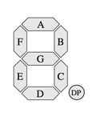{: .float-right .d-inline}
The 7-segment display, as its name implies, is comprised of 7 individually lightable LEDs, labeled A, B, C, D, E, F, and G. There is also a decimal point labeled DP, which we will not be using. Each segment is an LED. Recall that an LED has an anode and a cathode. The polarity matters for an LED; the anode voltage must be positive relative to the cathode for the LED to be lit. If the cathode is positive with respect to the anode, the segment is not lit.

On the 7-segment display we use,
the cathodes (ground) are all connected to a shared ground.
Such a display is called *common cathode*.

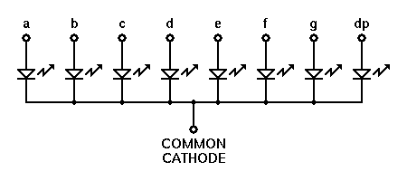{: .zoom}

To show a digit on the display, you create a circuit by connecting the
common cathode to ground and applying a voltage to the desired segment
pins. Turning on all seven segments would show the digit `8`.

The clock display in your kit has four 7-segment displays integrated into a single unit:

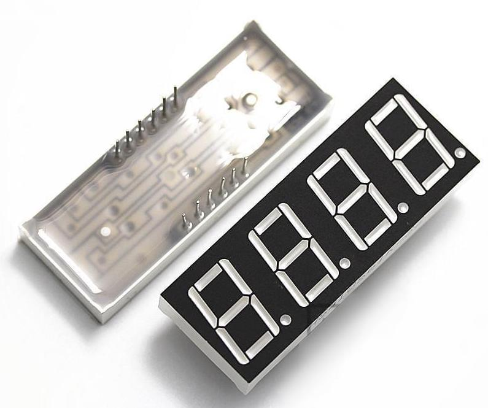{: .zoom .w-25}

#### Datasheets
Here is the [datasheet for the 5641-AS](/readings/7segment_5641AS.pdf) display unit. A datasheet is your go-to when learning a new component. It will lay out the specifications, schematic, pinout diagram, operational behavior, testing data, and more. In practice, datasheets vary a lot in how well they present the information.  In our writeup below, we extracted the essential facts from the datasheet to get you started. Learning to read a datasheet found in the wild is a good skill to work at developing.

This is the internal schematic of the four-digit 7-segment display unit:

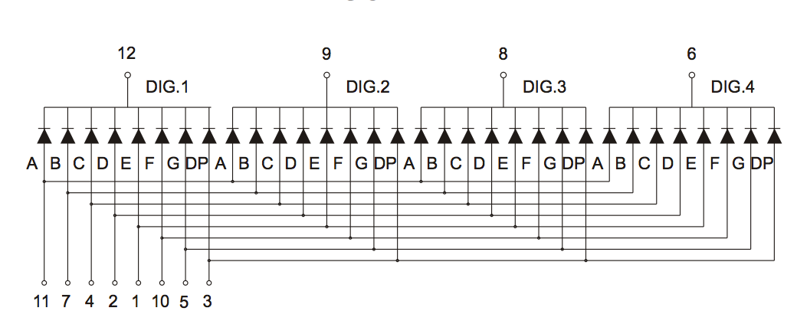{: .zoom .w-75}

Untangling the connections can be a bit tricky. There are twelve pins in total: four digit pins (`DIG.1`, `DIG.2`, `DIG.3`, and `DIG.4`) and eight segment pins (`A`, `B`, `C`, `D`, `E`, `F`, `G`, `DP`). Each segment pin connects to all four digits; start at the pin numbered 11 and follow its connections to the `A` segment for each digit. Each digit has its own unique ground, e.g. `DIG.1` is the cathode/ground pin for digit 1. Trace out how each segment connects to the shared digit grounds.

If you turn on segment pins `B` and `C` and connect `DIG.1` and `DIG.2` to ground, the first
and second digits both show `"1"` while the third and
fourth digits do not show anything, because they are not connected to ground.

Below is the pinout for the display unit. In this diagram, the labels for `DIG.1` - `DIG.4` have been shortened to `D1` - `D4`. The pins are also numbered for reference. By convention, numbering starts at the bottom left corner (pin #1), and proceeds in a counter-clockwise fashion until reaching the upper left corner (pin #12).

{: .zoom}

#### 4b) Place resistors for segments

> __Safety first__ Don a pair of safety glasses to protect your eyes from flying leads.
{: .callout-warning}

Start by connecting all of the breadboard power and ground rails to make accessing power and ground more convenient. Custom-fit a red wire that connects the upper power rail to the lower power rail and a black wire for the ground rails. If your breadboard has a mid-rail gap, connect over the gap with short red and black wires. The end result should be one fully connected rail for power and another for ground.

How do you know if your breadboard has a mid-rail gap? Check whether rail marking is a continuous line or has a break at mid-rail. The breadboard in the photo below has a mid-rail gap. Click the image to zoom in and see the markings. The rest of the photos in this guide use a breadboard that does not have a gap, so may look different than yours.

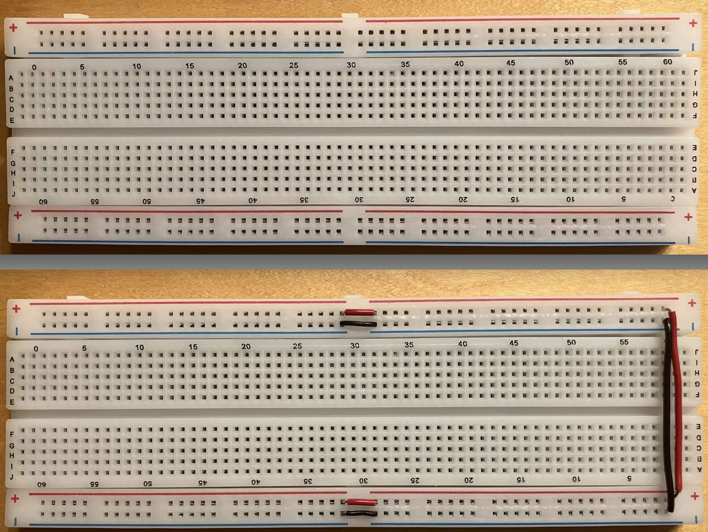{: .zoom }


> __Pro-tip: custom fitting a wire__
> Watch the video below to see how Liana uses her tools to strip and cut a length of wire to neatly fit between two set points.
{: .callout-info}

<video controls="controls" width="500" name="fitting wire" src="images/fitting_wire.mp4"></video>

Take note that each hole on the wire strip corresponds to a specific wire gauge. Breadboarding wire is typically 22 AWG (or sometimes 20 or 24 AWG); read the label on the spool to identify the gauge of the wire you are using.
Place the wire to be stripped into the matching hole on the stripper. The stripper jaws will pull off just the casing, leaving the wire core intact.

My convention is to orient my breadboard so that the blue ground rail is on
the bottom (after all, ground is underneath us). Insert your display unit in the middle of your breadboard, with the decimal points on the bottom and the digits slanted to the right.

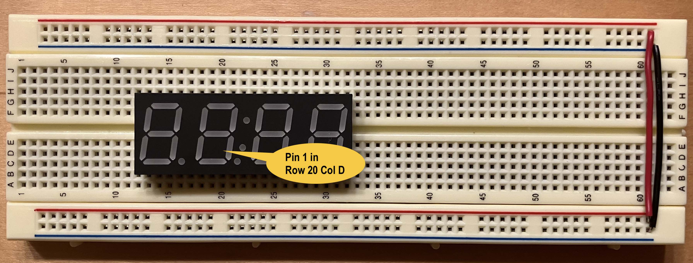{: .zoom }

Take note of which row and column numbers on the breadboard align with pinout of the
display unit. When the display unit is inserted into the breadboard you can no longer
see the pins underneath, so you want to know which breadboard holes aligns with each pin. Throughout this guide, we placed the display unit so __pin 1 is in the hole labeled Row 20 Column D__ on our breadboard. This location may be labeled differently on your breadboard. To match our anchor point, count starting from the left side to the 20th row and go down 2 from middle channel. Jot down the row/col number of the anchor according to the labels on your breadboard.

The LEDs in the display unit require a current-limiting resistor just as a single LED does. Place a 1K resistor bridging the middle of the breadboard to the right of the display unit. The resistor should sit neatly. In the video below, Liana shows using the pliers to make a sharp crease and clipping the leads with the cutter to make a nice secure fit.

<video controls="controls" width="500" name="fitting resistor" src="images/fitting_resistor.mp4"></video>


Now you will make some temporary connections to the display unit to test turning on a single segment. For testing, make connections using male-male jumpers. After validating your circuit, you will re-wire it in a neater and more permanent fashion.

The first test connection is to turn on the single segment B of digit 1. Below is a schematic for the circuit you will need. Take a moment to identify all of the components in the schematic. (click image to enlarge)

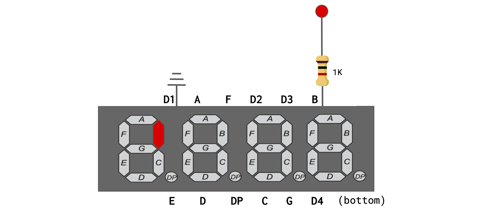{: .zoom }

- Follow the above schematic and build this test circuit on your breadboard.
	- Pick out three short male-male jumpers (orange for 3.3V, black for GND, and green).
	- Use the orange jumper to connect the red power rail to the top of the resistor.
	- Use the green jumper to connect the bottom of the resistor to segment B on the display unit.
	- Use the black jumper to connect digit D1 on the display unit to the ground rail.
- Connect your breadboard to power and ground from your Mango Pi.
    - Pick out a pair of red and black male-female jumpers.
	- Use your ref card to identify 3.3V and ground pins on your Pi's header.
	- Use the red jumper to connect the 3.3V header pin to the power rail of the breadboard and the black to connect a ground header pin to the ground rail.

After tracing your circuit and confirming it is correctly constructed, power up the Pi. Segment B of the leftmost digit should light up (click photo to enlarge):

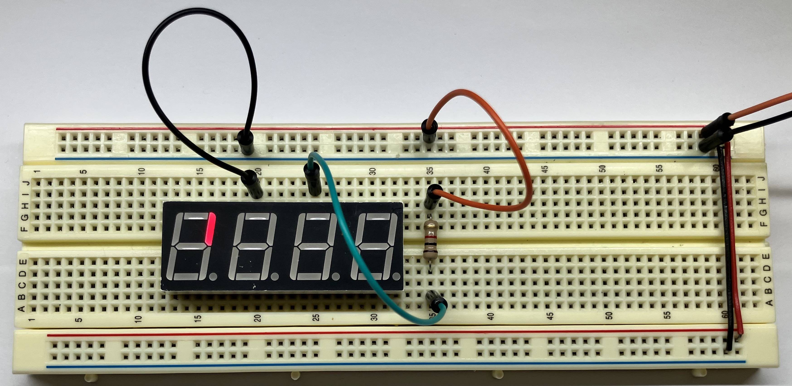{: .zoom}

You can change which segment and digit is lit by moving the jumpers to different pins on the display unit.  (Remember to disconnect your breadboard from power while you are fiddling with the wiring) Try moving the black jumper from digit 1 to digit 2. Segment B of digit 1 turns off and segment B of digit 2 turns on. If you add a second black jumper that grounds digit 3, now segment B will light on __both__ digits.  Note
that you cannot simultaneously light different segments on different digits: Why not?

Place 6 more 1K resistors on your breadboard next to the first one, bringing the total to 7, one for each segment A-G (we will not wire the unused 8th segment DP). We
suggest a layout where the leftmost resistor is connected to segment A, its neighbor
is to segment B, and so on such that the rightmost resistor is segment G.

After you have placed all resistors, time to test. Simultaneously wiring all segments with 7
jumper cables would be very messy; instead connect one segment
at a time and move the jumper to test each of the 7 segments. As you go, make a
sketch of the correct connection between each resistor and its pin on the display unit and save
it to refer to when wiring up the permanent circuit.

Follow the schematic below and connect jumpers to show `"1 1 "` on the display unit. Here a space means that the digit is blank (no segments
turned on).

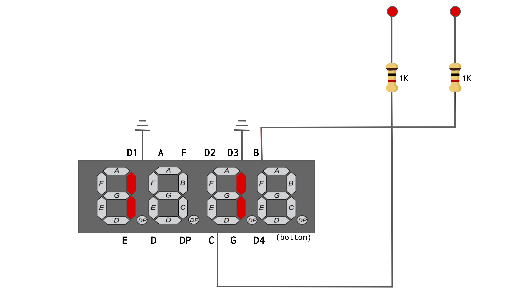{: .zoom}

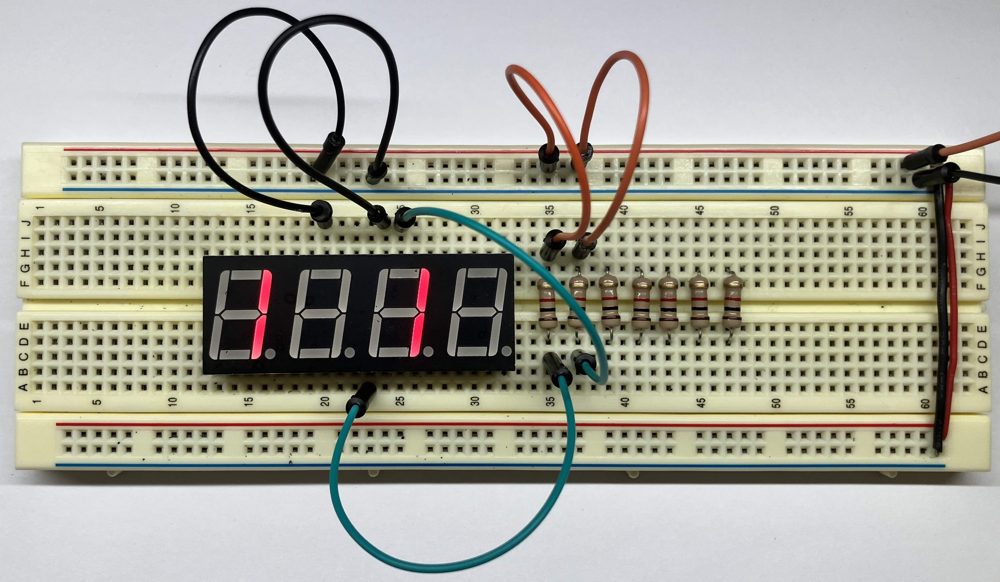{: .zoom}

Here are a few questions for you and your partner to discuss about the 7-segment display:

- What additional connections are needed to show `"1"` on all four digits?
- Why is it impossible to simultaneously show `"1"` on one digit and `"2"` on another? (In the assignment, you will see the trick is to quickly switch between digits to create the illusion of displaying `"12"`)
- One end of each resistor will eventually have a jumper connecting to a header pin on the Pi and the other end connected to a pin on the 7-segment display. As there is no directionality to a resistor, you could swap which connection is on which end, but why might it be a good practice to be consistent across all segments?

Show your lit display to the TA[^4] before moving on.


#### 4c) Place transistors for digits

Up to now, you have been controlling whether a digit is on by adding or
removing a jumper that connects the digit pin to ground. We eventually want to
programmatically control which segments and digits are turned on,
so we need an electronic switch that can be controlled by a GPIO pin.
To do this we will use a bipolar-junction transistor, or BJT.

A transistor has three terminals— the base (B), collector (C), and emitter (E).
The base controls the amount of current flowing from the collector to the
emitter. Normally, no current flows from collector to emitter. This condition
is an open circuit. However, if you apply 3.3V to the base, the collector will
be connected to the emitter and current will flow. This is equivalent to
closing the switch.

We are using 2N3904 transistors. Here is the [2N3904 datasheet](/readings/2N3904.pdf).
The diagram below identifies the pinout for the collector, base, and emitter connections.

{: .zoom .w-25}

The transistor cap has a flat side and a rounded side. If you are looking
at the flat side with the legs pointing down, the leftmost leg will be the
emitter.

Instead of wiring a digit pin directly to ground as before, you connect the digit pin to the collector of a transistor whose emitter is connected to ground.
Applying power to the transistor base activates the switch which then grounds the
digit pin.

Here are the steps to add the digit transistors to your breadboard:
- Disconnect all jumpers used for temporary connections from a digit to ground.
- Place four transistors in your breadboard to the left of your display unit. The layout is from left to right where leftmost transistor controls digit D1 and the
rightmost controls D4.  Use cutters to trim the transistor legs so that it sits neatly
against the breadboard.
- Custom-fit a short black wire from the emitter of each transistor to ground.
- Place a 1K current-limiting resistor to protect the base of each transistor.
- In the permanent circuit, the collector of each transistor will have a custom-fit wire to its digit pin. For now, use jumpers as temporary connections.

Test your transistors by using jumpers to make temporary circuits. Below is a schematic and photo where we've connected _both_ D1 and D3 to the collectors of transistors and applied power to the bases of those
transistors. This circuit displays `"1 1 "`.

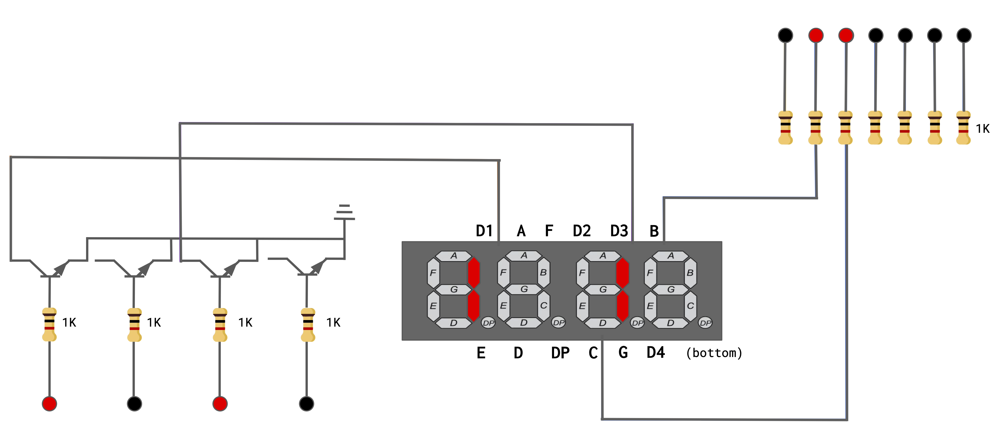{: .zoom .w-75}

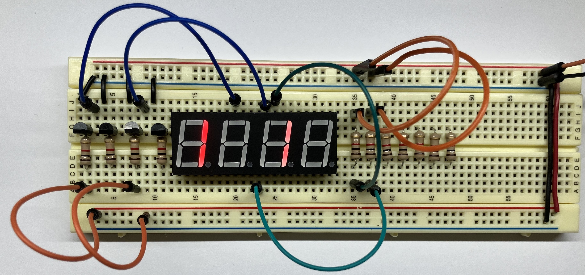{: .zoom .w-75}

#### 4d) Permanently wire circuit (start now, finish later)

Now comes the time-consuming part. Each segment pin needs to be connected to
its resistor and each digit pin connected to the collector of its transistor.
Be patient, this takes some time. Rather than do a rush job to finish in lab, 
instead practice with precise and neat wiring to develop your craft. Carefully
review the schematic and ask questions about anything you find unclear. We want
you to leave lab with confidence that you can complete the rest of the circuit on your own.

Here is a photo of the breadboard with all components placed, ready to start wiring...

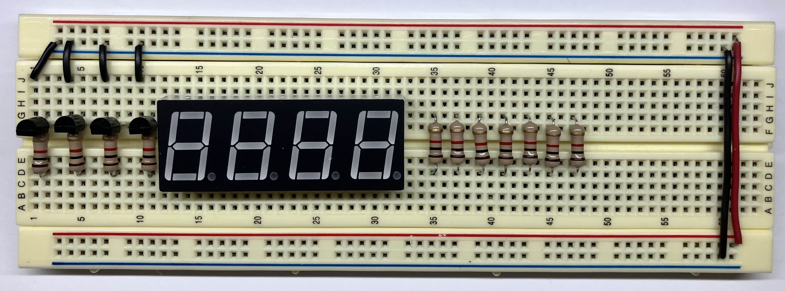{: .zoom}

...and here is a full schematic of what you will be wiring up:

{: .zoom .w-75}

In the full schematic, the 3.3V input we've been using up to this point has been
replaced by labeled dots where you will connect male-female jumpers to the GPIO pins on the Pi. The dots in the upper right connect to the GPIOs that control the segments, the dots on the lower left are for the digits. As an example, turning on gpios PB4 and PB6 will light segment B of digit 1.

As you wire your breadboard, custom-fit your wires to the proper length and arrange them neatly.  When the circuit is tidy, it's easier to see if everything is set up correctly. If you didn't do a pre-lab watch of [Ben Eater's technique](#prelab-preparation), do it now!

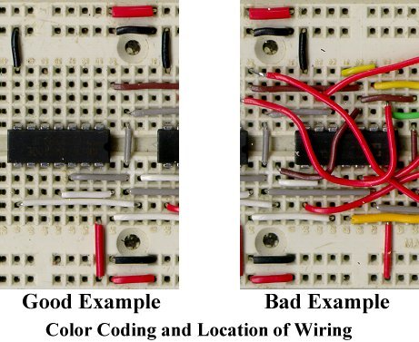{: .zoom}

Take your time and test as you to go to check your work. A little bit of care will save you a lot of time later, because, if your system has a bug, the set of things that you have to check is much smaller. For added readability of your circuit, use different colors of wire to annotate the wire's purpose. In our example breadboard below, we used green wire for the segments and purple for the digits.

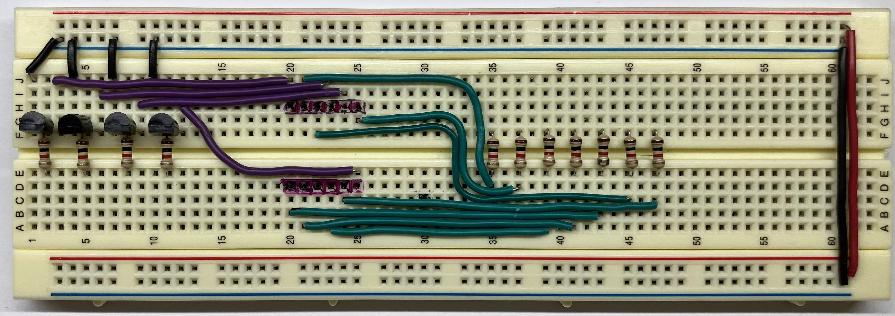{: .w-75 .zoom}

The finishing touch is to add a pushbutton that will start the clock. The button is not connected into the display circuit. It is wired to the power rail through a 10K pull-up resistor and connected to gpio PD12 to be read as an input. (If you did not finish the [button exercise from last week's lab](/labs/lab1#button), review it now!)

Here is a photo of the completed breadboard, looking sharp! Ben Eater would be proud!

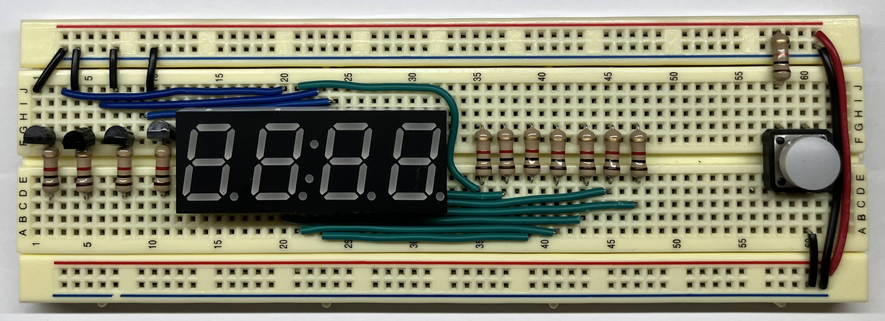{: .w-75 .zoom}


## Check in with TA

We are here to help! Please touch base with us during lab to ask your questions and confirm your understanding.[^5]

The breadboarding supplies (hand tools, safety glasses, hook-up wire) are available in lab and you may come at any time to use them. These supplies are to __remain in the lab room__ for all to use, they are not available for borrowing. If you are interested in purchasing your own tools for home, we have [recommendations](/guides/handtools). We love tools!

__Don't forget to clean up!__ Please sweep/vacuum debris from the table and floor and return shared tools and supplies to their rightful place.  We all appreciate having a tidy and neat workplace. Thank you!
{: .callout-warning}

<div class=checkinsheet markdown="1">
# {{ page.title }}
<div class="underline-name"></div>
Circle lab attended:  &nbsp;&nbsp;&nbsp;&nbsp;&nbsp;&nbsp;  _Tuesday_  &nbsp;&nbsp;&nbsp;&nbsp;&nbsp;&nbsp;  _Wednesday_
<BR>
<BR>
Fill out this check-in sheet as you go and use it to jot down any questions/issues that come up.  Please check in with us along the way, we are here to help![^6]
</div>

[^1]:  Review the code for `wait_until_low` in `codegen.c`. Which of the two variables needs to be be qualified as `volatile`?
[^2]:  If you invoke `make` with no argument, which target from the makefile is used?
[^3]:  You have a test program with a sequence of 10 test cases written as assert statements. When you run the program, the blue ACT led turns on and stays on. What can you determine from this observation? What will be your next steps to debug from here?
[^4]:  Show us your display unit directly wired and lit up to show `"1 1 "` (and again with transistors if you get there).
[^5]:  Before leaving lab, ensure you have a solid start on the breadboard and a clear understanding of how to complete the remaining tasks on your own. Do you need followup assistance? How can we help?
[^6]: Do you have any feedback on this lab? Please share!
