
Task list to copy/paste when creating PR for this lab:

__Before releasing lab2:__
- [ ] Review writeup/code/checkin questions (instructor)
- [ ] Walk through (SL)
- [ ] Followup on issues from previous quarter postmortem (issue #382)

__To prep for lab2:__
- [ ] See private/answers and private/staff_notes for advice saved from past
- [ ] Forum announcement for students to bring their own tools (also repeated in prelab)
- [ ] Confirm lab cabinet has plenty of hookup wire and hand tools
- [ ] Make copies of 7-segment pinout diagram to distribute in lab



{: .w-50 .float-right}

<br/>
---
<br/>
## Goals
During this lab you will:
- Read the assembly language produced by `gcc` when compiling a C program.
- Review the use of basic makefiles.
- Learn how to use `assert` as a simple unit test.
- Begin breadboarding a 4-digit 7-segment display for your next assignment, the clock.

## Prelab preparation

To prepare for this lab, please do the following:

1. Organize your supplies to bring to lab
    - Bring your laptop (with full charge) and CS107e parts kit.
    - If you have your own [hand tools](/guides/handtools), bring them along!
2. From our course guides, please review:
    -  [gcc guide](/guides/gcc) on compile C programs for bare metal
   programming on the Mango Pi
    -  [make guide](/guides/make) on the structure of makefiles
3. Read [section 4a below](#crossref) on the theory of operation
   for 7-segment displays and skim the rest of exercise 4 to get the lay of the land for the breadboarding work.
4. Watch this excellent tutorial video from Ben Eater <https://www.youtube.com/watch?v=PE-_rJqvDhQ> on best practices for breadboarding. Ben is the 🐐!

## Lab exercises
This lab has four exercises. We recommend pacing yourself to spend at most 20 minutes on each of exercises 1-3, reserving the second hour of lab for the breadboarding task in exercise 4. You do not need to complete the entire breadboard in lab, but we want to be sure you make a solid start and have a clear understanding of how to finish it on your own.

If you have to skimp a bit on the codegen/make/testing exercises during lab, try to circle back when you have time to make a full exploration. If you run into any issues or have follow-up questions, post on Ed or come by office hours to talk with us about it!

### 0. Pull lab starter code

Change to your local `mycode` repo and pull in the lab starter code:

```console
$ cd ~/cs107e_home/mycode
$ git checkout dev
$ git pull code-mirror lab2-starter
```

### 1. C to assembly (20 min)

Compilers are truly an engineering marvel. Converting C source into a fitting use of assembly instructions, registers, and memory necessitates both technical mastery and a fair bit of artistry. From here forward in the course, you'll hand over the task of writing assembly to `gcc`, but you will continue to grow your fluency reading and understanding assembly. For this exercise, you will observe and pay tribute to the handiwork of the compiler.

Sometimes the assembly
produced by the C compiler can be surprising. You will be pleased by its clever optimizations, although occasionally its eagerness can also remove or rearrange your code in ways that confound your intentions. When this happens to you, you can deploy your assembly superpowers to dig into the generated
assembly and figure out what the compiler did rather that sit
there dumbfounded by the unexpected behavior!

Change to the `lab2/codegen` directory. Open the `codegen.c` source file in
your text editor. The file contains functions that demonstrate arithmetic, control flow, and pointers. Skim the C code and read our comments to get the lay of the land.

Open <https://gcc.godbolt.org/z/MMvPnGzx4> in your browser; this is Compiler Explorer configured to match our `RISC-V gcc` toolchain with split panes on the right to show generated assembly at two different optimization levels (`-Og` and `-O2`).

In `codegen.c`, find the section marked `Part (a): arithmetic`. Paste these functions into the Compiler Explorer source pane on the left and review the generated assembly shown on the right. Verify that the assembly accomplishes what was asked for in the C source. Do you note any surprising choices in how it goes about it?  Read our comments in `codegen.c` as the guide for what to look for and what follow-up experiments to try.

After you finish exploring Part a, do the same with the other parts in `codegen.c`.

The final part includes some C code for which the generated assembly is somewhat surprising -- examine those closely to understand what is happening and why. If the source code ventures outside the boundary of legal C, it is said to have "undefined behavior" and the compiler has a lot of latitude in how it can handle it.  Check out this article for more examples <https://embeff.com/compiler-dependent-behaviour-in-practice/>

A good way to learn how a system works is by trying
things. Curious about a particular C construct is translated to assembly? Wonder about the effect of changing the compiler optimization level? Try it out and see. Let your curiosity be your guide!

You're ready for the check-in question about translating C to assembly.[^1]


### 2. Makefiles (20 min)

Change to the directory `lab2/makefiles` and view the C version of the blink-actled program and its simple Makefile, reproduced below:

```makefile
NAME = blink_actled

ARCH = -march=rv64im -mabi=lp64
CFLAGS = $(ARCH) -g -Og -Wall -ffreestanding
LDFLAGS = -nostdlib -e main

all: $(NAME).bin

%.bin: %.elf
	riscv64-unknown-elf-objcopy $< -O binary $@

%.elf: %.o
	riscv64-unknown-elf-gcc $(LDFLAGS) $< -o $@

%.o: %.c
	riscv64-unknown-elf-gcc $(CFLAGS) -c $< -o $@

clean:
	rm -f *.o *.elf *.bin
```

Discuss and document the various features and syntactical
constructs used in this Makefile.

- What happens if you just type `make`? Which commands will execute?
- If you edit `blink-actled.c` and run `make` again, which commands will re-run?
What part of each target indicates the prerequisites? (A prerequisite means
that if that file changes, then the target is stale and must be rebuilt)
- What does `make clean` do?
- What do the symbols `$<` and `$@` mean?

#### Make run
After building the program, you then invoke the `mango-run` command to load it and execute on the Pi. It would be handy to have that action included in the Makefile, let's add it now! Open `Makefile` in your editor and add a new target `run` . Configure the program file as a dependency for `run` so as to trigger a rebuild of the program if needed before the run action. The recipe for `run` invokes `mango-run` on the program file. With this addition, `make run` can now be used to run the program, first rebuilding if necessary.

You should be able to answer the check-in question about makefiles[^2] now.

### 3. Testing (20 min)
<a href="testing"></a>
An effective developer knows that testing goes hand-in-hand with writing code. The better your tests and more timely your efforts, the sooner you will find your bugs and the easier your debugging will be. To help you grow this important skill, assignments will include a required testing component along with our guidance on testing structure and strategies.

The standard C library offers an `assert` macro for use as a simple diagnostic. In CS106B, you constructed test cases using SimpleTest `STUDENT_TEST` and `EXPECT`. The C `assert` serves a similar purpose, although much less sophisticated.
In your terminal, use the command `man assert` to learn about the standard library version. The `assert` macro is invoked on an expression that is expected to evaluate to true. If the expression evaluates to be true, the assertion succeeds and the program continues on.  If the expression is false, the assertion fails which cause the program to print an error message and exit.

Running bare metal means no standard libraries, and furthermore we don't have printf (yet!). To get something akin to `assert`, we have to cobble it up ourselves and given our limited resources, it will be rather primitive.  There is an onboard blue LED built onto the Mango Pi board that we will use to signal success and failure.  Our bare bones `assert` is going to blink this LED to report a failure.

Let's walk through an example that shows using assertions as rudimentary testing tool.

#### A buggy program

Change to the `lab2/testing` directory. The program in `testing.c` defines the `count_bits` function to count the on bits in a given number.  Each test case in `main()` calls `count_bits` on an input and asserts that the result is correct. The function `count_bits` works correctly for some inputs but not all. Don't try to work out the bug by inspection, instead let's see how we can using testing to determine which test cases are failing.

#### What do you expect?

First, let's review what we expect to
happen when executing the test program. If a test case fails, the `assert` macro will call `abort`. What does `abort` do? Read the comments in the file `testing.c` to find out!

Now look at the code in the file `cstart.c` to see what happens after the
program runs to completion, i.e., what follows after `main()` finishes? (For now, you can gloss over the `bss` stuff: we will talk about that in an upcoming lecture.)

Test your understanding. What do you expect to see on the Pi :
- if the program executes a single test of `count_bits` on a value that triggers its bug?
- if the program executes a single test of `count_bits` on a value that works correctly?
- if the program executes several `count_bits` tests, some which pass and some which fail?
  + This last one is a particularly important to understand. Unlike SimpleTest, a sequence of test cases (asserts) does not produce a report of pass/fail results, one per test. It stops at the first failure.

#### Make test

The Makefile for this program has a `test` target that builds the program and executes it on the Pi. Try `make test` now. The program runs and the ACT LED starts blinking. Hmmm, that means at least one test failed, but which one?

Divide and conquer to the rescue! Leave in the first half of the test cases and comment out the remainder. Rebuild and re-run. If the program still fails, you know you have a culprit in the first half; otherwise you can move on to looking in the second half. The strategy is to iterate, selectively commenting in/out
test cases and re-running to narrow in on which specific cases fail.
How many of the test cases pass? How many fail?  Which ones? Why?

Study the test results to identify the pattern to the failures. Use that information to find and fix the bug in `count_bits` so that it works correctly for all inputs.

Keep in mind that your test cases are implemented as code, which means that they, too, can have bugs of their own. Having a bug in your test case can truly be a maddening experience! A test case that produces a false negative can lead you to investigate a non-existent defect and a false positive lulls you into overlooking a lurking one. You attribute the erroneous test result to the code being tested, yet the real issue is that the test case itself is mis-constructed. Unlike hackneyed sitcom plots, hilarity does not ensue from this misunderstanding.

A test case that is properly constructed should assert an expression that will be true if and only if the code is correct. The last test case in `main` shows an example of a mis-constructed test case. What happens when running this test case on the original broken code? What happens on the now-corrected code? Fix the error in the test case so that it works as intended.

Uncomment all test cases, rebuild, re-test, and enjoy the quiet sign of successful completion!

You're ready for the check-in question about unit tests.[^3]

<a name="crossref"></a>
### 4. Wire up display breadboard (60 min)

The second half of the lab period is directed toward the breadboard circuit needed for Assignment 2, a clock implemented on a 4-digit 7-segment display unit.

The lab exercise below guides you in stages and has you test each stage before moving on.
This "test as you go" strategy is the hallmark of a great engineer. Do not cut corners in a mad rush to finish the entire circuit in lab! The goal for the lab session is that you understand the schematic, get a good start on wiring it up, and have a solid idea of how to complete the rest on your own.

#### 4a) Theory of operation

Start by understanding how a single 7-segment display works.
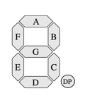{: .float-right .d-inline}
The 7-segment display, as its name implies, is comprised of 7 individually lightable LEDs, labeled A, B, C, D, E, F, and G. There is also a decimal point labeled DP, which we will not be using. Each segment is an LED. Recall that an LED has an anode and a cathode. The polarity matters for an LED; the anode voltage must be positive relative to the cathode for the LED to be lit. If the cathode is positive with respect to the anode, the segment is not lit.

On the 7-segment display we use,
the cathodes (ground) are all connected to a shared ground.
Such a display is called *common cathode*.

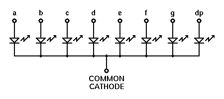{: .zoom}

To show a digit on the display, you create a circuit by connecting the
common cathode to ground and applying a voltage to the desired segment
pins. Turning on all seven segments would show the digit `8`.

The clock display in your kit has four 7-segment displays integrated into a single unit:

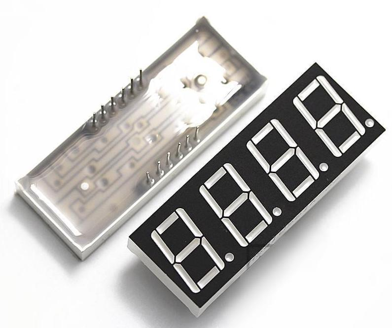{: .zoom .w-25}

Here is the internal schematic for the four-digit 7-segment display unit:

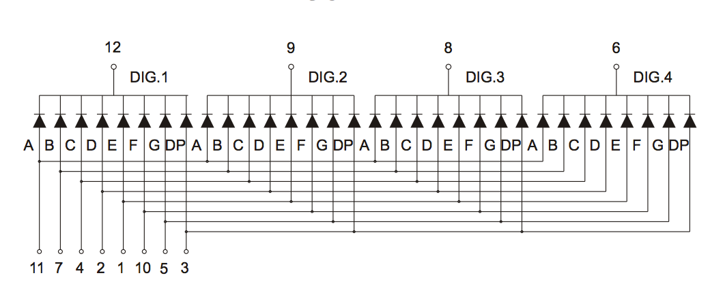{: .zoom .w-75}

Untangling the connections can be a bit tricky. There are twelve pins in total: four digit pins (`DIG.1`, `DIG.2`, `DIG.3`, and `DIG.4`) and eight segment pins (`A`, `B`, `C`, `D`, `E`, `F`, `G`, `DP`). Each segment pin connects to all four digits; start at the pin numbered 11 and follow its connections to the `A` segment for each digit. Each digit has its own unique ground, e.g. `DIG.1` is the cathode/ground pin for digit 1. Trace out how each of eight segments connect to this shared ground.

If you turn on segment pins `B` and `C` and connect `DIG.1` and `DIG.2` to ground, the first
and second digits both show `"1"` while the third and
fourth digits do not show anything, because they are not connected to ground.

Below is the pinout for the display unit. Note that the `DIG.1`,
`DIG.2`, `DIG.3`, and `DIG.4` labels have been shortened to `D1`, `D2`, `D3`, and `D4`. The pins are also numbered for reference. By convention, numbering starts at the bottom left corner (pin #1), and proceeds in a counter-clockwise fashion until reaching the upper left corner (pin #12).

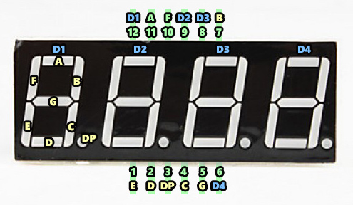{: .zoom}

#### 4b) Place resistors for segments

Start by connecting the power and ground rails of your breadboard to make accessing power and ground more convenient. Custom-fit a red wire to connect the two power rails and a black wire for the ground rails.

Pro-tip: Watch how Liana uses her tools to neatly fit a wire between two set points:


> When using the wire stripper, place the wire in the numbered hole that corresponds to the wire's gauge. The wire used for breadboarding is typically 22 AWG (or sometimes 20 or 24 AWG); read the label on the wire spool to identify the gauge you are using.
{: .callout-info}

My convention is to always orient my breadboard so that the blue ground rail is on
the bottom (after all, ground is underneath us).

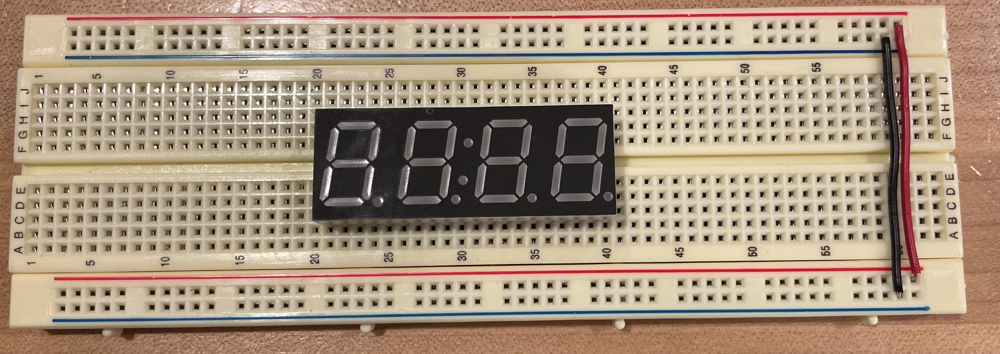{: .zoom }

Insert your display unit in the middle of your breadboard, with the decimal points on the bottom and the digits slanted to the right. Take note of which column numbers on the breadboard align with pinout of the
display unit. When the display unit is inserted into the breadboard you can no longer
see the pins underneath, so you want to know which breadboard column aligns with each pin. We chose to place our display unit so __pin 1 is inserted into column 30 on the breadboard__.

The LEDs in the display unit require a current-limiting resistor just as the LEDs in your larson scanner did. Place a 1K resistor bridging the middle of the breadboard to the right of the display unit. The resistor should sit neatly--- Liana shows how to use the pliers to make a sharp crease and clip the leads with the cutters for a nice secure fit.


Now you will make some temporary connections to the display unit to test turning on a single segment. We recommend that you use jumper cables when making these temporary connections. After validating your circuit, you will re-wire it in a neater and more permanent fashion.

The first test connection is to turn on the single segment B of digit 1. Below is a schematic for the circuit you will need. Take a moment to identify all of the components in the schematic. (click image to zoom)

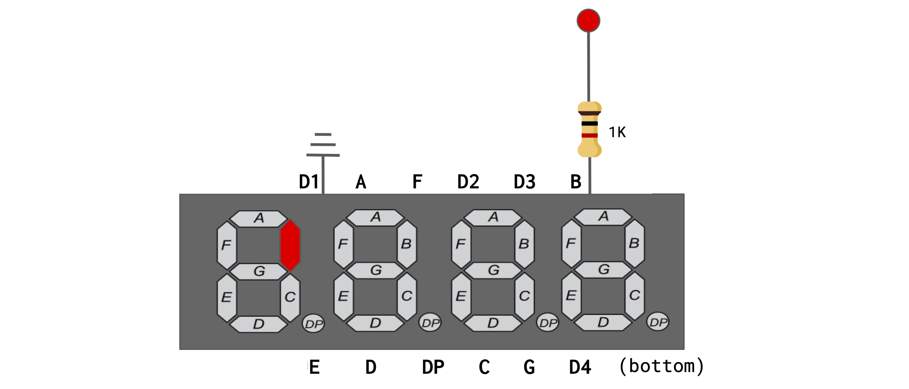{: .zoom }

- Follow the above schematic and build this test circuit on your breadboard.
	- Pick out three short male-male jumpers (orange for 3.3V, black for GND, and green).
	- Use the orange jumper to connect the red power rail to the top of the resistor.
	- Use the green jumper to connect the bottom of the resistor to segment B on the display unit. Consider: if pin 1 of the display unit is aligned with breadboard column 30, which column number aligns with the pin for segment B?
	- Use the black jumper to connect digit D1 on the display unit to the ground rail.
- Connect your breadboard to power and ground from your Mango Pi.
    - Pick out a pair of red and black male-female jumpers.
	- Use your ref card to identify 3.3V and ground pins on your Pi's header.
	- Use the red jumper to connect the 3.3V header pin to the power rail of the breadboard and the black to connect a ground header pin to the ground rail.

After tracing your circuit and confirming it is correctly constructed, power up the Pi. Segment B of the leftmost digit should light up (click photo to enlarge):

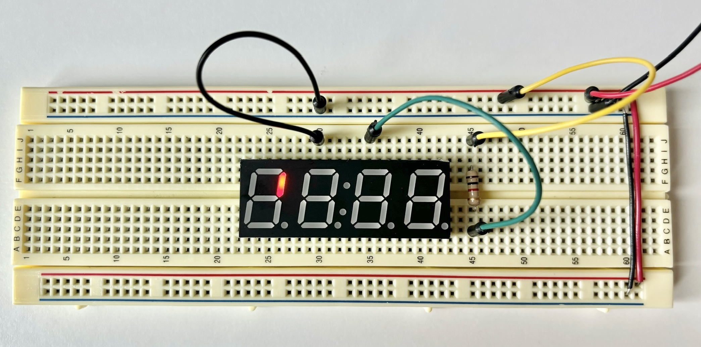{: .zoom}

You can change which segment and digit is lit by moving the jumpers to different pins on the display unit.  (Remember to disconnect your breadboard from power while you are fiddling with the wiring) Try moving the black jumper from digit 1 to digit 2. Segment B of digit 1 turns off and segment B of digit 2 turns on. If you add a second black jumper that grounds digit 3, now segment B will light on __both__ digits.  Note
that you cannot simultaneously light different segments on different digits: Why not?

Place 6 more 1K resistors on your breadboard next to the first one, bringing the total to 7, one for each segment A-G (we will not wire the unused 8th segment DP). We
suggest a layout where the leftmost resistor is connected to segment A, its neighbor
is to segment B, and so on such that the rightmost resistor is segment G.

After you have placed all resistors, time to test. Simultaneously wiring all segments with 7
jumper cables is much too messy; instead connect one segment
at a time and move the jumper to test each of the 7 segments. As you go, make a
sketch of the correct connection between each resistor and its pin on the display unit and save
it to refer to when wiring up the permanent circuit.

Follow the schematic below and connect jumpers to show `"1 1 "` on the display unit. Here a space means that the digit is blank (no segments
turned on).

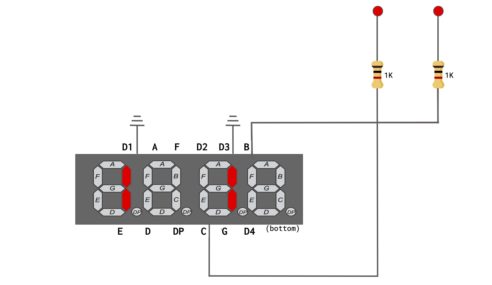{: .zoom}

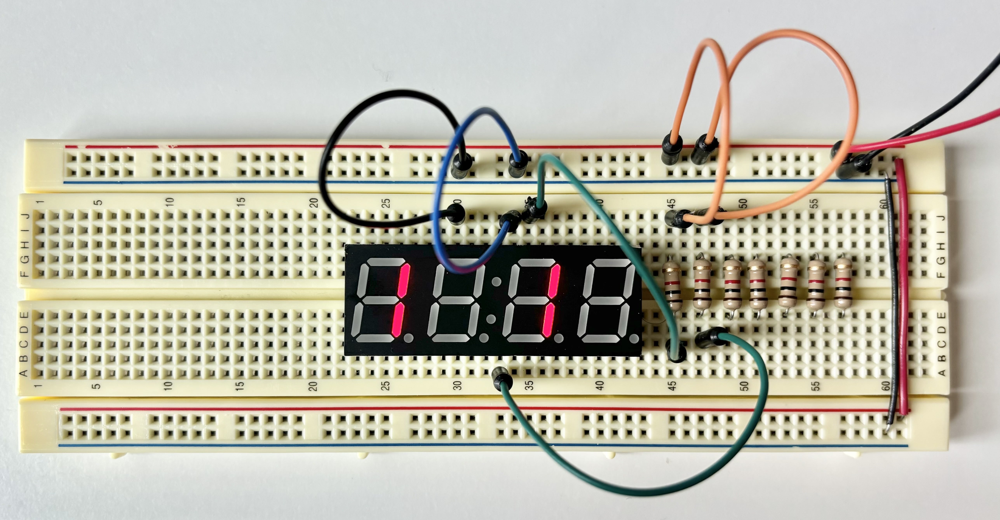{: .zoom}

You and you partner should now discuss check-in question on the 7-segment display[^4] and confirm with the TA before moving on.


#### 4c) Place transistors for digits

Up to now, you have been controlling whether a digit is on by adding or
removing a jumper that connects the digit pin to ground. We eventually want to
programmatically control which segments and digits are turned on,
so we need an electronic switch that can be controlled by a GPIO pin.
To do this we will use bipolar-junction transistors, or BJTs.

A transistor has three terminals— the base (B), collector (C), and emitter (E).
The base controls the amount of current flowing from the collector to the
emitter. Normally, no current flows from collector to emitter. This condition
is an open circuit. However, if you apply 3.3V to the base, the collector will
be connected to the emitter and current will flow. This is equivalent to
closing the switch.

We are using 2N3904 transistors. The following diagram identifies which
pins on the 2N3904 are collector, base, and emitter.

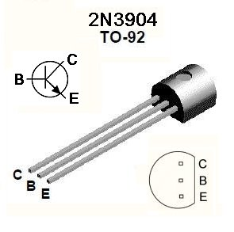{: .zoom .w-25}

The transistor cap has a flat side and a rounded side. If you are looking
at the flat side with the legs pointing down, the leftmost leg will be the
emitter.

Instead of wiring a digit pin directly to ground as before, you connect the digit pin to the collector of a transistor whose emitter is connected to ground.
Applying power to the transistor base activates the switch which then grounds the
digit pin.

Here are the steps to add the digit transistors to your breadboard:
- Disconnect any of the jumpers making temporary connections from a digit to ground.
- Place four transistors in your breadboard to the left of your display unit. We suggest a layout where the leftmost transistor controls digit D1 and the
rightmost controls D4.  Use cutters to trim the transistor legs so that it sits neatly
against the breadboard.
- Connect the emitter of each transistor to ground using a small custom-fit __black__ wire.
- Place a 1K current-limiting resistor to protect the base of each transistor.
- In the permanent circuit, the collector of each transistor will have a custom-fit wire to its digit pin. For now, use jumpers as temporary connections.

Test your transistors by using jumpers to make temporary circuits. Below is a schematic and photo where we've connected _both_ D1 and D3 to the collectors of transistors and applied power to the bases of those two
transistors. This circuit displays `"1 1 "`.

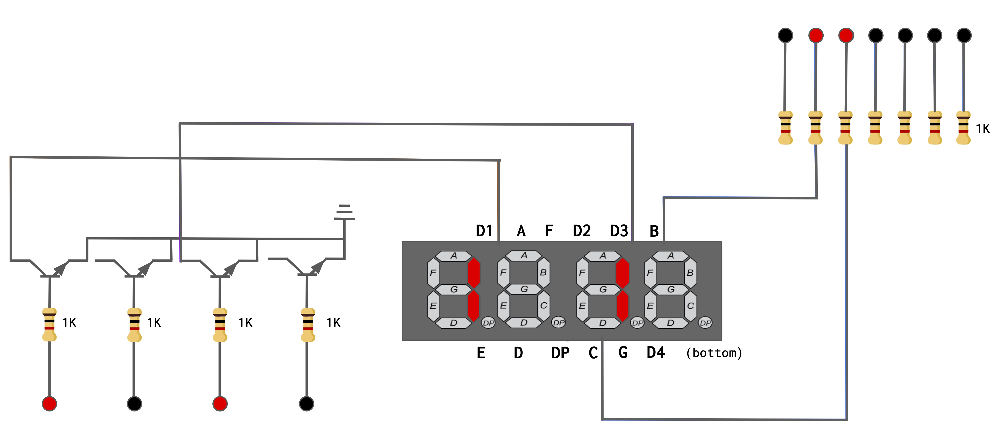{: .zoom .w-75}

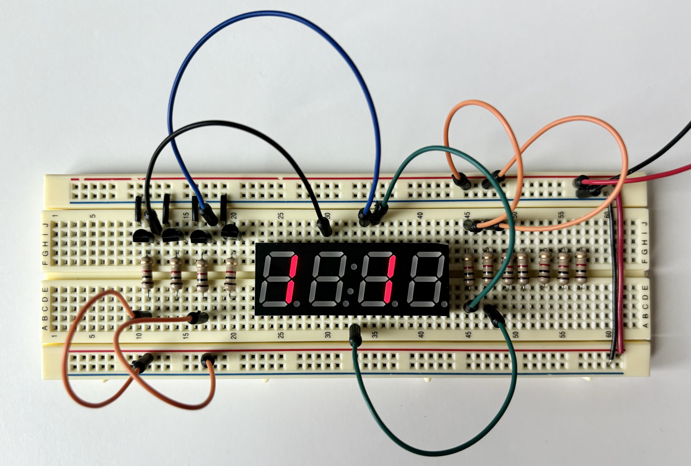{: .zoom .w-75}
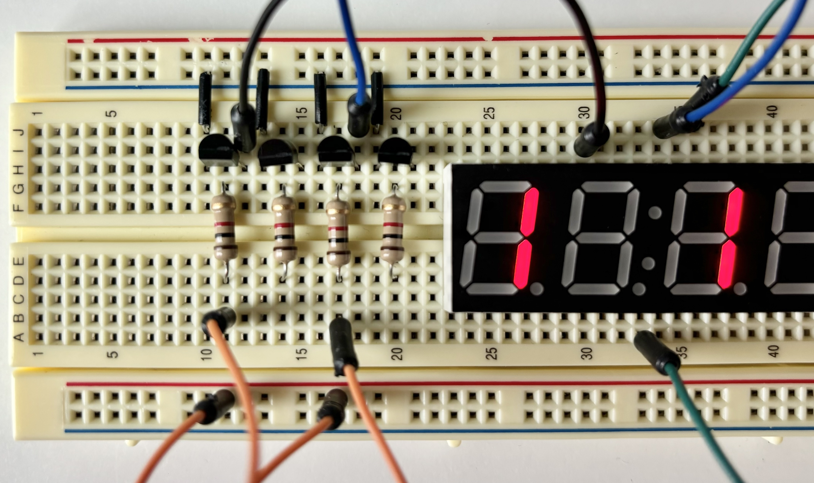{: .zoom .w-75}

#### 4d) Permanently wire circuit (start now, finish later)

Now comes the time-consuming part. Each segment pin needs to be connected to
its resistor and each digit pin connected to the collector of its transistor.
Be patient, this takes some time. Rather than do a rush job to finish in lab, 
instead practice with precise and neat wiring to get the hang of it. Carefully
review the schematic and ask questions about anything you find unclear. We want
you to leave lab with confidence that you can complete the rest of the circuit on your own.

Here is a photo of the breadboard with all components placed, ready to start wiring...

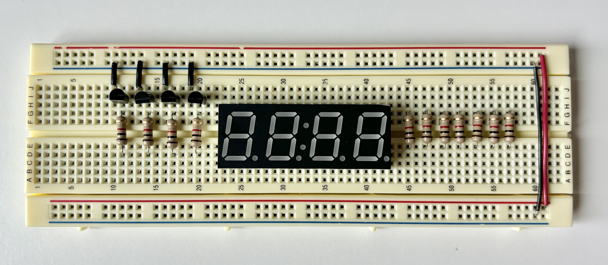{: .zoom}

...and here is a full schematic of what you will be wiring up:

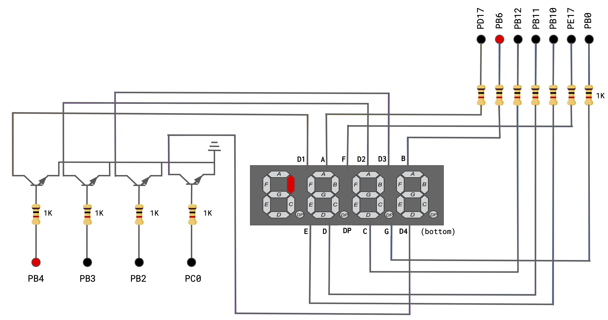{: .zoom .w-75}

In the full schematic, the 3.3V input we've been using up to this point has been
replaced by labeled dots where you will connect M-F jumpers to the GPIO pins on the Pi. The dots in the upper right connect to the GPIOs that control the segments, the dots on the lower left are for the digits. As an example, turning on gpios PB4 and PB6 will light segment B of digit 1.

As you wire your breadboard, custom-fit your wires to the proper length and arrange them neatly.  When the circuit is tidy, it's easier to see if everything is set up correctly. If you didn't have a chance before lab to watch [Ben Eater's technique](#prelab-preparation), do it now!

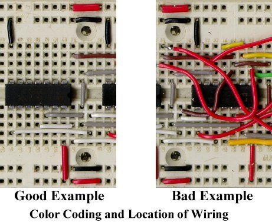{: .zoom}

Take your time and check your work. A little bit of care here will save you a lot of time later, because, if your system has a bug, the set of things that you have to check is much smaller. For added readability of your circuit, use different colors of wire to annotate the wire's purpose. In our example breadboard shown below, we used green wire for the segments and purple for the digits. Within the group, we used white for the first wire (e.g. D1 and segment A) to remind of the proper orientation for the connections.

The finishing touch is to add a pushbutton that will start the clock. The button is not connected into the display circuit. It is wired to the power rail through a 10K pull-up resistor and connected to gpio PG13 to be read as an input. (If you did not finish the [button exercise from last week's lab](/labs/lab1#button), review it now!) You can squeeze an optional second button alongside the first one. The second button is only used for an assignment extension.

Here are photos of the completed breadboard, looking sharp! Ben Eater would be proud!

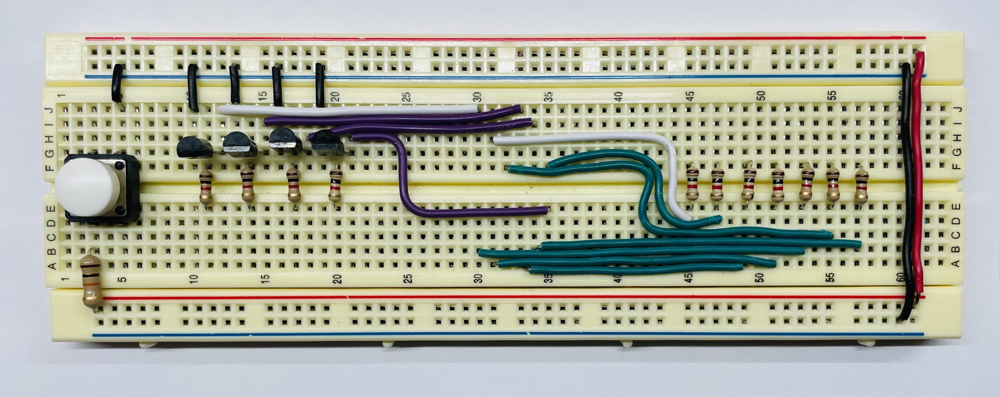{: .w-75 .zoom}
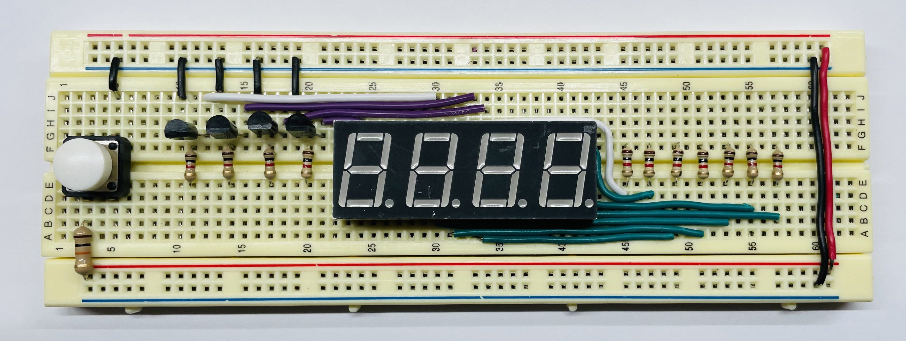{: .w-75 .zoom}

## Check in

Be sure to check in with us during lab. We want to confirm that you make a solid start on your clock breadboard and a clear understanding of how to complete the remaining tasks on your own.

[^1]:  Which of the two variables in `wait_until_low` needs to be be qualified as `volatile`?

[^2]:  Using the Makefile shown in exercise 2, trace what happens when you issue `make` with no command-line arguments. What target does `make` try to build? How does it determine which actions to take to build that target?

[^3]:  You run a program with a sequence of 10 asserts on the Pi and get the flashing light of doom. Describe your strategy to narrow in and identify which test case(s) is failing. What happens if the program has a bug in a test case that causes it to enter an infinite loop-- what then would you expect to be the observed behavior when testing?

[^4]:Which pins must be connected to show `"3"` on the first digit? Which additional pins much be connected to show `"3333"` across all four digits? Why is it impossible to simultaneously show `"3"` on the first digit and `"4"` on the second? (The trick to doing so, as you will see in the assignment, is to quickly switch between digits to create the illusion of displaying `"34"`)

__Don't forget to clean up!__ Before leaving, be sure to discard all debris and return shared tools.  We all appreciate having a tidy and neat workplace.
{: .callout-warning}
