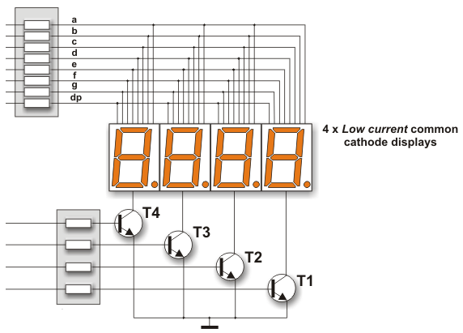
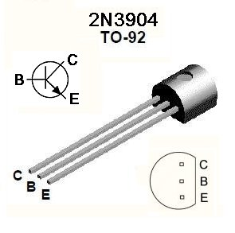
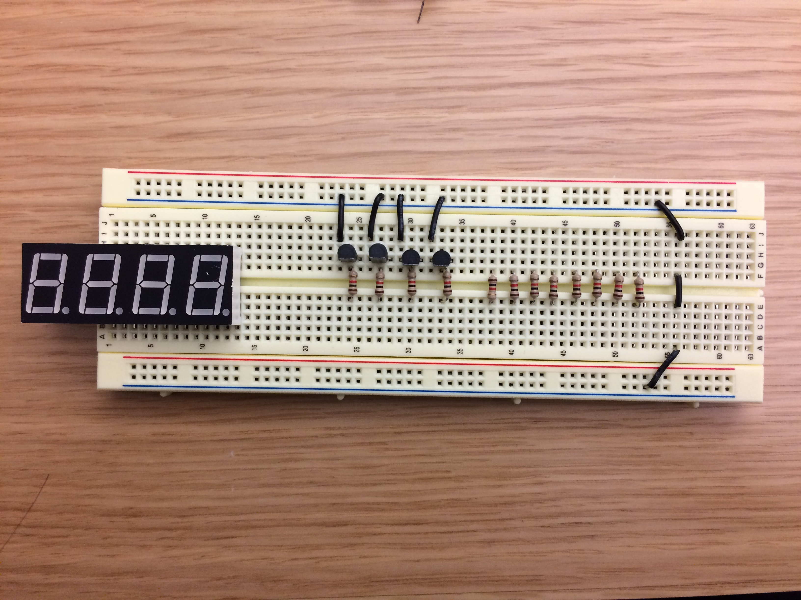
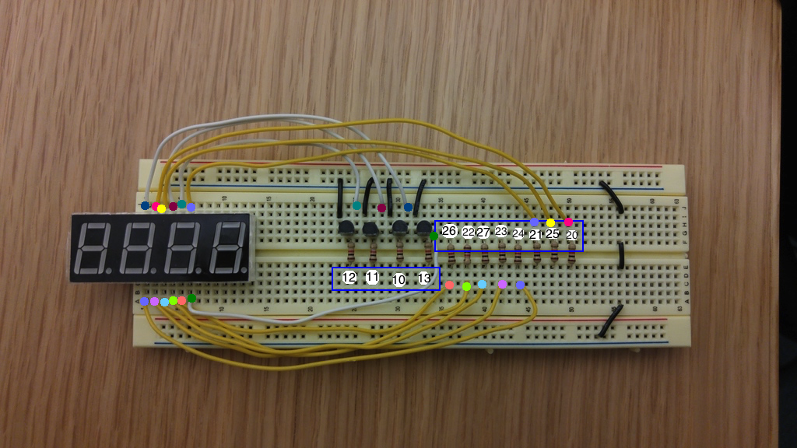
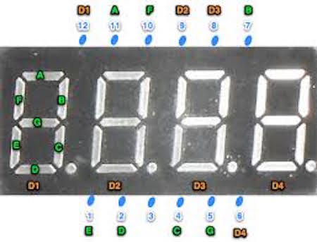

*Lab written by Pat Hanrahan*


Death Valley, CA.

### Goals

During this lab you will:

1 Understand the assembly language produced by gcc when compiling a C program.

2 Setup up a 4-digit 7-segment display 
for your next assignment - building a clock.

3 Understand ```make``` and ```Makefiles```

We have broken the lab into 3 sections. 

**To complete the lab, you must answer the questions in the
[checklist](checklist).**

### Prelab preparation

To prepare for this lab, you should do the following.

1 Read the [gcc](/guides/gcc) tutorial
about how to compile C programs for bare metal
programming on the Raspberry Pi.

2 Read the [make](/guides/make) guide
on setting up makefiles for cross-development
on the Pi.

To start this lab, find the `cs107e.github.io/labs/lab2/code` directory.
You may need to pull from the `cs107e.github.io` repository
to get the latest code.
(Run `git pull` in your cloned `cs107e.github.io` folder from the previous lab.)

### Lab exercises

#### 1. Compiling C to assembly

The goal of this exercise is to understand how C is translated 
into assembly language. You won't have much occasion to hand-code 
gobs of assembly, but you will do a lot of __reading__ assembly.

We want you to have an intuitive understanding of 
how the compiler generates assembly from C
and to be able to inspect that assembly to better understand 
what is happening when executing a program.
As we will see, sometimes the assembly language
produced by the C compiler can be surprising. 
Using your ARM superpowers, you can dig into the generated 
assembly and figure out what the compiler did rather than sit 
there dumbfounded when an executing program does not behave as expected!

Change to the `codegen` directory. Review the C code in the `codegen.c`
and `ptrs.c` source files.

The code is decomposed into a number of functions, each of which explores 
a particular issue for code generation. You will have to wait until
Friday's lecture to hear about the operation of C function call/return, so 
for now, take it on faith that the first four parameters are placed
in r0, r1, r2, and r3, the return value is to be written to r0, and
the ARM instructions `bl` and `bx` direct control to/from a subroutine.

The comments in `codegen.c` guide you through four issues: (a) constant folding
(b) if/else versus switch (c) undefined behavior and ARM divide 
and (d) loops and loop unrolling. In `ptrs.c` there are three parts: 
(a) dead code elimination (b) pointer/array access
and (c) pointer/bitwise expressions for access to GPIO.

During lab time, we'd like you to work through parts labeled (a) and (c) of codegen.c
and (a) and (b) of ptrs.c.  Use the comments in the C source as your guide.
You are encouraged to explore the remaining parts
in lab if you have time or leave for later completion on your own. 

Keep in mind that a great way to learn how a system works is by trying things. 
Curious or unusre what ARM is used for a given C construct? Type it up and run 
it through the compiler to find out!


#### 2. Basics of your 4-digit 7-segment display

Your next assignment will be to build a simple clock
using a 4-digit 7-segment display. 

Each digit on the 7-segment display is comprised of 7 individually
lightable LEDs, normally labeled A, B, C, D, E, F, G.  There is also a
decimal point labeled dp.  The displays we will use are called common
cathode displays. The cathode is common to all the LEDs.
Recall that the cathode is connected to the negative side
of the power supply, normally towards Ground.

 

We will be using a display with 4 digits,
all integrated into a single unit.
The displays we are using are from 
[Adafruit](http://www.adafruit.com/products/865).

In this lab, you should wire up the display on your breadboard.
Below is a schematic for the entire circuit.



The anodes for the LEDs comprising each segment are
labeled A, B, C, D, E, F, G and "dp",
and correspond to the segments of the digit as shown above.

Each of the anodes should be connected to a 1K
current limiting resistor (shown as a rectangle in the schematic).
One end of each resistor will connect to a GPIO pin on the raspberry Pi,
and the other end to the pin on the 4-digit display.
Recall again that the anode is connected to the positive side
of the power supply.

In the schematic, you may notice that each segment (A-G) is wired to all 
four digits (this wiring is internal to the display). If you turn on segment A,
it will actually turn on all four digits. (To have different digits show different things,
you actually have to cheat -- you need to turn on one digit, turn on the segments
for the number you want to show, and then turn that digit off,
turn on the next digit and
the segments for that, in a loop through all the digits.)

So we'll be using 12 GPIO pins on the Pi in this lab: 8 pins to control which segments
are turned on, and then 4 pins to control which digits are turned on.

To control which 
digit is lit up at any one time, we will use bipolar-junction transistors,
or BJTs. 
There are 4 transistors, one per digit.
The collector (C) of the transistor is connected
to the pin on the 4-digit display. 
The emitter (E) is connected to ground.
The base (B) of the transistor is connected to the GPIO pin of the
raspberry pi (through a resistor).
When the GPIO is set to high, 3.3V is applied at the base
of the transistor.
The transistor will turn on and 
it will allow current to flow from the common cathode of one of the
display digits to ground, thus completing the circuit 
and lighting up that digit. 
The following diagram identifies which
pins on the 2N3904 are collector, base, and emitter.



Remember to answer the checklist questions. What segments do you need to 
turn on to make a 0?  A 1?

#### 3. Wire up the display



First, place the 4 segment display onto the very end of the board starting at row 1. 
Next, follow the diagram to place twelve 1K resistors and the four transistors onto the board. 

For the transistors, make sure the flat side of the transistors
faces toward the center of the breadboard. The left most leg (E on the diagram) of each transistor should be connected to ground and the middle leg (B on the diagram) should be connected to a resistor.

Finally, connect the two ground rails!

Just to give a little background on the components: the transistors
are essentially switches -- when connected, the transistors become a
pathway to ground. The switch gets closed when a high voltage value is
sent into B. The resistors are a necessary intermediary
between the Raspberry Pi pin and the display pin to limit the current
that enters the display pin.

##### Connecting to the Display pins 

It’s time to connect the display pins to the C legs of the transistors and the resistors so we can drive the display pins. 




Here, GPIO pins 10-13 controls the digits where pin 10 controls the first digit, pin 11 controls the second digit, etc. GPIO pins 20-27 controls the 8 segments on the display A-F and the decimal where pin 20 is A, pin 21 is B, etc.

Follow the two diagrams to connect each resistor and each remaining transistor leg to the corresponding display pin by matching the colored dots. 

Finally, connect the resistors to the corresponding Pi pins as labeled.

##### Testing

We need to ensure that everything is wired properly. To do so, let’s
do a simple test: light up segment A of digit 1. Recall that requires
sending high voltage to the B gate of the transistor connected to
digit 1 (the one controlled by GPIO pin 10) and sending high voltage
to the resistor connected to segment A (the one controlled by GPIO pin
20).

If everything is working as it should, try turning on segments B
through DP one at a time for the first digit. Finally, loop through the digits. 
Then you can try lighting up multiple digits and/or segments.

Here are videos of what it should look like if everything is wired properly. 

Cycling through the segments and digits by manually powering a digit
pin and a segment pin:

<iframe width="420" height="315" src="https://www.youtube.com/embed/uXdsBATrHBU" frameborder="0" allowfullscreen></iframe>

Lighting up multiple digits at once (notice that the same segments are
lit on each digit):

<iframe width="420" height="315" src="https://www.youtube.com/embed/q1n5YkT_cLI" frameborder="0" allowfullscreen></iframe>

For reference, [here are pin-outs for the 4-digit displays](http://img1.cdn.tradevv.com/Y201201M1186283T1G1366376/NFD-5641ABUx-21.pdf).

#### 4. Understand Makefile

Break into pairs and read the following Makefile.

```
ARMGNU = arm-none-eabi
CC = $(ARMGNU)-gcc
CFLAGS = -g -Wall -std=c99 -Og -ffreestanding
OBJCOPY = $(ARMGNU)-objcopy
OBJDUMP = $(ARMGNU)-objdump
NAME = myfile

all: $(NAME).bin
     
%.bin: %.o
       $(OBJCOPY) $< -O binary $@

%.o: %.c
     $(CC) $(CFLAGS) -c $< -o $@

%.list: %.o
	$(OBJDUMP) -d $< > $@

install: $(NAME).bin
	 rpi-install.py $<

clean:
	rm -f *.o *.bin
```

Discuss and document all the various features and syntactical constructs used
in this Makefile. 

 - What do each of the CFLAGS do?
 - What happens if you just type `make`? Which commands will execute?
 - If you modify myfile.c and run `make` again, which commands will rerun?
What part of each target indicates the prerequisites? (A prerequisite means 
that if that file changes, then the target is stale and must be rebuilt)
 - What do the symbols `$<` and `$@` mean?

Now that you understand this simple Makefile, take a look at the one in the
`codegen` directory. That is an example of a more complete Makefile and is the
one we will work with and modify for labs and assignments in this class.
When you have time (now or later), go through that Makefile and ensure you
understand it as well.
