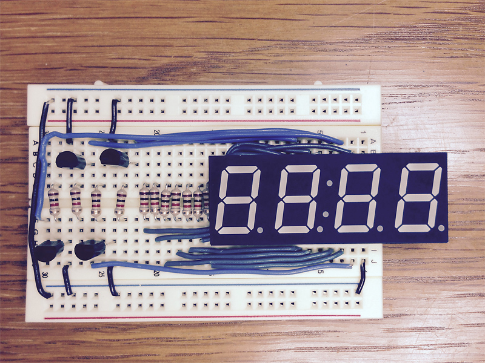
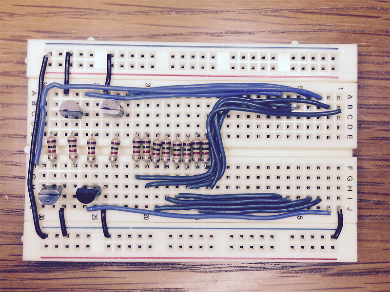
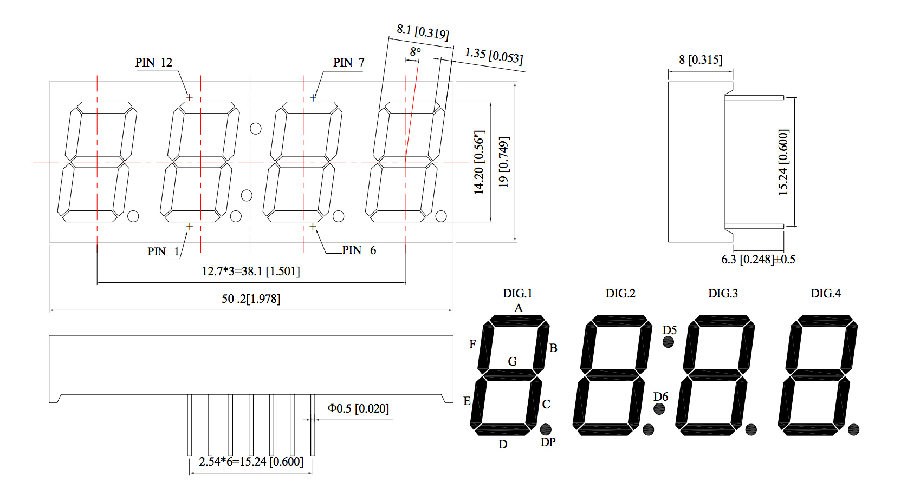
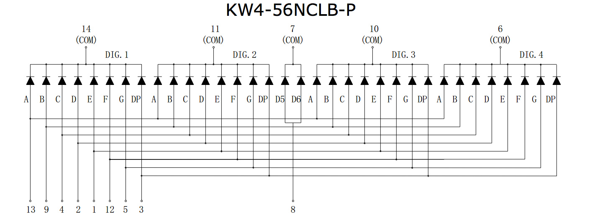
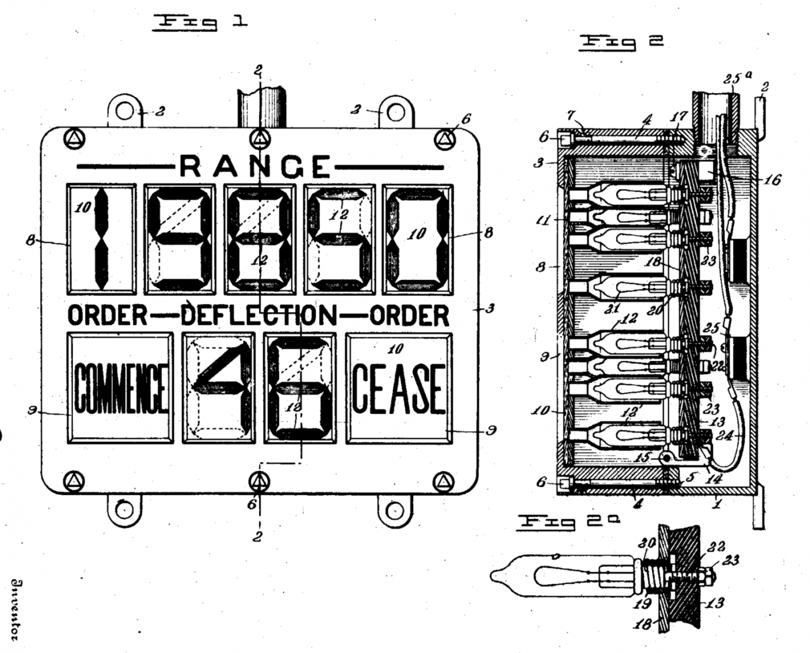

## Lab 2: Below C Level

*Lab written by Pat Hanrahan*

Death Valley, CA.

### Goals

During this lab you will:

1 Learn how to simulate the ARM processor using gdb.

2 Understand the assembly language produced by gcc when compiling a C program.

3 Setup up a 4-digit 7-segment display 
for your next assignment - building a clock.

We have broken the lab into 3 sections. 
To complete the lab,
you must answer the questions in the 
[check list](checklist.md).

### Prelab preparation

To prepare for this lab, you should do the following.

1 Read the [gdb](../../guides/gdb.md) tutorial 
about how to debug the ARM processor using 
gdb in simulate mode.

2 Read the [gcc](../../guides/gcc.md) tutorial
about how to compile C programs for bare metal
programming on the Raspberry Pi.

3 Read the [make](../../guides/make.md) guide
on setting up makefiles for cross-development
on the Pi.

To start this lab, find the `courseware/labs/lab2/code` directory.
You may need to pull from the `cs107e/courseware` repository
to get the latest code.
There are four sub-directories, `blink`, `simple`, `volatile`, and `opt`. 
Make a working copy of these three directories and proceed.

### Lab exercises

1 **Simulate the blink program using gdb**

The goal of the first exercise is to teach you how
to use gdb in ARM simulation mode. 
This is useful as a way of learning what
happens when ARM instructions are executed,
and to debug programs.

Change to the blink directory.
Assemble and link the program using make.

    % make
    arm-none-eabi-as -g blink.s -o blink.o
    arm-none-eabi-ld blink.o -o blink.exe

Follow the steps in the [gdb guide](../../guides/gdb.md).
This guide walks you through how to setup gdb 
to simulate the ARM processor.
You will load `blink.exe`,
set a breakpoint at `_start`, and then run the program.
Execution will stop at the breakpoint,
and then you can 
single step through the program inspecting registers and memory.
Follow the entire guide and make sure you understand what is going on.

The final part of this exercise is to understand the 
*current program status register (CPSR)*.
Continue stepping through blink until you enter the delay loop.
Inspect the values of `CPSR` each time through the loop.
What value does `CPSR` have when `bne` returns to `wait1`?
What values does `CPSR` have when `bne` does not branch,
and the loop is exited?

Record your answers to the first question on the check list.

2 **Compiling C to assembly**

The goal of the second exercise
is to understand how C is translated into assembly language.
We want you to have an intuitive understanding of 
what the processor does when you write C programs,
and to be able to inspect the results to check 
that what you expect to happen does in fact happen.
As we will see, sometimes the assembly language
produced by the C compiler can be surprising.

Change to the `simple` directory.

Study the makefile.

    % cat Makefile
    ARMGNU = arm-none-eabi
    CFLAGS  = -O2 -nostdlib -nostartfiles -ffreestanding

    all:
        $(ARMGNU)-gcc -c $(CFLAGS) simple.c
        $(ARMGNU)-objdump simple.o -d > simple.s

    clean:
        rm *.s *.o 

This makefile first compiles `simple.c` to make `simple.o`.
It then disassembles `simple.o` to produce the
assembly language program `simple.s`.

    % make
    arm-none-eabi-gcc -c -O2 -nostdlib -nostartfiles -ffreestanding simple.c
    arm-none-eabi-objdump simple.o -d > simple.s
    % ls
    Makefile    simple.c     simple.o     simple.s

Look at the functions 
`simple_mul_3`, 
`simple_mul_12`, 
`simple_div_3`, 
`simple_div`, 
`deadcode`, and
`foo`.
Note that the instruction `bx lr` returns from the subroutine.
We will discuss how subroutines are called in the next lecture.

Does the assembly language match what you expect?
What optimizations are being made by gcc.

Now change into the directory `volatile`,
and take a look at `volatile.c`

    int volatileint(void)
    {
        volatile int *ptr = (int*)0x20200008;
        int val;
        int i;

        for( i = 0; i < 10; i++ )
           val = *ptr;
        return val;
    }

Inspect the assembly language that was produced. 
Do you understand what is going on?

Remove the `volatile` keyword

    int *ptr = (int*)0x20200008;

Look at the assembly language after the change. What happened?

The `volatile` keyword is necessary because if you
read from a GPIO register, it may change on its own
without the program doing anything.
The C compiler may assume nothing has changed,
when it has in fact changed.
If nothing changes, gcc is going optimize the code,
in this case removing the entire loop!

Finally, if you have time and want to try some more complicated examples,
change to the `opt` directory. 
Look at the code generated for different types of 'switch' statements.

3 **Wire up your 4-digit 7-segment display**

Your next assignment will be to build a simple clock
using a 4-digit 7-segment display. 

Each 7-segment display is comprised of 7 individually
lightable LEDs, normally labeled A, B, C, D, E, F, G.
There is also a decimal point labeled dp.
The displays we will use are called common cathode displays.
The cathode is common to all the LEDs. 

 

We will be using a display with 4 digits,
all integrated into a single unit.
The displays we are using are from 
[Adafruit](http://www.adafruit.com/products/865).

In this lab, you should wire up the display on your breadboard.
Here is the schematic for the entire circuit.

The anodes for the LEDs comprising each segment are
labeled A, B, C, D, E, F, G and "colon",
and correspond to the segments of the digit as shown above.
Each of the anodes should be connected to a 1K
current limiting resistor (shown as a rectangle in the schematic).
One end of the resistor will connect to the GPIO pin on the raspberry Pi,
and the other end to the pins on the 4-digit display.

The digits themselves are controlled using a bipolar-junction transistor,
or BJT. 
The base of each transistor will be connected to the
GPIO pin on the Raspberry Pi.
The collector of the transistor is connected
to the pin on the 4-digit display.
The emitter is connected to ground.
The following diagram identifies which
pins on the 2N3904 are collector, base, and emitter.

When wired up properly,
applying 3.3V to the base will turn the transistor on,
which will then turn on all the segments for that digit.
There are 4 transistors, one per digit.

Here are two photos of the breadboarded circuit that I built.

Test it as you build it step-by-step.
For example, start by connecting one end of a resistor to the A pin,
and then other end to 3.3V.
Next, ground digit 1.
Providing power to the anode while the cathode is grounded should
turn on segment A.
Map out all the pins systematically in this way.

Then wire up a transistor for digit 1 as shown in the schematic.
When you apply 3.3V to the base of the transistor,
you should turn on segment A.
When the transistor turns on,
it has the effect of connecting digit 1 to ground.

What segments do you need to turn on to make a 0?  A 1?

**Additional Resources**

Here are pin-outs for the 4-digit displays. The pin on the lower
left when looking at the display in reading order is labeled pin 1.

 

For additional information of these parts, 
consult the [datasheet](doc/4digit.pdf).

The original 7 (8?) segment display invented in 1908 by Frank Wood
[Hackaday](http://hackaday.com/2015/01/09/the-original-seven-eight-segment-display/)

