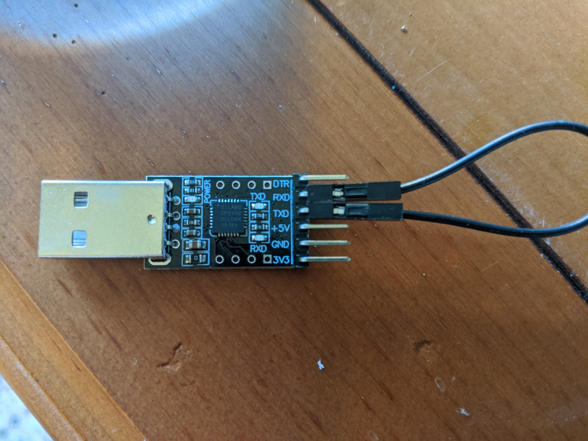


Task list to copy/paste when creating PR for this lab:

__Before releasing lab3:__
- [ ] Review writeup/code/checkin questions (instructor)
- [ ] Walk through (SL)
- [ ] Re-take photo of loopback on latest CP2102
- [ ] Followup on issues from previous quarter postmortem (issue #)

__To prep for lab3:__
- [ ] Be extra careful when reviewing exercise 1, make sure nothing has changed to invalidate the typescript embedded in writeup
- [ ] Make copies of gdb reference sheet to hand out in lab


*Lab written by Pat Hanrahan, updated by Julie Zelenski*

## Goals

During this lab you will:

- Learn how to use `arm-none-eabi-gdb` in simulation mode. 
Simulation mode is also a good way to learn more about how the ARM processor executes instructions.
- Use gdb to trace through function call/return and examine registers and memory.
- Learn how to use `screen` with the USB-serial adapter. Also understand how the UART peripheral works on the Raspberry Pi.
- Implement a few simple C-string operations and use a combination of
unit testing and gdb simulation to debug your work.

These are all very useful background work for you next assignment, implementing a `printf` library.

## Prelab preparation
To prepare for lab, do the following: 

1. Read our [guide to using gdb in simulation mode](/guides/gdb).
1. Review this [recap of stack frames](stack/).
1. Pull the latest version of the `cs107e.github.io` courseware repository. 
1. Clone the lab repository `https://github.com/cs107e/lab3`.

## Lab exercises
Find a buddy (or two) to join up in a breakout room with. Show off your clock 
breadboards to each other. Pull up the [check in questions](checkin). You're 
ready to go!

### 0. Merging assignment 1 branches into master

Let's start with a little house-keeping: since assignment 1 grades have been released,
we can now merge in the assignment branches (assign1-basic and assign1-extension)
into the master branch of your assignments repo. Doing so will ensure that all of your graded
assignment code lives in a single place. As you continue to submit and receive grades for 
assignments, you'll continue to merge your assignment branches into master. By the end of the 
quarter, your master branch will contain all of the assignment code that you've written over 
the course of the quarter! We know that git can be an intimidating tool to learn at first,
which is why we want to walk you through the process here in lab so that we can answer questions
that arise.

To start, switch to your assignments repo and checkout and update the master branch:
```
$ cd ~/cs107e_home/assignments
$ git checkout master
$ git pull
```

Now, merge in the assign1-basic branch:
```
$ git merge assign1-basic
$ git push
```

If prompted to enter a commit message for the merge in vim, press `:x` to use the default
merge commit message.

If the merge succeeded (i.e. no merge conflicts arose), then you can delete the local branch:
```
$ git branch -d assign1-basic
```

Now, the assign1-basic branch no longer exists locally (i.e. in your copy of your repo on your
computer) but it still exists remotely. To confirm that it still does exist remotely, pull up your
repo on [GitHub](https://github.com/cs107e) and click on the branches drop-down menu. After doing so, 
you can delete the remote branch:
```
$ git push origin --delete assign1-basic
```

Again, head back to GitHub and confirm that the remote branch was successfully deleted.

Merging the assign1-extension branch (if you have one) follows the same steps as above except for that
it requires a preprocessing step at the beginning. In both the basic and extension portions of the assignment,
you modified `src/apps/larson.s`. If you merge the assign1-extension branch into master after merging the assign1-basic
branch, you'll overwrite your basic version of the assignment. To avoid this, we'll rename `src/apps/larson.s` to 
`src/apps/larson_ext.s` after checking out the assign1-extension branch:
```
$ git checkout assign1-extension
$ mv src/apps/larson.s src/apps/larson_ext.s
$ git add --all
$ git commit -m "rename extension larson.s"
$ git checkout master
$ git merge assign1-extension
$ git push
```

Confirm that you have `src/apps/larson.s` and `src/apps/larson_ext.s` on the master branch. Once you've confirmed this, you can go
ahead and delete the assign1-extension branch by repeating the delete process that you carried out for the assign1-basic branch.

And that's it! You've successfully merged all of your hard work on assignment 1 into your master branch.

### 1. Debugging with gdb

The goal of the first exercise 
is to practice using the `gdb` debugger in ARM simulation mode.
The debugger allows you to observe and manipulate a running program. Using this 
tool will teach you more about how ARM instructions are executed and allow you 
to debug your programs. When you are debugging bare metal code,
there's a way to hook up `gdb` to a live processor using a hardware connection
called JTAG: this requires some special hardware, though, so in this class
we will stick with using `gdb` to test our code in simulation and rely on
`printf` to debug on the Pi.

`gdb` is an amazingly powerful and useful tool. When debugging C code,
proficiency with `gdb` can improve your debugging speed by a factor of 10,
or in the hands of an expert, a factor of 100. It gives you complete
visibility into a program: if you know where to look, you can find out
exactly what is happening and what your bug is. Mastering it is just
as important as mastering your text editor.

#### 1a) Use `gdb` in simulation mode

We will demonstrate `gdb` on a simple example program. 
Change to the directory `lab3/code/simple` directory and review the program in `simple.c`. 

Build the program using `make`. Note that is the ELF 
file that we use in conjunction with the gdb simulator, 
not the raw binary file that we have been running on the actual Pi.

Run gdb on `simple.elf`. 


```
$ arm-none-eabi-gdb simple.elf
GNU gdb (GDB) 7.8.1
Copyright (C) 2014 Free Software Foundation, Inc.
       ... blah blah blah ...
+++ CS107E local .gdbinit successfully loaded +++
(gdb) 
```

When started, gdb displays several lines of output, unfortunately that chatter can obscure warnings or errors buried in there that may require attention.

On Mac, you may get warnings about missing Python gdb modules; these warnings can be ignored. 

On WSL, you may get a warning about "gdbinit auto-loading declined"; this situation requires action on your part to resolve. Follow these steps:
- Use `quit` to exit gdb. 
- Open the text file `~/.gdbinit` in your editor. Append the line below verbatim:

        set auto-load safe-path /
- Save the file and exit your editor. 
- Run gdb again. The previous warning should be gone and instead you see the message "CS107E local .gdbinit successfully loaded" in its place.
- You will only need to make this edit once, gdb is now configured for all time.

Within `gdb`, connect to the simulator and load the program:

```
(gdb) target sim
Connected to the simulator.
(gdb) load
Loading section .text, size 0x188 vma 0x8000
Start address 0x8000
Transfer rate: 3136 bits in <1 sec.
```

Set a *breakpoint* on the `main` function and start executing the program:

```
(gdb) break main
Breakpoint 1 at 0x80e4: file simple.c, line 35.
(gdb) run
Starting program: .../lab3/code/simple/simple.elf 
Breakpoint 1, main () at simple.c:35
```

The debugger stops the program when it reaches the breakpoint. The `next` command executes
the next line of C source.
The command `print d` shows the value of `d`
after the call completes. 

```
Breakpoint 1, main () at simple.c:35
35 {
(gb) next
38      int d = diff(x, y);
(gdb) next
39      int f = factorial(7);
(gdb) print d
$1 = 74
```

Note that when `gdb` shows your program stopped at a line, 
it's stopped  _before_ that line has executed. At the end of the sequence shown above, the program is stopped before calling 
`factorial`. If you attempt to print `f`
before executing its declaration statement, the debugger
will report that the variable is not (yet) accessible.

Sometimes you want to step __into__ the code of the function being called.
To do this, use `step` instead of `next`. Put another
way, `next` executes the entire next line in the function
you're in, while `step` executes the next line of code, 
which may be in a different function.

Use `run` to restart the program
and then use `step` you hit the breakpoint.

```
(gdb) run
The program being debugged has been started already.
Start it from the beginning? (y or n) y

Breakpoint 1, main () at simple.c:35
35	{
(gdb) step
38      int d = diff(x, y);
(gdb) step
diff (a=a@entry=33, b=b@entry=107) at simple.c:31
31      return abs(a - b);
```

Execution has stepped into `diff` and is stopped at the first line of the function.  Another `step` from here will step into the call to the `abs` function.

```
(gdb) step
abs (v=v@entry=-74) at simple.c:9
9   }
```

When using stepping through code, gdb displays the single next line of code to be executed. To see more context, use the `list` command
```
(gdb) list
4   int abs(int v)
5   {
6       int result = v < 0 ? -v : v;
7       return result;
8   }
9 
10  int factorial(int n)
11  {
12      if (n <= 1)
13          return 1;
```

Use `continue` to resume executing the program. While the program is executing, type `Control-c` to interrupt the running program and return control to gdb. Use the `backtrace` command to see where the program was executing when it was interrupted (ok to ignore the Python exception about frames on Mac):

```^C
Program received signal SIGINT, Interrupt.
0x0000800c in hang ()
(gdb) backtrace
#0  0x0000800c in hang ()
#1  0x0000800c in _start ()
Backtrace stopped: previous frame identical to this frame (corrupt stack?)
```

The above information tells you that the program is stopped in `hang` which is called from `_start`. Review the code in `start.s` and `cstart.c` to remind yourself of what happens in a C program before and after `main()`. If currently in `hang`, the program has finished and is in the final "holding pattern". This is the normal behavior for a C program that has successfully run to completion. Learn to recognize how this situation is presented in the debugger. You hope to be seeing a lot of successful program completion!

When debugging a function, a common workflow is to

  1. `break` on the function in question. `run` until you hit the breakpoint.
  1. Use `next` to step through each line of its code, inspecting variables to see where
     the problem occurs.
  1. If the next line of code is a call to a subroutine and you suspect the problem could be inside that call, use `step` to drop down into it.  If you `next` through a call and realize that you wish you had used `step` instead, use `run` to start over from the beginning and get another chance.
  1. Recursively apply rules 2-3 until you find the bug.

<a name="1b"></a>
#### 1b) Use `gdb` to trace function calls
If you didn't get a chance to do the pre-lab reading, review this recap on [stack frames](stack/) now.

There are gdb commands that allow you to drop down to the assembly instructions and view the contents of registers and memory.  Let's try them out!

Use `delete` to delete any existing breakpoints and set a breakpoint at the `diff` function:

    (gdb) delete
    Delete all breakpoints? (y or n) y
    (gdb) break diff
    Breakpoint 2 at 0x80c4: file simple.c, line 30.
    (gdb) run
    Breakpoint 2, diff (a=a@entry=33, b=b@entry=107) at simple.c:30

We asked for a breakpoint on the function `diff` and gdb converted our request to `0x80c4` which corresponds to the address of the first instruction of `diff`. A breakpoint set at _0xAddr_ will stop the program just before executing the
instruction at _0xAddr_. 

The command `disassemble` with no arguments lists the ARM instructions in the context where the program is currently executing. The instruction marked `=>`is the next one to be executed.
    
```
(gdb) disassemble
Dump of assembler code for function diff:
=> 0x000080c4 <+0>:     mov r12, sp
   0x000080c8 <+4>:     push {r11, r12, lr, pc}
   0x000080cc <+8>:     sub r11, r12, #4
   0x000080d0 <+12>:    rsb r0, r1, r0
   0x000080d4 <+16>:    bl  0x8010 <abs>
   0x000080d8 <+20>:    sub sp, r11, #12
   0x000080dc <+24>:    ldm sp, {r11, sp, lr}
   0x000080e0 <+28>:    bx  lr
```
Note that the first instruction of `diff` is at
address `0x80c4`, as we expected.

Use the command `info reg` to display all of the current registers.
```
(gdb) info reg
r0             0x21 33
r1             0x6b 107
r2             0x8180   33152
r3             0x8180   33152
r4             0x0  0
r5             0x4a 74
r6             0x0  0
r7             0x0  0
r8             0x0  0
r9             0x0  0
r10            0x0  0
r11            0x7ffffec    134217708
r12            0x7fffff0    134217712
sp             0x7ffffd8    0x7ffffd8
lr             0x80fc   33020
pc             0x80c4   0x80c4 <diff>
cpsr           0x60000013   1610612755
```
What value is currently in `r0`? Why does `r0` contain that value? (Consider: at what point in the program execution are we stopped right now? What was the last use of `r0`?)

You can access a single
register by using the syntax $regname, e.g. `$r0`.

```
(gdb) print $r0
$2 = 33
```

Print the `$lr` register to see the value currently stored.  What is that value? Disassemble that address, what code does it show you? 
```
(gdb) print/x $lr
$5 = 0x80fc
(gdb) disassemble $lr
```

`gdb` has a very useful feature to auto-display the current value of an expression every time you single-step.
This is done with the `display` command.
The command `display/4wx $sp` will auto-display a sequence of 4 words (w) in hex (x) beginning at the memory location pointed by the current `sp`. gdb will re-display that expression again after each gdb command.

    (gdb) display/4wx $sp
    1: x/4xw $sp
    0x7ffffd8:  0x00000000  0x00000000  0x07fffffc  0x07fffff0
    (gdb) step
    0x7ffffc8:  0x07ffffec  0x07ffffd8  0x000080fc  0x000080d0


The values printed each time are the four values topmost on the stack. As you being executing in `diff`, a `push` instruction placed these four values onto the stack. Examine the disassembly for `diff` to see which four registers are pushed. These registers correspond to the APCS "full frame".

Because you used the `display` command, gdb will reevaluate and print that
same expression after each gdb command. In this way, you can monitor the
top of the stack as you step through the program. This is quite handy and
much faster than manually reissuing a `print` command after each `next` or `step`.

Use `step` to proceed from here and watch the auto-display'ed stack contents to see what is happening to the values on the stop of the stack as you go in and out of the various function calls:

    (gdb) step
    (gdb) [RETURN]
    (gdb) [RETURN]
    (gdb) [RETURN]

Hitting just [RETURN], causes `gdb` to repeat the last command (in this
case `step`).

Note how the stack changes as you step through the function.
Which instructions change the value of the register `sp`? Which instructions change the contents of the memory pointed to by `sp`?

Use `delete` to delete all breakpoints. Set a breakpoint on
the `abs` function and re-run the program until you hit this
breakpoint.  Use the gdb `backtrace` to show the sequence of function
calls leading to here (as before, pay no mind to the python exception).

```
(gdb) backtrace
Python Exception <type 'exceptions.ImportError'> No module named frames: 
#0  abs (v=v@entry=-74) at simple.c:6
#1  0x000080d8 in diff (a=a@entry=33, b=b@entry=107) at simple.c:31
#2  0x000080fc in main () at simple.c:38
```

The backtrace shows that the function `abs` has been called by `diff`
from line 31, which in turn was called by `main` from line 38.  The
numbers on the left refer to the *frame*.  The innermost frame is
numbered 0, and corresponds to the currently executing function, in this case, `abs`. Frames for caller functions have higher numbers. The `info frame` command prints a summary of the current stack frame:

    (gdb) info frame
    Stack level 0, frame at 0x7ffffc8:
    pc = 0x8010 in abs (simple.c:6); saved pc = 0x80d8
    called by frame at 0x7ffffd8
    source language c.
    Arglist at 0x7ffffc8, args: v=v@entry=-74
    Locals at 0x7ffffc8, Previous frame's sp is 0x7ffffc8

The `info locals` and `info args` commands give more information about the stack frame's arguments and local variables:

    (gdb) info args
    v = -74
    (gdb) info locals
    result = <optimized out>

`info locals` reports that `result` is optimized out! This means that
the compiler decided that it did not need to use the stack to store its value.  Where,
is the value of `result` being tracked? Hint: `disassemble abs` and look at the
assembly instructions to figure it out. Knowing assembly is useful. 

`gdb` also lets you inspect state of other frames on the call stack.

    (gdb) up
    #1  0x000080d8 in diff (a=a@entry=33, b=b@entry=107) at simple.c:31

This moves "up" the call stack, to the calling function. In this

    (gdb) info args
    a = 33
    b = 107
    (gdb) info locals
    No locals.

Now let's go back "down" to the stack frame for `abs`.

    (gdb) down
    #0  abs (v=v@entry=-74) at simple.c:6

Disassemble the code for `abs` and trace its operation instruction
by instruction.

```
(gdb) disass abs
Dump of assembler code for function abs:
=> 0x00008010 <+0>:     mov r12, sp
   0x00008014 <+4>:     push {r11, r12, lr, pc}
   0x00008018 <+8>:     sub r11, r12, #4
   0x0000801c <+12>:    cmp r0, #0
   0x00008020 <+16>:    rsblt   r0, r0, #0
   0x00008024 <+20>:    sub sp, r11, #12
   0x00008028 <+24>:    ldm sp, {r11, sp, lr}
   0x0000802c <+28>:    bx  lr
End of assembler dump.
```

The `abs` function contains eight instructions in total. The first three instructions are the function _prolog_ which set up the
stack frame and the last three instructions are the _epilog_ to tear down the frame and return at function exit. That two middle instructions are function body. Identify those instructions in the above sequence. Work out how they do the job of the `abs` function. Where does it
read the value of `v` from?  Where does it write the return value?

The final instruction of `abs` is branch exchange that returns control
to the caller. Who is the caller of `abs`? What is the address of the 
instruction in the caller that will be executed when `abs` returns? 

The goal of all this mucking about in gdb is to solidify your understanding the mechanics of function calls and the runtime stack. If you haver further questions, ask your partner, table mates, or the staff to get them resolved now.

The `simple.c` program contains a few other functions that you can use to further your understanding of the stack.

The `factorial` function operates recursively. Set a breakpoint on the
base case `break 14` and run until the breakpoint is hit. Use the
`backtrace` command to get the lay of the land. Try moving `up` and
`down` and use `info frame` and `info args` to explore the stack
frames. 

The function `make_array` demonstrates how the stack is used
for storage of local variables. A local variable of size 32 bits or fewer (i.e. simple int) is likely stored in a register without the overhead of  writing to stack memory. Larger data
structures, such as arrays and structs, that do not fit in a register must be stored on the
stack. Set a breakpoint on the `make_array` function. Use `info locals` to see the array contents at the start of the function. Are
the array elements initialized to any particular value?  Step through
the loop a few times and use `info locals` to see how the array is
updated. 

Now introduced to `gdb`, you'll want incorporate it into your development process and to practice until you become comfortable and fluent.  Gdb can help you learn more about how your C code translates to generated assembly and being able to observe and manipulate your program while it is executing will be an invaluable aid when tracking down bugs.

In software development, only a small fraction of your time goes into writing the code, the rest is taken up in testing and debugging. These are important skills to hone and adept use of `gdb` can streamline your efforts by a significant factor. Developing your debugging superpowers will pay off many times over!

At this point, you should be able to answer the first [check in question](checkin).

### 2. Serial communication
#### 2a) Loopback test

Your laptop communicates over a serial interface when sending a program to the bootloader. To understand what is going on, let's do a simple *loop back* test with your USB-serial adapter.

Insert the USB-serial adapter into a USB port on your laptop and identify the `tty` (teletype) device assigned to the port. A simple way is to have `rpi-install.py` find it for you; the path will be of the form `/dev/your-tty-device-here`.

    $ rpi-install.py
    Found serial port: /dev/ttyS3

Disconnect the two jumpers between the RX and TX of the USB-serial adapter and the GPIO pins on the Pi.

Use a single jumper to connect TX to RX on the USB-serial adapter as shown below.



In loop back mode,
the signals sent out on the TX pin are wired straight to the RX pin. Reading from the RX pin will read the characters sent over TX.

`screen` is a program used to communicate over a tty device. Open `screen` on your USB-serial tty device and establish a connection 
at the baud rate of 115200. 

    $ screen /dev/your-tty-device-here 115200


On WSL, if screen fails due to a permissions error, first execute as superuser. The command `sudo screen -ls` should respond "No sockets found". After doing that once, you can then use screen normally. 
</div>

When screen opens, it clears your terminal and positions the cursor
in the upper left corner.
Type some characters.  What happens?
What happens if you type return on your keyboard?

To close the connection, type `Control-a` followed by `k`.
You should see the following message.

    Really kill this window? [y/n]

Type `y` to exit screen and return to the shell.

    [screen is terminating]

#### 2b) Echo test

Re-connect the TX/RX jumpers between the USB-serial and the Raspberry Pi. Remember the RX of the USB-serial connects to the TX of the Pi, and vice versa (the connections are __not__ TX-TX and RX-RX).

Change to the directory `lab3/code/echo` and build the program. 

The `rpi-install.py` that we use to send a program to the Pi can be invoked with an optional flag to open a communication channel with the running program.  The flag `-s` uses `screen` to create a 2-way channel that allows your laptop to send and receive data with the Pi. The flag `-p` creates a 1-way channel that prints data received from the Pi. Try the -s flag now:

    $ rpi-install.py -s echo.bin

After loading the program on the Pi, your terminal should automatically open `screen`. As you type, your characters should be echoed back to your
terminal. 

While you continue typing, have your partner gently unplug the jumper from the RX pin on your USB-serial and then re-connect it. What changes? Why does that happen?

Use `Control-a` `k` to exit screen.

#### 2c) UART/printf test

Change to the directory `lab3/code/uart-printf`.

    $ cd lab3/code/uart
    $ ls
    Makefile  cstart.c  hello.c   memmap    start.s

Review the code in `hello.c`. This program uses the `uart_putstring` function
to send characters using the TX pin on the Raspberry Pi. 

The Makefile already includes the `-p` flag when invoking `rpi-install.py`, so `make install` is one-stop shopping to rebuild the program, send to the Pi, and print the received output.

    % make install
    Found serial port: /dev/cu.SLAB_USBtoUART
    Sending `hello.bin` (1128 bytes): .........
    Successfully sent!
    hello, laptop
    hello, laptop
    hello, laptop
    hello, laptop
    hello, laptop

    rpi-install.py: received EOT from Pi. Detaching.

This program sends an EOT (end of transmission) character that tells your laptop to close the communication channel. You can also type `Control-c` on your laptop to manually close.

The function `uart_putstring` outputs a constant string, but what is really useful is the ability to output formatted strings, e.g. `printf`. For example, the call `printf("Today is %s %d\n", monthname, daynum)` 
inserts the month string and day number into the output. To learn more about how to use printf, check out the standard library [printf documentation](http://www.tutorialspoint.com/c_standard_library/c_function_printf.htm).

In Assignment 3, you will implement your own version of `printf`.  With a working `printf`, you will be able to report your program state and super-charge your debugging. What a big improvement over trying to communicate everything via blinking LEDs!

Open `hello.c` in your text editor and edit the `main` function to try out `printf`:

1. Add a call to `printf` inside the loop body that prints the value of `i` on each loop iteration.

1. Outside the loop, use `printf` to print the value in the `*FSEL2` in hex format. 

2. Use `gpio_set_output` to make pins 20 and 21 output pins.

3. Print the value of `*FSEL2` again.

Reset your Pi, and run `make install` again to see your program's output. How does the hex value stored in `FSEL2` change after changing the pin functions?

### 3. C-strings

For this exercise, you will work with C-string functions and get further practice with unit-testing and debugging.
Change to the `lab3/code/strings` directory and open the `cstrings.c`
file in your editor.

The first string operation to look at is `strlen`. This function returns the count of characters in a C-string. How is it possible to determine where a C-string ends? Is the null terminator included in the count? 

Review the given (correct) code for `strlen` in `cstrings.c`.  It uses array subscripting on a variable declared as a pointer. Why is this legal?  What does it mean to access the nth array element of a pointer variable?

The code for `strlen` is simple enough that you might feel confident calling it correct "by inspection", but let's use our unit testing strategy to truly confirm the behavior of the executing function.

Read through the test cases in the `test_strlen`.
Compile the program and run it on the Pi. You should get the green light of success for passing all the tests. It is a correctly-implemented `strlen` function, as advertised.

Now, let's move on the `strcpy` operation. This function copies the characters from one string to another:

    char *strcpy(char *dst, const char *src);

Spoiled programmers who work on hosted systems receive `strcpy` as part
of the standard library, but we must implement it ourselves for the Pi.

Functions in the standard library each have a man page that documents the function's use and behavior. Bring up the man page for `strcpy`.

    $ man strcpy

Try implementing `strcpy` yourself. Does `strcpy` copy the null terminator or only the non-null characters?  If you're not sure, read the man page to confirm the expected behavior.

When you are ready to test your `strcpy`, review the test cases in the `test_strcpy` function. Uncomment the call to `test_strcpy` in `main()`. Use `make install` to rebuild the program and run it on the Pi.

If you get the red flash of doom, dig in to find out what's gone wrong
and work to resolve the issue. Don't move on until all
tests pass and you earn your green light merit badge.

### 4. Gdb and testing

You can also test a program by running within gdb in simulation mode. Let's try that now on the cstrings program from the previous exercise.

#### 4a) Debug strlen

Edit `strlen` to intentionally plant a bug, such as changing the function to always return `7`. This will cause test failures in `test_strlen`. Use `make install` to build the program and run on the Pi and you get the flashing red LED that indicates a failed assert.

Let's learn how that failed assert is presented under the debugger. Get the buggy program under gdb and run it. There is no flashing red light; the simulator is not talking to your Pi nor its peripherals. Your Pi doesn't even need to be connected! 

What do you see in gdb? Not much; the program appears to be stuck. Type `Control-c` to interrupt the program and use `backtrace` to see where the program is stopped.

```^C
Program received signal SIGINT, Interrupt.
timer_get_ticks () at timer.c:10
10  timer.c: No such file or directory.
(gdb) backtrace
#0  timer_get_ticks () at timer.c:10
#1  0x000084b0 in timer_delay_us (usecs=usecs@entry=200000) at timer.c:17
#2  0x000084f8 in timer_delay_ms (msecs=msecs@entry=200) at timer.c:22
#3  0x0000841c in pi_abort () at pi.c:40
#4  0x00008078 in test_strlen () at cstrings.c:30
#5  0x0000822c in main () at cstrings.c:80
```

A-ha! When an assert fails, it calls `pi_abort` to flash the red light. The above backtrace tells you that the program is waiting in the delay loop within `pi_abort`.  Given the simulator does not emulate the timer or GPIO peripherals, `pi_abort` behaves as a no-action infinite loop. By looking further into the backtrace, we learn that the failed assertion occurred on line 30 of the `cstrings.c` file. Use `list` to see that code now:

```
(gdb) list cstrings.c:30
25 
26 void test_strlen(void)
27 {
28     char *fruit = "watermelon";
29 
30     assert(strlen("green") == 5);
31     assert(strlen("") ==  0);
32     assert(strlen(fruit) == 2 + strlen(fruit + 2));
33 }
34 
```

This allows us to pinpoint exactly which assert failed (rather than have to comment-in-and-out tests one by one to find it). Hooray for gdb!

Restore `strlen` to its correct implementation, rebuild and run again under the debugger. All tests should pass. As expected, there is no green light from the simulator, but once again the program appears stuck. Type `Control-c` to interrupt the program and use `backtrace` to see what's going on. What evidence confirms that the program successfully ran to completion? 


__Tip__: Any time your program is executing, typing `Control-c` will interrupt the program and return control to the debugger. `backtrace` will show where the program was executing when it was interrupted. 

Learn to recognize these two common situations: 
+ a successful run to completion that is waiting in `hang`
+ a failed assert in `pi_abort` attempting to flash a non-existent red LED
</div>

#### 4b) Debug bogus_strlen_calls

Both `strlen` and `strcpy` have been shown to work correctly for valid calls. We are now going to do a little exploration into what happens 
for calls that are not so kosher. 

Review the code in the aptly-named `bogus_strlen_calls` function. 
Get together with your tablemates and look at the three "bogus" calls.
For each consider __why__ it is invalid: what is improper about the C-string that is being passed as the argument?

The standard C-string library functions are generally not robust against bad calls, especially those that ask a function to read or write invalid memory.  The reason for this is not for performance or
due to laziness -- it's actually not possible for `strlen` to verify that its argument is a valid C-string. A `char*` is
not necessarily a pointer to a string -- it could be just a pointer
to a single character. Furthermore the address might not have a char pointee  at all -- it could be an int stored there or the address might be completely invalid or contents uninitialized. The C language does not have a reliable means to determine the validity of a pointer and reject the bad ones.

Uncomment the call to `stress_test_strlen` in `main()`. Rebuild the program and run it under gdb. Single step through the call to
`bogus_strlen_calls` and print the value returned from each of the
bad calls. Is the result what you anticipated?  What did you learn from this about the
observed consequences of reading uninitialized or invalid memory?

#### 4c) Debug sketchy_strcpy_call

Next, review the code for the `sketchy_strcpy_call` function, which attempts to copy a string to an improper destination.
We previously saw that `strlen` was able carry on and silently
blunder through __reading__ from an improper memory location. What is
going to happen when `strcpy` starts __writing__ to one?  With your
partner, draw a diagram on paper of what happens to the stack memory
during this call to `strcpy`.

Edit `main()` to comment out the call to  `stress_test_strlen` and uncomment the call `stress_test_strcpy`. Rebuild and run under `gdb`. Which of the test cases succeeds? Which fails? How is the failure reported?

This code exhibits a classic __buffer overflow__ bug where writing
too much data to a too-small stack buffer overwrites adjacent data
in the stack frame. What is the critical data stored in the stack that has
been destroyed here? At what point in the execution does the
overwritten data result in a bad consequence? 

#### 4d) Differences under simulation
It is important to be aware of the discrepancies you may observe when comparing the behavior of a program running on the Pi versus running under the gdb simulator. Read the section titled [Differences due to simulation](/guides/gdb/#differences-due-to-simulation) in our gdb guide to be introduced to some of the issues you may run into.

Change to the directory `lab3/code/simulator` directory and review the program in the `buggy.c` file  Trace through the operation of the program. What do you predict will be printed as output?

Build the program using `make`. You should get warnings from the compiler about the use of uninitialized variables.

Use `make install` to run the program on the Raspberry Pi. Does the output printed by the program match what you predicted earlier?  Use `make install` to run the program again. Is the output printed the same as the previous run?

Now use gdb on the `buggy.elf` program.  Run the program under gdb. When running under the simulator, the program does have the same output that you observed when running on the Pi. Why is it different?

Type `Control-c` to stop the program. Without exiting gdb, use `run` to run the program for a second time. How does this output compare to the previous run? Run a few more times in gdb until you understand the pattern. What have you learned about how the simulator handles the state of memory between runs? How does this compare to what happens to the state of memory when you reset the actual Pi and re-run the program?

## Check in with TA

Review the [check-in questions](checkin) to test your understanding of the
topics from the lab and call over the TA to check-in on your progress before leaving lab.
