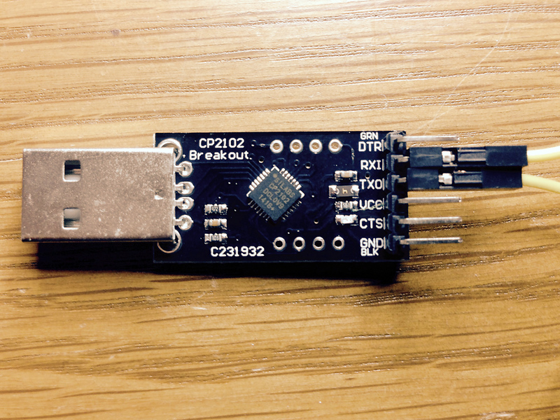

<script>
$().ready(function() {
    var elems = document.getElementsByClassName('language-terminal');
    for (const elem of elems) elem.className += ' terminal-gdb';
});
</script>

Task list to copy/paste when creating PR for this lab:

__Before releasing lab3:__
- [ ] Review writeup/code/checkin questions (instructor)
- [ ] Walk through (SL)
- [ ] Re-take photo of loopback on latest CP2102
- [ ] Followup on issues from previous quarter postmortem (issue #390)

__To prep for lab3:__
- [ ] Be extra careful when reviewing exercise 1, make sure nothing has changed to invalidate the typescript embedded in writeup
- [ ] Make copies of gdb reference sheet to hand out in lab



## Goals

During this lab you will:

- Learn how to use `riscv-unknown-elf-gdb` in simulation mode.
Simulation mode is also a good way to learn more about how the RISC-V processor executes instructions.
- Use gdb to trace through function call/return and examine registers and memory.
- Learn how to use `minicom` with the USB-serial adapter. Also understand how the UART peripheral works.
- Implement a few simple C-string operations and use a combination of
unit testing and gdb simulation to debug your work.

These exercises are useful preparation for your next assignment which is to implement `printf` for your Pi.

## Prelab preparation

To prepare for lab, do the following:

1. Read our [guide to using gdb in simulation mode](/guides/gdb). Print out a copy of the [gdb reference card](/readings/gdb-refcard.pdf) to have on hand.

## Lab exercises

### 0. Pull lab starter code

Change to your local `mycode` repo and pull in the lab starter code:

```console
$ cd ~/cs107e_home/mycode
$ git checkout dev
$ git pull code-mirror lab3-starter
```

### 1. Serial communication

#### 1a) Connect usb-serial
Find the usb-serial breakout in your parts kit and follow the instructions in the [uart guide](/guides/uart) to make a serial connection between your laptop and the Mango Pi.

#### 1b) Loopback test

Grab your USB-serial adapter and a female-female jumper to do a loopback test. Directly connect TX to RX on the USB-serial adapter in loop back mode, as shown in this photo:

{: .zoom}

In loop back mode, the signals sent out on the TX pin are wired straight to the RX pin. Reading from the RX pin will read the characters sent over TX.

Insert the USB-serial adapter into a USB port on your laptop and identify the device path using our [find-dev.sh](/guides/install/cp2102#find-dev) script.

`minicom` is a program used to communicate over a serial device. Use this command to start `minicom` on your device path and establish a connection at 115200 baud.

```console
$ minicom -D /dev/YOUR_DEVICE_PATH -b 115200
```

When minicom opens, it clears your terminal and positions the cursor in the upper left corner.
Characters that you type in the minicom window should be echoed. Try manually sending a line feed `LF` by typing `control-j` and a carriage return `CR` by typing `control-m`. What is the difference in behavior of `LF` versus `CR`? When you hit the enter/return key on your keyboard, does it seem to send a `LF`, a `CR`, or both?

Keep typing while have your neighbor reaches over and gently disconnects one end of the loopback jumper. Where are the characters going now?

Reconnect the jumper and type some more.  Your characters are echoed again.

It may feel like typing a character on the keyboard comes with an entitlement to seeing it drawn on the screen, but in fact, the minicom (or other terminal) program running on your laptop is necessary glue to bridging that communication. Minicom observes the typed character, sends it out over the serial TX line, and is listening on the serial RX line and echoing what it receives. In loop back mode, minicom happens to only be talking to itself, but it doesn't "know" this. If you disconnect the loopback jumper, no characters are echoed. Answer this check-in question[^2]

When you connect the TX and RX to the Mango Pi, minicom is bridging the communication from your laptop to the Pi and back. Minicom sends what you type to the Pi and displays what is received from the Pi. Neat!

You can exit minicom by typing `Esc-z` (the "escape" key is referred to as "meta" in the minicom documentation)
and choose `x` from the menu. However, you probably don't want to do a lot of quitting and restarting of minicom. Instead, open a separate window/tab for minicom and keep minicom running at all times. In your other terminal window(s), you will be issuing commands, editing, building, etc. while the minicom window maintains an open communication channel with the Pi. When you power-cycle or set your Pi, the minicom window will report it temporarily has no connected, but will reestablish communicated with the device when reconnected.

#### 1c) UART/printf test

Re-connect the TX/RX jumpers between the USB-serial and the Pi. Remember the RX of the USB-serial connects to the TX of the Pi, and vice versa (the connections are __not__ TX-TX and RX-RX).

Have `minicom` open and talking to your Pi now, this provides a 2-way channel that allows your laptop to send and recieve data with the Pi. 

Initialize the dram by entering the following command in your terminal (not your minicom window), and see what is printed in your minicom window!

```console
$ xfel ddr d1
```
Interesting! When FEL is running, it sends some diagnostic log messages on the serial line and only now are we keeping the channel open to hear what it's saying.

Change to the directory `lab3/uart-printf`.

```console
$ cd lab3/uart-printf
$ ls
Makefile  hello.c
```
Review the code in `hello.c`. This program uses the `uart_putstring` function
to send characters from the Pi's TX pin.


```console
$ make run
$ make run
mango-run hello.bin
xfel ddr d1
Initial ddr controller succeeded
xfel write 0x40000000 hello.bin
100% [================================================] 132.055 KB, 341.767 KB/s
xfel exec 0x40000000
```
Over in your minicom window, you should see this output:

```
hello, laptop
hello, laptop
hello, laptop
hello, laptop
hello, laptop
We <3 printf!
```

The function `uart_putstring` can be used to output a string constant, but what is much more useful is the ability to output formatted strings, e.g. `printf`. For example, the call `printf("Today is %s %d\n", monthname, daynum)` 
inserts the month string and day number into the output. To learn more about how to use printf, check out the standard library [printf documentation](http://www.tutorialspoint.com/c_standard_library/c_function_printf.htm).

In Assignment 3, you will implement your own version of `printf`.  With a working `printf`, your programs will be able to report on their state and super-charge your debugging. What a big improvement over trying to communicate everything using only LEDs!

Open `hello.c` in your text editor and edit the `main` function to try out `printf`:

1. Add a call to `printf` inside the loop body that prints the value of `i` on each loop iteration.

1. Outside the loop, use `printf` to print the value from `*PB_CFG0` in hex format.

2. Use `gpio_set_output` to make pins PB0 and PB1 output pins.

3. Print the value of `*PB_CFG0` again.

Reset your Pi, and run `make run` again to see your program's output. How does the hex value stored in `PB_CFG0` change after changing the pin functions?

### 2. Debugging with gdb

#### 2a)  Install gdb
Hot off the presses, we have freshly-patched RISC-V gdb debugger for you to install. Major thanks to Michael Chang for his help in finding and fixing the crucial bug!

If you run macOS, your instructions are:
```console
$ brew update
$ brew reinstall riscv-gnu-toolchain-13
```
{: .console-mac }

If you are on WSL, your instructions are:
```console
$ sudo apt install gdb
$ wget https://mchang.stanford.edu/riscv64-unknown-elf-gdb.tar.gz
$ sudo tar -C /opt -xvf riscv64-unknown-elf-gdb.tar.gz
$ sudo ln -s /opt/riscv64-unknown-elf-gdb/bin/riscv64-unknown-elf-gdb /usr/local/bin
```
{: .console-ubuntu }

For either, run the following to confirm your debugger is up and running.


```console?prompt=(gdb),$
$ riscv64-unknown-elf-gdb
GNU gdb (GDB) 13.2
Copyright (C) 2023 Free Software Foundation, Inc.
License GPLv3+: GNU GPL version 3 or later <http://gnu.org/licenses/gpl.html>
... blah blah blah ...
(gdb) target sim
Connected to the simulator.
(gdb) sim trace
(gdb) quit
```

#### 2b) Use `gdb` in simulation mode

This exercise is to practice using the `gdb` debugger in RISC-V simulation mode.
A debugger allows you to observe and manipulate a running program and its program state.
Running a debugger on a bare-metal system is challenging, so we instead will use
 `gdb` on our local computer to test our program running in simulation and revert to simple use of
`printf` to debug when actually running on the Pi.

`gdb` is an amazingly powerful and useful tool. When debugging C code,
proficiency with `gdb` can improve your debugging speed by a factor of 10,
or in the hands of an expert, a factor of 100. It gives you complete
visibility into a program: if you know where to look, you can find out
exactly what is happening and what your bug is. Mastering the debugger is just
as important as mastering your editor and compiler.


We will demonstrate `gdb` on a simple example program. 
Change to the directory `lab3/simple` directory and review the program in `simple.c`. 

Use the target `make debug` to build the `simple.elf` program and start it under
the debugger. Note that it is the ELF
file that we use in conjunction with gdb,
not the raw binary file that we have been running on the actual Pi.

Manually start the debugging use the command `riscv64-unknown-elf-gdb simple.elf`:

```console
$ riscv64-unknown-elf-gdb simple.elf
GNU gdb (GDB) 13.2
... blah blah blah
Reading symbols from simple.elf...
(gdb) 
```

Within `gdb`, you would connect to the simulator and load the program:

```console?prompt=(gdb)
(gdb) target sim
Connected to the simulator.
(gdb) load
Loading section .text, size 0x140 lma 40000000
Loading section .eh_frame, size 0x2c lma 40000140
Start address 40000000
Transfer rate: 2912 bits in <1 sec.
(gdb) quit
```
The commands to configure the simulator are always necessary when you enter gdb, so we made a gdb command file `gdbsim.commands` that contains these commands and specify this file to be auto-loaded when you use the `make debug` target. Enter `quit` to exit gdb and return to the terminal.  Now use `make debug` to reenter the debugger with the setup commands already auto-executed. The simulator is already connected and the program loaded.

```console?prompt=(gdb)
$ make debug
riscv64-unknown-elf-gdb -q --command=CS107E/other/gdbsim.commands simple.elf
Reading symbols from simple.elf...
Auto-loading commands from CS107E/other/gdbsim.commands...
Function "uart_putchar" not defined.
Breakpoint 1 (uart_putchar) pending.
Function "mango_abort" not defined.
Breakpoint 2 (mango_abort) pending.
Connected to the simulator.
Loading section .text, size 0x140 lma 40000000
Loading section .eh_frame, size 0x2c lma 40000140
Start address 40000000
Transfer rate: 2912 bits in <1 sec.
(gdb)
```
Use `start` to begin executing the program and stop at the beginning of main

```console?prompt=(gdb)
(gdb) start
Temporary breakpoint 1 at 0x400000f4: file simple.c, line 30.
Starting program: .../lab3/simple/simple.elf
Temporary breakpoint 1, main () at simple.c:30
30 int main(void) {
(gdb)
```

The debugger stops the program when at the beginning of the main function. The `next` command executes
the next line of C source.
The command `print d` shows the value of `d`
after the call completes. 

```console?prompt=(gdb)
Breakpoint 1, main () at simple.c:35
30 int main(void) {
(gdb) next
33     int d = diff(x, y);
(gdb) next
34     int f = factorial(7);
(gdb) print d
$1 = 74
(gdb) print f
$2 = <optimized out>
```

Note that when `gdb` shows your program stopped at a line, 
it's stopped  _before_ that line has executed. At the end of the sequence shown above, the program is stopped before calling 
`factorial`. When we try to print f, the debugger
reports that it is not (yet) accessible because we have not yet executed the line where it is declared/initialized.

Sometimes you want to step __into__ the code of the function being called.
To do this, use `step` instead of `next`. Put another
way, `next` executes the entire next line in the function
you're in, while `step` executes the next line of code, 
which may be in a different function.

Use `start` to restart the program and stop at `main()`.
and then use `step` once you hit the breakpoint.

```console?prompt=(gdb)
(gdb) start
The program being debugged has been started already.
Start it from the beginning? (y or n) y

Temporary breakpoint 2 at 0x400000f4: file simple.c, line 30.
Starting program: .../lab3/simple/simple.elf

Temporary breakpoint 2, main () at simple.c:30
30 int main(void) {
(gdb) step
33     int d = diff(x, y);
(gdb) ⏎
diff (a=a@entry=33, b=b@entry=107) at simple.c:27
27     return abs(b - a);
(gdb) ⏎
abs (v=v@entry=74) at simple.c:6
6      int result = v < 0 ? -v : v;
```

The return/enter key(`⏎`) causes `gdb` to repeat the last command (in above sequence, it will `step` two more times).

We first stepped into `diff` then took two steps in `abs` and execution is now stopped at the return statement.

When stepping through code, gdb displays the next line of code to be executed. To see more context, use the `list` command
```console?prompt=(gdb)
(gdb) list
2   * Sample code to use as gdb practice.
3   */
4
5  int abs(int v) {
6      int result = v < 0 ? -v : v;
7      return result;
8  }
9
10 int factorial(int n) {
11     if (n <= 1)
```

Use `continue` to resume executing the program. While the program is executing, type `Control-c` to interrupt the running program and return control to gdb. Use the `backtrace` command to see where the program was executing when it was interrupted:

```console?prompt=(gdb)
(gdb) continue
Continuing.
^C
Program received signal SIGINT, Interrupt.
0x0000000040000010 in hang ()
(gdb) backtrace
#0  0x0000000040000010 in hang ()
```

The above information tells you that the program is stopped in `hang`. Review the code in `start.s` and `cstart.c` to remind yourself of what happens in a C program before and after `main()`. If currently in `hang`, the program has finished and is in the final "holding pattern". This is the normal behavior for a C program that has successfully run to completion. Learn to recognize how this situation is presented in the debugger. You hope to be seeing a lot of successful program completion!

When debugging a function, a common workflow is to

  1. `break` on the function in question. `run` until you hit the breakpoint.
  1. Use `next` to step through each line of its code, inspecting variables to see where
     the problem occurs.
  1. If the next line of code is a call to a subroutine and you suspect the problem could be inside that call, use `step` to drop down into it.  If you `next` through a call and realize that you wish you had used `step` instead, use `run` to start over from the beginning and get another chance.
  1. Recursively apply rules 2-3 until you find the bug.

<a name="2c"></a>
#### 2c) Use `gdb` to access stack frames
There are gdb commands that allow you to trace function calls and view stack frames.  Let's try them out!

Use `delete` to delete any existing breakpoints and set a breakpoint at the `abs` function:
```console?prompt=(gdb)
(gdb) delete
Delete all breakpoints? (y or n) y
(gdb) break abs
Breakpoint 3 at 0x40000030: file simple.c, line 6.
(gdb) run
Breakpoint 3, abs (v=v@entry=74) at simple.c:6
6      int result = v < 0 ? -v : v;
```

You are now stopped at the breakpoint on `abs`. The command `disassemble` with no arguments lists the assembly instructions in the context where the program is currently executing. The instruction marked `=>`is the next one to be executed.
    
```console?prompt=(gdb)
(gdb) disassemble
Dump of assembler code for function abs:
=> 0x0000000040000030 <+0>:   sraw  a5,a0,0x1f
   0x0000000040000034 <+4>:   xor   a0,a0,a5
   0x0000000040000038 <+8>:   subw  a0,a0,a5
   0x000000004000003c <+12>:  ret
End of assembler dump.
```
Note that the first instruction of `abs` is at
address `0x40000030`, as we expected.
We asked for a breakpoint on the function `abs` and gdb converted our request to `0x40000030` which corresponds to the address of the first instruction of `abs`. A breakpoint set at `0xAddr` will stop the program just before executing the
instruction at `0xAddr`. 

Use the gdb `backtrace` to show the sequence of function
calls leading to here:

```console?prompt=(gdb)
(gdb) backtrace
#0  abs (v=v@entry=74) at simple.c:6
#1  0x00000000400000e8 in diff (a=a@entry=33, b=b@entry=107) at simple.c:27
#2  0x0000000040000110 in main () at simple.c:33
```

The backtrace shows that the function `abs` has been called by `diff`
from line 27, which in turn was called by `main` from line 33.  The
numbers on the left refer to the *frame*.  The innermost frame is
numbered 0, and corresponds to the currently executing function, in this case, `abs`. Frames for caller functions have higher numbers. The `info frame` command prints a summary of the current stack frame:

```console?prompt=(gdb)
(gdb) info frame
Stack level 0, frame at 0x4fffffc0:
 pc = 0x40000030 in abs (simple.c:6); saved pc = 0x400000e8
 called by frame at 0x4fffffd0
 source language c.
 Arglist at 0x4fffffc0, args: v=v@entry=74
 Locals at 0x4fffffc0, Previous frame's sp is 0x4fffffc0
```

The `info locals` and `info args` commands give more information about the stack frame's arguments and local variables:

```console?prompt=(gdb)
(gdb) info args
v = 74
(gdb) info locals
result = <optimized out>
```

`gdb` lets you choose which frame on the call stack you wish to inspect.
The command `up` selects the frame that is one step up the call stack (e.g. frame of caller) and `down` moves back to callee.

```console?prompt=(gdb)
(gdb) up
#1  0x00000000400000e8 in diff (a=a@entry=33, b=b@entry=107) at simple.c:27
27     return abs(b - a);
(gdb) info args
a = 33
b = 107
(gdb) info locals
No locals.
(gdb) down
#0  abs (v=v@entry=74) at simple.c:6
6      int result = v < 0 ? -v : v;
(gdb) info args
v = 74
```

Another useful `info` command is `info reg` which displays the values currently in the Pi's registers. 
```console?prompt=(gdb)
(gdb) info reg
ra             0x400000e8  0x400000e8 <diff+16>
sp             0x4fffffc0  0x4fffffc0
gp             0x0   0x0
tp             0x0   0x0
t0             0x0   0
t1             0x0   0
t2             0x0   0
fp             0x0   0x0
s1             0x0   0
a0             0x4a  74
a1             0x6b  107
a2             0x0   0
a3             0xb   11
a4             0x4   4
a5             0x0   0
a6             0x0   0
a7             0x0   0
s2             0x0   0
s3             0x0   0
s4             0x0   0
s5             0x0   0
s6             0x0   0
s7             0x0   0
s8             0x0   0
s9             0x0   0
s10            0x0   0
s11            0x0   0
t3             0x0   0
t4             0x0   0
t5             0x0   0
t6             0x0   0
pc             0x40000030  0x40000030 <abs>
```
What value is currently in `a0`? Why does `a0` contain that value? (Consider: at what point in the program execution are we stopped right now? What was the last use of `a0`?) What value is in `a1`?

You can access a single register by using the syntax $regname, e.g. `$a0`.

```console?prompt=(gdb)
(gdb) print $a1
$2 = 107
```
For further practice with gdb and stack frames, now try tracing and exploring with the `factorial` and `make_array` functions.

The `factorial` function operates recursively. Set a breakpoint on `factorial` so gdb will stop on each recursive call.  Each time you hit the breakpoint, use `backtrace` to see how the stack changes as you get deeper into the recursion. Try moving `up` and
`down` and use `info frame` and `info args` to view individual stack
frames.  Note how each invocation has its own copy of the parameter `n`. 

The function `make_array` demonstrates how the stack is used
for storage of local variables. A local variable of size 64 bits or fewer (i.e. int/long) is likely stored in a register without the overhead of  writing to stack memory. Larger data
structures, such as arrays and structs, that do not fit in a register must be stored on the
stack. Set a breakpoint on the `make_array` function. Use `info locals` to see the array contents at the start of the function. Are
the array elements initialized to any particular value?  Step through
the loop a few times and use `info locals` to see how the array is
updated. 

The goal of all this mucking about in gdb is to solidify your understanding the mechanics of function calls and the runtime stack. If there are portions you don't yet understand, ask your tablemates or the staff to resolve those questions now.


Now introduced to `gdb`, you'll want to incorporate it into your development process and to practice until you become comfortable and fluent.  Gdb can help you learn more about how your C code translates to generated assembly, and being able to observe and manipulate your program while it is executing will be an invaluable aid when tracking down bugs.

In software development, only a small fraction of your time goes into writing the code, the rest is taken up in testing and debugging. These are important skills to hone and adept use of `gdb` can streamline your efforts by a significant factor. Developing your debugging superpowers will pay off many times over!

At this point, you should be able to answer the first check-in question[^1]

### 3. C-strings

For this exercise, you will work with C-string functions and get further practice with unit-testing and debugging.
Change to the `lab3/cstrings` directory and open the `cstrings.c`
file in your editor.

The first string operation to look at is `strlen`. This function returns the count of characters in a C-string. How is it possible to determine where a C-string ends? Is the null terminator included in the count? 

Review the given (correct) code for `strlen` in `cstrings.c`.  It uses array subscripting on a variable declared as a pointer. Why is this legal?  What does it mean to access the nth array element of a pointer variable?

The code for `strlen` is simple enough that you might feel confident calling it correct "by inspection", but let's use our unit testing strategy to truly confirm the behavior of the executing function.

Read through the test cases in the `test_strlen`.
Compile the program and run it on the Pi (with `make run`, not `make test` in this case). Your test program should successfully run to completion. It is a correctly-implemented `strlen` function, as advertised.

Now, let's move on the `strcpy` operation. This function copies the characters from one string to another:

```c
char *strcpy(char *dst, const char *src);
```

Pampered programmers who work on hosted systems receive `strcpy` as part
of the standard library, but we must implement it ourselves for the Pi.

Functions in the standard library each have a man page that documents the function's use and behavior. Bring up the man page for `strcpy`.

```console
$ man strcpy
```

Read the man page and then try implementing `strcpy` yourself. Does `strcpy` copy only the non-null characters or is the terminator included?  If you're not sure, read the man page to confirm the expected behavior.

When you are ready to test your `strcpy`, review the test cases in the `test_strcpy` function. Uncomment the call to `test_strcpy` in `main()`. Use `make run` to rebuild the program and run it on the Pi.

If you get the blue flash of doom, dig in to find out what's gone wrong
and work to resolve the issue. Don't move on until all
tests pass and you earn the peace and quiet from your Pi.

### 4. Gdb and testing

You can also test a program by running within gdb in simulation mode. Let's try that now on the cstrings program from the previous exercise.

#### Debug strlen

Edit `strlen` to intentionally plant a bug, such as changing the function to always return `7`. This will cause test failures in `test_strlen`. Use `make run` to build the program and run on the Pi and you get the flashing LED that indicates a failed assert.

Let's learn how that failed assert is presented under the debugger. Use `make debug` to get the buggy program under gdb and run it. There is no flashing light; the simulator is not talking to your Pi nor its peripherals. Your Pi doesn't even need to be connected!

What do you see in gdb? There is some output about a failed assertion and then the program appears to be stuck. Type `Control-c` to interrupt the program and use `backtrace` to see where the program is stopped.

```console?prompt=(gdb)
[31;1mFile cstrings.c, line 27, in function test_strlen() : Assertion 'strlen("green") == 5' failed.
[0m

Breakpoint 2, mango_abort () at reference/mango.c:55
55  reference/mango.c: No such file or directory.

Reached mango_abort(), program had failed assertion.
(gdb) backtrace
#0  mango_abort () at reference/mango.c:55
#1  0x000000004000027c in test_strlen () at cstrings.c:27
#2  0x0000000040000454 in main () at cstrings.c:63
```

A-ha! When an assert fails, it calls `mango_abort` to blink the blue light.  Given the simulator does not emulate the timer or GPIO peripherals, `mango_abort` behaves as a no-action infinite loop. By looking further into the backtrace, we learn that the failed assertion occurred on line 27 of the `cstrings.c` file (or some nearby line number, depending on how long your `strcpy` implementation was). Use `list` to see that code now:

```console?prompt=(gdb)
(gdb) list cstrings.c:27
27 
28 void test_strlen(void)
29 {
30     char *fruit = "watermelon";
31 
32     assert(strlen("green") == 5);
33     assert(strlen("") ==  0);
34     assert(strlen(fruit) == 2 + strlen(fruit + 2));
```

This allows us to pinpoint exactly which assert failed (rather than have to comment-in-and-out tests one by one to find it). Hooray for gdb!

Restore `strlen` to its correct implementation, rebuild and run again under the debugger. All tests should pass. As expected, there is no blinking light from the simulator, but once again the program seems to have stopped. Type `Control-c` to interrupt the program and use `backtrace` to see what's going on. What evidence confirms that the program successfully ran to completion?


> __Tip__ Typing `Control-c` will interrupt the executing program and return control to the debugger. `backtrace` will show where the program was executing when it was interrupted. 
{: .callout-info}

Learn to recognize these two common situations: 
+ a successful run to completion that is waiting at end of `cstart/start` (or possibly `mango_reboot`)
+ a failed assert in `mango_abort` attempting to flash a non-existent blue LED

#### Debug bogus_strlen_calls

Both `strlen` and `strcpy` have been shown to work correctly for valid calls. We are now going to do a little exploration into what happens 
for calls that misuse the functions.

Review the code in the aptly-named `bogus_XXX` functions.
Get together with your tablemates and look at the three "bogus" calls.
For each consider __why__ it is invalid: what is improper about the C-string that is being passed as the argument?

The string functions in the standard C library are generally not robust against bad calls, especially those that ask a function to read or write invalid memory.  The reason for this is not for performance or
due to laziness -- it's actually not possible for `strlen` to verify that its argument is a valid C-string. A `char*` is
not necessarily a pointer to a string -- it could be just a pointer
to a single character. Furthermore the address might not have a char pointee  at all -- it could be an int stored there or the address might be completely invalid or contents uninitialized. The C language does not have a reliable means to determine the validity of a pointer and reject the bad ones.

Uncomment the call to one of the bonus functions in `main()`. Rebuild the program and run it under gdb. Single step through the call and print the value returned by the bad call. Is the result what you anticipated?  What did you learn from this about the
observed consequences of reading uninitialized or invalid memory? Confirm you understanding with this check-in question[^3]

#### The dangers of C-strings

The fact that a C-string depends on a properly-placed NULL terminator to mark the end is tremendously unsafe. If you forget to write the terminator or forgot to account for that extra byte when allocating space, it can be easy to scribble over memory. For example, consider this code:

```c
struct request {
  char* filename;
  char* host;
};

void process_request(struct request* request) {
  char filename[128];
  strcpy(filename, request->filename);
  read_file(filename); 
}
```

This code might seem contrived, but it's similar to what a lot of web server code
looked like in the early 2000s. Recall from lecture that variables allocated inside
functions are put on the stack: `filename` is an array of 128 bytes on the stack. 

Talk with your neighbor: what happens if `request->filename` is longer than 128 characters?
What will the call to `strcpy` do?
How might this cause software to fail or act unpredictably? If this code existed in a critical context, could it cause a serious failure? It's useful to note that that
[the git codebase (source code for the git program itself) bans the use of `strcpy`](https://github.com/git/git/blob/master/banned.h). Instead, you always are supposed to use `strncpy`, which has an explicit maximum
length for copying. E.g., this code would be OK:

```c
struct request {
  char *filename;
  char *host;
};

void process_request(struct request *request) {
  char filename[128];
  // 127 to make sure there's space for a \0
  stnrcpy(filename, request->filename, 127);
  read_file(filename); 
}
```

#### Differences under simulation
It is important to be aware of the discrepancies you may observe when comparing the behavior of a program running on the Pi versus running under the gdb simulator. Read the section titled [Differences due to simulation](/guides/gdb/#differences-due-to-simulation) in our gdb guide to be introduced to some of the issues you may run into.

Change to the directory `lab3/simulator` directory and review the program in the `buggy.c` file  Trace through the operation of the program. What do you predict will be printed as output?

Build the program using `make`. You should get warnings from the compiler about the use of uninitialized variables.

Use `make run` to run the program on the Pi. Does the output printed by the program match what you predicted earlier?  Use `make run` to run the program again. Is the output printed the same as the previous run?

Now load the same program into gdb simulator using `make debug`. If you run this program on the simulator, the program does not have the same output that you observed when running on the Pi. Why is it different?

Type `Control-c` to stop the program. Without exiting gdb, use `run` to run the program for a second time. How does this output compare to the previous run? Re-run the program a few more times in gdb until you understand the pattern. What have you learned about how the simulator handles the state of memory between runs? How does this compare to what happens to the state of memory when you reset the actual Pi and re-run the program?

The gdb simulator is a powerful addition to your toolbox, but it is important to understand its limitations and differences from an actual Pi. [^4]


## Check in with TA

Answer these questions that probe on topics from the lab and review your answers with the TA to confirm your understanding.

[^1]: What `gdb` commands can you use to interrupt an program and figure out where the program is executing and view current program state (values of registers, parameters, variables, etc.)?   

[^2]: Why is it necessary to plug in both `TX` and `RX` for the echo program to work correctly?

[^3]: On a hosted system, executing an incorrect call to `strlen` (e.g. argument is an invalid address or unterminated string) can result in a runtime error (crash/halt). But when running bare metal on the Pi, every call to `strlen` (whether well-formed or not) will complete "successfully" and return a value. Explain the difference in behavior. What will be the return value for an erroneous call?


[^4]: Running a program under the gdb simulator is not be a perfect match to running on the actual Pi. A particularly frustrating situation can come from a program that exhibits a bug running on the Pi, but appears to run correctly under the simulator or work on a first run in gdb but not a subsequent. What underlying difference(s) between the simulator and real thing might contribute to this kind of inconsistency?

