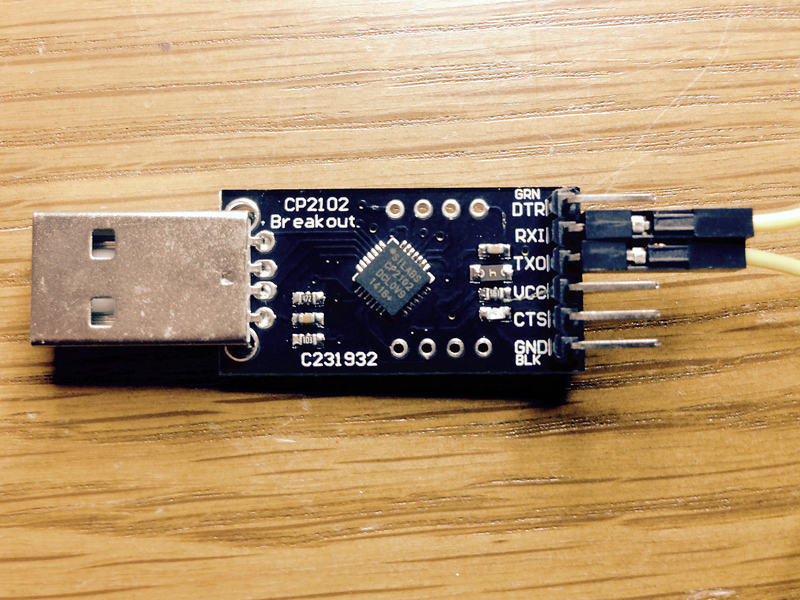

*Lab written by Pat Hanrahan*

### Goals

During this lab you will:

1. Learn how to simulate the ARM processor using `gdb`.

2. Use `gdb` to inspect stack frames.

3. Use `gdb` to find bugs in C programs.

4. Set up your console cable to work with the UART on the Raspberry Pi.

To complete the lab, you must answer the questions in the
[checklist](checklist).

### Pre-lab preparation

To prepare for this lab, you should read the
[gdb](/guides/gdb) tutorial about how to debug the ARM
processor using `gdb` in simulate mode.

### Lab exercises

#### 1. Simulate the blink program using gdb

The goal of the first exercise is to teach you how to use gdb in ARM
simulation mode. This is useful as a way of learning what happens
when ARM instructions are executed, and to debug programs.

Change to the blink directory. Assemble and link the program using
make.

    $ make
    arm-none-eabi-as -g blink.s -o blink.o
    arm-none-eabi-ld blink.o -o blink.exe

Follow the steps in the [gdb guide](/guides/gdb). This guide
walks you through how to setup gdb to simulate the ARM processor.

You will load `blink.exe`, set a breakpoint at `_start`, and then run
the program.

Execution will stop at the breakpoint, and then you can single step
through the program inspecting registers and memory. Follow the
entire guide and make sure you understand what is going on.

The final part of this exercise is to understand the
*current program status register (CPSR)*.

Continue stepping through blink until you enter the delay loop.

Inspect the values of `CPSR` each time through the loop.

- What value does `CPSR` have when `bne` returns to `wait1`?
- What values does `CPSR` have when `bne` does not branch, and the loop is exited?

Record your answer to the first question on the checklist.

#### 2. Stack frames and backtraces

Each time your program performs a function call,
a function activation record or stack frame is generated.
The stack frame contains arguments, local variables, and saved registers.
The stack frame is stored on the stack,
a region of memory your program sets aside for this purpose.

Check out the code for this lab and go the directory `code/stack`.
Read `stack.c` which is similar to the code I showed in lecture.
Also read the `Makefile`. 
First, notice that we compile the program
with debugging turned on (-g).
Second, notice that we compile the code with the 
flag `fno-omit-frame-pointer` to make sure
that gcc does not optimize away the stack frame.
Finally, notice the file `start.s`,
which is called first when your program runs.
The assembly language in this program
initializes the stack pointer (sp) to 0x8000,
and then calls the function `notmain`.
We use the name `notmain` 
because sometimes gcc will treat the function main different
than a normal function;
we do not want it to do that because we are running bare metal.
We will explain startup in more detail on Friday.

    $ make
    arm-none-eabi-gcc -O2 -g -Wall -nostdlib -nostartfiles -ffreestanding -fno-omit-frame-pointer start.s stack.c -o stack
    arm-none-eabi-objdump stack -d > stack.list

We now have an excutable `stack`, 
and the assembly language listing `stack.list`.

Run gdb,

    $ arm-none-eabi-gdb stack
    (gdb) target sim
    (gdb) load
    (gdb) break notmain
    Breakpoint 1 at 0x8094: file stack.c, line 14.
    (gdb) run
    Breakpoint 1, notmain () at stack.c:14
    14      return B(1,2,3);
    (gdb) break A
    (gdb) cont
    Breakpoint 2, A (a=3, b=-1) at stack.c:3
    3       return a-b;

When your program stops at a breakpoint, 
you can examine the stack frame.

    (gdb) backtrace
    #0  A (a=3, b=-1) at stack.c:3
    #1  0x00008070 in B (a=1, b=2, c=3) at stack.c:9
    #2  0x000080a4 in notmain () at stack.c:14
    #3  0x00008008 in _start () at start.s:4
    Backtrace stopped: previous frame identical to this frame (corrupt stack?)

Frames have numbers.
The current frame is numbered 0,
and corresponds to the invocation of function A.
Frames for caller functions have higher numbers.

    (gdb) info frame
    Stack level 0, frame at 0x7fd8:
     pc = 0x8020 in A (stack.c:3); saved pc = 0x8070
     called by frame at 0x7ff8
     source language c.
     Arglist at 0x7fd4, args: a=3, b=-1
     Locals at 0x7fd4, Previous frame's sp is 0x7fd8
     Saved registers:
      r11 at 0x7fd4
    (gdb) info args
    a = 3
    b = -1
    (gdb) info locals
    No locals

We can also inspect caller functions variables.

    (gdb) up
    #1  0x00008070 in B (a=1, b=2, c=3) at stack.c:9
    9       return d - A(c,d);

This moves up to frame #1, which is the function B.
B called A.

    (gdb) info args
    a = 1
    b = 2
    c = 3
    (gdb) info locals
    d = -1

Play around with gdb.
Try changing the functions, see how those changes
affect the generated assembly, and how this affects the stack frame. For
example, what happens if a function has more than 4 parameters? Note how gdb
both lets you see the affect on stack frame size by showing you the
previous and current stack frame pointers, but also hides it by allowing you
to reference variables by name.

Make sure to learn the abbreviated commands:
they will make you faster, and using them more will make them second nature.

#### 3. Bugs in C programs

Now change into the directory `code/bugs`.
This directory contains the following programs.

    $ ls
    array.c
    copy.c
    string.c
    recursion.c
    warn.c 
    epsilon.c

The `Makefile` has been setup to compile `warn.c`.
Compile the program and look at the warnings.
Why is gcc generating these warnings?

Now read the other programs.
Identify the bug.
If you have trouble indentifying the bug,
use gdb to step through the program
and see if you can track it down.

Extension: change -O0 to -O2 and recompile recursion.c.  What is going on?

#### 4. Using the console cable with the Raspberry Pi

*Make sure your cp2102 drivers are installed and worked properly.*

If you haven't done this, 
follow the instructions in the [Console Guide](/guides/console).

*Insert the usb serial point into a usb port on your laptop.*

Check whether it appears as a tty device.

On a MAC:

    % ls /dev/tty.SLAB_USBtoUART
    /dev/tty.SLAB_USBtoUART

On Linux 

    % ls /dev/ttyUSB0
    /dev/ttyUSB0

You can also type "dmesg" or use "tail -f" on whatever log your kernel writes to.  E.g., 

    % tail -f /var/log/kern.log  # on ubuntu
    [output deleted]
    Jan 27 16:23:45 ThinkPad-W530 kernel: [116656.523573] usb 1-1.2: cp210x converter now attached to ttyUSB0

If the drivers are not installed, this tty port will not appear.
If you remove the usb serial breakout port from your usb port,
the device will not appear.

*Wire the TX pin to the RX pin on the usb serial breakout board.*

Connecting TX to RX is called a *loop back*.
In loop back mode,
the signals sent out on the TX pin are wired to the RX pin.
This causes characters sent out to be echoed back.

Start a terminal program and connect to the tty port from above.  E.g.,

    % screen /dev/tty.SLAB_USBtoUART 115200

The screen should be cleared and the cursor positioned
in the upper left hand corner.
Type in some characters.  What happens?
What happens if you push return on your keyboard?

To exit screen, type Control-A followed by Control K.
You should see the following message.

    Really kill this window [y/n]

Typing `y` should return you to the shell.

    [screen is terminating]

*Test printing on your screen from the Raspberry Pi.*

First, download the code examples from
the last lecture on *Serial Communication*.
Change to the directory `lectures/Serial/code/hello`.

    % cd courseware/lectures/Serial/code/uart
    % ls
    Makefile    hello.c     start.s     uart.c      uart.h
    % make
    arm-none-eabi-gcc -I../include  -Wall -O2 -nostdlib -nostartfiles -ffreestanding -c hello.c 
    arm-none-eabi-gcc -I../include  -Wall -O2 -nostdlib -nostartfiles -ffreestanding -c uart.c 
    arm-none-eabi-as  start.s -o start.o 
    arm-none-eabi-ld -L../lib start.o uart.o hello.o -o hello.exe -lpi
    arm-none-eabi-objdump -D hello.exe > hello.list
    arm-none-eabi-objcopy hello.exe -O binary hello.bin

Now, wire up the usb serial breakout board 
so that TX on the breakout board is connected to RX on the Raspberry Pi.
Also RX on the breakout board to TX on the Raspberry Pi.

Download the `hello.bin` to the Raspberry Pi 
using either the bootloader or the SD card. 
Power up the Raspberry Pi, and start `screen`.

    % screen /dev/tty.SLAB_USBtoUART 115200
    Hello, laptop
    Hello, laptop
    Hello, laptop
    Hello, laptop
    Hello, laptop
    Hello, laptop
    Hello, laptop

This will print forever.
To stop it, exit `screen` (holding the control key down and typing
"ad" is a quick way; if you haven't reset the pi you can also 
reattach later by doing "screen -r")

### Stack intuition

Functions often need space (e.g., for variables or to store the return
address of their caller before they call another function).    There's
nothing special about this space, and we could allocate it as we
would any other memory.  However,
functions calls are frequent, so we want them as fast as possible.
Fortunately they have two
properties we can exploit for speed:
(1) when they return all memory they allocated is considered dead
(2) they return in LIFO order.  As a result
for speed, people have converged on using a contiguous array of memory
(called ``stack'' because of its LIFO usage).  Roughly speaking it
works as follows:

1. At program start we allocate a fixed-sized stack and set a
pointer (the stack pointer) to its beginning.

2. At each function call, all the memory the function needs is
allocated contiguously and all-at-once by simply incrementing
the stack pointer.

3. At each function call return, all the memory the function
allocated is then freed all-at-once by simply decrementing
the stack pointer.

OSes generally provide ways to dynamically grow the stack, but we will
ignore this here.

This organization is such a clear winner that compilers have explicit
support for it (and do the pointer increment and decrement) and
architecture manuals the rules for how to do so.
(This basic data structure appears in many other contexts when all the
data for a given purpose or type can be freed all at once.  )
If you know "malloc()" and "free()" one way to compare this method
and those functions is that the fastest malloc() you can do is a pointer
increment and the fastest free() a pointer decrement. 
