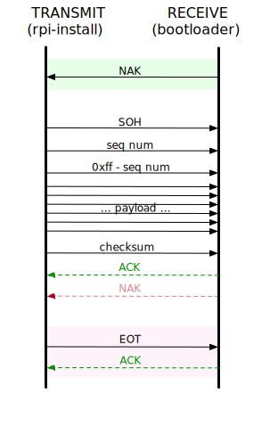


Task list to copy/paste when creating PR for this lab:

__Before releasing lab4:__
- [ ] Review writeup/code/checkin questions (instructor)
- [ ] Walk through (SL)
- [ ] Followup on issues from previous quarter postmortem (issue #232)

__To prep for lab4:__
- [ ] Make copies of bootloader.c and memory diagrams (ideally in color if possible) to hand out in lab



*Lab written by Pat Hanrahan, updated by Julie Zelenski*

## Goals

During this lab you will:

- Experiment with the linker `ld`, with the goal of understanding what is in
   an object (ELF) file by using `nm`, and how object files are combined to produce an
   executable.
- Understand how executing programs are laid out in memory, including the organization of stack frames.
- Read and understand the source to the bootloader. It is important to be able
   to read code produced in the wild.
- Explore the stack and heap in preparation for assignment 4.


## Prelab preparation
To prepare for lab, do the following: 

- Pull the latest version of the `cs107e.github.io` courseware repository.
- Clone the lab repository `https://github.com/cs107e/lab4`. 
- If you didn't complete the gdb stack exercise in last week's lab ([Lab3 exercise 1b](/labs/lab3/#1b)), please do before this week's lab. This will give you further practice with gdb and introduce you to the commands for tracing function calls and examining stack frames.
- Having a solid understanding of the memory layout of your program is essential for your next assignment. Review the program in [simple.c](code/simple/simple.c). Study the code alongside this [diagram of the program's address space](images/stack_abs.html) when stopped in the first call to `abs`. Having examined this in advance will be helpful when exploring the stack frame layout in exercise 4 below.

## Lab exercises

Pull up the [check in questions](checkin) so you have it open as you go.


### 1. Stack

Change to the directory `lab4/code/simple`. The `simple.c` program reprises a program that was used in lab3 to experiment with gdb. We will use this same program to study the use of stack memory and organization of stack frames.

Run `simple.elf` under the gdb simulator. Disassemble the `abs` function and read through its assembly instructions.

```
(gdb) disass abs
Dump of assembler code for function abs:
=> 0x00008010 <+0>:     mov r12, sp
   0x00008014 <+4>:     push {r11, r12, lr, pc}
   0x00008018 <+8>:     sub r11, r12, #4
   0x0000801c <+12>:    cmp r0, #0
   0x00008020 <+16>:    rsblt   r0, r0, #0
   0x00008024 <+20>:    sub sp, r11, #12
   0x00008028 <+24>:    ldm sp, {r11, sp, lr}
   0x0000802c <+28>:    bx  lr
End of assembler dump.
```

The first three instructions comprise the function _prolog_ which sets up the
stack frame. The last three instructions are the function _epilog_ which tears down the stack frame and restores caller-owned registers. The basic structure of the prolog and epilog is common to all functions, with some variation due to differences in local variables or use of caller-owner registers. 

Get together with your partner and carefully trace through instructions in the prolog and epilog of `abs`. Sketch a diagram of the stack frame that it creates.  Below are some issues to note and questions to discuss as you work through it.

__Function prolog__:
- Register `r11` is used as the frame pointer `fp`. The disassembly from gdb refers to `r11`, while an objdump listing calls it `fp`. The two are completely synonymous, so don't let that trip you up.
- Which four registers are pushed to the stack to set up the
APCS frame?  
- Three of the four registers in the APCS frame are caller-owned registers whose values are preserved in the prolog and later restored in the epilog. Which three are they? Which register is the fourth? Why is that register handled differently?  What is even the purpose of pushing that register as part of the APCS frame?
- What instruction in the prolog anchors `fp` to point to the current frame?
- To what location in the stack does the `fp` point?
- The first instruction of the prolog copies `sp` to `r12` and then uses `r12` in the push that follows. This dance may seems roundabout, but is unavoidable. Do you have an idea why? (Hint: a direct reference to `sp` in a push/pop instruction that itself is changing `sp` sounds like trouble...)

__Function epilog__:
- To what location in the stack does the `sp` point during the body of the function?  
- The first instruction of the epilog changes the `sp`. To what location does it pointer after executing that instruction?
- The `ldm` instruction ("load multiple") reads a sequence of words starting at a base address in memory and stores the words into the named registers. `pop` is a specific variant of `ldm` that additionally adjusts the base address as a side effect (i.e. changes stack pointer to "remove" those words) . The `ldm` instruction used in the epilog of `abs` copies three words in memory starting at the stack pointer into the registers `r11`, `sp`, and `lr`.  This effectively restores the registers to the value they had at time of function entry. The instruction does not similarly restore the value of the `pc` register. Why not?
- Which registers/memory values are updated by the `bx` instruction? 


Here is [a memory diagram when stopped at line 5 in simple.c](images/stack_abs.html). This is in the body of the `abs` function, after the prolog and before the epilog.
Our diagram shows the entire address space of the `simple`
program, including the text, data, and stack segments.  Studying this diagram will be helpful to confirm your understanding of how the stack operates and what is stored where in the address
space. 

The diagram contains a lot of details and can be overwhelming, but if you take the time to closely inspect it, you will gain a more complete understanding of the relationship between the contents of memory, registers, and the executing program.   Go over it with your partner and labmates and ask questions of each other until everyone has a clear picture of how memory is laid out.

Once you understand the prolog/epilog of `abs`, use gdb to
examine the disassembly for `diff` and `main`. 
Identify what part of the prolog and
epilog are common to all three functions and where they differ. What is the reason for those differences?

Lastly, disassemble `make_array` to see how the stack is used
to store local variables.  Sketch a picture of its stack frame as you follow along with the function instructions.

- After the instructions for the standard prolog, what additional instruction makes space for the array local variable?
- How are the contents for the array initialized (or not)? 
- In the body of the function, the array elements stored on the stack are accessed `fp`-relative.  What is the relative offset from the `fp` to the base of the array? How can you determine that from reading the assembly instructions?
- The prolog has an additional instruction to allocate space for the array, but the epilog does not seem to have a corresponding instruction to  deallocate the space. How then is the stack pointer adjusted to remove any local variables on function exit?

Compare your sketch to this [stack diagram for make_array](images/stack_makearray.html). Does your understanding line up?

### 2. Heap

Change to the directory `lab4/code/heapclient` to begin your foray in heap allocation.
So far we have stored our data either as local variables on the stack or global variables in the data segment. The functions `malloc` and `free`  offer another option, this one with more precise control of the size and lifetime and greater versatility at runtime.

Study the program `heapclient.c`. The `tokenize` function is used to 
dissect a string into a sequence of space-separated tokens. The function calls on the not-yet-implemented function `char *strndup(const char *src, size_t n)` to make a copy of each token. The intended behavior of `strndup` is to return a new string containing the first `n` characters of the `src` string.

Talk over with your partner why it would not be correct for `strndup` to declare a local array variable in its stack frame to store the new string.  When a function exits, its stack frame is deallocated and the memory is recycled for use by the next function call.  What would be the consequence if `strndup` mistakenly returns a pointer to memory contained within its to-be-deallocated stack frame?

Instead `strndup` must allocate space from the heap, so that the data can persist after the function exits. Edit `strndup` to use a call to `malloc` to request the necessary number of bytes. How many total bytes of space are needed to store a string with `n` characters?  

Now that you have the necessary memory set aside, what function from the `strings` module can you call to copy the first `n` characters from the `src` string to the new memory?

What is the final step you must take to complete the new string? (Hint: how is the end of a string marked?)

Once you have completed your implementation of `strndup` to make a proper heap copy of the string, build and run the program to verify your code is correct.

Unlike stack and global memory, which is automatically deallocated on your behalf, you must explicitly free dynamic memory when you are done with it. For the finishing touch, edit `main` to add the necessary calls to `free` to properly deallocate all of the heap memory it used.

### 3. Linking

In the first exercise, you will repeat some of the live coding demonstrations shown in the lecture on linking and loading.

Let's first review some terminology. An _object file_ (also called an .o file or a relocatable) is the result of compiling and assembling a single source file. An object file is on its way to becoming a runnable program, but it's not finished. The linker takes over from there to combine the object file with  additional object files and libraries. The linker is responsible for resolving inter-module references and relocating symbols to their final location. The output of the linker is an _executable_ file, this represents a full program that is ready to run.

#### Symbols in object files

Change to the `code/linking` directory of `lab4`. Read over the code in the files `start.s` and `cstart.c` and then build the object files `start.o` and `cstart.o`:

    $ make start.o cstart.o

The tool `nm` lists the symbols in an object file. Each function, variable, and constant declared at the top-level in the module is a _symbol_. Try `nm` out now:

    $ arm-none-eabi-nm -n start.o cstart.o


What symbols are listed for `start.o`? For `cstart.o`? How do the symbols listed correspond to the functions defined in the source files?
What is the significance of the number shown in the left column for each symbol?
What do each of the single letters `T`, `U`, and `t` in the second column mean? 

Skim the `arm-none-eabi-nm` [man page](https://manned.org/arm-none-eabi-nm) to learn a little bit about this tool and the variety of symbol types.  Our modules will typically contain text (code) symbols and data symbols (with variants common, uninitialized, read-only). What is the significance of upper versus lowercase for the symbol type? What does the `-n` flag do?

*Make sure you and your partner understand `nm`'s
output before continuing.*

Let's look at the symbols in a more complex object file. Review the variable definitions in the source file `linking.c`. Build `linking.o` and view its symbol list:

    $ make linking.o
    $ arm-none-eabi-nm -n linking.o

How many symbols are listed for `linking.o`? 
What do the single letter symbols `D`, `R`, `C`, and `b` mean in the `nm` output?
Can you match each function/variable definition in `linking.c` to its symbol in the `nm` output? A few of the variables defined seem to have been completely optimized out, what made that possible? None of the parameters or stack-local variables in `linking.c` are listed as symbols, why not?

What type and size of symbol would correspond to an array definition such as  `const int[5]`? See for yourself by uncommenting the declaration on line 13 of `linking.c`, rebuild and view `arm-none-eabi-nm -S linking.o`.

#### Symbols in an executable

After compiling each individual source file into an object file, the final build step is to link the object files and libraries into a program executable. The three object files we examined above are linked together in `linking.elf`.  Use `make linking.elf` to perform the link step and then use `nm` to look at the symbols in the final executable.

    $ make linking.elf
    $ arm-none-eabi-nm -n linking.elf

The executable contains the union of the symbols in the three object files. What is the order of the symbols in the executable? How have the symbol addresses changed during the link process?
Do any undefined symbols remain?
What happened to the symbols previously marked `C`?

#### Resolution and relocation

The Makefile in this project has additional action that creates a `.list` file for each build step. These listing files contain the disassembly of the compiled module.  Let's look into those listings to get a better understanding of how symbols are resolved and relocated by the linker.

```
$ cat start.o.list

00000000 <_start>:
       0:   mov     sp, #134217728  ; 0x8000000
       4:   mov     fp, #0
       8:   bl      0 <_cstart>

0000000c <hang>:
       c:   b       c <hang>
```

The third instruction is where `_start` calls `_cstart`. This *branch and link* instruction `bl` has 0 at the target destination address.
This target is labeled `<_cstart>`, but 0 doesn't seem quite right. In this module, 0 is the address of `_start`.  Hmm, most curious...

The listing for `linking.elf` begins with the instructions for `_start` but this is _after_ linking. What do you notice that is different now?

```
$ cat linking.elf.list
 00008000 <_start>:
     8000:       mov     sp, #134217728  ; 0x8000000
     8004:       mov     fp, #0
     8008:       bl      80b8 <_cstart>

 0000800c <hang>:
     800c:       b       800c <hang>

 00008010 <sum>:
     8010:       mov     ip, sp
     8014:       push    {fp, ip, lr, pc}
 ...

 000080b8 <_cstart>:
     80b8:       mov     ip, sp
 ...
```

First note that after linking, the addresses (in leftmost column) start at `0x8000` and increase from there. These addresses indicate the location of each instruction in the final executable. Can you work out how each symbol's final address relate to its original offset in the object file?  The process of gathering all symbols from the modules and laying out into one combined package at their final locations is called _relocation_. The linker uses the memory map ([described in exercise 2](#2.-memory-map)) to determine how and where to layout the symbols.

In the listing `start.o.list`, the destination address for the branch to `_cstart` was 0.  In the listing `linking.elf.list`, the destination address has been changed to `0x80b8`.  Read further down in the listing to see what is at address `0x80b8`. Makes sense?

In the listing for `linking.o.list` (pre-link), find the instructions for the function `main`. It contains three `bl` instructions, one is a function call to a function defined in this module (`sum`), the other two call functions outside this module (`uart_init` and `printf`).  The call within module has the function offset as destination address, but the calls to outside the module have destination address 0, used as a placeholder. In the listing `linking.elf.list` (post-link), find those same instructions for `main` and you will see all destination addresses are now filled in with the final location of the symbol.

The compiler processes only a single module (file) at a time and thus it can only resolve references to symbols that appear within the module currently being compiled. The linker runs in a subsequent pass to perform tasks that require joining across modules. The process of filling in the missing placeholder addresses with the final symbol locations is known as _resolution_.

The linker is given a list of object files to process and it will combine the files together and arrange symbols into their final locations (relocation) and resolve cross-module references (resolution).

#### Libraries

Next, `cd` into `../libmypi`.
This directory contains an example of building a library
`libmypi.a` containing the files `gpio.o` and `timer.o`.

Read the `Makefile`.
Notice the lines

    libmypi.a: $(LIBRARY_MODULES)
    	arm-none-eabi-ar crf $@ $^

The `arm-none-eabi-ar` program creates an *archive* from a list of object files.
The flags `crf` mean to create (`c`) the archive,
replace/insert (`r`) the files,
and use the filename (`f`) for the name of the archive.

The library can then be passed to the linker using `-lmypi`.

The linker treats objects files (`.o`) and libraries (`.a`) a little bit differently.
When linking object files, all the files are combined.
When linking libraries, only files containing definitions of
undefined symbols are added to the executable.
This makes it possible to make libraries with lots of useful modules,
and only link the ones that you actually use in the final executable.

### 4. Memory Map

As part of the relocation process, the linker places all of the symbols into their final location. You supply a _memory map_ to the linker to indicate the layout of the sections. Let's look into this file to better understand its purpose and function.

Change to the `lab4/code/linking` directory and use `nm` to see the final locations of all the symbols in the executable.

    $ arm-none-eabi-nm -n linking.elf

Note how all symbols of a given type (text, data, rodata, etc.) are grouped together into one section.

Now open the file `memmap` in your text editor. `memmap` is a _linker script_, which tells the linker how to lay out the sections in the final executable file.

- Do you see how the `memmap` linker script specifies how sections from
  individual files are to be combined?

- One of the purposes of `memmap` is to ensure that the symbol `_start`
  appears first in the executable file. Why is it critical that this 
  function be first? How does `memmap` specify where `start.o`
  should be placed?

- Another purpose of `memmap` is to setup block storage of uninitialized
  variables. Look for the symbols `__bss_start__` and
  `__bss_end__`. Where are those symbols placed? In a C program, uninitialized global
  variables are to be set to 0 at program start. How does `_cstart` use the bss start/end symbols to
  zero the unset variables?

Our projects all use this same `memmap`, which defines a correct layout for a standard bare-metal C program for the Pi. You are unlikely to need to edit or customize it.  However, if you are curious to know more,
here is [documentation on linker scripts](https://sourceware.org/binutils/docs-2.21/ld/Scripts.html).

### 5. Bootloader
The _bootloader_ is the program that runs on the Raspberry Pi that waits to receive a program from your laptop and then executes it. Back in lab 1, you downloaded `bootloader.bin` from the firmware folder and copied it to your SD card under the name `kernel.img` so it is the program that runs when the Raspberry Pi resets.

So far, we have used the bootloader as a "black box". Now you are ready to open it up and learn how programs are sent from your laptop and execute on the Pi.

The bootloader we are using is a modified version of one written by 
David Welch, the person most
responsible for figuring out how to write bare metal programs on the Raspberry
Pi. If it wasn't for [his great work](https://github.com/dwelch67/raspberrypi), we would not be offering this course!

#### Xmodem file transfer protocol
Your laptop and the bootloader communicate over the serial line via the Raspberry Pi's UART. They use a simple file transfer protocol called XMODEM. In the jargon of XMODEM, your laptop initiates the transfer and acts as the _transmitter_; the bootloader acts as the _receiver_.

The transmitter divides the data from the file into chunks of 128 bytes and sends each chunk in its own _packet_.  The payload data of a packet is introduced by a three-byte header and followed by a single CRC checksum byte; each packet comprises 132 bytes in total. The transmitter and receiver synchronize after each packet to decide whether to move on to the next packet or re-try due to a transmission error.

{: width="50%" style="float:right;"}

To send a file, the transmitter follows these steps:

1. Wait for `NAK` from receiver.
2. Send 132-byte packet consisting of:
  - `SOH`, control character for _start of heading_ indicates start of a new packet.
  - Sequence number. First packet is numbered 1 and 
   the number increments from there; wraps to 0 after 255.
  - Complement of sequence number.
  - Payload, 128 bytes.
  - Checksum (sum all payload bytes mod 256).
3. Read response from receiver:
    - If `NAK`, re-transmit same packet.
    - If `ACK`, advance to next packet.
4. Repeat steps 2-3 for each packet. 
5. Send `EOT` (end of transmission), wait for `ACK`.

The receiver performs the inverse of the actions of the transmitter:

1. Send `NAK` to indicate readiness.
2. Read 132-byte packet consisting of:
    - `SOH`, sequence number, complement, payload, checksum
3. Validate packet fields (start, sequence number, complement, checksum)
     - If all valid, respond with `ACK`, advance to next packet.
     - If not, respond with `NAK` and receive same packet again.
4. Repeat steps 2-3 for each packet. 
5. When `EOT` received, respond with `ACK` to complete the operation.

#### Transmit: `rpi-install.py`

`rpi-install.py` is a Python script that runs on your laptop and transmits a binary program to the waiting bootloader.

It is written as python script and is compatible with any OS with proper python support. Given the handy python libraries to abstract away the details of the XMODEM protocol-handling, the script doesn't expose the internals of the send/receive mechanics. In fact, the bulk of the script is goop used to find the CP2102 driver device for different platforms. Read over the script for yourself by browsing [rpi-install.py in our courseware repo](https://github.com/cs107e/cs107e.github.io/tree/master/cs107e/bin/rpi-install.py) or using this command in your terminal:
```
$ cat `which rpi-install.py`
```

#### Receive: `bootloader.bin`

The `bootloader.bin` you have installed on your SD card is a C program that runs bare-metal on the Raspberry Pi. Change to the directory `lab4/code/bootloader`. This directory contains the bootloader source code. The bootloader program waits for your laptop to send it a program binary. Upon receives a program, it loads it into memory, and then branches to the code to begin execution.

First, read the assembly language file `start.s`.
Note the `.space` directive between `_start` and the label `skip`.
This has the effect of placing the bootloader code
at location `0x200000`.
This creates a hole in memory
(between 0x8000 and 0x200000).
The bootloader loads your program into that hole.
Why can't the bootloader code also be placed at 0x8000?

The `bootloader.c` file contains the C code to perform the receiver side of the XMODEM protocol. Go over the bootloader code in detail with your labmates. Start by tracing the operation when everything goes as planned without errors, then consider what happens when things go awry.

Here are some questions to frame your discussion:

- Where does the bootloader copy the received program and how does it begin executing it? Which instruction is executed first?
- How does the bootloader use the green ACT led to signal to the user?
- In which circumstances does the bootloader respond with a `NAK`? When does the bootloader give up altogether on a transmission?
- How/why does the bootloader use the timer peripheral?
- How will the bootloader respond if you unplug the USB-serial in the middle of transmission?

With your group, mark up the copy of the bootloader source to add comments documenting its operation. Divide it up, something like:
- One person documents normal operation and explains how to "read" what bootloader is doing by watching the green LED.
- Another studies checksum calculation, how errors are detected and how retry/retransmit is accomplished.
- Another reviews handling for timeout, dropped connection, and when the user cancels the operation using Control-C.
- Someone brave can read David Welch's [bootloader03.c](https://github.com/dwelch67/raspberrypi/blob/master/bootloader03/bootloader03.c) and try to confirm our version is a faithful rewrite.

Have each person jot down notes and then explain their part to the group. **Collate your group's notes and marked up source and show the CA.**

## Check in with TA

At the end of the lab period, call over a TA to [check in](checkin) with your progress on the lab.

It's okay if you don't completely finish all of the exercises during
lab time; your sincere participation for the full lab period is sufficient
for credit.  If you don't make it through the whole lab, we still highly encourage you to
go through those parts, so you are well prepared to tackle the assignment.
