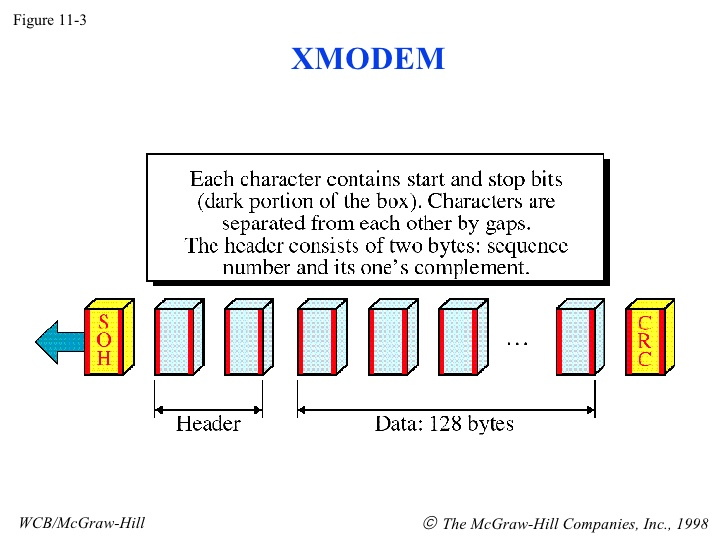
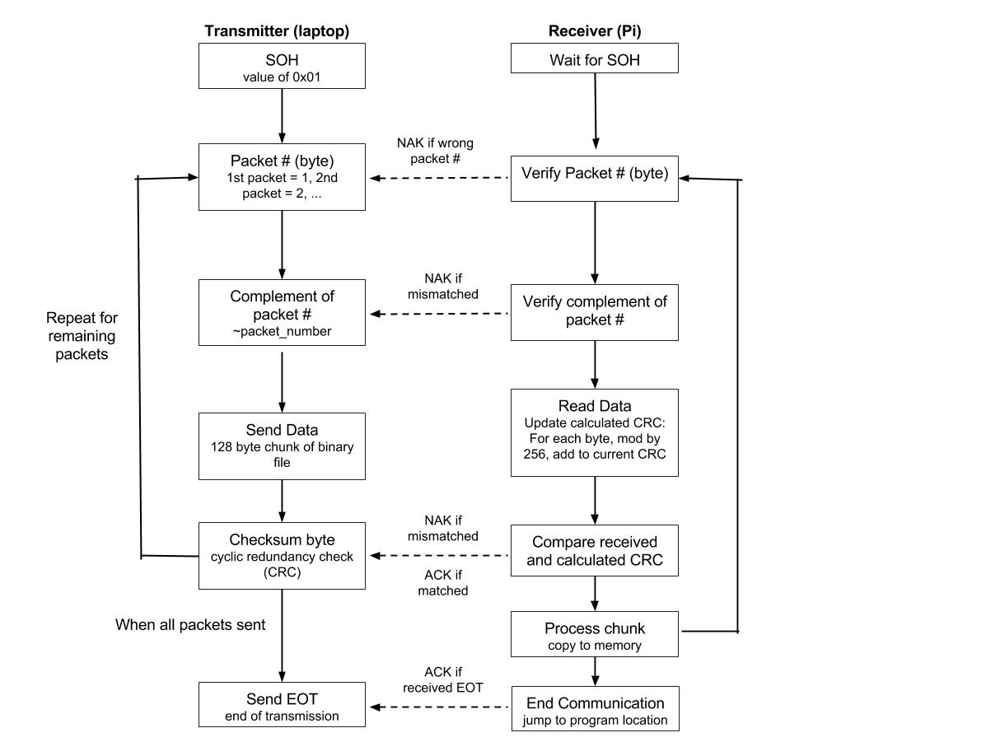

*Lab written by Pat Hanrahan*

### Goals

During this lab you will:

1 Experiment with the linker `ld`,
with the goal of understanding 
what is in an object (ELF) file,
and how object files are combined to produce an executable.

2 Read and understand the source to the bootloader.
It is important to read code produced in the wild.

To complete the lab,
you must answer the questions in the 
[check list](checklist.md).

The second question involves writing a
description of how the bootloader works.
See the detailed instructions in the second section of the lab.

### Lab exercises

#### Linking

In the first part of this lab,
you should repeat some of live coding demonstrations
showed during the lecture on linking and loading.

To start, check out the [code](./code) for this lab.

**Symbols in Object Files**

Descend into the `linking` folder. We will begin to examine the symbols (i.e. function names, variables, constants, etc) in this program by typing: 

    % make clean
    % make start.o
    % arm-none-eabi-nm start.o

What is the purpose of `arm-none-eabi-nm`? Here's a [helpful documentation](https://manned.org/arm-none-eabi-nm) to get a better understanding.
What does it print out?             
What do the single letter symbols 'T', 'U', and 't' mean?

Let's now try examining the symbols for main. 

    % make main.o
    % arm-none-eabi-nm main.o

What does this command print out? 
What does the print out tell you about the variables
and the functions in `main.c`.

Finally, let's see what `arm-none-eabi-nm` tell us about the symbols in `cstart.o`.

    % make cstart.o
    % arm-none-eabi-nm cstart.o

**Linking Object Files into Executables**

During lecture, we went over how object files need to be linked together to form one executable. `arm-none-eabi-ld` is the command 
that *links* the three files together to form a single executable. Let's do this now.

    % make main.exe
    arm-none-eabi-ld  -T memmap main.o cstart.o start.o -o main.exe
    ...
    
Next, look at the symbols for the executable as you did before with `nm`.

    % arm-none-eabi-nm main.exe

What has happened during the link process?

**Dissambling**

Let's disassemble `start.o` to get a better idea of what happens during linking.

    % arm-none-eabi-objdump -d start.o
    ...
    00000000 <_start>:
       0: e3a0d902    mov sp, #32768  ; 0x8000
       4: ebfffffe    bl  0 <cstart>

Note the branch at location 4.  

The *branch and link* instruction `bl` branches to location 0.
Is 0 the address of `cstart`?

Now let's disassemble `main.exe`, 
and let's look at the same code after linking.

    % arm-none-eabi-objdump -d main.exe
    ...
    00008000 <_start>:
    8000:    e3a0d902    mov sp, #32768  ; 0x8000
    8004:    eb000036    bl  80e4 <cstart>
    ...
    000080e4 <cstart>:
    80e4:    e92d4800    push    {fp, lr}
    80e8:    e28db004    add fp, sp, #4
    80ec:    e24dd018    sub sp, sp, #24
    ...

What is the difference between the branch address 
before and after linking?
What did the linker do to change the address?

**memmap**

A crucial part of executing any program is memory management. In order to get a sense of how memory gets organized through linking, run the following line: 

    % make main.exe
    arm-none-eabi-ld  -T memmap main.o cstart.o start.o -o main.exe
    arm-none-eabi-objdump -D main.exe > main.exe.list

This generates the file `main.exe.list`, which shows the mapping of symbols to their addresses.  

Look at the listing.
How do the `.text`, `.data`, `.rodata`, and `.bss`
sections from the different files get combined during linking?

Now look at `memmap`. 

- Do you see how the `memmap` linker script
specifies how sections from individual files are to be combined?

- One of the purposes of `memmap` is to ensure that
the global label `start` appears first in the executable file.
How does `memmap` specify that `start.o` should be first?

- Another purpose of `memmap` is to setup block storage
of uninitialized variables.
It does this by defining the addresses
`__bss_start__` and `__bss_end__`.
How are those addresses determined?
In C, uninitialized variables should be set to 0.
How does `cstart` use those addresses to initialize the variables to 0?

#### The bootloader

The second part of the lab involves
reading and understanding
how programs get sent from your laptop to your Pi.

The code for this portion is in the folder `bootloader-rewrite`.

The bootloader we are using was written by David Welch,
the person most responsible for figuring out how
to write bare metal programs on the Raspberry Pi.
If it wasn't for his work,
we would not be offering this course.

In order for your laptop to transmit the program binary to the Pi, we have been using the program `rpi-install.py`.
The laptop and the Pi communicate using a simple
file transfer protocol called XMODEM.
In the jargon of XMODEM,
the host laptop is called the tranmitter.

The `bootloader.c` program is normally installed on your SD card as `kernel.img`.
When the Pi boots,
it loads the bootloader code,
and starts running it.
The bootloader program uses the Pi's UART to communicate with the host (i.e. your laptop).
What happens is the Pi receives the binary,
loads it into memory,
and then branches to the code to begin execution.

**Sending Programs**

The transmitter first reads in the binary file it wants to send,
and then sends the bytes to the Raspberry Pi as a series of packets.
This is the algorithm used in the transmitter.

1) Start the transmission by sending the SOH character,
which has the value 0x01.
SOH is a *control character* which stands for *start of transmission*.

2) Next send the packet number as a byte.
The first packet is numbered 1,
and the packet number is incremented after each packet is sent.

3) Next send a byte 
whose value is the complement of the packet number,
or `~packet_number`.

4) Send a 128 byte chunk of the binary file.

5) Finally, send a checksum byte.

6) Repeat the above for all the packets being transmitted.
When there are no more packets to be sent,
send the EOT character; EOT stands for *end of transmission*.

**Receving Programs on the Pi**

First, read the assembly language file `start.s`. 
Note the `.space` directive between `_start` and the label `skip`.
This has the effect of placing the bootloader code 
at location `0x200000`.
This creates a hole in memory
(between 0x8000 and 0x200000).
The bootloader loads your program into that hole.
Why can't the bootloader code also be placed at 0x8000?

Now let's look at the algorithm used to receive the XMODEM
protocol, as implemented in the file `bootloader.c`.
This program, which runs on the Raspberry Pi, is the receiver.

It reads bytes by doing the following:

1) Wait for a SOH.

2) Read the packet number. 
The first block must be packet number 1.
The packet number of each packet should be incremented
after each packet is successfully received.
If the receiver sees a packet with the wrong packet number,
the receiver should send the control character `NAK`, for 
negative acknowledge, to the transmitter.

3) Check that the complement of the packet number is correct.
How does the C code in bootloader check that the complement is correct?
If the packet number and 
the complement of the packet number are not consistent, 
send a `NAK` to the transmitter.

4) Read the 128 bytes comprising the payload of the packet.
Incrementally update the cyclic redundancy check (CRC) when a byte arrives.
The CRC is formed by adding together mod 256 all the bytes in the packet.

How is this done in the bootloader?
Suppose we send 128 bytes,
where the 1st byte is 1, the 2nd byte is 2, and so on, until
we get to 128th byte which has the value 128.
What is the value of the CRC in this case?

4) After all 128 bytes have been sent,
read the CRC byte sent by the transmitter.
Compare the CRC sent by the transmitter 
with the calculated CRC.
If they agree, send an `ACK` (acknowledge) to the transmitter;
if they do not agree, send a `NAK` (not acknowledge) to the transmitter.

5) If the packet has been successfully received,
copy it to memory,
and prepare to receive the next packet.

6) If the receiver receives the EOT byte,
then the tranmission has ended.
EOT stands for *end of transmission*.
Send an `ACK`,
and then jump to the program memory location.

Where does the bootloader copy the program?
What happens when the bootloader detects an error
which requires it to send a `NAK`?
How does it recover from errors?
Why does it use the timer?

Discuss the bootloader code in detail with your lab mates.
Make sure you understand all of it.

Each group is responsible for
writing a description of the C implementation of the bootloader.
Break the description up into parts,
one for each person in your group.
Assign part of the description to each person.
Each person should write one paragraph 
describing the part of the implementation assigned to them.
**Collate your descriptions, and hand in the completed writeup to the CA.**		

Here is a helpful diagram as you look through the code. 		

