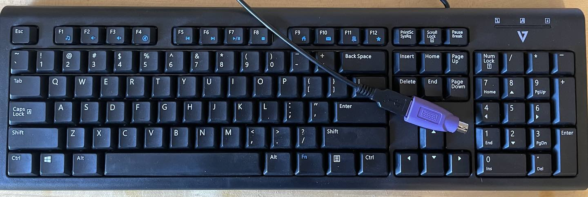
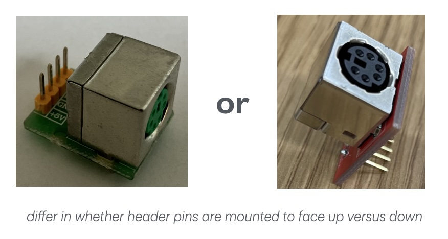
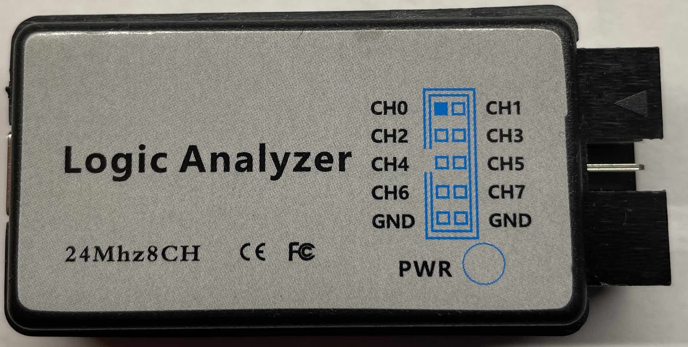
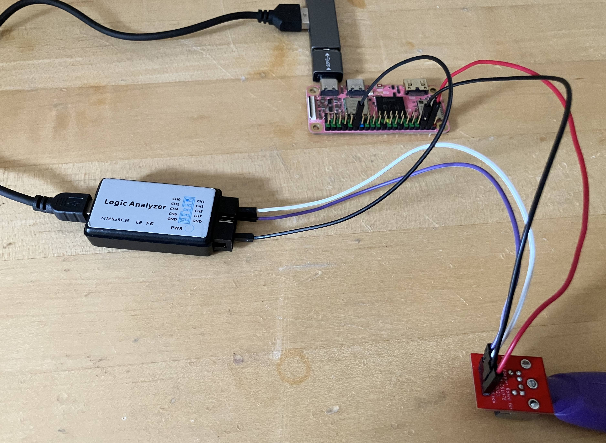
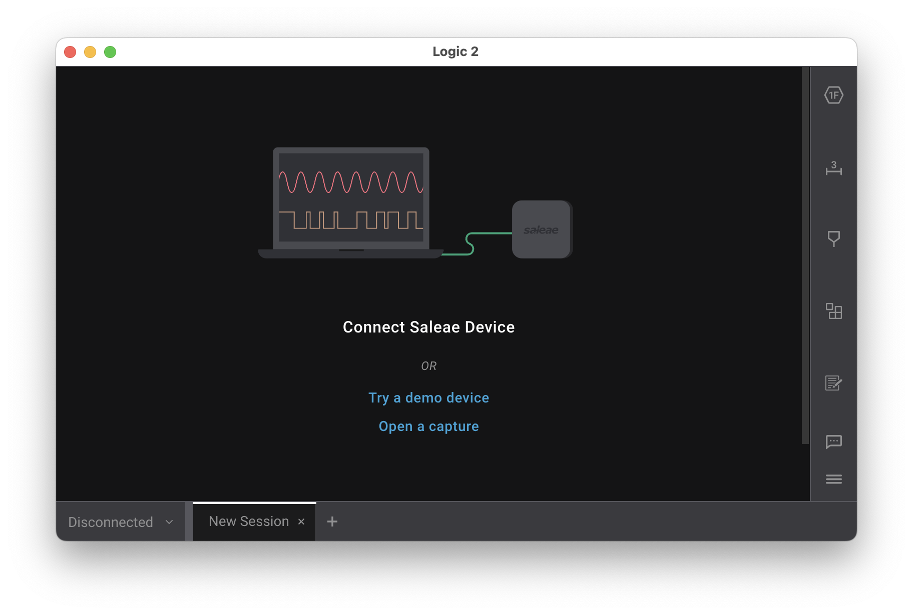
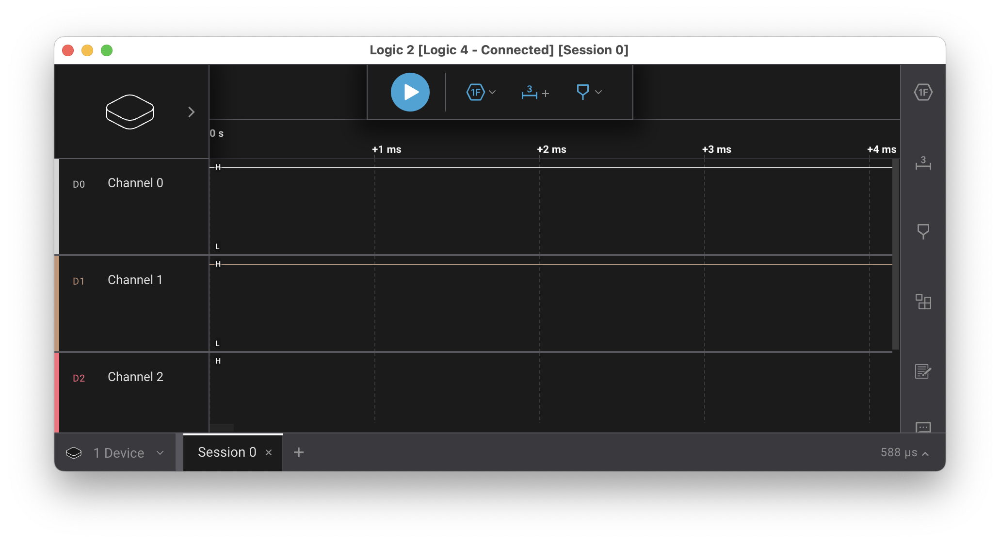
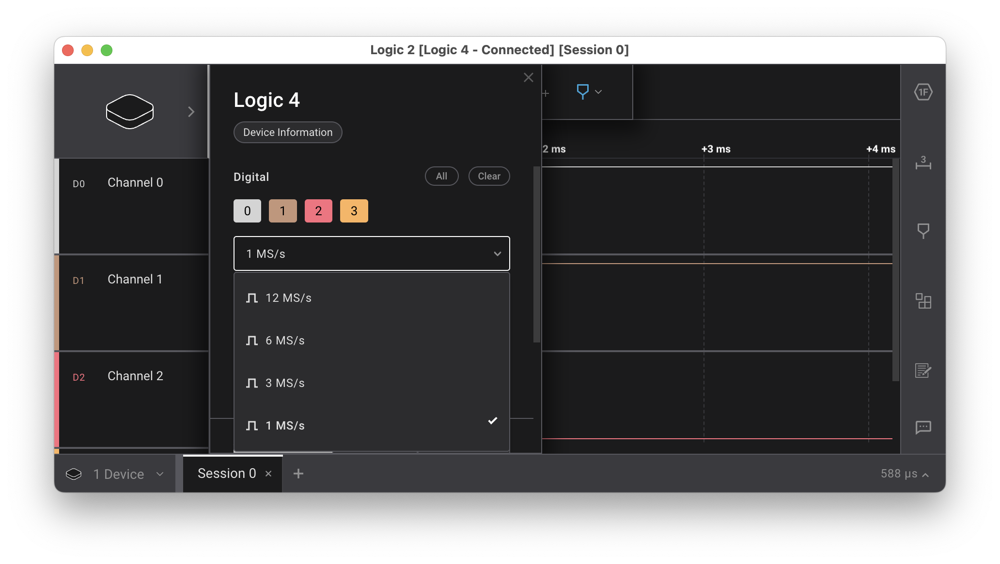
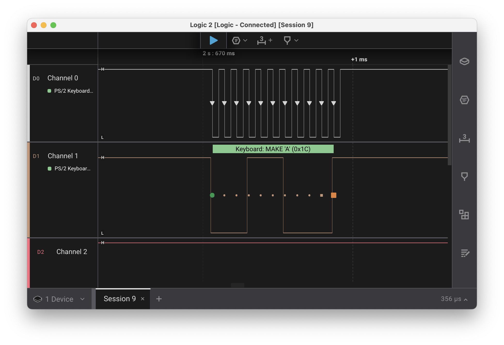
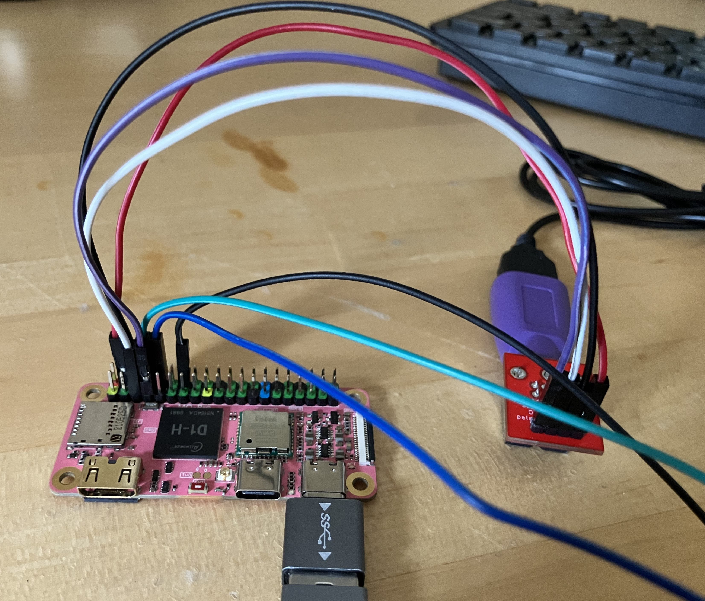


Task list to copy/paste when creating PR for this lab:

__Before releasing lab5:__
- [ ] Review writeup/code/checkin questions (instructor)
- [ ] Walk through (SL)
- [ ] Followup on issues from previous quarter postmortem (issue #396)
- [ ] Update instructions/photos for non-Saleae analyzers, consider PulseView instead of Logic app?

__To prep for lab5:__
- [ ] Confirm sufficient count of PS/2 keyboards+plug board+logic analyzers for all students (Label keyboard with id number for tracking and add column to lab attendance to record number checked out to student?)
- [ ] Print copies of PS/2 key code chart (assignments/assign5/images/scancode.gif)




## Goals

In your next assignment, you will write a PS/2 keyboard driver for your Pi. The
primary goal of this lab is to get you set up with the keyboard to be ready to start on
the assignment.

During this lab you will:

- Wire up a PS/2 keyboard to the clock and data gpios on your Mango Pi.
- Watch the signals from the keyboard using a logic analyzer.
- Print out the scancodes sent by the keyboard.
- Write code to read the 11 bits of a PS/2 scancode.

## Prelab preparation
To prepare for lab, do the following: 

1. Be up to date on [recent lecture content](/schedule/#Week5): __Keyboard__
1. Review this document detailing the [PS/2
  protocol](https://web.archive.org/web/20180302005138/http://computer-engineering.org/ps2protocol/).
  - Print a copy of this [PS/2 key code chart](images/scancode.gif) and have it on
  hand.
1. Install `Saleae Logic` application.
  - We will be using the `Saleae Logic` application to visualize the signals
  captured by the logic analyzer. [Saleae](http://saleae.com) is a company known
  for its high-quality logic analyzers and software.  Here is the page with
  [download links for Saleae Logic](https://ideas.saleae.com/f/changelog/). Download
  and install the version for your platform. If using WSL, download the Windows
  version.
    - The linux version seems to require some extra fiddling; see [helpful Ed post from Bhushan](https://edstem.org/us/courses/70346/discussion/6158273) with info.
1. Organize your supplies to bring to lab
    - Bring your laptop (with full battery charge) and entire parts kit.
    - Bring along interesting code for [show-and-tell](#code-reading)!

## Lab exercises

### 0. Pull lab starter code

Change to your local `mycode` repo and pull in the lab starter code:

```console
$ cd ~/cs107e_home/mycode
$ git checkout dev
$ git pull code-mirror lab5-starter
```
### 1. Connect PS/2 plug, power up keyboard

In lab, we will distribute a PS/2 keyboard and plug board to each of you.
(Click photos to enlarge).
- __PS/2 keyboard__ (including __USB-to-PS/2 adapter__ perma-attached with hot glue)
    {: .zoom .w-50}
- __PS/2 plug board__
    {: .zoom .w-50}

The keyboard and plug board are lent to you, take them home to work on the upcoming assignments. Write your name and id number of your keyboard on the sign-out sheet. Please take care of keyboard and plug board, you must return both at the end of the quarter.

Most modern keyboards use the Universal Serial Bus (USB). The USB protocol is quite complicated: a typical USB keyboard driver is 2,000 lines of code -- ouch!
In this course, we instead use a PS/2
keyboard because PS/2 is a simple serial protocol that is easy to decode.  The PS/2
keyboard appeared on the original IBM PC.  Computers have long since stopped
including a PS/2 port as standard equipment; we wire our own connection
from a PS/2 plug board to the GPIO pins on the Pi.

Sourcing genuine PS/2 keyboards has become an archaeological expedition for us. We use a particular modern USB keyboard that can also operate in PS/2 mode.  The keyboard has
a wired USB connector and a passive USB-to-PS/2 adapter. We use hot glue to attach that adapter, so the keyboard acts as a wired PS/2 keyboard.

There are two common PS/2 devices: a keyboard and a mouse.  A PS/2
plug is a 6-pin
[mini-DIN connector](https://en.wikipedia.org/wiki/Mini-DIN_connector).
By convention, a mouse connector is green and a keyboard connector is purple, but the connectors
are otherwise identical.  Inspect the inside of the mini-din PS/2 connector on the keyboard. It
has 6 male pins and a plastic tab (SHLD) to guide inserting the plug with the correct
polarity. Two of the pins are NC (not-connected); the others
carry VCC, GND, DATA and CLK.


Grab the PS/2 plug board and look at its four-pin header. Each pin on the header corresponds to one of the four connected pins of the PS/2 plug. The circuit board has traces to connect each pin.  On the red plug boards, the CLK, DATA, and GND traces are on the top side of the board
and the 5V trace on the underside. On the green plug boards, all four traces are on the bottom side of the board.

From your parts kit, pick out five female-to-female jumpers: one red, two black, one white, and one purple. You'll be following these color conventions: red for
5V, black for GND, white for CLK, and purple for keyboard DATA.

Use the red and black jumpers to supply power to the plug board.
- insure your __Pi is powered off__ before fiddling with wiring!
- use a red jumper to connect a 5V pin on the Pi to the 5V pin on the plug board
- use a black jumper to connect a GND pin on the Pi to the GND pin on the plug board
- double-check these connections to confirm they are correct (wiring a short circuit through the keyboard can cause fatal damage; ask us how we know...).

Plug the male PS/2 end of your keyboard cable into the female socket on the plug board, being sure to rotate to correct position to align the plastic tab. If you try to force a misaligned plug, you can bend the pins or break off the tab. Please do not do this!

Power on your Pi and the keyboard should flash the small green LEDs in the upper corner when it powers up. These LEDs are not very bright and the flash is brief. You may get a better view if you use your hand to block the ambient light.

If your keyboard does not power on, grab a staff member to help diagnose.


### 2. Use a logic analyzer to visualize keyboard signals

We have a bin of logic analyzers available in lab. Use an analyzer and USB cable to do these exercises in lab, be sure to return to us before leaving lab.

A logic analyzer allows you to examine the signals sent by the keyboard. Here is an inexpensive 8-channel logic analyzer made by Hiletgo (click photo to enlarge):

{: .zoom .w-25}

The logic analyzer has a 10-pin header. The pins correspond to the different signals or _channels_ to be monitored by
the analyzer. The analyzer can read up to 8 simultaneous channels.

Read
the analyzer label to learn its pin layout and identify which pins correspond to the two lowest-numbered channels.  Some of our logic analyzers label the channels using a 0-based index (`Ch0`, `Ch1`, ... `Ch7`) and others use 1-based index (`Ch1`, `Ch2`,... `Ch8`). In either case, identify the two lowest-numbered channels. We will refer to the two lowest-numbered channels as `Ch0` and `Ch1` but they may be labelled `Ch1` and `Ch2` on the analyzer you are using.

With Pi powered off, wire the clock and data pins from your plugboard to the logic analyzer.

- use a white jumper to connect the CLK pin on the plug board to `Ch0` on the analyzer
- use a purple jumper to connect the DATA pin to `Ch1`

You must also ground the logic analyzer. Voltage is relative: when looking at a signal, the reading is the difference from a
reference voltage, which in this case should be the ground provided by the Pi. If you don't
tie the logic analyzer's ground to the Pi's ground, it will be measuring voltage against whatever happens to be
on the pins, which can act as tiny antennae. Connect the ground on your Pi to the ground on the analyzer.

- use a black jumper to connect an open ground pin on your Pi to a ground pin on the analyzer

Below is a photo of the circuit (click photo to enlarge). The plug board power (red) and ground (black) are connected to the Pi. The plug board CLK (white) and DATA (purple) are connected to channels 0 and 1 of the logic analyzer. The logic analyzer ground (black) is connected to Pi ground. Double-check to confirm your connections before powering up your Pi.

{: .zoom .w-50}

Open the __Saleae Logic__ application you installed on your laptop as part of prelab
preparation. When the logic analyzer is unconnected, the start-up screen is similar to this:

{: .w-75}

Connect the USB cable from the mini-USB port on the logic analyzer to an open port on your laptop or USB hub. When the logic analyzer is connected, the Logic screen will change to this:

{: .w-75}

Press the flat cube icon in the upper right to access the device settings. Find the sample rate control in the settings pane; it is labeled something like `24 M/s`. Adjust the sample rate down to `1 M/s` (1 million samples per second is plenty, attempting to sample at a higher rates can sometimes produce errors). Close the settings pane.

{: .w-75}

The blue triangle at the top is the play/stop button. Press play
to start reading the signal. Type a few keys on the PS/2 keyboard, then press stop to end the recording.
The Logic window will show the signals recorded on channels 0 and 1.
Zoom in and out and pan left and right to view the signal details. You should see the characteristic pattern of the PS/2
protocol. 

The Saleae Logic application has signal analyzers for common protocols.  Along the top of the window, click the hexagon labeled `1F` to
display the "Add Analyzer" pane. Type "PS" to filter the list of analyzers and select "PS/2 Keyboard/Mouse". Configure CLK on
channel 0 and DATA on channel 1. The captured data is now decoded according to
the PS/2 protocol and interprets the sampled signal as scancodes.



Hover over the visualization of the PS/2 clock channel to see the signal timing
data. How far apart is each falling clock edge? At what frequency is the PS/2
clock running?  Is the keyboard operating with the range dictated by the
[spec](https://web.archive.org/web/20180302005138/http://computer-engineering.org/ps2protocol/)? 

You're ready to answer the first check-in question[^1].

### 3. Run keyboard test

Now rewire the circuit to connect the clock and data lines of plug board to the Pi, instead of the logic analyzer.

Turn off power to the Pi and disconnect the logic analyzer and return to us. Re-use the white and purple jumpers to connect the plug board clock and data to the Mango Pi keyboard clock and data gpios.

Review the keyboard module interface [keyboard.h](https://cs107e.github.io/header#keyboard) to see which gpio pins to use for the keyboard clock and data lines. The white jumper (CLK) connects to `KEYBOARD_CLOCK` (`PG12`) and the purple jumper (DATA) to `KEYBOARD_DATA` (`PB7`). Find the corresponding header pins on the Mango Pi [pinout](/guides/refcard).
```console
$ pinout.py keyboard
```

All four jumpers (red, black, white, purple) connect from the plug board to the Mango Pi as shown in the photo below (click photo to enlarge). Double-check to confirm your connections before powering up your Pi.

{: .w-75}

The `keyboard_test` application uses the reference implementation of the
keyboard driver. Let's try it now:

```console
$ cd lab5/keyboard_test
$ make run
```
Type keys on the PS/2 keyboard and the program should print the scancodes
received. If you aren't getting events, check your wiring.

Note that scancodes are not ASCII characters. Instead, these values relate to
the physical placement of the key on the keyboard.  Inside the keyboard,
there's a 2-D matrix of wires that generates the scancode for a given key.

Each key press and key release is reported as a distinct action. Press a key;
the keyboard sends a scancode. Release the key; the keyboard sends another
scancode; this code is same as the first one, except it is one byte longer: it
has a leading `0xF0`. Tap the `z` key now. The keyboard sends `0x1A` on key
press, followed by `0xF0` `0x1A` on key release.

If you press `z` and hold it down, the keyboard enters auto-repeat or
_typematic_ mode where it repeatedly generates key press actions until you
release the key.  Press and hold `z`and watch for the repeat events to start
firing. About how long does it seem to take for auto-repeat to kick in? At
about what rate does it seem to generate auto-repeat events?  

Press and hold one key, then press and hold another without releasing the first. Which key repeats? What happens when you release that key? Try those same actions on your laptop's keyboard. Does it behave the same way?

Type single keys to observe the scancodes for press, release, and
auto-repeat.  Then try typing modifier keys like Shift and Alt, singularly and in conjunction
with other keys. Does shift being pressed changed what scancode is sent by a letter key? What about
caps lock? Observe the sequence of scancodes to suss out what functionality is provided by the keyboard hardware and what features are to be implemented in the keyboard driver software.

You're ready for the second check-in question [^2]

<style>
  .sidebar { font-size: small; }
</style>

> __Side note on N-key rollover__
- The PS/2 protocol reports each key action as a separate scancode. If the user simultaneously presses N keys, a PS/2 keyboard sends N scancodes, one for each key. In contrast, the USB protocol operates by asking the keyboard for the current state and the keyboard's answer is limited to reporting at most 6 pressed keys, i.e., USB is constrained to 6-key rollover. Try observing this on your laptop keyboard (which is likely USB). Open your editor or use the Mac "Keyboard Viewer" to visualize (In Preferences->Keyboard, enable "Show keyboard and emoji view in menu bar", then choose "Open Keyboard Viewer" from input menu). Hold down one letter, then two, and so on, and you'll reach a point at which no further key presses are detected.
- While the PS/2 protocol has no limitations and in theory allows full N-key rollover, in practice, the internal wiring of many PS/2 keyboards shares circuitry among keys rather than wiring each key independently. As a result, as you hold down more and more keys on your PS/2 keyboard, you'll likely reach a point where additional keys are mis-detected. Try it now on your PS/2 keyboard. How many simultaneous keys can your PS/2 keyboard reliably detect? What happens when you go past that limit?
- Here is a good explanation from Microsoft Research on [N-key rollover and keyboard circuitry](http://web.archive.org/web/20180112133411/https://www.microsoft.com/appliedsciences/content/projects/AntiGhostingExplained.aspx) if you want to learn more.
{: .callout-info .sidebar}

### 4. Implement ps2_read

In this lab exercise, you will get a start on writing the keyboard
driver that will be a part of your next assignment. We want you to do this task in lab because working at the intersection of hardware and software requires a specialized kind of debugging which can be tricky; it helps to
have staff around!

Change to the directory `lab5/my_keyboard`. This is the
same application as `lab5/keyboard_test`, except that rather than
using the reference implementation, you will write your own code to
read a scancode.

[Browse the headers](/header) for ps2.h and keyboard.h to review the module
documentation. The `ps2` module manages the low-level communication with a PS/2
device. The `keyboard` module layers on the ps2 module to interpret scancodes
into typed keys. During lab, you will implement an initial version of the
function `ps2_read`.

Open `ps2.c` in your editor. The function `ps2_new` has already been
written for you.  This function configures a new PS/2 device for the specified
clock and data gpio. In the library modules we have seen thus far, we have used
global variables to store data that is shared across the module. A single set
of global variables for the ps2 module does not work, as each device needs its
own independent settings (i.e clock and data gpio). `ps2_new` creates a new
struct to hold the per-device settings. Because that memory needs to be
persistent after the function call exits, it allocates memory using your shiny
new `malloc` . The rest of the function is setting the clock and data GPIOs as
inputs and enabling the internal pull-up resistor so these pins default to
high, as expected in the PS/2 protocol.

Once you understand the given code in `ps2.c` you are to implement the function `ps2_read`
to read the bits that make up a scancode. The basic operation is to wait for
the falling edge on the clock line and then read a bit from the data line.
You will need to do this 11 times for a scancode, but rather than duplicate that code 11 times,
we suggest you define a private helper function `read_bit`. The helper waits until observes the transition from high to low on
the clock line and then reads a bit from the data line. Unifying repeated code
into a shared helper aids readability and maintainability; this is a good habit
to adopt. 

A scancode transmission consists of 11 bits: a start bit (always low), 8 data
bits, a parity bit, and a stop bit (always high).  The
`ps2_read` should verify that first bit read is a valid start bit, e.g. is 0.
If not, discard it and read again until a valid start bit is received.  Next,
read the 8 data bits and lastly, read the parity and stop bits. In which order do the 8 data bits arrive?
If you're not sure, take a look at the signal you captured for the keyboard's data line with the
  logic analyzer or look back at the PS/2 protocol documentation linked in the prelab.

> __Error-checking in `ps2_read`__ In the starter version you write during lab, the only error-checking is to detect and discard an invalid start bit. For the assignment, your driver will implement additional error-checking for parity, stop bit, and timeout. For lab, it's okay to just read the bits and assume they are correct.
{: .callout-warning}

The function `keyboard_read_scancode` in `keyboard.c` simply calls `ps2_read`
to get the next scancode.  This means that once you have a working `ps2_read`,
your `keyboard_read_scancode` should automatically spring to life. Build and
run the application and see that it receives each scancode sent by the
keyboard.

If your implementation of `ps2_read` is working
correctly, you should be able to compile your application and have it act
identically to the `keyboard_test` version you tested in Step 3. If you run
into any snags, please be sure to get help from us now so that you'll be able
to hit the ground running on the assignment. Show us your working code! [^3]

> __Caution on adding debug code in timing-sensitive passages__ Back in lab1, you estimated how many instructions the Pi was executing (~400 million/second).  Earlier in this lab, you measured the time of one cycle of the PS/2 clock.  Work out how many instructions the Pi can execute in that time. Now consider a call to `printf`. Make a ballpark estimate of how many instructions are executed to process and output each character and multiply that count by length of the format string for a rough total count. Imagine adding a debug print statement to your keyboard driver after reading one bit and before reading the next. What would be the consequence if that `printf` call takes longer to execute than the time before the next bit is sent by the keyboard? To ensure you stay within budget, best to limit debug output to a quick jot of a few characters via `uart_putchar`.  Keep this lesson in mind whenever working with code that has similar tight timing requirements.
{: .callout-warning }

#### Using a logic analyzer to "snoop"
In this lab, we connected the keyboard clock and data lines to __either__ the logic analyzer or to the Pi, but it's also possible to connect to __both__ simultaneously!  You would run clock and data jumpers from the plug board to a breadboard and then fan out two connections from there, one to the logic analyzer and another to your Pi. Your Pi receives the data while the same signal is simultaneously captured by the logic analyzer.  This can be very useful during debugging as you can compare what your Pi thinks
it's receiving with the ground truth of the logic analyzer capture. Using the logic analyzer to observe
exactly what signals are sent while simultaneously seeing how your Pi interprets them is like having gdb for the pins! The logic analyzers are available in lab if you need to borrow one in the future.

<a name="code-reading"></A>
### 5. Code reading
One great way to deepen your understanding of programming and computer systems is to read
and review code written by others.


If we have some time at end of lab period, we hope to do some group code review. We welcome you to bring a passage of particular interest to you.
It can be code you wrote yourself (for CS107e, of in past courses or personal project) or code from a
public source (github, open source repository, blog, textbook, paper, etc.). Perhaps you've seen a clever technique that you would like to further understand ([Fast inverse square root?](https://en.wikipedia.org/wiki/Fast_inverse_square_root) ) Maybe you have a piece of code that you struggled to design and would like to brainstorm alternative approaches? Perhaps we will settle a score with code that deserves to be drawn and quartered for its crimes against [good taste](https://xkcd.com/1695/) and all that is [sacred](https://xkcd.com/1833/)? Bring it in for show-and-tell!


## Check in with TA
The key goals for this lab are to leave with wired connection to the PS/2 keyboard and a working draft code to read the 11 bits of a single scancode. Please return __logic analyzer and usb cable__ to the lab cabinet (not to take home).[^4]

<div class=checkinsheet markdown="1">
# {{ page.title }}
<div class="underline-name"></div>
Circle lab attended:  &nbsp;&nbsp;&nbsp;&nbsp;&nbsp;&nbsp;  _Tuesday_  &nbsp;&nbsp;&nbsp;&nbsp;&nbsp;&nbsp;  _Wednesday_
<BR>
<BR>
Fill out this check-in sheet as you go and use it to jot down any questions/issues that come up.  Please check in with us along the way, we are here to help![^5][^6]
</div>

[^1]: The PS/2 clock frequency must be in the range 10 to 16.7 kHz. To be within spec, what should time period between falling clock edges be? When you measured using the logic analyzer, what time period did you observe? Is your keyboard operating within spec?
[^2]: What sequence of codes is sent when typing capital `A`? If you hold down both the shift key and 'a' key, what is the sequence of repeating codes is sent?
[^3]: Show off that your implementation of `keyboard_read_scancode` correctly receives scancodes from your keyboard.
[^4]:  The PS/2 keyboard and plug board are on loan to you to take home. Please take care of this equipment; you will return both at the end of quarter. Write down the number marked on your keyboard so we can track it.
[^5]: Are there any tasks you still need to complete? Do you need assistance finishing? How can we help?
[^6]: Do you have any feedback on this lab? Please share!

