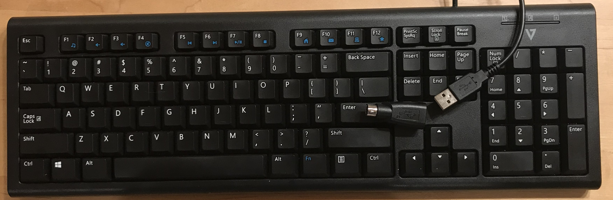
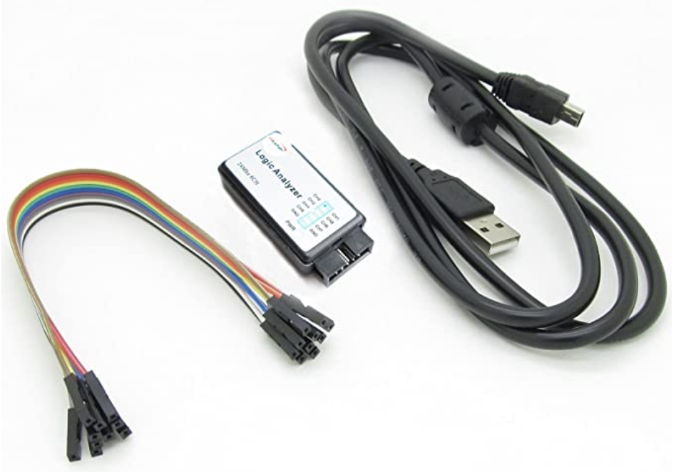
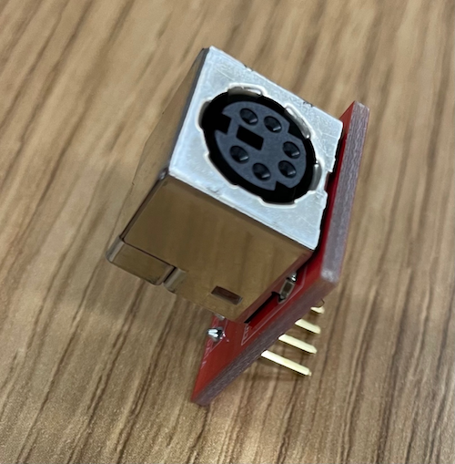
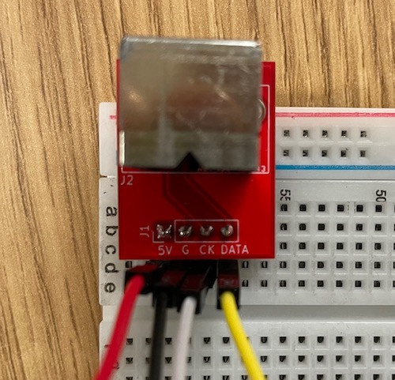
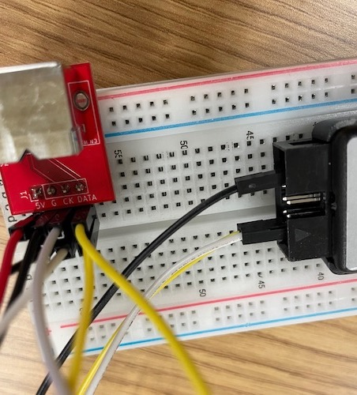
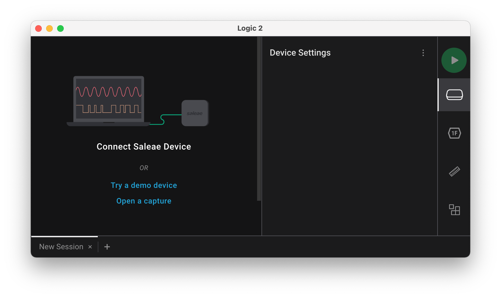
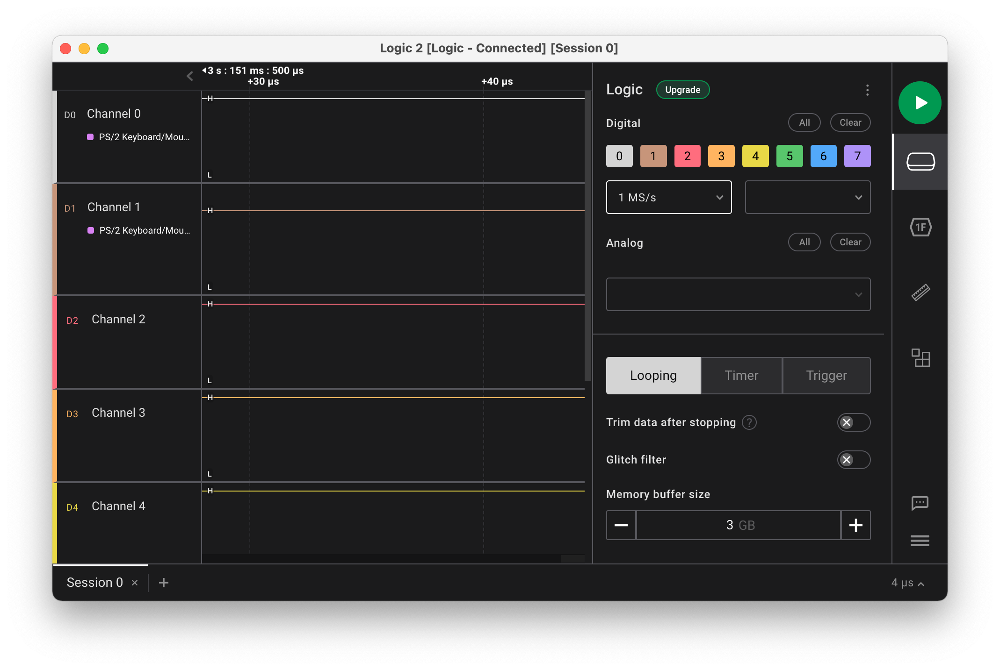
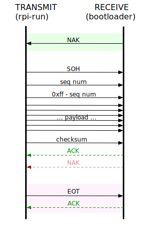


Task list to copy/paste when creating PR for this lab:

__Before releasing lab5:__
- [ ] Review writeup/code/checkin questions (instructor)
- [ ] Walk through (SL)
- [ ] Followup on issues from previous quarter postmortem (issue #396)
- [ ] Update instructions/photos for non-Saleae analyzers, consider PulseView instead of Logic app?

__To prep for lab5:__
- [ ] Confirm sufficient count of PS/2 keyboards+plug board+logic analyzers for all students (Label keyboard with id number for tracking and add column to lab attendance to record number checked out to student?)
- [ ] Print copies of bootloader.c source code
- [ ] Print copies of PS/2 key code chart (assignments/assign5/images/scancode.gif)



*Lab written by Philip Levis and Pat Hanrahan*

## Goals

In your next assignment, you will write a PS/2 keyboard driver for your Pi. The
primary goal of this lab is to set up the keyboard so that you can start on
the assignment.

During this lab you will:

- Connect a keyboard to your Raspberry Pi's GPIO pins.
- Watch the signals from the keyboard using a logic analyzer.
- Print out the scancodes sent by the keyboard.
- Write code to decode the PS/2 protocol to produce scancodes.
- Read and understand the code for the magical bootloader program on your SD card. It is important to be able
  to read code produced in the wild.

## Prelab preparation
To prepare for lab, do the following: 

- We will be using the Saleae `Logic 2` application to visualize the signals
  captured by the logic analyzer. Saleae <http://saleae.com> is a company known
  for its high-quality logic analyzers and software.  Here is the page with
  [links to download Logic 2](https://ideas.saleae.com/f/changelog/). Download
  and install the version for your platform. If using WSL, download the Windows
  version.
- Review the [slides from the Keyboard lecture](/lectures/Keyboard/slides.pdf)
  and this document detailing the [PS/2
  protocol](https://web.archive.org/web/20180302005138/http://computer-engineering.org/ps2protocol/).
  Print a copy of this [PS/2 key code chart](images/scancode.gif) and have it on
  hand.

## Lab exercises

We have labeled each exercise with a recommended time allotment to help you keep on pace during the lab period.
If you are running short on time during lab, it's recommended that you move along as noted, and come back to any
unfinished parts on your own time or during OH.

### 0. Pull lab starter code

Before starting each new lab, first do a `git pull` in your $CS107E repository to ensure the courseware files are up to date.

```console
$ cd $CS107E
$ git pull
```

Now cd to your local `mycode` repo and pull in the lab starter code:

```console
$ cd ~/cs107e_home/mycode
$ git checkout dev
$ git pull --allow-unrelated-histories starter-code lab5-starter
```

### 1. Install PS/2 plug (10m)

We will distribute a keyboard kit to you. The kit includes a keyboard, logic analyzer, and PS/2 plug and circuit board.
(Click photo to show each full screen).
- __PS/2 keyboard__ (including __USB-to-PS/2 adapter__, which will be hot glued the cord of your keyboard)
    {: .zoom .w-50}
- __Logic analyzer__ 
    {: .zoom .w-25}
- __PS/2 plug board__
    {: .zoom .w-25}

These supplies are lent to you, you must return them at the end of the quarter. Please take care of them!

Most modern keyboards use the Universal Serial Bus (USB). As you
heard in lecture, the USB protocol is quite complicated: a typical USB keyboard driver is 2,000 lines of code -- ouch!
In this course, we instead use the older PS/2
keyboard because it has a simple serial protocol that is easy to decode.  The PS/2
keyboard appeared on the original IBM PC.  Computers have long since stopped
including a PS/2 port as standard equipment so we will wire a direct connection
from the PS/2 plug board to the GPIO pins on the Raspberry Pi.

Finding genuine PS/2 keyboards has become somewhat of an archaeological expedition. In this course, we use a specific USB keyboard that is dually capable of operating in PS/2 mode.  The keyboard has
a wired USB connector and a USB-to-PS/2 adapter. We used hot melt
glue to permanently attach that adapter, so the keyboard acts as a wired PS/2 keyboard.

There are two common PS/2 devices: a keyboard and a mouse.  A PS/2
plug is a 6-pin
[mini-DIN connector](https://en.wikipedia.org/wiki/Mini-DIN_connector).
By convention, mice use a green connector and keyboards use a
purple connector.  Inspect the inside of the mini-din PS/2 connector on the keyboard. It
contains a plastic tab (that forces you to insert it into the port with the correct
polarity) and 6 male pins. Two pins are NC (not-connected), and the others
carry VCC, GND, DATA and CLK.


Grab your PS/2 plug board. Flip it over to see the four-pin header that
sticks out from the bottom of the circuit board. Those header pins connect
to the male pins in the PS/2 plug through small traces. Look at the
board and find those traces. The CLK, DATA, and GND traces are on one side of the board
and the 5V trace is on the opposite side.

Place the plug board into your breadboard so that each of the four pins
is on a different row. Be careful not to mis-orient the board; if the four pins are all in the same row, they are all connected together, which is not what you want!

You will use female-to-male
jumpers to make a connection to each of the four breadboard rows.
Follow these color conventions for the jumpers: red for
5V, black for GND, white for CLK, and yellow for DATA.

First, supply power to your keyboard. Choose two female-to-male jumpers, one red and one black.
Connect the female end of the red jumper to a 5V pin on your Raspberry Pi and the male end to the 5V row in your breadboard.
Similarly, use a black jumper to connect a GND pin on your Pi to the GND row.

### 2. Use a logic analyzer to visualize keyboard signals (20m)

We're going to use a logic analyzer to examine the signals sent by the keyboard.  Familiarize yourself with the hardware of the logic analyzer.

{: .zoom .w-25}

One end of the logic analyzer has a bank of
pins that correspond to the different signals or _channels_ to be monitored by
the analyzer. The analyzer supports reading up to 8 simultaneous channels. The
other end of the logic analyzer has a mini-USB port. You will connect the USB
of the logic analyzer to your laptop supply power and read data.

Choose two female-to-male jumpers, one white and one yellow.
Read
the label on the analyzer to learn the pin layout and identify which pins correspond to channels 0 and 1.
Connect the female end of the white jumper to channel 0
on your analyzer and the male end to the CLK row on your breadboard.
Similarly, use the yellow jumper to connect channel 1 to the DATA row.

In the photo below, the four jumpers from left to right are power (red), ground (black), CLK (white), and DATA (yellow).
The power and ground connect to your Pi. The CLK and DATA are connected to channels 0 and 1 of the logic analyzer.

{: .zoom .w-25}

Choose another two female-to-male jumpers, one white and one yellow. Connect the male end of the second white jumper to the CLK row and the second yellow jumper to the DATA row. Leave the female jumper ends unconnected.
We will connect these later, but it's easier to get them into the breadboard now.

You must also ground the logic analyzer. Voltage is relative: when looking at a signal, all you can tell is its difference from a
reference, which in this case should be the ground provided by the Pi. If you don't
connect the logic analyzer to the Pi's ground, then it will be measuring voltage against whatever happens to be
on the pins, which can act as tiny antennae. Identify
the ground pin on the analyzer and use a female-to-female black jumper to connect it to a
ground pin on your Raspberry Pi. Depending on the model of logic analyzer you are using, there may be one shared ground for all channels or a separate ground per channel.

This is what it looks like when the plug board is wired up to the logic analyzer.

{: .zoom .w-75}
{: .zoom .w-75}

Plug your keyboard into the PS/2 port on the plug board.

Open the *Logic 2* application you installed on your laptop for prelab
preparation. When the logic analyzer is unconnected, the start-up screen is similar to this:



Connect the USB cable from the mini-USB port on the logic analyzer to an open USB-A port on your laptop. If your laptop doesn't have an open USB-A port or requires an additional USB-A to C adapter, pair up with your neighbor and pool your resources to get a single setup working on one laptop that you can both observe.

When you connect the logic analyzer to your laptop, the Logic 2 screen will change to this:



Find the sample rate control; it is labeled something like `24 M/s`. Click on the control and adjust the sample rate down to `1 M/s` (1 million samples per second is plenty, attempting to sample at a higher rates can sometimes produce errors).

In the upper right corner is a green button with the white "Play" triangle. Click this button
to start reading the signal. Type a few keys on the PS/2 keyboard and then click the red "Stop" button to stop reading.
The application records and visualizes activity on channels 0 and 1. 
You can zoom in and out and pan left and right to see the details
of the captured signal. You should see the characteristic pattern of the PS/2
protocol. 

The Logic 2 application provides protocol analyzers that can be applied to
the captured data. Along the right side, find the hexagon labeled `1F` . Click this button to
display the *Analyzers* pane. Click the `+` in upper right to access the list
of analyzers and choose the PS/2 protocol analyzer. Configure CLK on
channel 0 and DATA on channel 1. The captured data is now decoded according to
the PS/2 protocol and interprets the sampled signal as scancodes.


Hover over the visualization of the PS/2 clock channel to see the signal timing
data. How far apart is each falling clock edge? At what frequency is the PS/2
clock running?  Is the keyboard operating with the range dictated by the
[spec](https://web.archive.org/web/20180302005138/http://computer-engineering.org/ps2protocol/)? 

You're ready to answer the first check-in question[^1].

### 3. Run keyboard test (20m)

You're now ready to try reading the keyboard signals on the Pi.
Earlier you added a second white and second yellow jumper to your breadboard rows, connect the female ends to your Raspberry Pi now.
The white jumper (CLK) connects to GPIO 3 and the yellow jumper (DATA) to GPIO 4.

Having two connections for each of CLK and DATA (one connected to the logic analyzer, the other connected to your Pi)
lets you simultaneously receive the data at your Pi and look at the scancodes
on the logic analyzer. This is very useful during debugging as you can compare what your Pi thinks
it's receiving with the ground truth of what the logic analyzer sees.

Here is what the connections to the Pi look like:

{: .zoom .w-75}

The `keyboard_test` application uses the reference implementation of the
keyboard driver. Let's try it now:

```console
% cd lab5/keyboard_test
% make run
```
Type keys on the PS/2 keyboard and the program should print the scancodes
received. If you aren't getting events, check your wiring.

Note that scancodes are not ASCII characters. Instead, these values relate to
the physical placement of the key on the keyboard.  Inside the keyboard,
there's a 2D matrix of wires that generates the scancode for a given key. In the
keyboard driver, you will implement the logic to lookup that scancode and generate
the appropriate ASCII character. 

Each key press and key release is reported as a distinct action. Press a key;
the keyboard sends a scancode. Release the key; the keyboard sends another
scancode; this code is same as the first one, except it is one byte longer: it
has a leading `0xF0`. Tap the `z` key now. The keyboard sends `0x1A` on key
press, followed by `0xF0` `0x1A` on key release.

If you press `z` and hold it down, the keyboard enters auto-repeat or
_typematic_ mode where it repeatedly generates key press actions until you
release the key.  Press and hold `z`and watch for the repeat events to start
firing. About how long does it seem to take for auto-repeat to kick in? At
about what rate does it seem to generate auto-repeat events?  

Press and hold one key, then press and hold another without releasing the first. Which key repeats? What happens when you release that key? Try those same actions on your laptop's keyboard, does it behave the same way?

Type single keys to observe the scancodes for press, release, and
auto-repeat.  Then try typing modifier keys like Shift and Alt, singularly and in conjunction
with other keys. Does shift being pressed changed what scancode is sent by a letter key? What about
caps lock? Observe the sequence of scancodes to suss out what functionality is provided by the keyboard hardware and what features are to be implemented in the keyboard driver software.

You're ready for the second check-in question [^2]

<style>
  .sidebar { font-size: small; }
</style>

> __Side note on N-key rollover__
- The PS/2 protocol reports each key action as a separate scancode. If the user simultaneously presses N keys, a PS/2 keyboard sends N scancodes, one for each key. In contrast, the USB protocol operates by asking the keyboard for the current state and the keyboard's answer is limited to reporting at most 6 pressed keys, i.e., USB is constrained to 6-key rollover. Try observing this on your laptop keyboard (which is likely USB). Open your editor or use the Mac "Keyboard Viewer" to visualize (In Preferences->Keyboard, enable "Show keyboard and emoji view in menu bar", then choose "Open Keyboard Viewer" from input menu). Hold down one letter, then two, and so on, and you'll reach a point at which no further key presses are detected.
- While the PS/2 protocol has no limitations and in theory allows full N-key rollover, in practice, the internal wiring of many PS/2 keyboards shares circuitry among keys rather than wiring each key independently. As a result, as you hold down more and more keys on your PS/2 keyboard, you'll likely reach a point where additional keys are mis-detected. Try it now on your PS/2 keyboard. How many simultaneous keys can your PS/2 keyboard reliably detect? What happens when you go past that limit?
- Here is a good explanation from Microsoft Research on [N-key rollover and keyboard circuitry](http://web.archive.org/web/20180112133411/https://www.microsoft.com/appliedsciences/content/projects/AntiGhostingExplained.aspx) if you want to learn more.
{: .callout-info .sidebar}

### 4. Implement ps2_read (40m)

In this lab exercise, you will get a start on writing the keyboard
driver that will be a part of your next assignment. We want you to do this task in lab because working at the intersection of hardware and software requires a specialized kind of debugging (logic analyzer, etc.) which can be tricky; it helps to
have staff around! Once this is working, the rest of the keyboard driver is software, and back to your regular debugging approach of print statements and gdb.

Change to the directory `lab5/my_keyboard`. This is the
same application as `lab5/keyboard_test`, except that rather than
using the reference implementation, you will write your own code to
read a scancode.

[Browse the headers](/header) for ps2.h and keyboard.h to review the module
documentation. The `ps2` module manages the low-level communication with a PS/2
device. The `keyboard` module layers on the ps2 module to interpret scancodes
into typed keys. During lab, you will implement an initial version of the
function `ps2_read`.

Open `ps2.c` in your editor. The function `ps2_new` has already been
written for you.  This function configures a new PS/2 device for the specified
clock and data gpio. In the library modules we have seen thus far, we have used
global variables to store data that is shared across the module. A single set
of global variables for the ps2 module does not work, as each device needs its
own independent settings (i.e clock and data gpio). `ps2_new` creates a new
struct to hold the per-device settings. Because that memory needs to be
persistent after the function call exits, it allocates memory using your shiny
new `malloc` . The rest of the function is setting the clock and data GPIOs as
inputs and enabling the internal pull-up resistor so these pins default to
high, as expected in the PS/2 protocol.

Once you understand the given code in `ps2.c` you are to implement the function `ps2_read`
to read the bits that make up a scancode. The basic operation is to wait for
the falling edge on the clock line and then read a bit from the data line.
You will need to do this 11 times for a scancode, but rather than duplicate that code 11 times,
we suggest you define a private helper function `read_bit`. The helper waits until observes the transition from high to low on
the clock line and then reads a bit from the data line. Unifying repeated code
into a shared helper aids readability and maintainability; this is a good habit
to adopt. 

> If you need a refresher on how to correctly wait for a clock edge, take a
> look at the [Keyboard lecture ps2 sample
> code](/lectures/Keyboard/code/ps2/ps2.c).
{: .callout-info}

A scancode transmission consists of 11 bits: a start bit (always low), 8 data
bits, a parity bit, and a stop bit (always high).  To synchronize with the keyboard,
`ps2_read` should verify that first bit read is a valid start bit, e.g. is 0.
If not, discard it and read again until a valid start bit is received.  Next,
read the 8 data bits. 

* In which order do the 8 data bits arrive? [^3]  *Hint: if you're not sure,
  take a look at the signal you captured for the keyboard's data line with the
  logic analyzer, or look back at the PS/2 protocol documentation linked in the
  prelab.*

The last two bis are the parity and stop bits. For the assignment, your driver will
validate these bits have the correct values, but for lab, just read the bits
and assume they are correct. 

If you're having trouble reading in the bits correctly, debug by comparing the bits
your code is seeing with the signals seen by the logic analyzer: run your program,
start the logic analyzer, and type one key. Being able to simultaneously see
exactly what signals are sent *and* how your Pi interprets them is extremely
useful: it's like gdb for the pins!

> __Disconnecting logic analyzer__
The wiring we have you do in lab has four jumpers for CLK and DATA: one pair to send the keyboard signals to the Pi and another to share with the logic analyzer.
The essential connection is between the keyboard and the Pi; the connection to the logic analyzer is just for debugging. Once you have debugged your keyboard driver, you may want to disconnect the logic analyzer to de-clutter.
{: .callout-warning}

The function `keyboard_read_scancode` in `keyboard.c` simply calls `ps2_read`
to get the next scancode.  This means that once you have a working `ps2_read`,
your `keyboard_read_scancode` should automatically spring to life. Build and
run the application and see that it receives each scancode sent by the
keyboard.

If your implementation of `ps2_read` is working
correctly, you should be able to compile your application and have it act
identically to the `keyboard_test` version you tested in Step 3. If you run
into any snags, please be sure to get help from us now so that you'll be able
to hit the ground running on the assignment. Show us your working code! [^4]

### 5. Code reading: bootloader (30m)
One great way to deepen your understanding of programming and computer systems is to read
and review code written by others. For this exercise, we want you to examine the
code for a program that is very near and dear to you this quarter: the bootloader.

The _bootloader_ is the program that runs on the Raspberry Pi that waits to
receive a program from your laptop and then executes it.  Back in lab 1, you
downloaded `bootloader.bin` from the firmware folder and copied it to your SD
card under the name `kernel.img` so it is the program that runs when the
Raspberry Pi resets.  So far, we have used the bootloader as a "black box". Now
you are ready to open it up and learn how programs are sent from your laptop
and execute on the Pi.

The bootloader we are using is a modified version of one written by David
Welch, the person most responsible for figuring out how to write bare metal
programs on the Raspberry Pi. If it wasn't for [his great
work](https://github.com/dwelch67/raspberrypi), we would not be offering this
course!

#### Xmodem file transfer protocol
Your laptop and the bootloader communicate over the serial line via the
Raspberry Pi's UART. They use a simple file transfer protocol called XMODEM. In
the jargon of XMODEM, your laptop initiates the transfer and acts as the
_transmitter_; the bootloader acts as the _receiver_.

The transmitter divides the data from the file into chunks of 128 bytes and
sends each chunk in its own _packet_.  The payload data of a packet is
introduced by a three-byte header and followed by a single CRC checksum byte;
each packet comprises 132 bytes in total.  The transmitter and receiver
synchronize after each packet to decide whether to move on to the next packet
or re-try due to a transmission error.

{: width="50%" style="float:right;"}

To send a file, the transmitter follows these steps:

1. Wait for `NAK` from receiver.
2. Send 132-byte packet consisting of:
  - `SOH`, control character for _start of heading_ indicates start of a new packet.
  - Sequence number. First packet is numbered 1 and 
   the number increments from there; wraps to 0 after 255.
  - Complement of sequence number.
  - Payload, 128 bytes.
  - Checksum (sum all payload bytes mod 256).
3. Read response from receiver:
    - If `NAK`, re-transmit same packet.
    - If `ACK`, advance to next packet.
4. Repeat steps 2-3 for each packet. 
5. Send `EOT` (end of transmission), wait for `ACK`.

The receiver performs the inverse of the actions of the transmitter:

1. Send `NAK` to indicate readiness.
2. Read 132-byte packet consisting of:
    - `SOH`, sequence number, complement, payload, checksum
3. Validate packet fields (start, sequence number, complement, checksum)
     - If all valid, respond with `ACK`, advance to next packet.
     - If not, respond with `NAK` and receive same packet again.
4. Repeat steps 2-3 for each packet. 
5. When `EOT` received, respond with `ACK` to complete the operation.

#### Transmit: `rpi-run.py`

`rpi-run.py` is a Python script that runs on your laptop and transmits a binary
program to the waiting bootloader.

It is written as python script and is compatible with any OS with proper python
support. Given the handy python libraries to abstract away the details of the
XMODEM protocol-handling, the script doesn't expose the internals of the
send/receive mechanics. In fact, the bulk of the script is goop used to find
the CP2102 driver device for different platforms. Find the script and read it
over using this command in your terminal:
```console
$ cat `which rpi-run.py`
```

#### Receive: `bootloader.bin`

The `bootloader.bin` you have installed on your SD card is a C program that
runs bare-metal on the Raspberry Pi. Change to the directory
`lab5/bootloader`. This directory contains the bootloader source code. The
bootloader program waits for your laptop to send it a program binary. Upon
receives a program, it loads it into memory, and then branches to the code to
begin execution.

First, read the assembly language file `start.s`.
Note the `.space` directive between `_start` and the label `skip`.
This has the effect of placing the bootloader code
at location `0x200000`.
This creates a hole in memory
(between 0x8000 and 0x200000).
The bootloader loads your program into that hole.
Why can't the bootloader code also be placed at 0x8000?

The `bootloader.c` file contains the C code to perform the receiver side of the
XMODEM protocol. Go over the bootloader code in detail with your tablemates.
Start by tracing the operation when everything goes as planned without errors,
then consider what happens when things go awry. We intentionally removed most of the
comments from our code. We want you to add back in the critical information
to help the reader understand and follow the program's operation.

Here are some questions to frame your discussion:

- Where does the bootloader copy the received program and how does it begin
  executing it? Which instruction is executed first?
- How does the bootloader use the green ACT led to signal to the user?
- In which circumstances does the bootloader respond with a `NAK`? When does
  the bootloader give up altogether on a transmission?
- How/why does the bootloader use the timer peripheral?
- How will the bootloader respond if you disconnect the USB-serial in the middle of
  transmission?

With your group, annotate the bootloader source with comments documenting its operation. Divide it up, something like:
- One person documents normal operation and explains how to "read" what
  bootloader is doing by watching the green LED.
- Another studies checksum calculation, how errors are detected and how
  retry/retransmit is accomplished.
- Another reviews handling for timeout, dropped connection, and when the user
  cancels the operation using Control-C.
- Someone brave can read David Welch's
  [bootloader03.c](https://github.com/dwelch67/raspberrypi/blob/master/bootloader03/bootloader03.c)
  and try to confirm our version is a faithful rewrite. Which of these two versions would you rather maintain?
- When reviewing your part of the code, reflect on the style/readability. What design choices seem to be good ones? How could it be improved?

Have each person jot down notes and then explain their part to the group.
**Collate your group's notes and annotated bootloader code and show to the
CA.**[^5]


## Check in with TA

Before you leave, confirm you have a working `keyboard_read_scancode` and take your keyboard kit[^6] home.

[^1]: The PS/2 clock frequency must be in the range 10 to 16.7 kHz. To be within spec, what should time period between falling clock edges be? When you measured using the logic analyzer, what time period did you observe? Write down this number, you will need it for a later check-in question .

[^2]: What sequence of codes is sent when typing capital `A`? If you hold down both the shift key and 'a' key, what is the sequence of repeating codes is sent?  

[^3]: In a PS/2 scancode, does the least significant or most significant data bit arrive first?

[^4]: Show off that your implementation of `keyboard_read_scancode` correctly receives scancodes from your keyboard.  
    
    Back in lab1, you estimated how many instructions the Pi was executing (~20 million/second).  Earlier in this lab, you measured the time of one cycle of the PS/2 clock.  Calculate how many instructions the Pi can execute in that time. Now consider a call to `printf`. Make a ballpark estimate of how many instructions are used to process and output a single char and multiply that count by length of the format string for a rough total. If your keyboard driver makes a call to `printf` in between reading bits that overruns your budget, what will be the consequence? Keep this lesson in mind whenever working with code that has similar tight timing requirements.

[^5]: Hand in your group's annotated copy of `bootloader.c`.

[^6]: Take your entire keyboard kit (keyboard, plug board, logic analyzer) with you. This equipment is on loan to you. Please take care of it, you must return these parts to us at the end of quarter.
