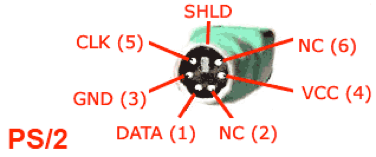
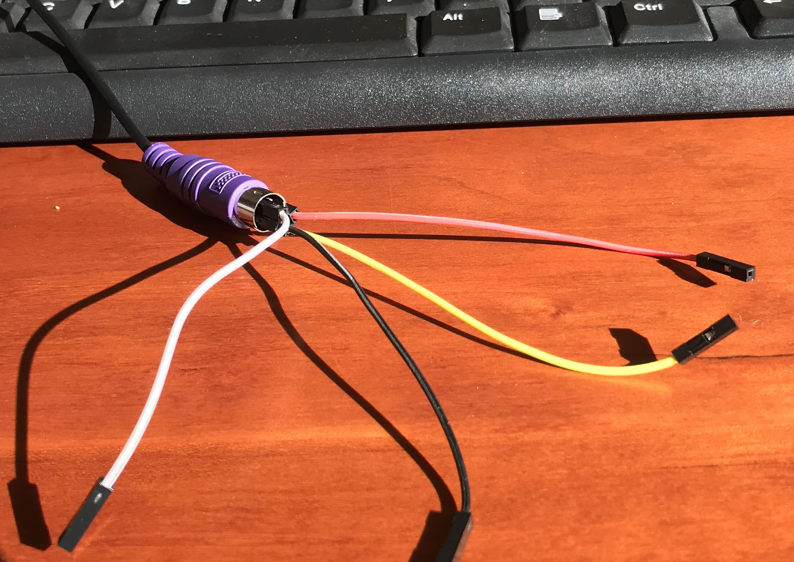
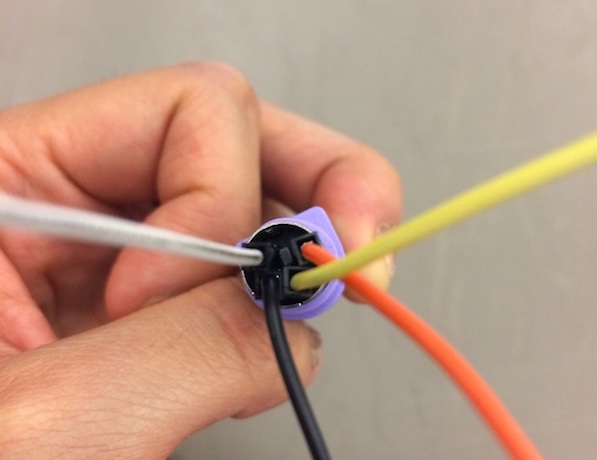
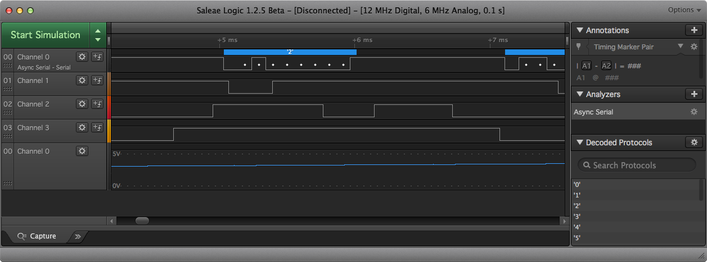
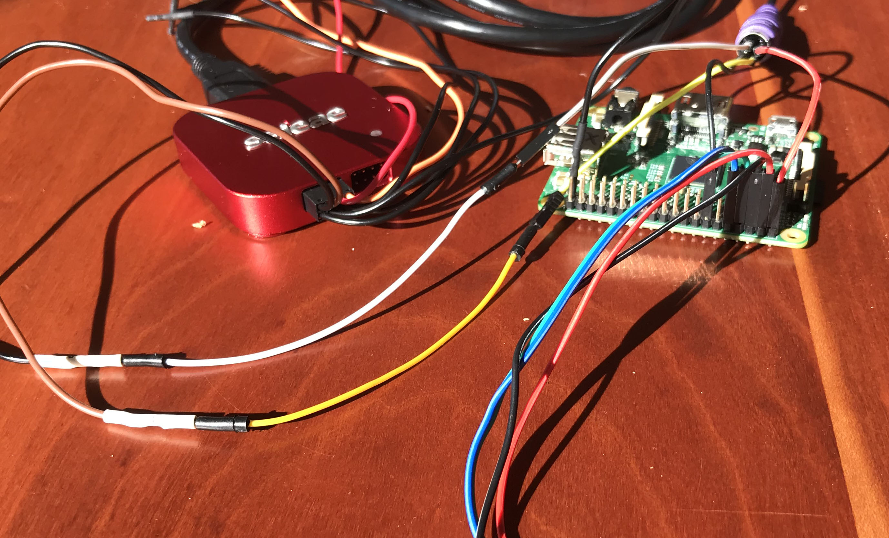
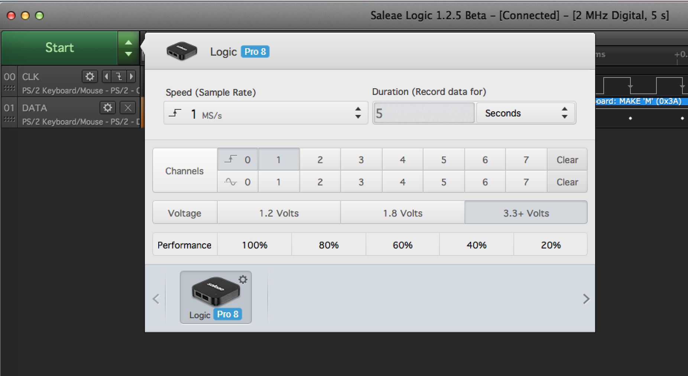
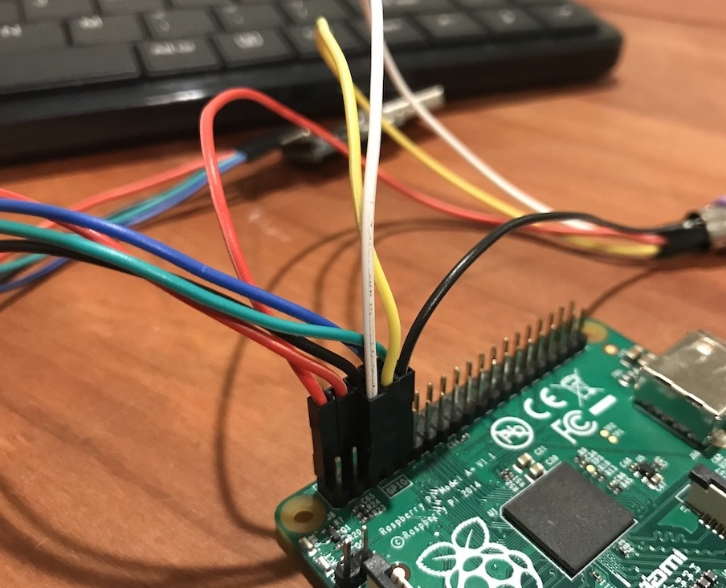


Task list to copy/paste when creating PR for this lab:

__Before releasing lab5:__
- [ ] Review writeup/code/checkin questions (instructor)
- [ ] Walk through (SL)
- [ ] Followup on issues from previous quarter postmortem (issue #)
- [ ] Update instructions/photos for non-Saleae analyzers, consider PulseView instead of Logic app?

__To prep for lab5:__
- [ ] Confirm there are sufficient number of working PS/2 keyboards to check out one to each student (Label each keyboard with number for tracking). Add column to lab attendance to record keyboard number checked out to student.
- [ ] Confirm there are 4-6 logic analyzers in lab cabinet, also 4-5 non-Inland keyboards to analyze
- [ ] Print copies of PS/2 key code chart (assignments/assign5/images/scancode.gif)



*Lab written by Philip Levis, updated by Pat Hanrahan*

## Goals

In your next assignment, you will write a PS/2 keyboard driver for your Pi. The goal of this lab is to set up the
keyboard so that you can immediately start on the assignment.

During this lab you will:

- Install jumpers into your PS/2 keyboard mini-DIN connector.
- Watch the signals from the keyboard using a logic analyzer.
- Print out the scancodes sent by the keyboard.
- Write code to decode the PS/2 protocol to produce scancodes.

## Prelab preparation
To prepare for lab, do the following: 

- Pull the latest version of the `cs107e.github.io` courseware repository.
- Clone the lab repository
   `https://github.com/cs107e/lab5`.
- [Download and install the *Logic* application from the Saleae
  web site.](https://www.saleae.com/downloads) This application visualizes the signals captured by the logic analyzer.
  You may also want to download the 
  [Logic user manual](http://downloads.saleae.com/Saleae+Users+Guide.pdf).
- Review the [lecture slides from Monday](/lectures/Keyboard/slides.pdf) and this document detailing the [PS/2 protocol](https://web.archive.org/web/20180302005138/http://computer-engineering.org/ps2protocol/).

## Lab exercises

Pull up the [check in questions](checkin) so you have it open as you go.

### 1. Install jumpers in your PS/2 keyboard connector

Most modern keyboards are USB keyboards.  Unfortunately, the USB
protocol is complicated; it's approximately 2,000 lines of code to
interface with a USB keyboard.  Instead, we will
interface with a PS/2 keyboard, which uses a simple serial protocol
that is easy to decode.  The PS/2 keyboard appeared on the original
IBM PC. Computers have long since stopped including a PS/2 port as standard equipment so we will wire a direct connection from the PS/2 connector to the GPIO pins on the Raspberry Pi.

There are two common PS/2 devices: a keyboard and a mouse.  PS/2
devices connect to a PC using a 6-pin
[mini-DIN connector](https://en.wikipedia.org/wiki/Mini-DIN_connector).
By convention, mice use a green connector and keyboards use a
purple connector.

Inspect the inside of the keyboard connector. It contains a plastic tab (that forces you to 
plug it in with the correct polarity) and 6 male pins.
Two pins are NC (not-connected), and the others carry VCC, GND, DATA and CLK.

Identify which four pins correspond to VCC, GND, DATA, and CLK. Install a female-to-female jumper onto each pin. Use the following convention: red for VCC,
black for GND, yellow for DATA, and white for CLK.

The four jumpers are a tight fit, so it may require use of pliers and a bit of force.
The good news is that once they are in, they are unlikely to fall out.

To ease the crowding, you can remove the plastic housing from one of the jumpers. Pry up the black tab on the side of the housing and the crimped pin will slide right out. (Video demonstration: <https://www.youtube.com/watch?v=-InoAbkNVdQ>)

&nbsp;

### 2. Use a logic analyzer to visualize keyboard signals

Let's use a logic analyzer to examine the signals sent by the keyboard. Do this in groups of 2 or 3
so we have enough logic analyzers to go around.


__Note:__ Choose a keyboard __without__ an "Inland" logo to use with the logic analyzer.  The Inland keyboards require pull-up resistors on the clock and data lines to handshake correctly. When using these keyboards with your Pi, you will configure the clock and data GPIOs to use the Pi's internal pull-ups. To use with the logic analyzer, we would need to bust out some hardware resistors. Instead just analyze one of the non-Inland keyboards.

Open the *Logic* application you installed on your laptop as prelab preparation. The start-up screen should be similar to this:

Familiarize yourself with the hardware of the logic analyzer. It has a bank of pins that correspond to the different signals or _channels_ to be monitored by the analyzer. Most of our analyzers support up to 8 simultaneous channels. The analyzer uses a USB connection to your laptop to receive power and send data.

The Saleae analyzers have a custom wiring harness that plugs into the channel pins for channels 0 through 7. Each channel has a pair of jumpers; a colored one for signal, and black for ground.  The ground line for each channel is directly underneath its signal line. 

The generic analyzers use an ordinary DuPont cable for jumpers. All channels share one common ground pin. Even though the label on the generic analyzer numbers the channels as 1-8, we, and the Logic application, will refer to them as channels 0-7.

On the analyzer you are using, identify the pins/jumpers for channels 0 and 1 and the corresponding ground pin(s). You are going to connect these two channels to the CLK and DATA pins of a PS/2 keyboard.

Our convention uses white for clock and yellow for data. Add a white jumper connecting channel 0 of the logic analyzer to the white CLK jumper you placed in your PS/2 keyboard connector. Add a yellow jumper connecting channel 1 to the yellow DATA jumper.

You must also ground the channels on the logic analyzer. Identify the appropriate ground pin(s) for channels 0 and 1 and use jumpers to connect them to ground pins on your Raspberry Pi. There may be a separate ground per channel or one shared ground, depending on the model of logic analyzer you are using.

You need to supply power to your keyboard.  Connect the VCC and GND jumpers from your keyboard connector to 5V and GND pins on your Raspberry Pi.

Lastly, connect the USB cable from the logic analyzer to a USB port on your laptop.

This is what it looks like wired up. 

In the Logic application, configure the logic analyzer to acquire the signal. Click the green button labeled with up/down arrows to access configuration options. Use a sampling rate of at least 1 MS
(megasample) per second and a duration of several seconds. 

If you are missing a logic analyzer or a keyboard, you can download a capture file [here](https://drive.google.com/drive/folders/1djr6z-jJJjwHe1XOf7VsKMHwFdqt30pw?usp=sharing). Download the file and load it from the drop-down menu labeled "options" in the top right corer of the Logic window.

You can set a "trigger" in the Logic application to make it start recording whenever a certain channel does a specific thing (like when it "falls" from high to low). To access the trigger settings for a specific channel, click the small square button labeled "+ wave" next to that channel.  Set the trigger to start recording when the CLK signal (channel 0) is falling. 

Click "Start" and
begin typing on the keyboard. The logic analyzer should pop up a dialog
saying that it is capturing data.  After a few seconds, it will stop recording and display the data it collected.  You can zoom in and out and
pan left and right to see the details of the captured signal.
You should see the characteristic pattern of the PS/2 protocol.

The Logic application provides protocol analyzers that can be applied to
the captured data. Click the "+" button in the *Analyzers* pane and find the PS/2 protocol. Choose it and configure for CLK on channel 0 and DATA on channel 1. The captured data is now decoded according to the PS/2
protocol and displays the hex values sent by the keyboard.

Hover over the visualization of the PS/2 clock channel to see the signal timing data. How far apart is each falling clock edge? At what frequency is the PS/2 clock running?  Is the keyboard operating with the range dictated by the [spec](https://web.archive.org/web/20180302005138/http://computer-engineering.org/ps2protocol/)? 

You're ready to answer question 1 on the [check in list](checkin).

### 3. Run keyboard test

We're now ready to try reading the keyboard signals on the Pi. Disconnect the logic analyzer from the keyboard and your laptop.   Connect the white jumper (CLK) from your PS/2 connector to GPIO 3 on your Raspberry Pi
and the yellow jumper (DATA) to GPIO 4.

Here is what it should look like if everything is connected
up properly.

The `keyboard_test` application uses the reference implementation of the keyboard driver. Let's try it now:

    % cd code/keyboard_test
    % make install

Type keys on the PS/2 keyboard and the program should print the scancodes received. If you aren't getting events, check your wiring.

Note that scancodes are not ASCII characters. Instead, these values relate to the physical
placement of the key on the keyboard.  Inside the keyboard, there's a 2D matrix
of wires that generates the scancode bits. It is the keyboard driver that will implement the logic to lookup that code and generate the appropriate ASCII character. 

Each key press and key release is reported as a distinct action. Press a key; the keyboard sends a scancode. Release the key; the keyboard sends another scancode; this code is same as the first one, except
it is one byte longer: it has a leading `0xF0`. Tap the `z` key now. The keyboard sends `0x1A` on key press, followed by `0xF0` `0x1A` on key release.

If you press `z` and hold it down, the keyboard enters auto-repeat or _typematic_ mode where it repeatedly generates key press actions until you release the key.  Press and hold `z`and watch for the repeat events to start firing. About how long does it seem to take for auto-repeat to kick in? At about what rate does it seem to generate auto-repeat events?  

Type some single letters to observe the codes for press,
release, and auto-repeat.  Then try typing modifier keys like Shift and Alt. Try pressing more than one key at a time. 

* What sequence of codes do you see when typing (capital) `A`? 

* What does this tell you about what will be required for your keyboard driver to handle the Shift or Control keys?

A note on __N-key rollover__: The PS/2 protocol reports a key action with an individual scancode. If the user simultaneously presses N keys on a PS/2 keyboard, the keyboard should report this state by sending N scancodes, i.e., there is no limit on the number of key actions that can be detected and reported.  In contrast, the USB protocol asks the keyboard for the current state and the keyboard's answer is limited to reporting at most 6 pressed keys, i.e., USB is constrained to 6-key rollover. Ty observing this on your laptop keyboard (which is likely USB). Open your editor or use the Mac "Keyboard Viewer" to visualize (In Preferences->Keyboard, enable "Show keyboard and emoji view in menu bar", then choose "Open Keyboard Viewer" from input menu). Hold down one letter, then two, and so on, and you'll reach a point at which no further key presses are detected. 

While the PS/2 protocol has no limitation and in theory allows full N-key rollover, in practice, the internal wiring of many PS/2 keyboards shares circuity among keys rather than wire each key independently. As a result, as you hold down more and more keys on your PS/2 keyboard, you'll likely reach a point where additional keys are mis-detected. Try it now on your PS/2 keyboard. How many simultaneous keys can your keyboard reliably detect?

Here is a good explanation from Microsoft Research on [N-key rollover and keyboard circuitry](http://web.archive.org/web/20180112133411/https://www.microsoft.com/appliedsciences/content/projects/AntiGhostingExplained.aspx) if you want to learn more.

### 4. Implement read scancode

Your final achievement tonight will be to get a start on writing your own keyboard driver. We want you to do this in lab because it touches on both
hardware and software, so it can be tricky to debug; it helps to
have staff around!

Change to the directory `code/my_keyboard`. This is the
same application as `code/keyboard_test`, except that rather than
using the reference implementation of the keyboard driver, it uses your driver in `keyboard.c`.

Review [keyboard.h](https://github.com/cs107e/cs107e.github.io/blob/master/cs107e/include/keyboard.h) which documents the interface to the keyboard module. During lab, you will implement initial versions of the functions `keyboard_read_scancode` and `keyboard_read_sequence`.

Open `keyboard.c` in your text editor. The function `keyboard_init` has already been written for you. It
configures the clock and data GPIOs as inputs and enables the internal pull-up resistor so these pins default to high, as expected in the PS/2 protocol.

The function `keyboard_read_scancode` reads the individual bits that make up a scancode. 

Before reading each bit, it must first wait for the falling edge on the clock line. You will need to repeatedly do these tasks and rather than replicate code, we suggest you define a private helper function `read_bit`. The helper waits until observes the transition from high to low on the clock line and then reads a bit from the data line. Unifying repeated code into a shared helper aids readability and maintainability; this is a good habit to adopt.

A scancode transmission consists of 11 bits: a start bit (must be
low), 8 data bits, a parity bit, and a stop bit.  To synchronize with the keyboard, your driver should verify that first bit read is a valid start bit, e.g. is 0. If not, discard it and read again until a valid start bit is received.  Next, read the 8 data bits. 

* In which order do the 8 data bits arrive? *Hint: if you're not sure, take a look at the signal you captured for the keyboard's data line with the logic analyzer, or look back at the PS/2 protocol documentation linked in the prelab.*

Lastly, read the parity and stop bits. For the assignment, your driver will validate these bits have the correct values, but for lab, just read the bits and assume they are correct. 

If your `keyboard_read_scancode` is working correctly, then you should
be able to build and run the application and see that it receives each scancode sent by the keyboard.

The next layer in the keyboard driver is `keyboard_read_sequence`. This function recognizes when a scancode is not a standalone action, but part of a larger sequence, such as the two scancodes sent together for a key up action. Review the PS/2 protocol to see the format of those two and three-byte sequences and then edit the body of `keyboard_read_sequence` to read a sequence of 1, 2, or 3 scancodes as appropriate and return the key action corresponding to the entire sequence.

If your driver's implementation of `keyboard_read_scancode` and  `keyboard_read_sequence` are working correctly, you should be able to compile your application and have it act identically to
the `keyboard_test` version you tested in Step 3.

## Check in with TA

At the end of the lab period, call over a TA to [check in](checkin)
with your progress on the lab.

Before leaving lab, make sure your `keyboard_read_scancode` is working correctly. If you haven't made it through the whole
lab, we still highly encourage you to go through the parts you skipped
over, so you are well prepared to tackle the assignment.
