
Task list to copy/paste when creating PR for this lab:

__Before releasing lab5:__
- [ ] Review writeup/code/checkin questions (instructor)
- [ ] Walk through (SL)
- [ ] Followup on issues from previous quarter postmortem (issue #396)
- [ ] Update instructions/photos for non-Saleae analyzers, consider PulseView instead of Logic app?

__To prep for lab5:__
- [ ] Confirm sufficient count of PS/2 keyboards+plug board+logic analyzers for all students (Label keyboard with id number for tracking and add column to lab attendance to record number checked out to student?)
- [ ] Print copies of PS/2 key code chart (assignments/assign5/images/scancode.gif)




## Goals

In your next assignment, you will write a PS/2 keyboard driver for your Pi. The
primary goal of this lab is to set up the keyboard so that you can start on
the assignment.

During this lab you will:

- Connect a keyboard to the GPIO pins on your Pi.
- Watch the signals from the keyboard using a logic analyzer.
- Print out the scancodes sent by the keyboard.
- Write code to decode the PS/2 protocol to produce scancodes.

## Prelab preparation
To prepare for lab, do the following: 

- Bring sure to bring your full parts kit, including your breadbaord.
- We will be using the Saleae `Logic 2` application to visualize the signals
  captured by the logic analyzer. Saleae <http://saleae.com> is a company known
  for its high-quality logic analyzers and software.  Here is the page with
  [download links for Logic 2](https://ideas.saleae.com/f/changelog/). Download
  and install the version for your platform. If using WSL, download the Windows
  version.
- Review this document detailing the [PS/2
  protocol](https://web.archive.org/web/20180302005138/http://computer-engineering.org/ps2protocol/).
  Print a copy of this [PS/2 key code chart](images/scancode.gif) and have it on
  hand.
- Bring in interesting code for [show-and-tell](#code-reading)!

## Lab exercises

### 0. Pull lab starter code

Change to your local `mycode` repo and pull in the lab starter code:

```console
$ cd ~/cs107e_home/mycode
$ git checkout dev
$ git pull code-mirror lab5-starter
```

### 1. Install PS/2 plug

In lab, we will distribute a PS/2 keyboard and plug board to each of you.
(Click photos to enlarge).
- __PS/2 keyboard__ (including __USB-to-PS/2 adapter__ perma-attached with hot glue)
    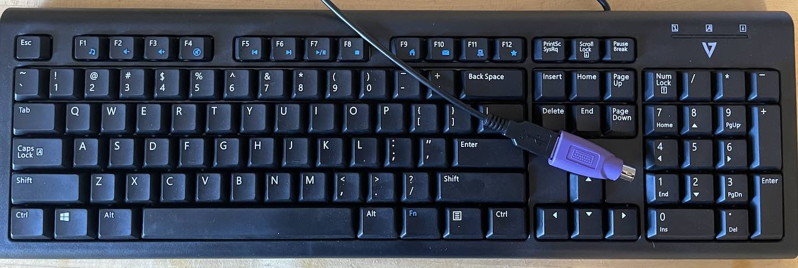{: .zoom .w-50}
- __PS/2 plug board__
    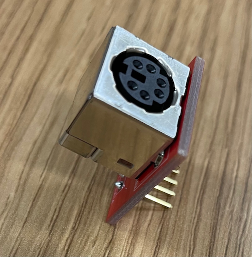{: .zoom .w-25}

The keyboard and plugboard are lent to you, you are to return them at the end of the quarter. Please take care of them!

Most modern keyboards use the Universal Serial Bus (USB). The USB protocol is quite complicated: a typical USB keyboard driver is 2,000 lines of code -- ouch!
In this course, we instead use a PS/2
keyboard because PS/2 is a simple serial protocol that is easy to decode.  The PS/2
keyboard appeared on the original IBM PC.  Computers have long since stopped
including a PS/2 port as standard equipment so we will wire a direct connection
from a PS/2 plug board to the GPIO pins on the Pi.

Sourcing genuine PS/2 keyboards has been an archaeological expedition for us. We found a USB keyboard that is dually capable of operating in PS/2 mode.  The keyboard has
a wired USB connector and a USB-to-PS/2 adapter. We used hot glue to permanently attach that adapter, so the keyboard acts as a wired PS/2 keyboard.

There are two common PS/2 devices: a keyboard and a mouse.  A PS/2
plug is a 6-pin
[mini-DIN connector](https://en.wikipedia.org/wiki/Mini-DIN_connector).
By convention, a mouse connector is green and a keyboard connector is purple, but the connectors
are otherwise identical.  Inspect the inside of the mini-din PS/2 connector on the keyboard. It
contains a plastic tab (this is there to require that you insert into the plug with the correct
polarity) and 6 male pins. Two pins are NC (not-connected), and the others
carry VCC, GND, DATA and CLK.

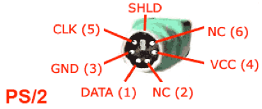

Grab the PS/2 plug board and fip it over to see the four-pin header that
on the underside of the circuit board. These header pins connect
to the male pins in the PS/2 plug through small traces. Find those traces on the circuit board. The CLK, DATA, and GND traces are on the top side of the board
and the 5V trace on the underside.

Place the plug board into your breadboard so that each of the four pins
is on a different row. Be careful not to mis-orient the board; if the four pins are all in the same row, they are all connected together, which is not what you want!

From your kit, pick out seven female-to-male jumpers: one red, two black, two white, and two yellow. You'll be following these color conventions: red for
5V, black for GND, white for CLK, and yellow for DATA.

Use one red and one black jumper to supply power to your keyboard.
Connect the female end of the red jumper to a 5V pin on your Pi and the male end to the 5V row in your breadboard.
Similarly, use a black jumper to connect a GND pin on your Pi to the GND row.

### 2. Use a logic analyzer to visualize keyboard signals

We have a bin of logic analyzers available in lab. Grab an analyzer and USB cable to do these exercises in lab, please return them to us when leaving lab.

You can use a logic analyzer to examine the signals sent by the keyboard. Here is an inexpensive 8-channel logic analyzer made by Hiletgo (click photo to enlarge):

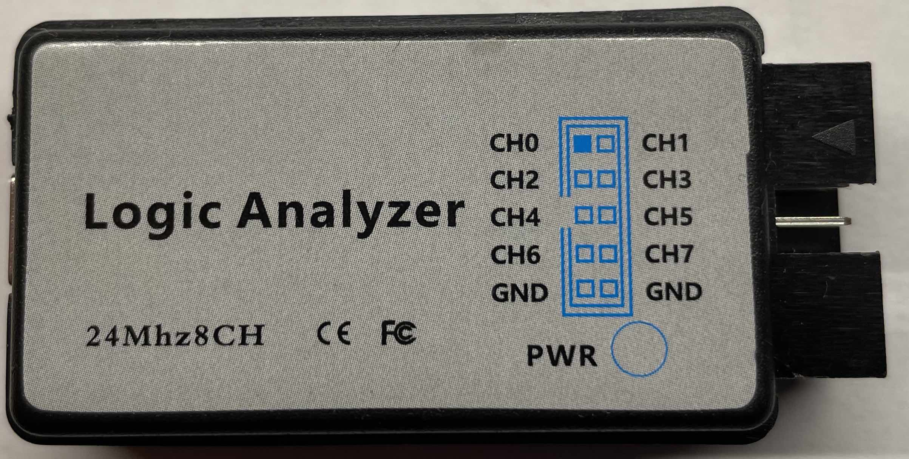{: .zoom .w-25}

One end of the logic analyzer has a 10-pin header. The pins correspond to the different signals or _channels_ to be monitored by
the analyzer. The analyzer supports reading up to 8 simultaneous channels. The
other end of the logic analyzer has a mini-USB port. You will connect the USB
of the logic analyzer to your laptop to supply power and read data.

Use one white and one yellow jumper to connect the keyboard clock and data to the logic analyzer.
Use
the label on the analyzer to learn the pin layout and identify which pins correspond to channels 0 and 1.
Connect the female end of the white jumper to channel 0
on your analyzer and the male end to the CLK row on your breadboard.
Similarly, use the yellow jumper to connect channel 1 to the DATA row.

In the photo below, the four jumpers from left to right are power (red), ground (black), CLK (white), and DATA (yellow).
The power and ground connect to your Pi. The CLK and DATA are connected to channels 0 and 1 of the logic analyzer.

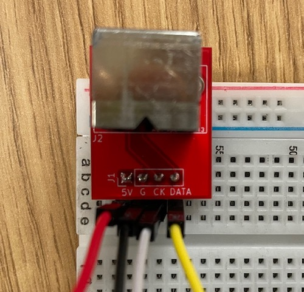{: .zoom .w-25}

You must also ground the logic analyzer. Voltage is relative: when looking at a signal, all you can tell is its difference from a
reference voltage, which in this case should be the ground provided by the Pi. If you don't
connect the logic analyzer to the Pi's ground, then it will be measuring voltage against whatever happens to be
on the pins, which can act as tiny antennae. Identify
the ground pin on the analyzer and use a black jumper to connect it to the keyboard
ground. Depending on the particular model of logic analyzer you are using, there may be one shared ground for all channels or a separate ground per channel.

The last two jumpers (one white and one yellow) will be be used to connect the keyboard clock and data to the gpio pins on the Pi. Connect the male end of the second white jumper to the CLK row and the second yellow jumper to the DATA row. Leave the female jumper ends unconnected.
We will connect these later, but it's easier to get them into the breadboard now.

This is what it looks like when the plug board is wired up to the logic analyzer. (Click photos to enlarge)

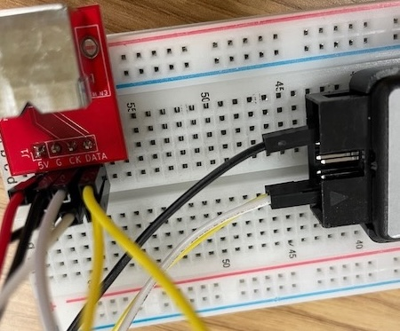{: .zoom .w-50}
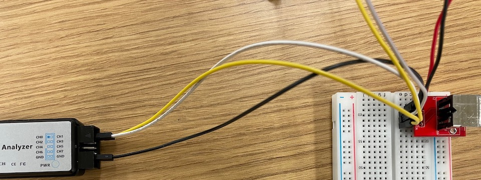{: .zoom .w-50}

Plug your keyboard into the PS/2 port on the plug board.

Open the *Logic 2* application you installed on your laptop for prelab
preparation. When the logic analyzer is unconnected, the start-up screen is similar to this:

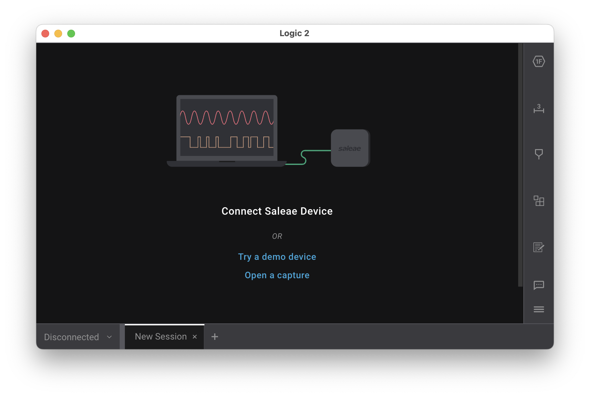{: .w-75}

Connect the USB cable from the mini-USB port on the logic analyzer to an open port on your laptop or USB hub. When the logic analyzer is connected, the Logic 2 screen will change to this:

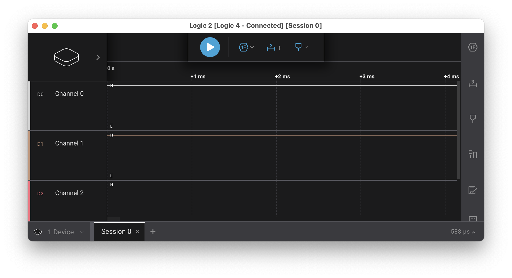{: .w-75}

Click the flat cube icon in the upper left to access the device settings. Find the sample rate control in the settings pane; it is labeled something like `24 M/s`. Adjust the sample rate down to `1 M/s` (1 million samples per second is plenty, attempting to sample at a higher rates can sometimes produce errors). Close the settings pane.

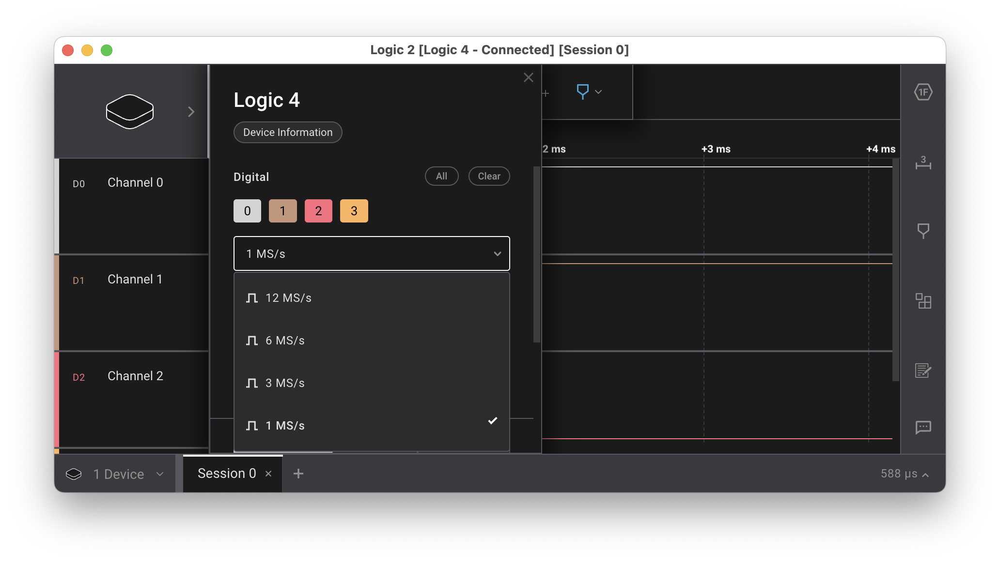

The blue circle with a white "Play" triangle is the play/stop button. Click play
to start reading the signal. Type a few keys on the PS/2 keyboard, then click stop to end the recording.
The Logic2 window will show the signals recorded on channels 0 and 1.
You can zoom in and out and pan left and right to see the details
of the captured signal. You should see the characteristic pattern of the PS/2
protocol. 

The Logic 2 application provides protocol analyzers that can be applied to
the captured data. Along the right side, find the hexagon labeled `1F` . Click this button to
display the *Analyzers* pane. Click the `+` in upper right to access the list
of analyzers and choose the PS/2 protocol analyzer. Configure CLK on
channel 0 and DATA on channel 1. The captured data is now decoded according to
the PS/2 protocol and interprets the sampled signal as scancodes.

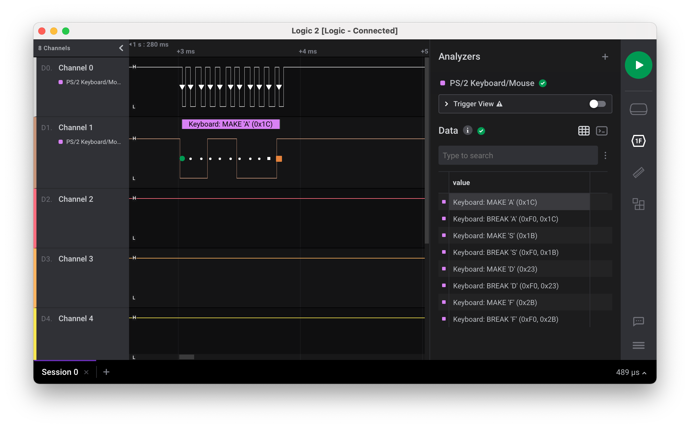

Hover over the visualization of the PS/2 clock channel to see the signal timing
data. How far apart is each falling clock edge? At what frequency is the PS/2
clock running?  Is the keyboard operating with the range dictated by the
[spec](https://web.archive.org/web/20180302005138/http://computer-engineering.org/ps2protocol/)? 

You're ready to answer the first check-in question[^1].

### 3. Run keyboard test

You're now ready to try reading the keyboard signals on the Pi.
Earlier you added additional white and yellow jumpers to your breadboard rows, connect the female ends to your Pi now.
The white jumper (CLK) connects to PG12 and the yellow jumper (DATA) to PB7. Find the corresponding header pins on the Mango Pi [pinout](/guides/refcard).

Fanning out two connections from keyboard CLK and DATA (one to the logic analyzer, the other to your Pi)
allows your Pi to receive the data while simultaneously capturing the same signal
on the logic analyzer. This is useful during debugging as you can compare what your Pi thinks
it's receiving with the ground truth of what the logic analyzer sees.

Here are the connections to the Pi:

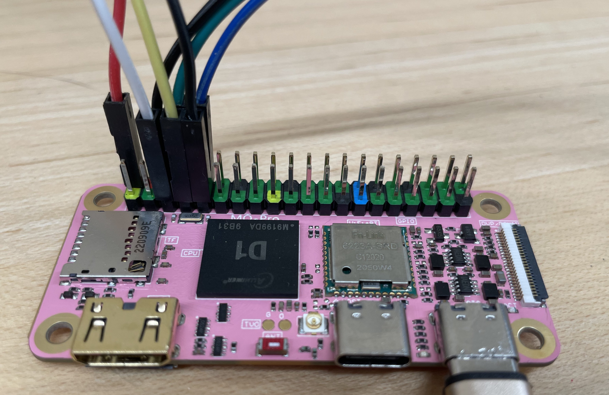{: .zoom .w-75}

The `keyboard_test` application uses the reference implementation of the
keyboard driver. Let's try it now:

```console
% cd lab5/keyboard_test
% make run
```
Type keys on the PS/2 keyboard and the program should print the scancodes
received. You should also be able to see the signals in the Logic 2 application. If you aren't getting events, check your wiring.

Note that scancodes are not ASCII characters. Instead, these values relate to
the physical placement of the key on the keyboard.  Inside the keyboard,
there's a 2D matrix of wires that generates the scancode for a given key. In the
keyboard driver, you will implement the logic to lookup that scancode and generate
the appropriate ASCII character. 

Each key press and key release is reported as a distinct action. Press a key;
the keyboard sends a scancode. Release the key; the keyboard sends another
scancode; this code is same as the first one, except it is one byte longer: it
has a leading `0xF0`. Tap the `z` key now. The keyboard sends `0x1A` on key
press, followed by `0xF0` `0x1A` on key release.

If you press `z` and hold it down, the keyboard enters auto-repeat or
_typematic_ mode where it repeatedly generates key press actions until you
release the key.  Press and hold `z`and watch for the repeat events to start
firing. About how long does it seem to take for auto-repeat to kick in? At
about what rate does it seem to generate auto-repeat events?  

Press and hold one key, then press and hold another without releasing the first. Which key repeats? What happens when you release that key? Try those same actions on your laptop's keyboard, does it behave the same way?

Type single keys to observe the scancodes for press, release, and
auto-repeat.  Then try typing modifier keys like Shift and Alt, singularly and in conjunction
with other keys. Does shift being pressed changed what scancode is sent by a letter key? What about
caps lock? Observe the sequence of scancodes to suss out what functionality is provided by the keyboard hardware and what features are to be implemented in the keyboard driver software.

You're ready for the second check-in question [^2]

<style>
  .sidebar { font-size: small; }
</style>

> __Side note on N-key rollover__
- The PS/2 protocol reports each key action as a separate scancode. If the user simultaneously presses N keys, a PS/2 keyboard sends N scancodes, one for each key. In contrast, the USB protocol operates by asking the keyboard for the current state and the keyboard's answer is limited to reporting at most 6 pressed keys, i.e., USB is constrained to 6-key rollover. Try observing this on your laptop keyboard (which is likely USB). Open your editor or use the Mac "Keyboard Viewer" to visualize (In Preferences->Keyboard, enable "Show keyboard and emoji view in menu bar", then choose "Open Keyboard Viewer" from input menu). Hold down one letter, then two, and so on, and you'll reach a point at which no further key presses are detected.
- While the PS/2 protocol has no limitations and in theory allows full N-key rollover, in practice, the internal wiring of many PS/2 keyboards shares circuitry among keys rather than wiring each key independently. As a result, as you hold down more and more keys on your PS/2 keyboard, you'll likely reach a point where additional keys are mis-detected. Try it now on your PS/2 keyboard. How many simultaneous keys can your PS/2 keyboard reliably detect? What happens when you go past that limit?
- Here is a good explanation from Microsoft Research on [N-key rollover and keyboard circuitry](http://web.archive.org/web/20180112133411/https://www.microsoft.com/appliedsciences/content/projects/AntiGhostingExplained.aspx) if you want to learn more.
{: .callout-info .sidebar}

### 4. Implement ps2_read

In this lab exercise, you will get a start on writing the keyboard
driver that will be a part of your next assignment. We want you to do this task in lab because working at the intersection of hardware and software requires a specialized kind of debugging (logic analyzer, etc.) which can be tricky; it helps to
have staff around!

Change to the directory `lab5/my_keyboard`. This is the
same application as `lab5/keyboard_test`, except that rather than
using the reference implementation, you will write your own code to
read a scancode.

[Browse the headers](/header) for ps2.h and keyboard.h to review the module
documentation. The `ps2` module manages the low-level communication with a PS/2
device. The `keyboard` module layers on the ps2 module to interpret scancodes
into typed keys. During lab, you will implement an initial version of the
function `ps2_read`.

Open `ps2.c` in your editor. The function `ps2_new` has already been
written for you.  This function configures a new PS/2 device for the specified
clock and data gpio. In the library modules we have seen thus far, we have used
global variables to store data that is shared across the module. A single set
of global variables for the ps2 module does not work, as each device needs its
own independent settings (i.e clock and data gpio). `ps2_new` creates a new
struct to hold the per-device settings. Because that memory needs to be
persistent after the function call exits, it allocates memory using your shiny
new `malloc` . The rest of the function is setting the clock and data GPIOs as
inputs and enabling the internal pull-up resistor so these pins default to
high, as expected in the PS/2 protocol.

Once you understand the given code in `ps2.c` you are to implement the function `ps2_read`
to read the bits that make up a scancode. The basic operation is to wait for
the falling edge on the clock line and then read a bit from the data line.
You will need to do this 11 times for a scancode, but rather than duplicate that code 11 times,
we suggest you define a private helper function `read_bit`. The helper waits until observes the transition from high to low on
the clock line and then reads a bit from the data line. Unifying repeated code
into a shared helper aids readability and maintainability; this is a good habit
to adopt. 

A scancode transmission consists of 11 bits: a start bit (always low), 8 data
bits, a parity bit, and a stop bit (always high).  To synchronize with the keyboard,
`ps2_read` should verify that first bit read is a valid start bit, e.g. is 0.
If not, discard it and read again until a valid start bit is received.  Next,
read the 8 data bits. 

- In which order do the 8 data bits arrive? [^3]
    - Hint: if you're not sure, take a look at the signal you captured for the keyboard's data line with the
  logic analyzer or look back at the PS/2 protocol documentation linked in the prelab.

The last two bis are the parity and stop bits. For the assignment, your driver will
validate these bits have the correct values, but for lab, just read the bits
and assume they are correct. 

If you're having trouble reading in the bits correctly, debug by comparing the bits
your code is seeing with the signals seen by the logic analyzer: run your program,
start the logic analyzer, and type one key. Being able to simultaneously see
exactly what signals are sent *and* how your Pi interprets them is extremely
useful: it's like gdb for the pins!

> __Disconnecting logic analyzer__
The wiring we are using in lab has four jumpers for CLK and DATA: one pair to send keyboard signals to the Pi and another to share with the logic analyzer.
The essential connection is between the keyboard and the Pi; the additional connection to the logic analyzer is just for debugging. When leaving lab, remove the extra jumpers and return the logic analyzer to us. We store the logic analyzers in the lab cabinet if you need to borrow one again in future.
{: .callout-warning}

The function `keyboard_read_scancode` in `keyboard.c` simply calls `ps2_read`
to get the next scancode.  This means that once you have a working `ps2_read`,
your `keyboard_read_scancode` should automatically spring to life. Build and
run the application and see that it receives each scancode sent by the
keyboard.

If your implementation of `ps2_read` is working
correctly, you should be able to compile your application and have it act
identically to the `keyboard_test` version you tested in Step 3. If you run
into any snags, please be sure to get help from us now so that you'll be able
to hit the ground running on the assignment. Show us your working code! [^4]

<a name="code-reading"></A>

### 5. Code reading
One great way to deepen your understanding of programming and computer systems is to read
and review code written by others.

We are going to use the last bit of lab for group code review. We will have some passages of
our own picked out but we welcome you to bring a passage of particular interest to you.
It can be code you wrote yourself (for CS107e, of in past courses or personal project) or code from a
public source (github, open source repository, blog, textbook, paper, etc.). Perhaps you've seen a clever technique that you would like to further understand ([Fast inverse square root?](https://en.wikipedia.org/wiki/Fast_inverse_square_root) ) Mabye you have a piece of code that you struggled to design and would like to brainstorm alternative approaches? Perhaps we will settle a score with code that deserves to be drawn and quartered for its crimes against [good taste](https://xkcd.com/1695/) and all that is [sacred](https://xkcd.com/1833/)? Bring it in for show-and-tell!

## Check in with TA

Please return __logic analyzer and usb cable__ to the lab cabinet (not to take home). [^5]

[^1]: The PS/2 clock frequency must be in the range 10 to 16.7 kHz. To be within spec, what should time period between falling clock edges be? When you measured using the logic analyzer, what time period did you observe? Write down this number, you will need it for a later check-in question .

[^2]: What sequence of codes is sent when typing capital `A`? If you hold down both the shift key and 'a' key, what is the sequence of repeating codes is sent?  

[^3]: In a PS/2 scancode, does the least significant or most significant data bit arrive first?

[^4]: Show off that your implementation of `keyboard_read_scancode` correctly receives scancodes from your keyboard.  
    
    Back in lab1, you estimated how many instructions the Pi was executing (~400 million/second).  Earlier in this lab, you measured the time of one cycle of the PS/2 clock.  Calculate how many instructions the Pi can execute in that time. Now consider a call to `printf`. Make a ballpark estimate of how many instructions are required to process and output each character and multiply that count by length of the format string for a rough total. If your keyboard driver makes a call to `printf` in between reading bits that overruns your budget, what will be the consequence? Keep this lesson in mind whenever working with code that has similar tight timing requirements.

[^5]: Take the PS/2 keyboard and plug board home with you. This equipment is on loan to you, please take care of them. You must return both to us at the end of quarter.
