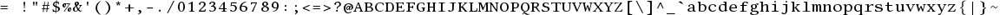

*Lab written by Philip Levis, updated by Pat Hanrahan*

### Goals

The goal of the lab is understand everything you need for 
the next assignment.
In that assignment, 
you will be adding double-buffering to the framebuffer initialization code,
building a basic graphics library,
and creating a text console.

During this lab you will:

1. Connect your Raspberry Pi to a monitor and generate video
2. Read and understand the mailbox and fb code
3. An aside on pointers to multi-dimensional arrays
3. Read and understand fonts and the representation of characters

To complete the lab, you must complete the [check list](checklist) and 
show the results to the TA.

### Lab exercises

To start this lab, pull from `cs107e.github.io` and go into
the directory `labs/lab5`. 

#### 1 Setup the Raspberry Pi to output video to a monitor

You will need a standard HDMI cable and an HDMI to DVI adapter
which we will provide.
Attach the HDMI to DVI adapter to one end of HDMI cable.
Then attach the DVI connector to the monitor.
The monitors we are using are older and do not have an HDMI connector.
Next attach the HDMI cable to the HDMI connector on the Raspberry Pi.
Power on your Raspberry Pi, you should see the following.

Now test the GPU on the Raspberry Pi.
Go into the directory `code/grid`.

     % make clean
     % make

Reset your Pi, and then type

     % make install

Once it reboots, you should see a grid on the monitor.

Modify the `grid.c` in two ways.

1. Change the video resolution to 1024 by 768, and redraw the grid.

2. Change the grid code to draw a checkerboard pattern (alternating
   black and white squares).

Note that this example uses our cs107e standard `libpi.a`. 
The library and include files are located in the directories
`cs107e.github.io/libpi/{lib,include}`.
Note how the `Makefile` has been modified to work with these directories.
We had to change the `CPPFLAGS` to search for header files
in that include file;
we also had to modify the loader to search for libraries
in that lib file.
Note also that we have included `libgcc.a` in the lib directory.
`libgcc.a` contains functions like divide and the like that
are used by the gcc compiler.
If you link to that file, you can now use divide in your programs!

`libpi.a` contains implementations of all the functions
we showed in class, as well as working versions of the functions
we asked you to write as part of your assignments.
Here, we are using functions `gpio_set_function` and `printf`.
We provide these functions in case you had problems with one
of the assignments.
Normally, however, we want you to use your implementations
of these functions.
That is, you should be sort of 'building your own version of
`libpi.a`' by reusing your code from past projects.

#### 2 Read and understand the fb and mailbox code

Recall from
[lecture](/lectures/framebuffer/framebuffer.pdf)
that the CPU communicates with the GPU by sending it mail using a *mailbox*.
The mailbox can only contain a single message.
If it has a message, it is full;
if there is no pending message, it is empty.
The CPU typically initiates a send by creating a message,
and then giving the mailbox the address of the message.
When the mailbox contains a message,
the GPU is alerted, and will read the message.
The GPU then sends a reply to the CPU.
The CPU waits until the mailbox is full,
and then reads the message.

In order to configure the framebuffer,
we need to send a _framebuffer configuration message_ to the GPU.
This message should contain the physical and virtual sizes
of the framebuffer, as well as the depth of the pixels.
The GPU returns a pointer to the start of the framebuffer,
the total size in bytes allocated to the framebuffer,
and the length of each scanline or row of the framebuffer
(this is called the pitch).
You should check that the framebuffer was configured properly
by checking that the physical and virtual sizes that you
sent the GPU are returned as is.

If the framebuffer is configured properly,
the GPU will return a pointer to the pixels in the framebuffer.
You can use that framebuffer pointer to read and write pixels.
The GPU will continually refresh the display 
based on the contents of the framebuffer.
So, if you change the framebuffer, 
the display will be updated automatically.

Now change into the directory `code/fb`.
That directory contains the files:

    % ls 
    Makefile    fb.c        memmap
    cstart.c    mailbox.c   start.s

The `fb.c` contains the function `fb_init()` that was shown in class.
This function configures the `fb_t` structure,
and sends it to the GPU using `mailbox_write` and `mailbox_read`.
These mailbox functions are defined in `mailbox.c`.

Read and discuss the code in `fb.c` and `mailbox.h/c` with your lab mates. 
Discuss as a group each of these questions,
and have one person in your group 
record your answers to each question on your checklist,
and then turn in the checklist to the CA at the end of the lab.

   1. Why do we need to check whether the mailbox is EMPTY or FULL?

   2. Why is the declaration for `fb_t fb` tagged as `volatile`?

   3. Why is the declaration of `mailbox_t mailbox` also tagged as volatile?

   4. Why can we add the `addr` and `channel` in `mailbox_write`?
      Could we also `|` them together?
      What bit positions are used for the `addr` and what for the `channel`?

   5. What is the purpose of GPU_NOCACHE?

#### 3 Multidimensional pointers

Pointers are one of the hardest concepts in C.
The goal of this part of the lab is to review basic
pointer declarations, in particular,
pointers to multidimensional arrays.
Multidimensional arrays are used to represent images.
In the assignment,
the framebuffer memory region
can be interpreted as a multidimensional array.

To start, here is a quick quiz.
What is the difference between the following two lines of code?

   char *a = "Hello, world\n";

   char a[]= "Hello, world\n":

Read the following code in `code/md/md.c`.

    int main(void)
    {
        int a[2][2] = { {0, 1}, {2, 3}};;
        int  *b = &a[0][0];
        int (*c)[2] = a;
        int (*d)[2][2] = &a;

         printf("a = %08x\n", (unsigned)a );
    	 printf("&a[0][0] = %08x\n", (unsigned)(&a[0][0]) );
         printf("&a[0][1] = %08x\n", (unsigned)(&a[0][1]) );
    	 printf("b = %08x\n", (unsigned)b );
    	 printf("b+1 = %08x\n", (unsigned)(b+1) );
    	 printf("b+2 = %08x\n", (unsigned)(b+2) );
         printf("&a[0] = %08x\n", (unsigned)(&a[0]) );
    	 printf("&a[1] = %08x\n", (unsigned)(&a[1]) );
    	 printf("c = %08x\n", (unsigned)c );
    	 printf("c+1 = %08x\n", (unsigned)(c+1) );
    	 printf("d = %08x\n", (unsigned)d );
    	 printf("d+1 = %08x\n", (unsigned)(d+1) );

        int a1[] = { 0, 1 };
        int a2[] = { 2, 3, 4 };
        int *p[2] = { a1, a2 };
        int *q = p[0];

        printf("a1 = %08x\n", (unsigned)a1 );
        printf("a2 = %08x\n", (unsigned)a2 );
        printf("p = %08x\n", (unsigned)p );
        printf("q = %08x\n", (unsigned)q );
        printf("p[0] = %08x\n", (unsigned)p[0] );
        printf("p[1] = %08x\n", (unsigned)p[1] );
    }

Compile this code using `make`.
This will generate an executable that runs on your laptop.
Run the code and interpret the results.

What is the difference between the following two declarations?

        int *p[2];

        int (*c)[2];

#### 4 Fonts

A major part of your assignment will be to draw text on the screen.
In order to do this, you need *font*.

All the characters are stored in a single image.
The first character stored on the left is '&nbsp;' (space),
whose ASCII value is 32 (0x20).
The last character is '~' (tilde),
whose ASCII value is 127 (0x7e). 
There are 128 characters in total. 
The characters are all the same size.
In this case, each character is 12 pixels wide and 18 pixels tall.
This is termed a *fixed-width* font. 

Read the files `font.h` and `font.c` in `code/font`.

The file `font.c` contains the above image as a C struct.

    /* GIMP RGBA C-Source image dump */

    static const struct {
        unsigned int     width;
        unsigned int     height;
        unsigned int     bytes_per_pixel; 
        char             pixel_data[1152 * 18 * 4 + 1];
    } gimp_image = {
      1152, 18, 4,
      "\377\377\377\377\377\377\377\377\377\377\377\377\377\377\377\377\377\377"
      "\377\377\377\377\377\377\377\377\377\377\377\377\377\377\377\377\377\377"
      ...
      "\377\377\377",
    };

The RGB channels are inverted (black on white).
That is, `'\377'` should be interpreted as black.

The key function is `font_get_char()` which copies
a single character from the font image into a buffer.
Read this function carefully,
since you will need to use it in the next assignment.

## Check off with TA

At the end of the lab period, submit the checkoff form to a TA 
so you are properly credited for your work.
