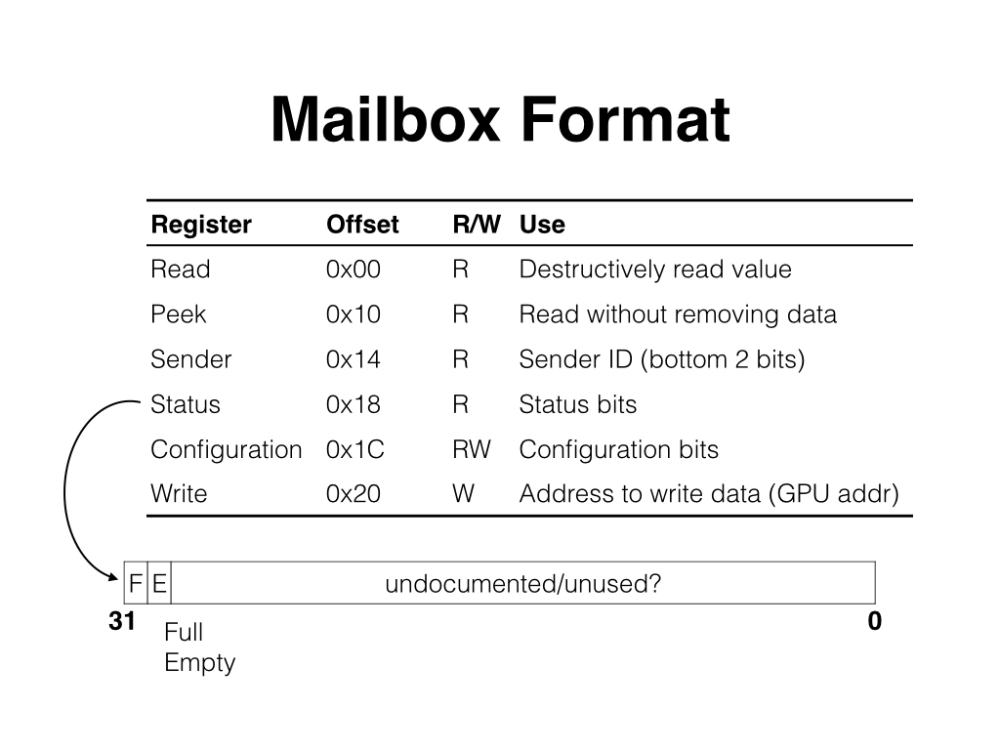
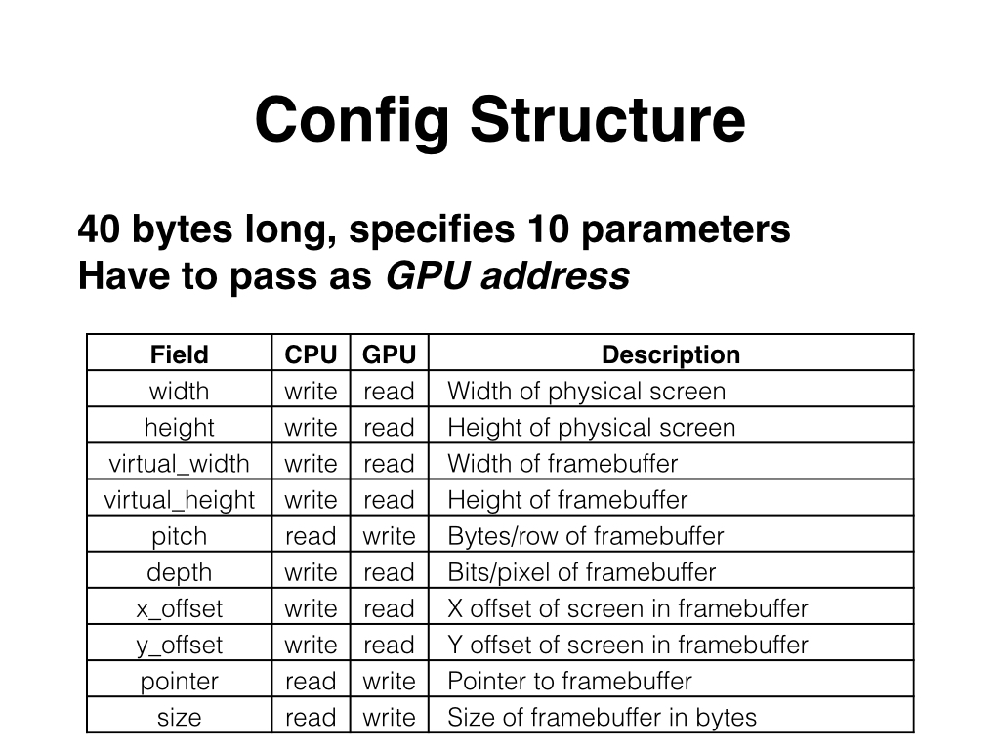

## Lab 5: Framebuffer
# Lab written by Philip Levis

### Learning goals
During this lab you will:

1. get the frame buffer working
1. learn how pixels are represented

The goal of the lab is for you to get the tricky parts of configuring
the framebuffer working so you can start on assignment 5.
To complete the lab, you must complete the [check list](checklist.md) and 
show the results for question 3 to the TA.

If you'd like some background on color and frame buffers, 
[Baking Pi](http://www.cl.cam.ac.uk/projects/raspberrypi/tutorials/os/screen01.html)
has a good tutorial. We will be using RGBA32, so that each pixel is 32
bits (an unsigned integer).

### Lab exercises

1. __Pull the lab 5 project.__

    To start this lab, find the `courseware/lab/lab5/code` directory.
    You may need to pull from the `cs107e/courseware` repository
    to get the latest code.

    Inside the code directory is a binary named `reference.img`.
    This is a binary of the NSTC test pattern you saw in class.
    You can use this binary to test that everything is working
    correctly.

1. __Plug in a monitor.__ Using an HDMI to DVI adapter, plug a monitor
    into your Raspberry Pi. If everything is working correctly, when you boot
    your Pi you should see a color spectrum in the center of your screen.

1. __Configure the frame buffer.__ Recall from lecture that the processor
    communicates with the GPU through Mailboxes, regions of shared memory that
    expect structures with a particular format. To tell the GPU to set up
    the frame buffer, you need to send and receive messages via a Mailbox.
    You first send a message telling it the desired configuration, then
    (assuming your configuration is accepted), receive a message that gives
    you the pointer to the frame buffer.

    Fill in the file `fb.c` to provide the functions in `fb.h`.
    Referring to the Framebuffer lecture slides will be useful
    here. The base address of the Mailbox is 0x2000B880. I suggest
    using a C structure to lay out the format of the Mailbox. Be
    sure to pay attention to the offsets of the fields and add padding
    bytes in the structure when needed:

    

    The first step is to wait until the most significant bit of the
    status field is 0 (the mailbox is not full).  Now that the mailbox
    is empty, we can send a message. This involves writing a pointer
    to the message to the `write` field of the Mailbox. There are a
    few details on how this works, so read the next two steps
    carefully.

    The second step is to create the message to send, which is a set
    of configuration parameters.  Use a struct for the whole
    configuration structure:

        

    Note that this configuration structure
    must be 16-byte aligned (its low 4 bits must be 0x0). So the
    address of the first field of the configuration must end in 0x0.
    You can force gcc to do this with `__attribute__
    ((aligned(16)))`. The width field should be 1280, the height
    should be 960, the virtual width should be 1280, the virtual
    height should be 960, the depth should be 32 (RGB and alpha) and
    both offsets should be 0. This sets up a single 32-bit buffer.

    The third step is to put the address of your configuration
    structure in the write field of the mailbox. The low 4 bits of the
    address should be set to 0x1: this tells the hardware that the
    message is to Mailbox channel 1, the GPU. Remember that this needs
    to be a a GPU, not CPU address! If you pass a CPU address then it
    will tell the GPU to use a region of memory that is not cache
    coherent with the CPU, such that the GPU can write values which
    the CPU then doesn't see. You need to translate the CPU address to
    a GPU one for a region of memory that will be immediately visible
    to the CPU. Refer to the peripheral memory map on page 5 of the
    [BCM2835 manual](http://www.raspberrypi.org/wp-content/uploads/2012/02/BCM2835-ARM-Peripherals.pdf) 
    to find the offset for the L2 Cache Coherent memory
    region and add this to the address you pass (hint: it's a constant
    in `fb.c`). So set the write field to address of configuration
    struct + GPU offset + 1. 

    The fourth step is to wait until there is a response. When the GPU
    sends a response, it will clear the second most significant bit
    (0x40000000) of the status field of the Mailbox (the empty bit). 
    Then, check that
    this is a message from the GPU: check that the low 4 bits of the read
    field are 1. If they aren't 1, ignore the message and wait for the
    next one. Once you've received a message from the GPU, the configuration
    structure you passed in step 3 will now be filled in.

    The fifth step is to retrieve the frame buffer pointer. It is
    stored in the pointer field of your now filled-in configuration
    structure.

    Below is some pseudocode pulled from the lecture slides to help you with 
    the above steps. Check that your code has this general form.

    ```
	//WRITING:
	//Wait while mailbox is full
	while(status & full){}

	//Write the address of config structure
	//Address must be 16-byte aligned & a GPU address
	//Bottom 4 bits indicate channel, channel 1 if FB
	write = address + 1;

	//READING:
	//Wait until expected message
	while true {
	      //Wait until mailbox not empty
	      while(status & empty){}
	      val = read;

	      //Expected channel, break out of while(1)
	      if((val & 0xF) == 1) break;
	}
	return val;
    ```

    Write a program that calls `fb_init`. If your steps are
    successful, you should see the screen go black when a program
    calls it. It might also be that doing this unsuccessfully makes the
    screen go black.  There's one easy way to tell if your code is
    working, though: try to draw on the screen!

1. __Test drawing some pixels in the frame buffer.__ Recall that X,Y
    pixels on a screen count from the top-left corner. So X=0, Y=240 is a
    pixel on the left edge of the screen, one quarter of the way down from
    the top. In this first step, open `lines-1d.c` and write an
    application that accesses the frame buffer as a 1D array and computes
    offsets explicitly. Draw a white line that goes from x=20,y=20 to
    x=420,y=420, a green line from x=20,y=40 to x=420,y=440, and a line of
    any color you like from x=20,y=60 to x=420,y=460. Make absolutely sure
    the alpha value of your pixels is 0xFF. Because the slope of all
    three of these lines is 1, (-1 as you see it, because 0,0 is the top
    left corner) you can draw them by incrementing x and y.

1. __Draw some more lines.__ Open `lines-2d.c` and write an
    application that casts the address provided by the GPU into a 2D array
    with width 1280.  Draw the same lines as with your 1D program.

1. __Experiment with other array sizes.__ Modify `lines-2d.c` to use
    different row lengths than 1280, but keep your framebuffer configuration
    to have a width of 1280. For example, try a row length of 1279
    and 640. What happens?

1. __Compare the assembly that accesses the framebuffer in your 1D and 2D
   implementations both with no optimizations and with -O3.__
   How do they differ? 

## Check off with TA

At the end of the lab period, submit the checkoff form and ask your lab
TA to approve your submission so you are properly credited for your work.
It's okay if you don't completely finish all of the exercises during lab;
the main purpose of these exercises was to get people up to speed on the
basic hardware configuration that can be very difficult to debug if you're
unfamiliar with it. If you don't complete the lab in the standard time,
we encourage you to do so as soon as possible, to get this part out
of the way so you can start with assignment 5.
