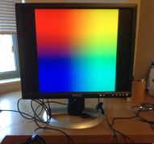
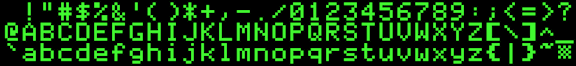


Task list to copy/paste when creating PR for this lab:

__Before releasing lab6:__
- [ ] Review writeup/code/checkin questions (instructor)
- [ ] Walk through (SL)
- [ ] Followup on issues from previous quarter postmortem (issue #)

__To prep for lab6:__
- [ ] Confirm there are sufficient number of working monitors, HDMI cables, and HDMI-DVI adapters (aim for 1 setup for every 2-3 students)



*Lab written by Philip Levis and Pat Hanrahan*

## Goals

For your next assignment, you will implement library of simple graphics routines and use them to implement a text console for your shell. The goal of this lab is to review concepts and code in preparation.

During this lab you will:

- Connect your Raspberry Pi to a monitor and generate video
- Read and understand the mailbox and framebuffer code
- Review C syntax for pointers to multi-dimensional arrays
- Read and understand fonts and the representation of characters

## Prelab preparation
To prepare for lab, do the following: 

- Pull the latest version of the `cs107e.github.io` courseware repository.
- Clone the lab repository `https://github.com/cs107e/lab6`.
- Review the code shown in the [framebuffer lecture](/lectures/Framebuffer/slides.pdf).

## Lab exercises

Pull up the [check in questions](checkin) so you have it open as you go.


### 1. Connect your Pi to a monitor (5 min)

If you connect an HDMI cable from the HDMI port on your Raspberry Pi to the HDMI input of a monitor, TV, or projector, the default test pattern is displayed. 

Try this now with your Pi and one of the lab monitors. You will need an HDMI cable and an HDMI-to-DVI adapter. (The adapter is needed because our monitors are older and accept only DVI inputs, not HDMI).

Attach the HDMI-to-DVI adapter to the DVI input on the monitor and connect the HDMI cable from the adapter to the HDMI port on the Raspberry Pi. Now power up your Pi, and you should see the following.



Be sure that each of you connect your Pi to a monitor to confirm the test pattern. For the rest of the lab, partners can share one Pi/monitor.

While working on your assignments, you are welcome to come to the lab room to use our monitors or use any HDMI-capable display that you have access to. Please do not remove monitors or take our cables/adapters; these should remain in the lab room for all to use. 

### 2. Draw pixels (40 min)

Change to the directory `code/grid` and build and run the grid program.

     $ make install

The monitor should now display a grid pattern.

Open the `grid.c` file in your text editor and modify the program in the following three ways:

1. Change the video resolution to 1024 by 768, and redraw the grid.

2. Change the grid code to draw horizontal lines in red and vertical lines in yellow.
  *Remember from lecture that the B (blue) in BGRA is the lowest byte.*

3. Change the grid code to draw a checkerboard pattern 
   (alternating filled black and white squares).

### 3. Study fb and mailbox code (30 min)

The _framebuffer_ is a contiguous block of memory that stores pixel data; this memory is shared between the CPU and GPU.  When the CPU writes to the framebuffer, the GPU reads the new data and displays the updated pixels on the screen.

The CPU and the GPU communicate about the framebuffer via a mailbox mechanism. The CPU composes a message to memory and sends to the GPU by putting the message address into the mailbox. The _mailbox_ is a set of hardware registers that can be accessed by both processors. 


#### The framebuffer configuration message

Change to the directory `code/fb`. The directory contains these files:

    $ ls
    Makefile    fb.c        mailbox.c   main.c      start.s
    cstart.c    fb.h        mailbox.h   memmap

The file `fb.c` contains code to initialize the framebuffer by sending a configuration message to the GPU. The configuration message is represented by the struct `fb_config_t`.

The CPU writes these struct fields when sending the message:
- __physical size__: requested width/height for the physical screen.
- __virtual size__: requested width/height of pixel data in framebuffer. The virtual size can differ from the physical size, and if so, the virtual image will be scaled when displayed on the physical screen.
- __bit depth__: requested number of __bits__ per pixel
- __offset__: requested location within framebuffer for upper left corner of screen image (0 for now)
- All other fields should be set to 0 (GPU will set these fields in response)

The CPU uses `mailbox_write` to send the configuration message to the GPU and calls `mailbox_read` to receive the GPU's response. If the return value from `mailbox_read` is 0, this confirms the request was satisfied and the GPU has filled in values to the remaining struct fields. A non-zero result indicates the GPU cannot support the requested configuration and your graphics are in a confused/indeterminate state.

The CPU reads these fields from a successful GPU response message:
- __framebuffer__: address of the start of the framebuffer in memory.
- __total_bytes__: total number of bytes allocated to the framebuffer.
- __pitch__:  number of __bytes__ in each row of the framebuffer. The pitch is at least equal to the virtual width multiplied by the pixel depth in bytes. The pitch will be larger when the GPU has added padding at
the end of each row for alignment reasons.

Review the code in the `fb_init()` function. Discuss with your lab neighbors and try to answer the questions below.

   1. What is the difference between physical size and virtual size? What is the difference between width and pitch?

   2. What typecast could you apply to the framebuffer address to access the  pixel data as a one-dimensional array of 8-bit bytes? As a two-dimensional array of 32-bit pixels? (Be sure to take into account the difference between width and pitch!)

#### GPU mailbox code
The CPU and GPU communicate by composing a message in memory and writing the address of the message into the hardware register for the mailbox. 
When the sender places a message in the mailbox, it is considered *full*.
When the message is read by the receiver, it becomes *empty*. 

Overall, the communication pattern we'll be using is:
* The CPU starts the exchange by creating a message 
  and putting a pointer to that message in the mailbox. The mailbox is now full.
* The hardware alerts the GPU to read the message, which empties the mailbox.
* After processing the message,
  the GPU responds by putting a return message in the mailbox 
  (filling it again) for the CPU to read.
* Meanwhile, the CPU is waiting at the mailbox for the GPU's response.
  When the mailbox status changes to full, the CPU reads the return message from the GPU.

The message passing between CPU to GPU uses the functions `mailbox_write` and `mailbox_read` defined in `mailbox.c`. Read the code in this file now and discuss with your lab neighbors and try to answer the questions below. Ask the TA to clarify if there is confusion.

   1. Why does the code need each of the checks for whether the mailbox is `EMPTY`
      or `FULL`? What might go wrong if these checks weren't there?

   2. Why can we add the `addr` and `channel` in `mailbox_write`?
      Could we also `|` them together?
      Which bit positions are used for the `addr` and which are used for the `channel`?

   3.  Sketch a memory map diagram of where `fb`, `mailbox`, and the framebuffer live.
      Mark where the CPU's memory and GPU's memory are, as well as
      non-RAM device registers. Your Pi is configured to give the 
      bottom 256MB of memory (0x00000000 - 0x0ffffffff) to the CPU and the top 256MB 
      (0x10000000 - 0x1fffffff) to the GPU.  Do `fb`, `mailbox`, and the framebuffer live 
      in GPU or CPU memory?   Which of these
      data structures can we choose where to allocate, and which are given to us?

   4. The Makefile in this project is configured to compile two versions of the mailbox code; one version qualifies the mailbox
      as `volatile`, the other that does not.
      Open the two listing files `mailbox.list` to `mailbox-not-volatile.list` and compare to see the difference in the generated assembly. What happens to the loop that waits until not full/empty? What would be the observed behavior of executing the code that doesn't use `volatile` ?

### 4. Multidimensional pointers (30 min)

Pointers are one of the hardest concepts in C. When you have a linear sequence of elements, Arrays provide an indexed abstraction on top of 
The goal of this part of the lab is to review 
pointers to multidimensional arrays
to better prepare you for the assignment.

One convenient way to represent
images is with a two-dimensional array.
Treating it as a 2D array
can be much easier
than explicitly calculating offsets into a one-dimensional array.

To start, here is a quick self-test:

* What is the difference between the following two declarations?
  Think about what operations are valid on `a` versus `b`.

      char *a  = "Hello, world\n";
      char b[] = "Hello, world\n";

* What is the difference between the following two declarations?

      int *p[2];
      int (*c)[2];

  You may find the **[cdecl tool](http://cdecl.org/)** helpful in demystifying a complex C declaration.

Inspect the code in `code/pointers/pointers.c`. Compile the program using `make`, run it on your Pi, and interpret the results.


### 5. Fonts (15 min)

A major part of your assignment will be to draw text on the screen.
In order to do this, you need a *font*. Each character in the font is a little picture that represents the glyph to draw. 



This famous font was used by the original Apple IIe. We chose it to provide that extra-special retro touch for your graphical console.

Review the files [font.h](https://github.com/cs107e/cs107e.github.io/blob/master/cs107e/include/font.h) and [font.c](https://github.com/cs107e/cs107e.github.io/blob/master/cs107e/src/font.c). The file `font.h` declares a `font_t` struct for representing a font and the `font.c` defines the variable  `font_default`:

```
/* from font.h */
typedef struct  {
    unsigned char first_char, last_char;
    unsigned int  char_width, char_height;
    unsigned char pixel_data[];
} font_t;
```

```
/* from font.c */
static const font_t font_default = {
    .first_char = 0x21, .last_char = 0x7F,
    .char_width = 14, .char_height = 16,
    .pixel_data = {
    0x0c, 0x00, 0xcc, 0x03, 0x30, 0x03, 0x00, 0xf0, 
    0x00, 0xc0, 0x00, 0xc0, 0x03, 0x00, 0x0c, 0x00, 
     ...
    0xfc, 0x00, 0x00, 0x00, 0x00, 0x0c, 0x00, 0x00, 
    0x00, 0x00, 0x00, 0x00 }
};
```

The pixel data for the font characters is stored as a bitmap. 
In a bitmap, each pixel is represented by a single bit.
If the bit is 'on', the pixel is to be drawn in the foreground color; if
'off', the pixel is set to the background color.
We use a bitmap rather than full RGBA because it takes much less (32 times less) memory.
This makes the font data much smaller,
and hence faster to upload to your Raspberry Pi.

Below is a pictorial representation of `font_default` using green to display each 'on' pixel in the bitmap. (click the image to see larger version):

[](images/apple2e-line.bmp)

The characters are stored in a single line.
The leftmost character is '`!`', whose ASCII value is 33 (0x21).
The rightmost character is ASCII value 127 (0x7f) Delete, which is displayed as a little checkerboard.
The font contains 95 characters in total.

Each character is the same size: 14 pixels wide and 16 pixels tall.
This is termed a *fixed-width* font.

Each line of the image is 1330 pixels long (95 characters * 14 pixels wide),
and requires 1330 bits.
The bitmap is stored using an array of `unsigned char` values.
For example, the first two bytes in the array are `0x0c, 0x00`.
Group the 8 bits from the first byte and 6 bits from the second into the 14-bit sequence `0b 00001100 000000`.  These 14 bits correspond to the top row of the first character in the font, which is an exclamation point. The vertical line for the exclamation point is 2 pixels wide and positioned slightly off-center to the left.

* Talk with your neighbor: why does pixel_data have size `95 * 14 * 16 / 8`?

Look carefully at the function `font_get_char()` in [font.c](https://github.com/cs107e/cs107e.github.io/blob/master/cs107e/src/font.c) which copies a single character
from the font image into a buffer.  Read this function carefully,
since you will use it in the next assignment.

* Trace the operation of `font_get_char` for ASCII character `&` (hex 0x26)? At what location in pixel_data does it look to find the appropriate bits?


## Check in with TA

At the end of the lab period, call over a TA to [check in](checkin) with your progress on the lab.

If you haven't made it through the whole lab, we still highly encourage you to
go through the parts you skipped over, so you are well prepared to tackle the assignment.
