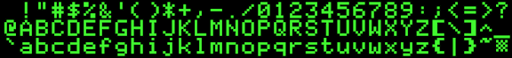


Task list to copy/paste when creating PR for this lab:

__Before releasing lab6:__
- [ ] Review writeup/code/checkin questions (instructor)
- [ ] Walk through (SL)
- [ ] Followup on issues from previous quarter postmortem (issue #403)

__To prep for lab6:__
- [ ] Confirm there are sufficient number of working monitors, HDMI cables, and HDMI-DVI adapters (aim for 1 setup for every 2-3 students)




## Goals

For your next assignment, you will implement library of simple graphics routines and use them to implement a text console for your shell. The goal of this lab is to review concepts and code in preparation.

During this lab you will:

- Connect your Pi's HDMI port to a monitor and generate video
- Write code to allocate framebuffer memory and make changes to the pixel data
- Review C syntax for pointers to multi-dimensional arrays
- Read and understand fonts and the representation of characters

## Prelab preparation
To prepare for lab, do the following: 

- Bring your Mango Pi and complete parts kit to lab. You will not need your PS/2 keyboard for lab6, but will use it for assign6.
- Lab6 and assign6 use an HDMI display. This can be any computer monitor, tv, or projector that accepts HDMI input.
    - Our lab room has about a dozen monitors that you can use. You are welcome to come to lab anytime to use them. Please do not remove the cables or monitors, these must remain in lab for all to share.
    - You can also work using an HDMI-capable display that you have access to. We have confirmed our hardware support code on a smattering of monitors, but lurking bugs and corner cases may have yet to surface. Please let us know if you run into trouble and we can help diagnose.

## Lab exercises

### 0. Pull lab starter code

Change to your local `mycode` repo and pull in the lab starter code:

```console
$ cd ~/cs107e_home/mycode
$ git checkout dev
$ git pull code-mirror lab6-starter
```
### 1. Confirm video

Find an available monitor in lab, connect the monitor to power, and turn it on.
Connect its HDMI cable to the mini-HDMI port on your Mango Pi.

The monitors we have in lab are older and only accept DVI inputs, so one end of the HDMI cable has a HDMI-to-DVI adapter where
it plugs into the monitor. The other end has a standard-to-mini HDMI adapter where it plugs into Mango Pi. Be sure that all of the connections/adapters are firmly seated (a bad connection will result in jitter or no signal at all).

Change to the directory `lab6/grid` and build and run the grid program using
`make run`. The monitor should display a grid of white lines on a black background. Type any key in your minicom
window to exit the grid program.

Each of you should try connecting your Pi to a monitor to confirm the grid display.
For the rest of the lab, partners can share one Pi/monitor.

### 2. Review code for modules fb/de/hdmi

You will implement the `fb` module to handle allocating the framebuffer memory
and coordinating with the lower-level `de` and `hdmi` modules to control
the hardware peripherals that display the framebuffer pixels on the screen.

Our reference libmango provides the implementation of the `de` (Display Engine)
and `hdmi` modules.
Peruse the module interfaces [$CS107E/include/de.h](/header#de) and [$CS107E/include/hdmi.h](/header#hdmi). You
'll note that the modules export a tiny number of functions.
We wrote those modules to support exactly and only the very specific features needed for our system.

Take a very brief skim over the the implementation in files
[$CS107E/src/de.c](/src#de) and [$CS107E/src/hdmi.c](/src#hdmi). You will not modify this code and
do not need to make deep dive into it. Your `fb` module will interact with
the `de` and `hdmi` modules through limited public functions documented in the header files.

#### Initializing the framebuffer

Change to the directory `lab6/fb`. The directory contains these files:

```console
$ ls
Makefile      fb.c         main.c
```
The file `fb.c` contains code to initialize the framebuffer. The `fb` module
declares a struct to hold the module-level state. This struct has four fields:


- `width`, `height`: width/height of framebuffer in pixels
- `depth`: number of bytes per pixel (always 4 in our system)
- `framebuffer`: base address of the framebuffer memory

Review the code in the `fb_init` function. Discuss with your tablemates and
try to answer the questions below.

   1. How are total bytes calculated when allocating the framebuffer?
   2. What is the color of the pixels in the newly created framebuffer?
   3. How does the framebuffer coordinate with the `hdmi` module to set the sceen size?
   4. How does the framebuffer communicate with the `de` module to draw the pixels on screen?
   5. What kind of changes will be needed for the `fb` module to support double-buffering (i.e. separate front/back buffers)?

You're ready to answer the check-in questions about framebuffers.[^1]

### 2. Draw pixels
In directory `lab6/grid`, open the `grid.c` file in your text editor and modify the program in the following ways:

1. Change the grid code to draw horizontal lines in red and vertical lines in yellow.
   *Remember from lecture that the B (blue) in BGRA is the lowest byte.*

2. Change the grid code to draw a checkerboard pattern
   (alternating filled red and yellow squares). Hint: define a helper function
   that draws a filled rectangle.

Remember that C has no bounds-checking on array indexes. Writing to an index
outside the bounds of the framebuffer will ovewrite the data at that location.
Such as transgression can create a strange variety of symptoms, so should you encounter
some trouble, review how your code accesses the framebuffer memory.

Check-in with us and show off your checkerboard. [^2]

### 4. Multi-dimensional arrays

Pointers are ubiquitous in systems programming in C and one of the most
difficult concepts to master. Just when you are getting the hang of pointers
and one-dimensional arrays, now we're adding multi-dimensioned arrays into the
mix. The goal of this lab exercise is to review pointers and multi-dimensional
arrays in preparation for your next assignment.

One convenient way to represent images is with a two-dimensional array.
Treating it as a 2D array can be easier than explicitly calculating offsets
into a one-dimensional array.

To start, here is a quick self-test:

* What is the difference between the following two declarations?
  Think about what operations are valid on `a` versus `b`. Also
  think about what memory is allocated.

      char *a  = "Hello, world\n";
      char b[] = "Hello, world\n";

* What is the difference between the following two declarations?

      int *p[2];
      int (*c)[2];

  You may find the **[cdecl tool](http://cdecl.org/)** helpful in demystifying a complex C declaration.

Inspect the code in `lab6/pointers/pointers.c`. Compile the program using
`make`, run it on your Pi, and interpret the results. Ask questions about
anything that doesn't make sense to you and check-in with us to confirm your
understanding. [^3]

### 5. Fonts

A major part of your assignment will be to draw text on the screen.
In order to do this, you need a *font*. Each character in the font is a little
picture that represents the glyph to draw. 

{: .zoom .w-100}

This famous font was used by the original Apple IIe. We chose it to
provide that extra-special retro touch for your graphical console.

Review the file [$CS107E/src/font.c](/src#font). It declares a `font_t` struct for representing a font and
defines the variable `font_default`:

```
/* from font.c */
typedef struct  {
    unsigned char first_char, last_char;
    unsigned int  glyph_width, glyph_height;
    unsigned char pixel_data[];
} font_t;

static const font_t font_default = {
    .first_char = 0x21, .last_char = 0x7F,
    .glyph_width = 14, .glyph_height = 16,
    .pixel_data = {
        0x03, 0x00, 0x33, 0x00, 0xcc, 0x00, 0xc0, 0x3c,
        0x00, 0x30, 0x00, 0x30, 0x00, 0xc0, 0x03, 0x00,
        ...
        0x3f, 0x00, 0x00, 0x00, 0x00, 0x03, 0x00, 0x00,
        0x00, 0x00, 0x00, 0x00
     }
 };
```

The pixel data for the character glyphs is stored as a bitmap.  In a bitmap,
each pixel is represented by a single bit. If the bit is 'on', the pixel is to
be drawn in the foreground color; if 'off', the pixel is set to the background
color. We use a bitmap rather than full RGBA because it takes much less (32
times less) memory. This makes the font data much smaller, and hence faster to
upload to your Pi.

Below is a pictorial representation of `font_default` using green to display
each 'on' pixel in the bitmap. (click the image to see larger version):

{: .zoom .w-100}

The font bitmap stores the character glyphs in a single line. The leftmost glyph is for the
character '`!`', whose ASCII value is 33 (0x21), the neighboring glyph is for
character '`"`' (ASCII 34) and so on ending with rightmost character ASCII
value 127 (0x7f) Delete, whose glyph is a little checkerboard. The font bitmap
contains glyphs for 95 total characters, from ASCII 33 to 127.

Each glyph is the same size: 14 pixels wide and 16 pixels tall.  This is termed
a *fixed-width* font.

The bitmap is stored using an array of `unsigned char`
values. For example, the first two bytes in the array are `0x03, 0x00`.  Group
the 8 bits from the first byte and 6 bits from the second into the 14-bit
sequence `0b00000011000000`.  These 14 bits correspond to the top row of the
first glyph, the exclamation point. The bits indicate the vertical line for 
the exclamation point is 2 pixels wide and positioned in the center. 

Each line of the bitmap is 1330 pixels long (95 characters * 14 pixels wide),
and requires 1330 bits. If each glyph is 16 pixels tall, how many total
bytes are in the `pixel_data` array?

Look carefully at the function `font_get_glyph()` in `font.c` which copies a
single glyph from the font bitmap into a buffer.

* Trace the operation of `font_get_glyph` for ASCII character `&` (ascii hex
  0x26)? At what locations in `pixel_data` does it look to find the appropriate
bits? 

Now change to the directory `lab6/banner` and review the code in `banner.c`.
This program calls `font_get_glyph` to store the glyph image into `buf`. The
code then wants to go on to access `buf` as a 2-d array through the variable
named  `img`, but `img` is missing its declaration and initialization. Read and
follow the instructions marked `TODO:` to fix this issue. Compile and run and
you'll get an ascii banner that prints letters to the terminal using your Pi's
font - neat!

You're ready to answer the final check-in.[^4]

## Check in with TA

Before leaving the lab, check in with a TA and discuss any challenges to
answering the questions in the lab. If you do not feel confident about your
responses, please ask us about it too!

[^1]: Talk us through your plan for extending the `fb` module to support double-buffering.

[^2]: How does your checkerboard look? Show us your crisp looking squares!

[^3]: What are the differences between the following two lines of code?
    ```c
char *a  = "Hello, world\n";
char b[] = "Hello, world\n";
    ```
[^4]: Show the declaration for `img` needed for the `banner.c` program.


