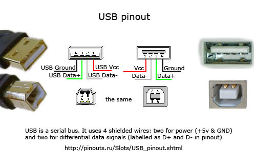
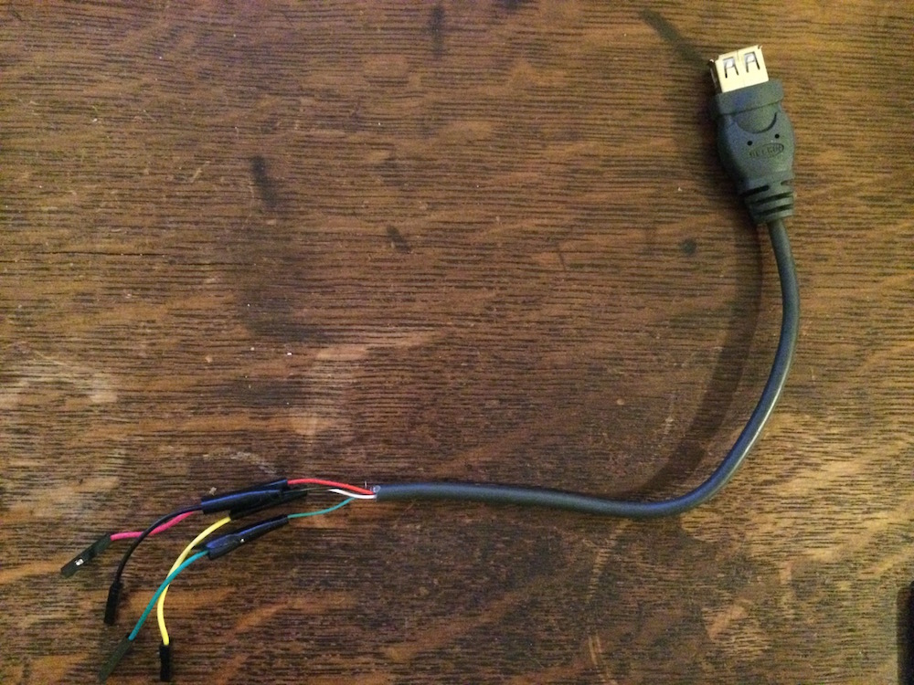
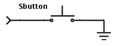
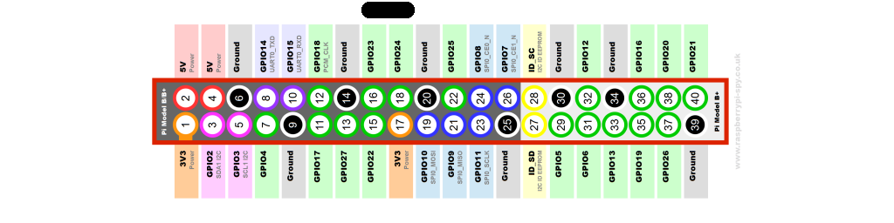

## Lab 6: Keyboard Surfin
# Lab written by Philip Levis

### Learning goals
During this lab you will:

1. Connect a PS2 keyboard to your Raspberry Pi
1. Set up the GPIO pins to receive scan codes

The goal of the lab is for you to do the tricky parts of setting up a
PS2 keyboard so you can get started on Assignment 6. To complete the lab,
you must complete the 
[check list](checklist.md).

We've provided several support libraries (GPIO implementations, timers,
etc.) to make this easier. Be sure to read what's available to you before
getting started so you don't have to repeat work. Note that these libraries
are somewhat different from some of those used in lectures. If you've
built on those files, you might need to change your code slightly.
For example, calls to `uwait()` can be replaced with `timer_wait_for()`.

There are two parts to this lab: hacking up a USB cable so you can
plug it into your Raspberry Pi's GPIO pins, and configuring those GPIO
pins so you can receive PS2 scan codes. So you can test your code without
worrying about whether a keyboard is doing what it should be doing,
you'll also set up a test circuit on the bread board.

### Lab exercises

1. __Pull the lab 6 project.__

    To start this lab, find the `courseware/labs/lab6/code` directory.
    You may need to pull from the `cs107e/courseware` repository
    to get the latest code.

    Inside the code directory is a binary named `keyprint.img`.
    This is a binary of a simple console program that displays the
    character you type at the keyboard. It's the code I wrote in
    the GPIO lecture. You can use this as a piece of known
    working software to debug whether your problem is hardare
    or software.

1. __Prepare your USB cable to plug into GPIO pins.__ We're going to
    take the four wires in a USB cable and solder them to female pins
    so we can plug them into GPIO lines on the Raspberry Pi
    header. You will be using the female end of the USB cable to plug in 
    the keyboard. You want it to be at least 2 feet long,
    in case you make a mistake and need to cut it shorter to try
    again. Take your USB extension cable and cut it.  Recall
    that USB has 4 pins: power, ground, data+ and data-. But in PS/2
    mode these revert to power, ground, clock, and data. Red is power,
    black is ground, white is data+ (clock) and green is data- (data).
    
    This step requires using the soldering irons and other tools so there
    might be a wait. I suggest that one of your team of two progress with
    this step and the other person jump to step 4 below (building a test
    circuit). If there's a long line, you can wait by working on step 4.

    Strip a few inches of the outer rubber shielding and unravel
    the 4 wires on the female connector half. Strip an inch or so of
    the rubber coating from each one. Take 4 female pins (red, green,
    black, and white, if you can) and do the same. Figure out which
    colored wires are which pins by using a multimeter to check that
    the connection from a pin to the wire has a low resistance (they should 
    match the convention above, but check to be sure).

    

    If you can solder your female pins to the wires so they follow the above
    color coding (red: power; white: data-; greed: data+; black: ground), it
    will make your life easier. This way you avoid debugging for
    a long time only to remember you have your pins plugged in incorrectly. 
    As mentioned above, the colors should match the USB wires for most people, 
    but you should check to be sure they do.

    Once the solder has cooled,
    wrap the connection in electrical tape, Be sure that the tape leaves
    no wire exposed. This serves two purposes. First, it means you won't
    accidentially short the wire when it touches something. Second, it
    will add a bit more strength to the connection so when you pull one
    end the solder joint won't come undone.

    

1. __Test your cable.__  Using a multimeter, test that each pin has a very
    low resistance from the USB connector to your female pin. If there
    seems to be no connection, you should check your solder joint.

1. __Build a test circuit.__ You'll want to be able to test if your basic code
    to detect signals on the GPIO pins is correct before moving on to
    processing PS2 scan codes. It would therefore be helpful to have a
    very simple test circuit that produces the same waveforms as a PS2
    device. This is very easy -- all you care about are falling edges.

    What we want is for a pin to default to being high (1), and when
    we press the button, it goes low (0). The way to do this is to make
    the pin have a "pull-up resistor". This means that when the pin
    is in an open circuit (the button is not pressed), it will default to
    a value of 1. When the button is pressed, we want to close a circuit
    that connects the pin to ground, so it will read a 0.

    To create a falling edge generator, put a button in your breadboard.
    Connect one side of the button to GPIO pin 23 and the other to a
    ground pin. If you're not sure which axis the button circuit is
    across, use diagonally opposite terminals.

         
 
    Now, GPIO pin 23 will default to a high value and when you push the
    button it will go low -- a falling clock edge.

1. __Configure your GPIO pins__. At this point, you should have a
    working test circuit and a working USB cable. Now, starting with
    the test circuit, we'll configure GPIO pin 23 and GPIO pin 24 to
    be able to process PS2 signals. You want to make each pin an input
    and make it a pull-up.  Take a look at the functions available in
    `gpio.h` to do this.

1. __Write and use a GPIO test program__. Write a simple program that
    turns the green status led off (`led_off` in `led.h`) when GPIO
    pin 23 is high and turns it on (`led_on`) when GPIO pin 23 is
    low. Hook up your test circuit to pin 23 and check that it
    works. Do the same for pin 24.

1. __Plug a keyboard into the Raspberry Pi header.__ Plug in a keyboard
    so the clock line (white) is connected to pin 23 and the data line
    (green) is connected to pin 24. Power should be plugged into a 5V
    pin and ground should be plugged into ground.

1. __Check that the keyboard clock line is working.__ Install your
    program that displays the state of pin 23 on the status LED. If
    everything is working correctly, when you press a key, the LED
    should flicker 11 times, such that the LED toggles, and when you
    release the key it should flicker 11 times again. If you hold a
    key down the LED should flicker every 500ms or so (keyboards have
    an auto-repeat feature).  If the keyboard is not working, try
    unplugging its power and plugging it back in. If this seems to not
    be working, Phil or Pat can check your keyboard with a logic analyzer
    (or you can grab a new one). If two keyboards don't work it's probably
    not the keyboard's fault.

1. __Check that the keyboard data line is working.__ Repeat the above
    exercise, but use GPIO pin 24 (the data line). It won't flicker as
    regularly, because different keys will send different bits, but
    pressing keys should have the same, slightly less regular effect.

    Load the test image `keyprint.img` and check that you can receive
    keypresses. When you press a key it should be displayed on the screen
    as a single character. 

## Check off with TA
At the end of the lab period, submit the checkoff form and ask your lab
TA to approve your submission so you are properly credited for your work.

