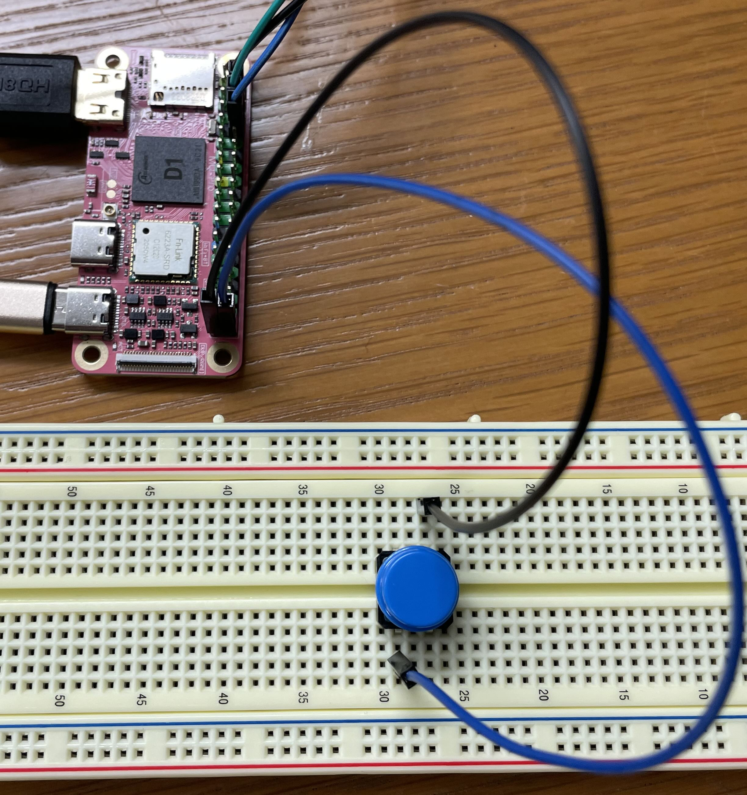


Task list to copy/paste when creating PR for this lab:

__Before releasing lab7:__
- [ ] Review writeup/code/checkin questions (instructor)
- [ ] Walk through (SL)
- [ ] Followup on issues from previous quarter postmortem (issue #)

__To prep for lab7:__
- [ ] Ensure monitor/cable per pair avail in lab



*Lab written by Philip Levis, updated by Pat Hanrahan and Julie Zelenski*

## Goals

The goal of this lab is to get you started with interrupts in preparation for
your final assignment.

During this lab you will:

- Review the support code for interrupts on the Pi,
- Fill in two missing pieces of assembly code: the code of the interrupt handler itself and a helper function that shows
  you a case where knowing assembly can make your code 100x faster,
- Write code to handle button presses using GPIO event interrupts, and
- Optimize a screen redraw function (and enjoy the adrenaline rush!).


## Prelab preparation
To prepare for lab, do the following:

- Pull the latest version of the `cs107e.github.io` courseware repository.
- Clone the lab repository `https://github.com/cs107e/lab7`.

## Lab exercises

Pull up the [check in questions](checkin) so you have it open as you go.

### Interrupts

#### 1) Review and write interrupt code (60 min)

In class, we introduced the `interrupts` module that is used to
configure interrupts and manage interrupt handlers. The module
interface is documented in `interrupts.h` and its implementation is
split into the files `interrupts.c` (C code) and `interrupts_asm.s`
(assembly). `interrupts.h` is in the `cs107e/include` directory, while
`interrupts.c` is in the `cs107e/src` directory.  You have an
almost-complete version of `interrupts_asm.s` in your starter code
that you'll complete in lab.  You can access the cs107e directory by
[browsing cs107e on
github](https://github.com/cs107e/cs107e.github.io/blob/master/cs107e/)
or by changing to the directory `$CS107E` on your laptop.

Read through the code for `interrupts_init` in `interrupts.c` and
review the contents of the vector table and how it is installed into
the correct location.

Take a look at `interrupts_asm.s` in `code/interrupts`. This directory
contains the two assembly files you will be writing code in.
`interrupts_asm.s` contains almost all of the assembly code you need
to support interrupts. There's one missing part, the interrupt handler
itself, which you will write.

The first two functions, `interrupts_global_disable` and `interrupts_global_enable`,
do as they indicate: they flip the interrupts enabled bit in the CPSR
(current processor state register). This register is so important and
special that it has its own instructions to read and write it, `msr` and
`mrs`.

Next, the file defines `_RPI_INTERRUPT_VECTOR_BASE`, which specifies
the address where the interrupt vector table should go. On the Raspberry
Pi, this is address 0 -- one reason why null pointer errors are so dangerous!

Next, the file defines `_vectors`, which are the assembly instructions
that the processor will jump to on different interrupts. For us, almost
all of them indicate some kind of fatal error we can't recover from,
so the instruction is `ldr pc, abort_addr`. If these interrupts trigger,
we put the data stored at `abort_addr` into the program counter. For
general interrupts, though, index 6 in the table, we'll instead load
the value at `interrupt_addr` into the program counter.

Both `interrupt_addr` and `abort_addr` are defined just below the table.
They hold the address of the `interrupt_asm` and `abort_asm` functions.
By putting these into `.word` values right after the table, they'll
store absolute addresses and can be copied with the table. This means
that when we copy the table to `_RPI_INTERRUPT_VECTOR_BASE`, code will
still jump to the right address and call these functions. Note that
`_vectors_end` is *after* these two `.word` values, so they are copied
with the table.

`abort_asm` resets the stack pointer to use a separate stack (so it
won't corrupt our current stack) then jumps to `pi_abort`, which
does not return.

Challenge one another to understand each and every line of this code.
After you've gone through it, work through the questions below to
confirm your understanding. Ask us for clarification on anything you
find confusing.

+ When installing the vector table, `interrupts_init` copies eight
instructions plus two additional words of data. What are those
additional words and why is it essential that they are copied along
with the table? The existing code copies the information using an
explicit loop. This could instead be a single call to `memcpy`. What
would be the correct arguments to `memcpy` to do the equivalent copy
task?
 
+ How does the private helper `vector_table_is_installed` verify that
initialization was successful? Find where this helper is used. What
client oversight is it attempting to defend against?

+ What piece of state needs to change to globally enable/disable
interrupts?

+ The supervisor stack is located at `0x8000000` and configured as one
of the first instructions executed in `_start`. Where is the interrupt
stack located and when it is configured?  A different approach would
be to configure the interrupt stack at program start along with the
supervisor stack, but doing so then would require temporarily changing
to interrupt mode -- why is that switch needed?

+ How is a function "registered" as a handler for an interrupt source?
Can there be multiple handlers registered to the same source> What
happens if no handler has been registered to process a handled interrupt?


You need to fill in `interrupts_asm`. Recall, this assembly code needs
to:
  - set your stack pointer to `0x8000`,
  - fix the return address (since the value of `lr` is 8 after the interrupted instruction),
  - safely store the state of the processor,
  - invoke `interrupt_dispatch` passing the fixed return address as the first argument, and
  - restore the processor to its state before the interrupt was triggered.

We provided code for this in lecture -- _don't look at it just yet!_ The
goal of this part of the lab is for you to try to write it yourself, then
compare with our reference solution.

An interrupt is triggered immediately *after* an instruction. So this means that
if `lr` is equal to 0x81a0, the interrupt was triggered right after 0x8198 and the
next instruction the processor should execute after the instruction is 0x819c.

To safely store the state of the processor, you need to spill `r0`-`r12` as well
as the value you want to restore to `pc` (as calculated above). You don't
need to spill `r13`-`r15` because interrupt mode has its own copies of these
registers. One easy
easy way to do this is update `lr` with the correct value and add it to the list
of registers you store with `push`.

You can then invoke the C function `interrupts_dispatch` which is implemented
in `interrupts.c`.

The last part is the trickiest, because it uses an assembly feature you haven't
used before, automatically changing the execution context. Recall that
an interrupt handler runs in the interrupt context -- this is why we have
seperate copies of `r13`-`r15`. If we just jump back to the next instruction
in our main code, we'll be running our main code in interrupt context and
won't handle any more interrupts.

The assembly feature you want to use is `^`. You put this at the end
of the list of registers you want to load with `ldm`. If one of the
registers you load is the program counter, the processor will go back
to the previous execution context it was in. The ARM reference manual
reads, [^ is an optional suffix. You must not use it in User mode or
System mode...  If op is LDM and reglist contains the pc (r15), in
addition to the normal multiple register transfer, the SPSR is copied
into the CPSR. This is for returning from exception handlers. Use this
only from exception
modes.](http://infocenter.arm.com/help/index.jsp?topic=/com.arm.doc.dui0068b/ch02s08s01.html)
So, for example, if you wanted to load registers `r0`, `r8`, and `pc`
from the stack and return to your previous execution context, you'd
use the instruction `ldm sp! {r0, r8, sp}^`.

Once you've written your `interrupt_asm` function, go to the lecture
slides for Interrupts and look at the code there. Is your code the same?
Different? Equivalent? If it's different and you're not sure if it's
equivalent, try using your code first and see if it works! If it doesn't,
staff can help you understand why, and you can always fall back to
the reference implementaiton.

In addition to `interrupt_asm`, you need to implement one more
function in assembly.  This function is used by `interrupts.c`. You'll
also probably want to use it in your GPIO interrupt library below. Its
signature is:

```unsigned int count_leading_zeroes(unsigned int value);```

Take a look at its definition in `bits.h` to see exactly how it should work.

The obvious way to implement this function is in C. You could perhaps
iterate over every bit, or do some fancy bit twiddling, say use
Kernighan's algorithm mentioned in class and combine it with a lookup
table. This might take anywhere from 8-100 cycles.

A better way to implement it is in assembly. Read up on the
[`clz` instruction](http://infocenter.arm.com/help/index.jsp?topic=/com.arm.doc.dui0802a/Cihjgjed.html)
and implement `count_leading_zeroes` as an assembly function in `bits_asm.s`.
If you need a refresher on the ARM calling convention for how
arguments and return values are put into registers, you can
refer to the [lecture notes on C functions, starting on slide 
23](http://cs107e.github.io/lectures/C_Functions/slides.pdf).
If you've done this right, by knowing a bit of assembly you've been able
to cut the time it takes to find a pending interrupt from 100 to 3 cycles,
a 33x improvement. Given this code runs on every interrupt, this is an
excellent performance improvement: it's why instructions like `clz` exist.

Your system can now handle interrupts!

Debugging this part of your code is very hard. If something is wrong,
things can go very, very wrong. To help you with this, we've included
a very simple program, `armtimer_diagnostic`. This program uses the
interrupts module to handle a periodic timer and links in your
implementations of `interrupts_asm.s` and `bits_asm.s`. It prints out
a few key values when the timer fires, such as a stack backtrace as
well as the current position of the stack pointer. This last one is
useful to make sure that the stack is being properly setup and
restored: it should be identical on every invocation, and a bit below
`0x8000`.


Very carefully trace the critical sequence of assembly
instructions in the interrupt vector used to safely transition into
interrupt mode and back again. Once you get to a C function, the code
proceeds pretty normally. Look at the C code which stores the client's
handler function pointers and how the dispatch finds the appropriate
handler to process an interrupt.

#### 2) Set up a button circuit (10 min)

Set up a simple, one-button circuit on your breadboard. Connect one
side of the button to GPIO pin 20 and the other side to
ground. Connect your Pi to a HDMI monitor.



Configure the button circuit so that the default state of the pin is
high (1) and pressing the button brings it low (0). The way to do this
is to use a pull-up resistor as you did with the PS/2 clock line. 
When the button is not pressed, the resistor "pulls up" the value
to 1.  When the button is pressed, it closes the circuit and connects
the pin to ground. The value then reads as 0.

The application in `button/button.c` loops waiting for a button press
and then redraws the screen. Fill in the implementation of the empty
`configure_button` and `wait_for_click` functions.  `wait_for_click`
should:

+ Wait for a falling edge on the button gpio, i.e. wait until the pin goes from 1 to 0 (checking its state with `gpio_read`).

+ Use `printf("+")` to report the press.


Compile and run the program. Press the button and you get a printed
`+` and the screen redraws. Each redraw cycles the background color
from red->white->blue.

1. If you click the button multiple times in quick succession, some of
the presses are missed. You get neither a printed `+` nor a screen
redraw. Why does that happen?

You'll note that redrawing the screen is glacially slow. If we speed
that up (which we will do later in this lab!), it would cause us to
miss fewer events, but we still have to spin waiting for a press and
still can miss events. Interrupts will solve this problem.

#### 3) Write a button handler (20 min)

You are now going to rework the program to detect button presses via
interrupts.

Remove the call to `wait_for_click`. Compile and re-run. The program
now repeatedly redraw the screen, cycling the colors
red->white->blue. This appears to completely dominate the CPU and
leave no time for anything other than screen redraw.

There are several steps to configuring and enabling interrupts:

- Update `configure_button` to enable detection of falling edge events
on the button pin. You can consult 
[gpioextra.h](https://github.com/cs107e/cs107e.github.io/blob/master/cs107e/include/gpioextra.h)
for documentation on the function `gpio_enable_event_detection`.
- Write your handler. This function should have the signature
`bool (*)(unsigned int pc)`. For starters, just have it print something
to the console. Remember that this handler must clear the event,
or it will trigger forever.
- In `main`, register your handler to your button pin with
`interrupts_register_handler` for `INTERRUPTS_GPIO3`.
- Finally, in `main`, set up your system to generate interrupts. You
need to initialize the interrupts module, enable global interrupts,
and enable interrupts for `INTERRUPTS_GPIO3`. You can refer to
`armtimer_diagnostic` for what this code looks like.

The order that you do these operations can be very important: think
carefully about what this code does, revisiting the lecture notes if
you need to.  Talk this over with your tablemates and ensure that you
understand what each step does and why it's necessary.

Compile and run the program. As before, the loop main appears to be
continuously redrawing, but pressing the button will print your
message.  You get the best of both worlds: your long-running
computation can be written as a simple loop, yet the system remains
extremely responsive to input.

#### 4) Make your screen respond to button presses (30 min)

In this final step, you will rewrite your program so the screen
changes only when a button is pressed. This requires that our interrupt
and main code share state.

Change your program so the color drawn is based on the number of
button presses rather than `nrefresh`. The variable you use to store
the number of button presses must be declared `volatile`. Why? Can the
compiler tell, by looking at only this file, how control flows between
main and the interrupt handler? Will the compiler generate different
code if `volatile` than without it? Will the program behave
differently? Test it both ways and find out!

When you're done, discuss and answer the following questions with your 
neighbors.

1. What changes if your counter variable is not declared `volatile`?

1. Describe what is done by each step of configuring and enabling interrupts. What would be the effect of forgetting that step?

1. What happens if the handler does not clear the event before returning?

## Check in with TA (10m)

At the end of the lab period, call over a TA to [check in](checkin) with your progress on the lab.

