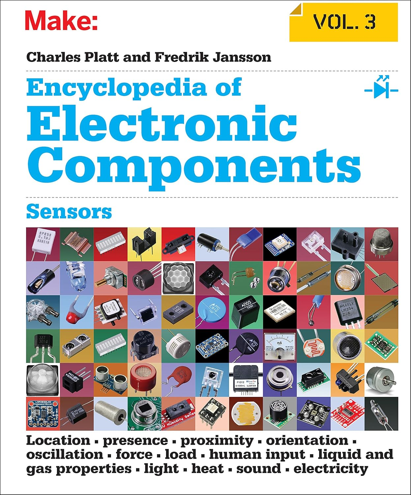

Your parts kit has some components you might repurpose (LEDs, resistors, transistors, buttons), and there are wide variety of additional components and sensors that you may want to consider incorporating into your project.

An excellent reference book for exploring sensors is "Make: Encyclopedia of Electronic Components Volume 3: Sensors" by Charles Platt and Fredrik Jansson.

{: .zoom .w-50}
You can access the online version via Stanford Libraries Safari Books portal <https://searchworks.stanford.edu/view/13211489>.
 We also have one shared physical copy in the lab room. (Please do not remove from lab so that all may use it.)

Below is a partial list of components and sensors that have been successfully used in previous projects (Mango, and previously Raspberry Pi).

### Digital buttons/switches
- Buttons (press, snap-action, toggle, latching, dip, ...)
- Keypad
- Digital joystick
- Rotary encoder
- Tilt/vibration/shock
- Capacitive touch
- Digital Hall effect

### Analog inputs
The Mango Pi GPIO pins are digital, reading an analog value requres interfacing with an analog to digital converter (ADC). The D1-H has ADC on-chip but no analog inputs are broken out on our board 🥲

- ADCs (analog-to-digital converters)
    - [mcp3008](https://www.digikey.com/product-detail/en/microchip-technology/MCP3008-I-P/MCP3008-I-P-ND/319422), 8-channel 10-bit, SPI protocol
    - [ADS 1115](https://www.adafruit.com/product/1085), 4-channel 16-bit, I2C protocol
- Potentiometers: rotary, sliding, ribbon
- Photoresistor
- Analog joystick
- Analog Hall effect
- Piezo vibration
- Force detection, strain gauge
- Temperature
- Flex sensor

### Optical/light

- IR distance sensor
- Phototransistor
- Passive infrared motion sensors [HC_SR501](https://a.co/d/0hGCCZqw)
- IR emitter/detector [TSOP 43838 38 KHz](https://www.digikey.com/product-detail/en/vishay-semiconductor-opto-division/TSOP34838/751-1386-5-ND/1768188)
- RGB LED
- Laser emitter/detector
- Photointerruptor

### Sound/music

- Active and passive buzzer
- Electret microphone
- Ultrasonic distance [HC-SR04](https://cdn.sparkfun.com/datasheets/Sensors/Proximity/HCSR04.pdf) (time of flight)
- I2S digital audio
    - PCM5102A (DAC digital-to-analog output)
    - SPH0645LM4H (digital microphone)

### I2C
- IMU motion (accelerometer/gyro/compass) [GY-521](https://a.co/d/03i20tGs), LSM6DS3
- Time-of-flight distance [VL6180X](https://www.pololu.com/product/2489), [VL53L0X](https://www.pololu.com/product/2490)
- Real-time clock DS3231
- Oled display SSD1306
- I2C backpack on LCD1602 character display

### SPI
- APA102 addressable LED strip [sparkfun tutorial](https://learn.sparkfun.com/tutorials/apa102-addressable-led-hookup-guide/all)
- Shift registers HC595 SIPO, HC165 PISO
- LCD TFT display ili9341
- W25Q Flash storage
- SD card reader <https://a.co/d/07BkfTaH>
- Arducam 2-Megapixel Camera OV2640 (uses both i2c and spi)

## Component suppliers

Some known good vendors for electronic components:

- [Jameco](https://www.jameco.com/) has a great selection of electronic parts and are located in Belmont near SFO.
If you place an online order, parts will generally arrive the next day via US mail. If you have a car, you can also drive there and pick up parts same day at the Will Call desk.

- [Pololu](https://www.pololu.com/) has a wide selection of parts for robotics, including sensors and motor drivers. They also document their parts very well.

- [Adafruit](https://www.adafruit.com/) Limor Fried has founded a company that caters to makers of all types. Besides building great products, they also provide extensive tutorials and learning guides on their web site.

- [Sparkfun](https://www.sparkfun.com/) is another good source for hobbyist electronics, many great tutorials.

- If you have yet to visit [lab64](https://ee.stanford.edu/news/lab64), go now and check it out! The EE department's Maker Space is located on first floor of Packard building. The staff is super helpful and can assist you with using the available tools (oscilloscope, soldering, 3-D printing, laser cutting). They also have a store stocked with electronic components (transistors, op-amps, diodes, etc) and some common sensors and motors.

CS107E has a small lending library of some components that we can loan for you to try out before ordering your own.
